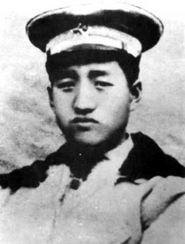
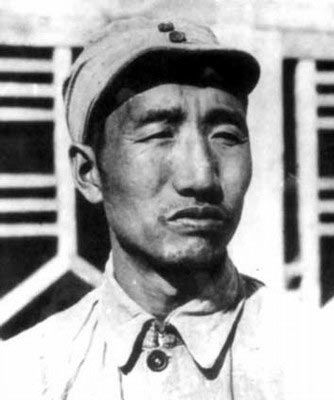
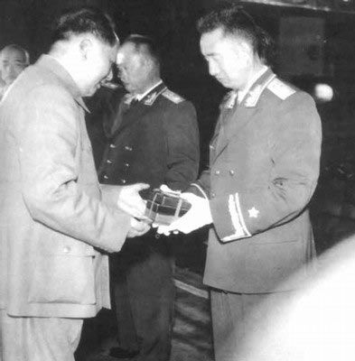

## nnnn姓名（资料）

### 成就特点

- 中华人民共和国十大元帅中唯一一名北方人
- 黄埔军校为一期生
- 指挥中国工农红军第四方面军第一、第二、第三、第四次反“围剿”战争
- 长征到达陕北，率领西路军渡黄河北伐，但失败
- 攻占山西全境
- 在“文化大革命”期间被牵扯进“二月逆流”案
- 任国务院副总理兼国防部长期间，他宣布停止金门炮战

### 生平

27年前的今天，十大元帅中唯一的北方人徐向前逝世

【从小学老师到黄埔军校】

1901年11月8日，徐向前出生于山西省五台县东冶镇永安村。家族原先为大户，父亲为清朝秀才。10岁时，被送去读私塾，后转到沱阳学校读高小，但不久被迫辍学，去河北阜平县亲戚开的书店做了两年半学徒。1919年春（18岁），在亲戚推荐下，考入阎锡山创建的山西省立国民师范学校的速成班。1921年，毕业后在山西各地当小学老师。

1924年，徐向前与几位同乡一同到上海参加黄埔军校考试。徐向前经过两轮笔试，考入黄埔军校第一期，编入第一队，加入中国国民党。同年9月，第一队作为孙中山的卫队前往韶关，参加北伐誓师。1925年2月，徐向前所在的黄埔军参加讨伐陈炯明的东征，并获胜利。此后，徐向前被派往河南，留任冯玉祥国民革命军，后因军队溃散，徐向前回到家乡。

【从南昌起义到大别山】

1927年3月，徐向前再赴南方，并加入中国共产党。4月12日，蒋介石发动清党，史称“四·一二事件”。6月，被派往张发奎的部队，任司令部参谋。7月15日，汪精卫发动七一五事变。8月1日，共产党在朱德、周恩来、叶挺等人率领下发动著名的南昌起义。此时，徐向前刚入党不久，没接到上级的通知，所以他并没有直接参加起义。

南昌起义后，徐向前赶到上海找到组织，并被派往广州。1927年12月，广州起义爆发，徐向前担任工人赤卫队第6联队队长。此后，起义部队整编为红四师，徐向前任红四师师长。红四师与东江地区彭湃的红二师会合，坚持东江游击战争。最终红四师大部被歼或解散，徐向前得到营救，辗转上海，抵达大别山。

【从三次反围剿到进入四川】

1930年春，徐向前任工农红军第一军第1师师长，转战于平汉铁路南段。此后，红一军与红十五军合编为红四军，徐向前任军参谋长。1931年7月，徐向前任红四军军长。徐向前率领军队，先后打退了三次反围剿战争。

1932年，蒋介石发动第四次围剿战役，并亲自挂帅指挥。采用“并列推进、步步为营”等战术，以纵队形成梯队前进，以避免此前红军的围点打援战术。双方发生惨烈拉锯战，红军损失巨大。

1932年12月，红四军跳出包围圈，摆脱各路国军的尾追堵截，全军尚存一万四千四百人，越过大巴山，进入四川。由于当时川军与蒋介石嫡系部队有利害冲突，相对安全。红四军取得了大发展，然而不久遭到川军的多次围攻，互相损失严重。

【从被迫长征到胜利会师】

1934年，中央红军因第五次反围剿失利而被迫长征。红四方面军决定撤出川陕根据地，建造川西北根据地，迎接中央红军北上。1935年6月13日，红一方面军、红四方面军在达维会师。

由于张国焘与毛泽东在红军主力进军方向上出现严重分歧，9月10日，党中央决定独自北上。为了红四军的完整性，徐向前只好率军南下。1936年1月，张国焘放弃另立中央。7月初，红四方面军与红二方面军在甘孜会师。10月，徐向前率部抵达会宁，三大红军主力会师，长征结束。

【从西渡黄河到全军覆没】

会师后，红四军打算占领宁夏与甘肃西部，打通与苏联的联系。10月28日，红四方面军军部渡过黄河，而本打算渡江的红三十一军却被临时取消计划。渡江红军在无援的情况下，开始孤军征程。红四军陷入苦战，最后只有李先念带领的一支七百余人部队经过祁连山、抵达新疆；其余河西西路军全军覆没。

徐向前化装沿途乞讨，跑到平凉，才联系到组织。徐向前到达西安，正逢批判“张国焘路线”的后期，红四方面军的大量干部被批斗。西路军的失利也让徐向前备受批评。毛泽东则安慰他道：“留得青山在，不怕没柴烧。你能回来就好，有鸡就有蛋。”

【从八路军到重病疗养】

1937年7月7日，卢沟桥事变爆发，中日战争正式全面开始。8月28日，红军改编为八路军，徐向前担任第129师副师长。1938年，129师共歼灭日军四千余人，基本控制晋东南地区，创建晋冀豫抗日根据地。随后进军河北、山东等地。

1940年，徐向前返回延安。不久被马踢伤，胫骨骨折，在医院调养。1943年，担任抗日军政大学校长。1944年7月，徐向前突患重病，整天发高烧便秘，身体极度虚弱，以至未能出席中共第七次代表大会，出院后的徐向前一直在延安枣园休养，一直疗养到1945年冬。

【从血战山西到停止金门炮战】

1947年1月13日，徐向前被任命为晋冀鲁豫军区副司令员，与薄一波、滕代远等负责内线作战、攻占山西。1948年3～5月，指挥临汾战役，在经过72天激烈的阵地战后，解放军以损失1.5万人兵力，攻占临汾城，控制山西南部。随后强攻太原，全歼守军八万九千余人。1949年5月，基本控制山西全境。

5月，徐向前因病到青岛治病。1949年10月1日，中华人民共和国成立。徐向前当选为军事委员会委员、总参谋长。1955年，被授予中华人民共和国元帅军衔。1978年3月，担任国务院副总理、国防部长。1979年1月1日，发表声明，中止了历时21年的金门炮战。

1990年9月21日，徐向前因病逝世，享年89岁。临终遗言：“我死后一不搞遗体告别，二不开追悼会，三把骨灰撒在大别山、大巴山、太行山、河西走廊。”

### 

