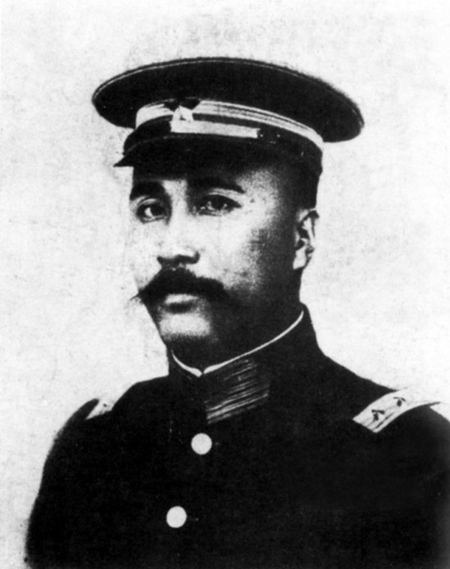

## nnnn姓名（资料）

### 成就特点

- 曾经出任粤军总司令、广东省省长
- 中国致公党首任总理
- 设立广州市
- 主张联省自治。他反对国民革命军北伐
- 黄花岗起义起义中，陈炯明为敢死队第四队队长

### 生平

84年前的今天，孙中山自愧不如、不愿北伐的总司令陈炯明去世

【加入同盟会的清朝秀才】

1878年1月13日，陈炯明生于广东海丰县白町乡。1898年（20岁），中清朝秀才。1906年（28岁），入读广东法政学堂。1908年7月（30岁），以“最优等生”成绩毕业。

毕业后，陈炯明回乡倡办海丰地方自治会，戒烟局等社会工作。1909年7月，当选广东咨议局议员，积极推行各种改革社会与保障人权的议案，后在上海加入同盟会，创办《可报》支持革命党。

【黄花岗的敢死队长】

1910年，参与广州庚戌新军起义。起义失败后，经香港回海丰，期间也有参加刘师复组织的“暗杀团”活动。1911年3月，黄花岗起义起义中，陈炯明为敢死队第四队队长。起义失败后，陈炯明回海陆丰筹备武装力量，并占领惠州。广东光复后，他领军入广州。民国成立后，陈炯明任广东副都督。

二次革命时，陈炯明被龙济光击败，逃离广东地区。先逃到香港，遭到香港政府的驱逐，再逃到新加坡。期间孙中山重组中华革命党，要求画押宣誓效忠孙文个人，陈炯明认为不符合民主思想，并未参加。

【拒绝列宁的定威将军】

1916年，陈炯明潜逃至广东东江地区组织广东共和军，反对洪宪称帝的袁世凯。陆荣廷的旧桂系部队击败龙济光进入广东，中央政府进行调停，陈炯明被封为“定威将军”。

1917年12月，陈炯明的二十营警卫军改编为“援闽护法粤军”，向福建进军。1918年8月，陈炯明进驻漳州，控制了闽南。在陈炯明部驻军福建期间，苏俄曾派人送列宁亲笔信与陈炯明联系，并咨询是否有合作的可能。陈炯明没有积极回应。

【不愿北伐的总司令】

1920年8月，桂系操纵的广州军政府分三路进攻福建，陈炯明联合许崇智部队反攻。11月，回到广东就任省长。陈炯明邀请孙中山、唐绍仪、伍廷芳回广东。孙中山从上海回到广州，任命陈炯明为粤军总司令。

1921年2月，孙中山就任为非常大总统。6月，桂系军阀再次进逼广东，陈炯明带兵迎敌。此战虽大败桂系并反攻广西，但死伤人员约有全军五分之一，士气大受打击。

陈炯明主张实行“联省自治”与孙中山的北伐、武力统一的主张有所冲突。1922年，孙中山执意北伐，陈炯明的广东省长、援桂总司令职位被罢黜，回惠州隐居。

【不在场的炮轰总统府】

1922年4、5月间，第一次直奉战争爆发，奉军战败，徐世昌宣布辞职，黎元洪复职。北方各界认为护法运动目的已达到，纷纷希望孙中山下野，以避免两个总统的僵局。

粤军中的叶举（陈炯明的部下）等人也联名发电要求孙中山下野。此时，粤军将领邓铿遭暗杀，孙中山与粤军互相指责。6月16日，叶举在通知孙中山后，出兵围攻总统府，鸣炮警示孙中山离开广东。

于是，“陈炯明率部叛变”的消息，传遍了广州。孙中山转移到永丰舰（后改名中山舰），还击轰炸广州后，离开广东。

【被学生军打败的老司令】

1922年9月16日，陈炯明自任总司令。1923年1月4日，孙中山借助滇军杨希闵部、桂军刘震寰部，粤军许崇智部，组成东西两路“讨贼军”，合击陈炯明。1月15日，陈炯明宣布下野，撤出广州退守惠州东江。2月21日，孙中山重回广州。

此后，支持孙中山的部队围攻惠州，陈炯明的粤军死守，双方保持僵局。1924年，发生广州商团事变，广东各界转而支持粤军。然而此时，孙中山的部队获得了苏联的支持，得到了大量优势武器。1925年，蒋介石率黄埔军校学生军两次东征，彻底打垮了陈炯明部。陈炯明被迫解散军队，退居香港。

【无钱下葬的“总理”】

1925年10月10日，前身为洪门秘密会社的“美洲致公堂”，正式改组为中国致公党，陈炯明被推举为为总理。但这只是虚职，陈炯明晚年生活拮据，颇为困难。1931年，九一八事变后，有日本人送他八万元支票，陈炯明在支票上打叉退还。

1933年9月22日，病逝于香港，停尸的是家中的一张行军床，连棺材也是母亲备用的棺木。

当时，陈家收到各方挽联达三千多幅，如陈立夫、章太炎、吴佩孚、段祺瑞等均有送联。因家中无钱下葬，灵柩存放于香港东华义庄。1934年，他的旧部发起募捐活动，社会各界纷纷捐资，包括汪精卫、陈济棠、蒋介石等人。1934年4月3日，终葬于惠州西湖旁紫薇山。

报纸评论：“陈氏为人刚毅果敢沉默寡言，其私人道德，可为南北权要之模范。”孙中山也坦言陈炯明“不好女色，不要舒服，吃苦俭朴，我也不如”。

