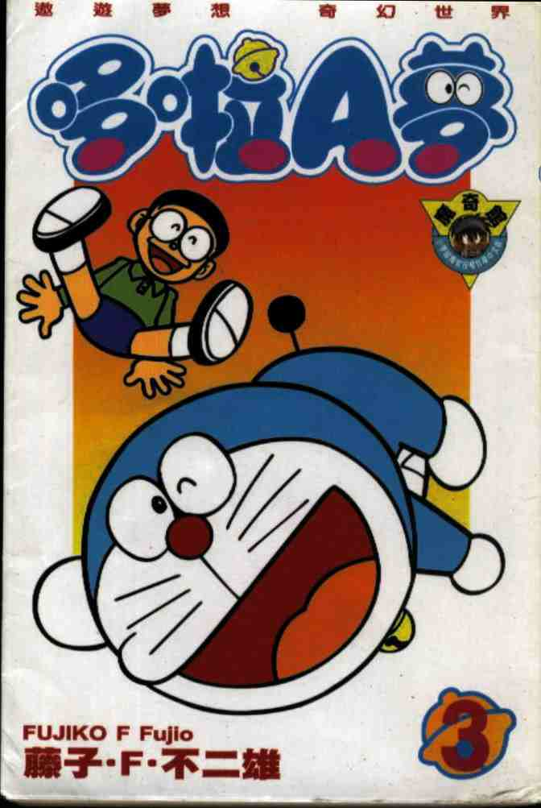

## nnnn姓名（资料）

### 成就特点

- 哆啦A梦 = Dream
- ​

### 生平

21年前的今天，神奇的机器猫《哆啦A梦》的作者藤子不二雄去世

【共用笔名的年轻漫画家】

1933年12月1日，藤子·F·不二雄出生于日本富山县高冈市，本名藤本弘。

1951年（18岁），与安孙子素雄一起向《每日小学生新闻》投稿处女作《天使之玉》并被发表，两人共用藤子不二雄的笔名。安孙子素雄的笔名为藤子不二雄A，藤本弘的笔名为藤子不二雄F，后改为藤子·F·不二雄。

从此，漫画成了藤子·F·不二雄一生的职业。

【绝版的小鬼Q太郎】

1964年 2月（31岁），漫画《Q太郎》开始在《少年SUNDAY》上连载。故事中，正太有次无意间拾到了一只很大的蛋。蛋竟然孵出了一只“小鬼”，名字叫Q太郎。从此，这些小鬼就住在正太的家里，并展开一段人与小鬼之间幽默溢出的趣剧。

1965年 8月，动画片《Q太郎》开始播放。由于版权问题，自藤子不二雄去世后，便再没有任何Q太郎的周边产品登场，之前的产品由此成为“绝版”。一本Q太郎漫画可以炒卖至数万日元。

【怀旧的小超人帕门】

1967年 1月（34岁），漫画《小超人帕门》开始在《少年SUNDAY》上连载。台湾最普遍称作〝超人小叮当〞，大陆译为“飞人”。故事讲述小学生须羽光夫无意中遇上负责保卫银河的超人，被委以重任，成为保护地球的小超人帕门。

1967年4月，黑白电视动画首播，最高收视率高达32.9%。即使在经过多年以后，《小超人帕门》在日本民众心目中，依然深受欢迎，是许多人心目中经典的怀旧作品之一。

【风靡不停的哆啦A梦】

1969年12月（36岁），漫画《哆啦A梦》开始在《小学馆の学习杂志》上连载。从此连载了22年，直到1991年。漫画同时在从幼儿园、到小学六年级的所有杂志上同时刊登。在1980年时，《哆啦A梦》最多曾同时连载于89本杂志上。

1973年，哆啦A梦电视动画开始播映，半年后由于日本电视台动画公司倒闭而终止播出。1979年，由朝日电视台播放，直至今日仍未停止。1980年，动画电影也开始在每年3月上映。30多年来，仅在2005年有过1次中断。为了拍摄动画电影，藤子·F·不二雄开始创作单行本的长篇故事，这就是《哆啦A梦大长篇》的开始。

除了哆啦A梦外，1974年 —1977年连载漫画《奇天烈大百科》，1977年—1982年连载漫画《超能力魔美》也取得了不错的成绩。

【哆啦A梦的乐园】

1996年9月20日，在执笔大长篇《大雄的发条都市冒险记》途中突然失去意识。9月23日：因为肝衰竭逝世，享年62岁。9月29日，葬礼在日本东京都台东区的宽永寺举行。

在藤子·F·不二雄过世后，电视动画及电影动画的制作依然持续，由藤子·F·不二雄的入室弟子麦原伸太郎和冈田康则（1998年进入藤子·F·不二雄制作公司）共同执笔。

2011年9月3日，藤子·F·不二雄博物馆在日本川崎市开馆，他从1961年开始在这里住了35年。博物馆里展示了部分哆啦A梦的场景和道具，是哆啦A梦迷的乐园。

（藤子·F·不二雄博物馆的场景）

【统一的哆啦A梦】

官方译名“哆啦A梦”是直接根据原作的日文原名“ドラえもん”（Doraemon）音译而来，但也有人认为是源于Dream（梦）。东亚各地的翻译都各有不同，如叮当、杜拉蒙、机器猫小叮当、机器猫等，角色名称翻译也各有不同。

藤子·F·不二雄病逝之后，朝日电视台继承了《哆啦A梦》的著作权，并依其遗愿“希望亚洲地区统一改以日本音译，使每个不同地方的读者只要一听就知道在讲同一个人物”。于是，逐渐统一改为《哆啦A梦》。在港台，阿福、技安相继改名为小夫、胖虎；大陆则把“大熊”改为“大雄”，康夫、小静、强强也相继改名为小夫、静香、胖虎。

【机器猫神奇口袋的经典】

总计由藤子·F·不二雄亲自执笔的《哆啦A梦》共有1345篇（包含短、中、长篇）。从1974年，藤子·F·不二雄选出部分短篇故事集结成四十五册单行本，在1974年至1996年间陆续发行，共收录短篇共821篇，到1992年为止发行量已经超过8000万本。

哆啦A梦为了帮助大雄，经常从他的四维空间口袋里拿出来自未来世界的道具，各种道具的创意成为哆啦A梦的特色之一。截至2004年5月为止，最权威的统计是漫画版的哆啦A梦共有1963个道具。

