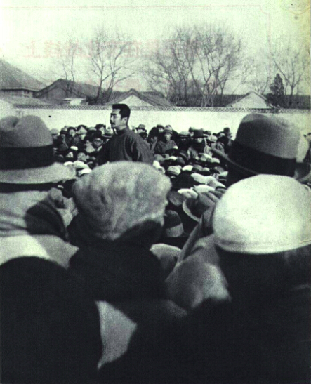
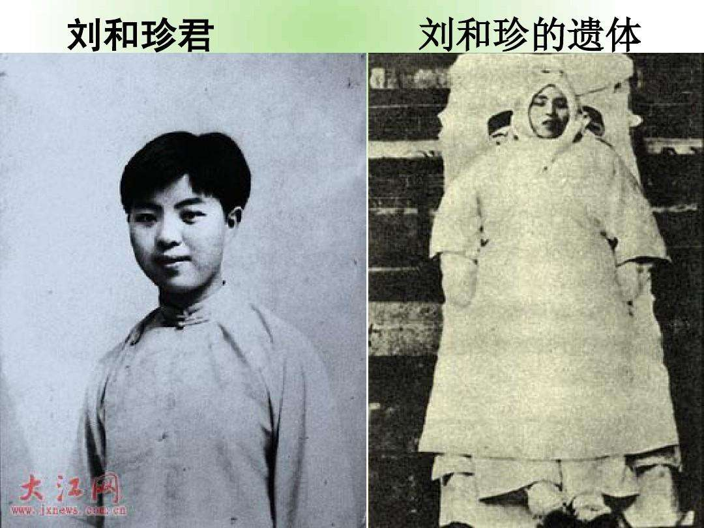
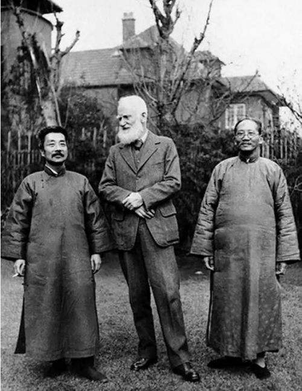
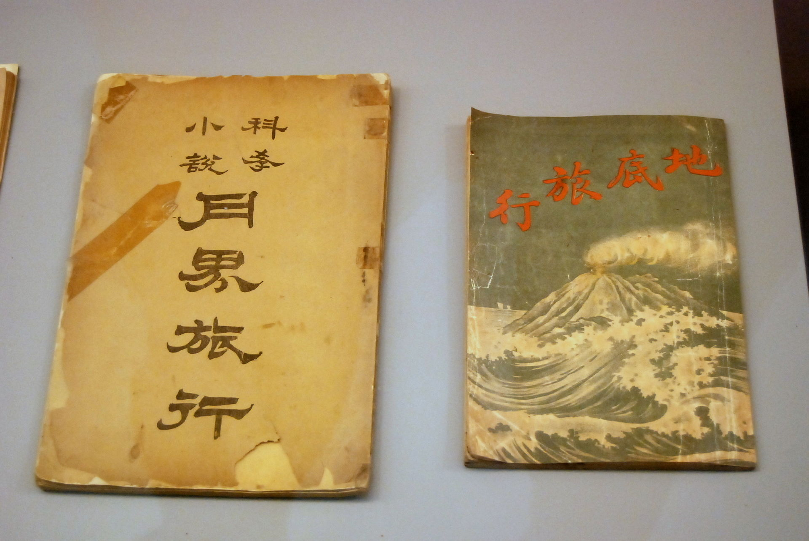
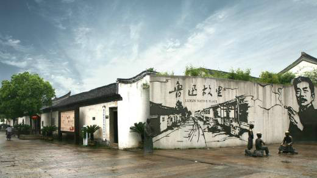
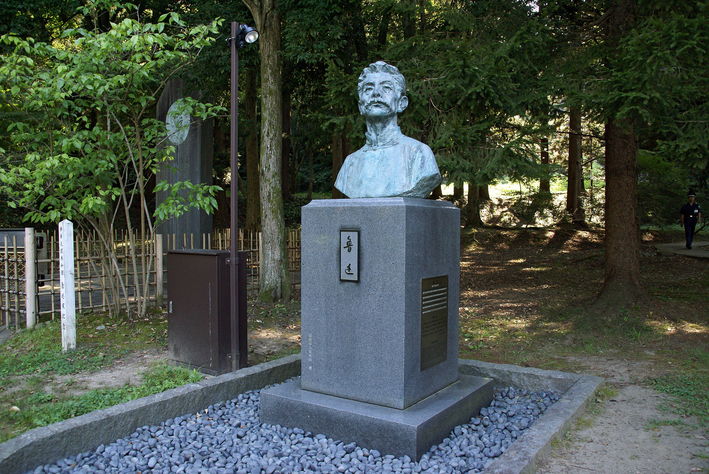
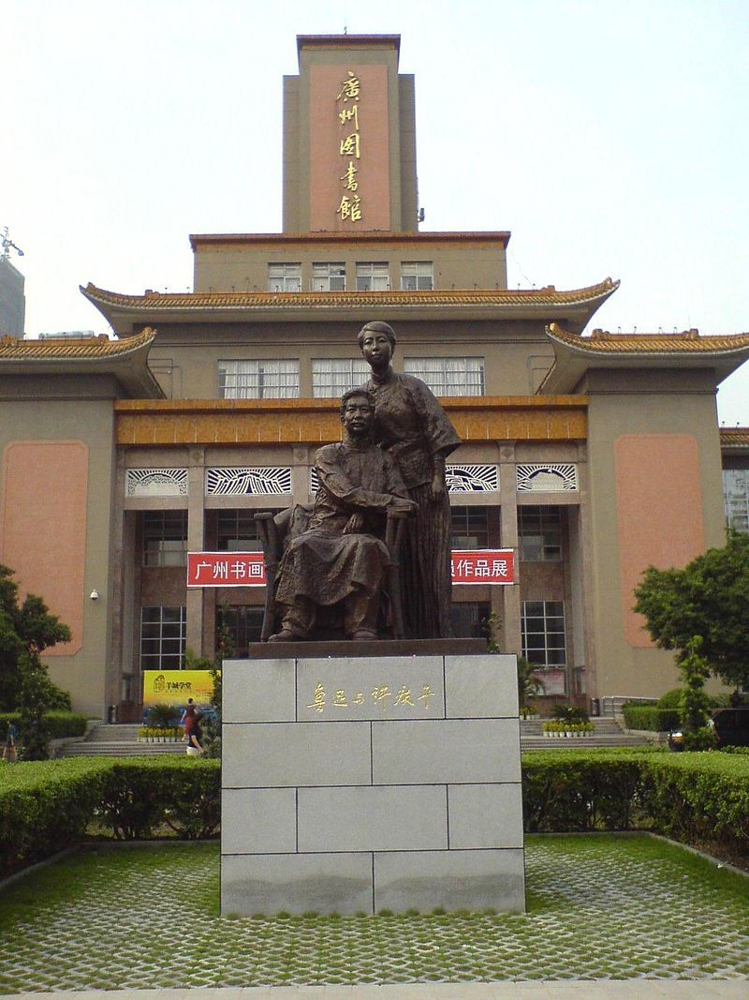
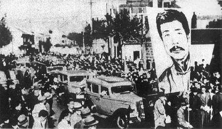

## nnnn姓名（资料）

### 成就特点

- ​
- ​

### 生平

周树人（1881年9月25日－1936年10月19日），原名樟寿，字豫才、豫山、豫亭，以笔名鲁迅闻名于世，浙江绍兴人，为中国的现代著名作家，新文化运动的领导人之一，中国现代文学的奠基人和开山巨匠，在西方世界享有盛誉的中国现代文学家、思想家。鲁迅的主要成就包括杂文、短中篇小说、文学、思想和社会评论、学术著作、自然科学著作、古代典籍校勘与研究、散文、现代散文诗、旧体诗、外国文学与学术翻译作品和木刻版画的研究，对于五四运动以后的中国社会思想文化发展产生一定的影响，蜚声世界文坛，尤其在韩国、日本思想文化领域有极其重要的地位和影响，被誉为“二十世纪东亚文化地图上占最大领土的作家”。

1881年9月25日（清光绪七年八月初三），鲁迅出生在中国浙江省绍兴府会稽县府城内东昌坊口（今属绍兴市越城区）的一个书香门第，名为周樟寿。父亲周伯宜是一名秀才。

童年生活于百草园、咸亨酒店、外婆家一带的农村等地，成为后来鲁迅的两部小说集《呐喊》、《徬徨》和散文集《朝花夕拾》的重要素材来源。

1892年（光绪18年），11岁就读于家乡绍兴的寿镜吾开设的私塾三味书屋。

1893年（光绪十九年），祖父周福清因为向浙江乡试主考官殷汝璋行贿，谋求周伯宜录取，被殷汝璋举报，而被革职下狱，鲁迅兄弟则被安插到离城有三十多里的皇甫庄大舅父的家中避难。周福清科举舞弊案判处了“斩监候”，周家为了使周福清得以活命，每年花费大笔资金疏通官府，直到八国联军事件之后，周福清才被赦免。但这八年的支出，周家家道衰落，同时期父亲周伯宜也重病在床，1896年病故。家庭的变故对鲁迅产生了深刻的影响[2]。

1898年4月，鲁迅离开家乡的三味书屋，进入金陵‘无需学费的学校’：新式学堂江南水师学堂，因为远房的叔祖周庆蕃（号椒生）在这所学校教汉文，兼当管轮堂监督。并改名为周树人。

鲁迅后来这样回忆起当时离家的情景：“我要到N进K学堂去了，仿佛是想走异路，逃异地，去寻求别样的人们。我的母亲没有法，办了8元的川资，说是由我的自便；然而伊哭了，这正是情理中的事，因为那时读书应试是正路，所谓学洋务，社会上便以为是一种走投无路的人，只得将灵魂卖给鬼子，要加倍的奚落而且排斥的。然而我也顾不得这件事，终于到N进了K学堂了。”

5月份入学，经过三个月的试读后补为正式生，分在管轮班。

1898年10月，转考入南京矿务铁路学堂（简称矿路学堂）。学校的主要目的是采煤，所以学校的功课以矿务为主，鲁迅感到非常新鲜。

1902年1月以优异成绩毕业，考取了“南京矿路学堂毕业奏奖五品顶戴”的官费对日留学生。

1902年2月，21岁的鲁迅赴日本，在写给弟弟周作人的信中，他说自己要入读成城学校——日本为留学生开设的一所陆军士官预备学校。当时凡进成城学校的留学生，均由中国留学生陆军监督审批，所以鲁迅未能进入。只好先入东京弘文学院（日本专为中国留学生创办的速成性质的学院，普通科二至三年，速成科有六个月、八个月、一年、一年半不等），入编江南班（班次以学生省籍编排）。鲁迅是江南班中第一个剪掉辫子的。

鲁迅与许寿裳、陶成章等浙江籍留日学生在东京组织浙江同乡会，会上决定出版的月刊《浙江潮》，成为留日学界宣传革命的重要刊物之一。鲁迅从创刊时起，就订购保存并积极撰稿支持。所撰稿子除了从德文版翻译各种欧美小说，还有矿物地质论文等。1903年，鲁迅参加了鼓吹革命的“浙学会”。

1904年4月，从东京弘文学院毕业，获得“日本语及普通速成科”文凭。按清政府给予的官费资格，鲁迅应该升入东京帝国大学工科所属的采矿冶金科学习。但鲁迅决意学医，理由是：
西医对日本的维新有助力；
毕业回国后救治像他父亲那样被中医误治的病人的痛苦，还可以促进国人对于维新的信仰
鲁迅自幼牙齿不好
因看不惯一些留日学生的吃喝玩乐，所以选择远离东京、地处东北偏僻小城镇的仙台医学专门学校（1912年改制东北大学医学部）。中国驻日公使兼留学生监督杨枢向该校校长发出照会，介绍鲁迅入校。鲁迅成了该校第一个中国留学生，学制四年，学校不收鲁迅学费。在仙台给鲁迅影响最大的是解剖学老师藤野严九郎。

鲁迅对医专生活的印象，第一是死记硬背：“校中功课，只求记忆，不须思索，修习未久，脑力顿锢。四年而后，恐如木偶人矣。”第二是课时太多，无暇搞译述活动:“而今而后，只能修死学问，不能旁及矣，恨事!恨事!”
1904年年底，鲁迅成为光复会第一批会员。

【从文】

1906年鲁迅在医专课堂上观看老师播放的日俄战争的幻灯片，里面有中国人给沙俄当坐探，被日军逮捕以间谍罪枪毙看头，大量本地中国人围观。鲁迅认识到“医学并非一件紧要事，凡是愚弱的国民，即使体格如何健全，如何茁壮，也只能做毫无意义的示众的材料和看客，病死多少是不必以为不幸的。所以我们的第一要著，是在改变他们的精神，而善于改变精神的是，我那时以为当然要推文艺。”决定弃医从文。[4]1906年3月，医专作为大二生退学。告诉许寿裳：“我决计要学文艺了，中国的呆子，坏呆子岂是医学所能治疗的么？”

1906年，25岁的鲁迅从日本回国，遵照母亲的意见而与时年28岁的朱安结婚。7月，从仙台回到东京，不再入学读书，专门从事文艺译著工作。

【】

1909年鲁迅从日本回到中国，担任浙江两级师范学堂（今杭州高级中学）优级生理学、初级化学教员，绍兴府中学堂监学兼博物学教员，绍兴山会初级师范学堂（今绍兴文理学院）校长等职务。后写出第一篇小说《怀旧》（文言文小说）。

1912年，鲁迅到中华民国政府教育部工作，袁世凯做大总统后，随政府搬到北京，历任教育部社会教育司第1科科长、教育部佥事。这时，他沉迷于收集研究拓本之中。后重新投身新文化运动，并兼任北京女子高等师范学校教授和北京大学兼职讲师。（注：鲁迅当时在北大兼职讲师，并不是北大职工。因为当时蔡元培校长定规，到北大任职，必须辞去原来职务，而鲁迅当时在教育部里担任佥事一职。这里往往被写北大历史的人搞错，生拉硬拽把鲁迅也当成北大职工。）

【】

1918年，37岁的周树人首次用“鲁迅”为笔名，在《新青年》上发表中国史上第一篇用现代形式创作的短篇白话文小说《狂人日记》。1921年12月，他还发表中篇小说《阿Q正传》。1924年，鲁迅、周作人、林语堂、钱玄同等人创办同人周刊《语丝》。
1924年，诺贝尔文学奖提名、印度大诗人泰戈尔来访紫禁城，北京方面安排鲁迅与泰戈尔会见且合照。当时中国文坛对于泰戈尔访华的评价趋于两极化，鲁迅将其访华评价为“做了一瓶香水”。

鲁迅共做了14年的中华民国北洋政府的公务员，主要的业绩有：担任国语统一会教育部代表，协调制定注音字母（与马裕藻、朱希祖、许寿裳、钱稻孙共同提议并执笔文案“统一读音，不过改良反切，故以合于双声叠韵的简笔汉字最为适用”）；与钱稻孙、许寿裳2位科长合作中华民国国徽设计案，执笔《致国务院国徽拟图说明书》（说明书全文详见2005年版《鲁迅全集》）；并设计了当时北京大学的校徽，系“北大”二字的美术字体；分管图书情报（图书资讯）业务：督导京师图书馆（后来的北京图书馆，现在的中国国家图书馆）等。直到被教育部时任署总长章士钊免职为止。

为此鲁迅向中华民国平政院提起行政诉讼并胜诉，依法可以复职，但他选择离开政府体系。

1926年8月，鲁迅因支持北京学生爱国运动，抗议三·一八惨案，对北洋政府失望，于是南下厦门大学任文科教授。数月后，1927年1月16日，46岁的鲁迅离开厦门，18日抵达广州，19日晨在孙伏园等人的陪伴下移入“广州中山大学”任文学系主任兼教务主任，并与自己29岁的学生许广平同居。

2月18、19日，赴香港在上环基督教青年会礼堂举行两场题为“无声的中国”及“老调子已经唱完”的演讲。

1927年10月，鲁迅搬至上海居住9年左右，他住在上海公共租界北区的越界筑路区域（所谓“半租界”，是指今天虹口区北部鲁迅公园一带），那里有特殊的政治环境保护他写作避免遭到迫害，还有他不少的日本友人。1930年起先后加入中国自由运动大同盟、左翼作家联盟和中国民权保障同盟，但鲁迅与左联部分成员有很多思想上的冲突。1927年到1936年间，鲁迅创作了很多回忆性的散文与大量思想性的杂文，翻译、介绍外国的文学作品。

鲁迅在上海期间，和宋庆龄、陈赓有交往。鲁迅所主持的文学团体和郭沫若、郁达夫主持的文学团体有矛盾。鲁迅扶植奖掖文学青年，包括柔石、白莽、萧军、萧红等，也和化名狄克的张春桥进行过论战。自1931年起，鲁迅大力倡导木刻版画，是为中国创作版画的先锋。

1936年10月19日清晨五点二十五分鲁迅在上海因肺结核病去世，终年55岁。他的死讯引起全中国的注意。治丧委员会由宋庆龄、蔡元培等知名人士组成，其中包括了上海各界救国联合会推荐的沈钧儒、李公朴二人。在上海上万民众自发为他一个文艺界人士举行前所未有的隆重的葬礼。

1936年10月21日下午，参加鲁迅葬仪的送葬队伍，从徐家汇一直排到虹桥万国公墓。鲁迅灵柩上覆盖写有“民族魂”的白旗，轰动一时。到达万国公墓墓地时，现场人山人海，约两万余人。蔡元培、宋庆龄、沈钧儒等立在高台上，由蔡元培、宋庆龄先后致悼辞后，沈钧儒讲话，他激动地说：“高尔基前几个月死了，死后由苏联政府替他国葬。现在，像鲁迅这样伟大的作家，我们人民群众一致要求国葬，但政府不管。今天我们人民自己来葬，到的都是民众自己。这个，我想鲁迅先生一定很愿意！”

1956年，鲁迅墓迁移重建于上海虹口公园。

鲁迅的遗嘱共有7条，其中前几条交代丧事从简；第5条交代幼儿周海婴“倘无才能，可寻点小事情过活，万不可去做空头文学家或美术家”；第6条是对别人应许的事物不可当真；最后一条是万勿接近“损着别人的牙眼，却反对报复，主张宽容的人”。

【作品】

鲁迅作品题材广泛，形式多样灵活，风格鲜明独特。在他的人生中，创作的作品，体裁涉及小说、杂文、散文、诗歌等。有《鲁迅全集》二十卷1000余万字传世。在中华人民共和国成立后，其多篇作品被选入中小学语文教材，对新中国的语言和文学有着深远的影响。

鲁迅以小说创作起家。1918年在《新青年》杂志发表的《狂人日记》是中国现代白话小说的开山之作，影响深远。其后，鲁迅连续发表多篇短篇小说，后来编入《呐喊》、《彷徨》两个短篇小说集，分别于1923年和1926年出版。

代表作有《阿Q正传》、《祝福》、《孔乙己》、《故乡》等。主人公阿Q、祥林嫂、孔乙己、闰土等在中国妇孺皆知。

鲁迅小说主题多是反封建、反礼教、反传统，反迷信，反映人性的阴暗面，善于讽刺，用笔深刻冷隽而富幽默，善于创造典型人物，描写人物的面貌言语、心理和行动，并善于描写环境、场面及渲染气氛。

【杂文】

鲁迅首创了以论理为主，形式灵活的新文体——“杂文”，并将之发扬光大。他的杂文数量极多，题材广泛，形象鲜明，论辩犀利，文风多变，毛泽东誉之为“匕首”和“投枪”（匕首投枪一说本于鲁迅《南腔北调集》中的《小品文的危机》），深入揭示了当时中国社会各方面的问题。
鲁迅杂文是匕首、是投枪，“论时事不留面子，砭锢弊常取类型”，题材广泛，对社会的黑暗面、民族的劣根性，观察深刻。形式灵活多变，有多样风格和笔法，有的隐晦曲折，有的幽默诙谐，均能在使人会意的一笑中达到讽刺的效果。有的沉郁严峻，在似乎从容的叙述中，蕴藏着对敌人的无限愤懑。
鲁迅杂文感情炽热，汪洋恣肆，咄咄迫人，冷隽辛辣，说理透彻，结构严密，简炼含蓄，善用比喻，形象性强，富于逻辑性，气势恢宏凌厉。
代表作有《二心集》、《华盖集》等。

鲁迅散文也有着重要的地位，鲁迅在空虚失望之余以小品文吐露心声，反映时代。主要作品结集为《朝花夕拾》和《野草》。

鲁迅并不看重自己的诗歌创作，只是偶尔为之。其诗作传世无多，主要以旧体的近体诗为主，多有佳句。“寄意寒星荃不察，我以我血荐轩辕”，“惯于长夜过春时，挈妇将雏鬓有丝。梦里依稀慈母泪，城头变幻大王旗。忍看朋辈成新鬼，怒向刀丛觅小诗。吟罢低眉无写处，月光如水照缁衣”，“度尽劫波兄弟在，相逢一笑泯恩仇”，“横眉冷对千夫指，俯首甘为孺子牛”

鲁迅也以译作著名。在鲁迅留下的1000多万字作品中，有一半是翻译文字。他在前期主要翻译欧美文学及日本文学作品，如尼采、凡尔纳等，后期则主要翻译东欧文学及苏联文学的革命文学作品。他的翻译强调忠实原文，有时甚至连原句的结构也不加改动，以“硬译”风格闻名。他曾希望借引入欧式的长句，来增加汉语对复杂关系的表现力。据统计，鲁迅总共翻译过14个国家近百位作家200多种作品。

【】

1937年10月19日，毛泽东在延安陕北公学的鲁迅逝世周年大会上发表的《论鲁迅》演讲中称鲁迅是“现代中国的圣人”，到毛泽东晚年（1971年），毛自称是“圣人的学生”，对鲁迅评价极高[16]。

中共在延安创办的文学院取名鲁迅文学院，后改为鲁迅艺术文学院。1949年中华人民共和国成立后，鲁迅的文学地位得到主流意识形态的高度肯定。鲁迅的众多文章被选为大陆中小学语文教材的课文。

由于鲁迅生前反对国民党政府的官僚腐化，因而受到国民政府的严重打压。1949年后，鲁迅在台湾也一直被当作国民党的反面教材加以贬低。不过，近年台湾也有推动鲁迅作品的努力，台北风云时代出版公司在1990年左右出版《鲁迅作品全集》，其出版小引说：“中国自有新文学以来，鲁迅当然是引起最多争议和震撼的作家……全世界以诠释鲁迅的某一作品而获得博士学位者，也早已不下百余位之多。”出版小引希望“还原历史的真貌，让鲁迅作品自己说话”。的确，鲁迅作品引起的正反两面评价之多、之极端，不但是新文学，甚至是中国文学史上罕见的。

日本著名作家，诺贝尔文学奖获得者大江健三郎评价鲁迅：“二十世纪亚洲最伟大作家。”

瑞典著名汉学家、诺贝尔文学奖终审评委马悦然曾澄清鲁迅拒绝获诺贝尔文学奖的传闻说：“鲁迅是在1936年去世了，那个时候，1930年代根本就没有外边的人知道鲁迅是谁，也没听说过他的名字。《呐喊》、《彷徨》是1950年代才翻成外文（原话如此，经查证，鲁迅作品最早被翻译为西方文字，是1936年8月英国乔治·C·哈拉普公司出版的《活的中国——现代中国短篇小说选》，收录了《药》、《一件小事》、《孔乙己》、《祝福》等多篇作品），是杨宪益翻译的（真实译者为斯诺），翻译得很好，但是那个时候鲁迅已经不在了。”

1949年山东当代诗人臧克家为纪念鲁迅逝世13周年而写了一首抒情诗，题为《有的人》，节录如下：
“	
有的人活着
他已经死了；
有的人死了
他还活着。

王蒙：“文坛上有一个鲁迅那是非常伟大的事。如果有五十个鲁迅呢？我的天！”

夏志清：“鲁迅是中国最早用西式新体写小说的人，也被公认为最伟大的现代中国作家。。在他一生最后的六年中，他是左翼报刊读者群心目中的文化界偶像。自从他于1936年逝世以后，他的声誉越来越神话化了。他死后不久，二十大本的《鲁迅全集》就立即出版，成了近代中国文学界的大事。但是更引人注目的是有关鲁迅的著作大批出笼：回忆录、传记、关于他作品与思想的论著，以及在过去二十年间，报章杂志上所刊载的纪念他逝世的多得不可胜数的文章。中国现代作家中，从没有人享此殊荣。这种殊荣当然是中共的制造品。

【】

### 照片

