## nnnn姓名（资料）

### 成就特点

- 与林风眠，刘海粟和颜文梁并称“四大校长”
- 中国现代美术的奠基者
- 与张书旗、柳子谷三人被称为画坛的“金陵三杰”。
- 尤以奔马享名于世
- 主张发展“传统中国画”的改良，立足中国现代写实主义美术，提出了近代国画之颓废背景下的《中国画改良论》。

### 生平

64年前的今天，中国现代美术奠基者徐悲鸿逝世

64年前的今天，为抗战卖画裸捐的中国现代美术奠基者徐悲鸿逝世

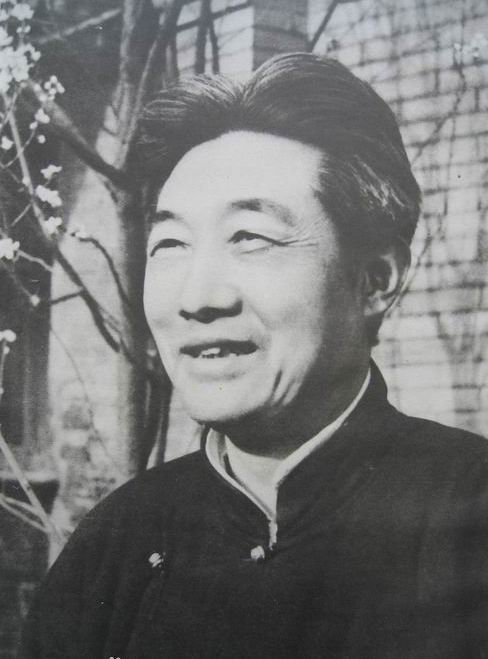

【卖画为生的少年】

1895年7月19日，江苏宜兴市屺亭镇人。父亲是私塾先生，徐悲鸿自幼随父亲学习诗文书画。13岁，随父辗转于乡村镇里，卖画为生。17岁，徐悲鸿独自到上海卖画谋生，从事插图和广告绘画等。

1916年（21岁），入震旦大学法文系半工半读。其间认识了著名的油画家周湘、岭南画派的代表人物高奇峰、高剑父，得到了他们指点。尤其结识了维新派领袖康有为，受其影响颇大。

【从私奔到留学欧洲】

此时，徐悲鸿与老师蒋梅笙教授的二女儿蒋碧微恋爱。蒋碧薇原已答应许配给苏州查家。1917年（22岁），在康有为的帮助下，两人私奔到日本学习美术。不久回国，两人得到了蒋碧微家庭的谅解。

徐悲鸿赴北京，但任北京大学画法研究会导师。在京期间，相继结识了蔡元培、陈师曾、梅兰芳及鲁迅等各界名人，深受新文化运动思潮的影响。1918年5月14日，发表著名的《中国画改良论》，并争取到公派赴法留学的机会。

1919年（24岁），夫妻两人一起到法国留学，开始接受正规的西方绘画教育。期间由于北洋政府一度中断学费，曾被迫转至德国柏林学习。在8年的欧洲学习中，他游历了瑞士、意大利的米兰、佛罗伦萨、罗马等地，创作了不少得意之作。

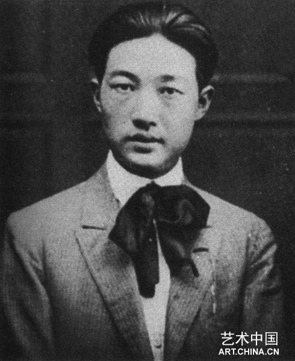

【一个女学生的恋情】

1927年（32岁），回国后，在上海成立南国艺术学院，担任绘画科主任。1929年，在国立中央大学任教，移居南京。1930年，一个名叫孙多慈的女学生，进入了徐悲鸿的生活。夫妇之间长达十余年的冷战，也由此展开。

1934年，应法国国立美术馆邀请，前往巴黎举办中国近代绘画展。同时游历了意大利、德国、苏联等地，举办画展。8月，回国后，徐悲鸿仍旧对孙韵君念念不忘，夫妇继续冷战、分居。数年后，徐悲鸿与孙韵君分手时，蒋碧微早已投入到在欧洲结识的张道藩的怀抱。

（徐悲鸿油画《放下你的鞭子》，以孙多慈为模特）

【为抗战卖画募捐】

1936年，与他人组织画会“默社”。1937，在香港购得视为生命的吴道子画《八十七神仙图》卷。10月，因抗战，随中央大学内迁赴重庆，创作《巴人汲水》。

1939年，在印度国际大学举办画展，与泰戈尔结识。完成中国画《愚公移山》。1941年，由印度回国，将几年来卖画所得近10万美元全部捐出，用于抗战救灾。尤其油画《珍妮小姐画像》募得四万新币。

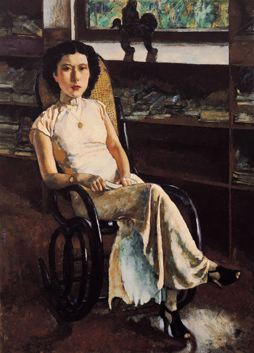

（徐悲鸿画作《珍妮小姐画像》，2005年拍出2200万元的高价）

1945年，与蒋碧微离婚。同年，在郭沫若起草的《文化界对时局进言》上签名，主张废除国民党的一党专政。1946年1月，与另一个学生、小28岁的廖静文结婚。1946年，任国立北平艺术专科学校校长。

（1948年，徐悲鸿与廖静文合影）

【为新中国不遗余力】

1950年，任中央美术学院院长。他在全国战斗英雄、劳动模范代表大会上为战斗英雄画像；创作《毛主席在人民中》。1951年7月，患脑溢血，半身不遂，抱病卧床一年有余，有所好转。

1953年，抱病指导中央美术学院教学工作，为抗美援朝的志愿军画《奔马》。9月26日，脑溢血症复发，逝世于北京医院，享年58岁。周恩来总理前往吊唁。入葬北京八宝山革命烈士公墓。

（1951年，徐悲鸿在家中创作《毛主席在人民中》）

【中国现代美术的奠基者】

他的代表作有油画《田横五百士》（1930年），《九方皋》（1931年），《徯我后》（1933年），《愚公移山》（1940年）等。

徐悲鸿最擅长画马。简练明快，富有生气，驰誉中外。他是中国现代美术的奠基者。

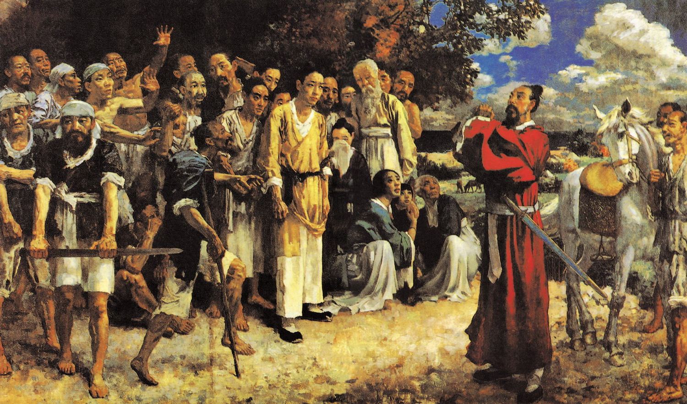

（徐悲鸿画作《田横五百壮士》）

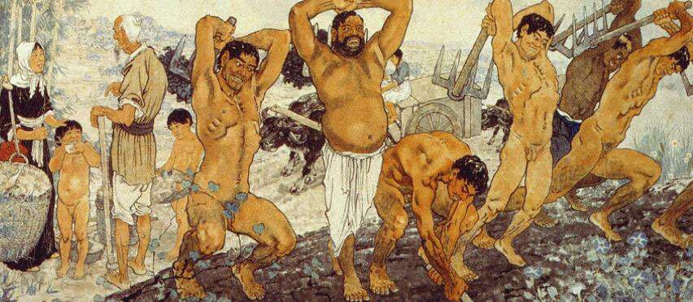

（徐悲鸿画作《愚公移山》）

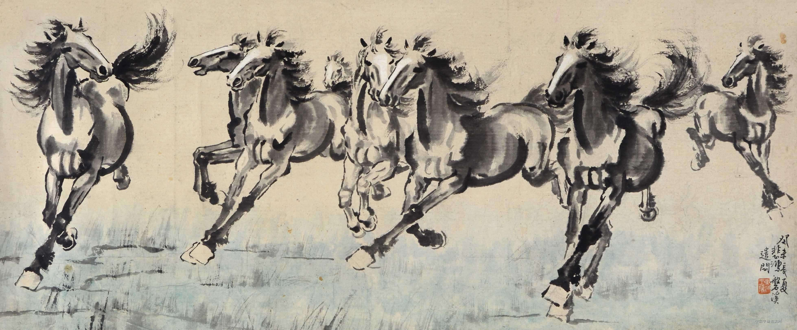

（徐悲鸿画作《八骏图》）

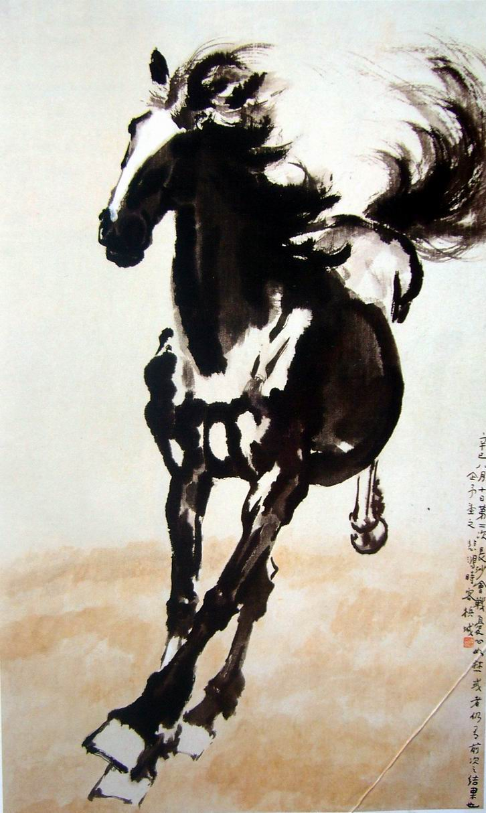

### 照片

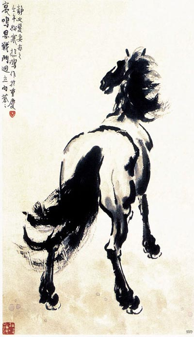

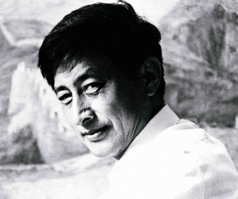

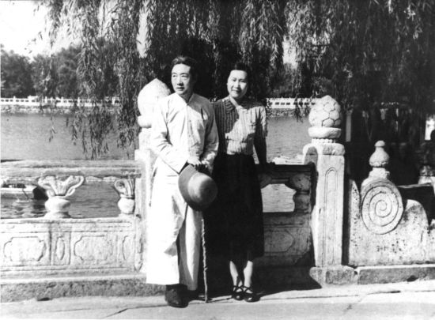

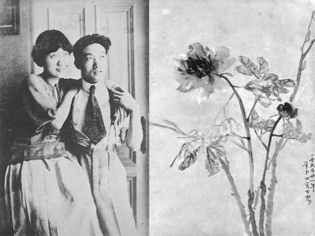

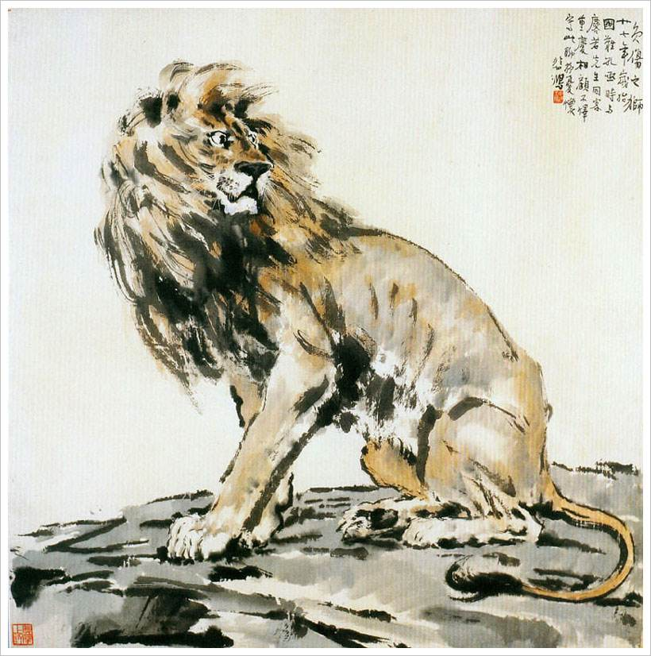

[当年徐悲鸿创作情景](当年徐悲鸿创作情景)

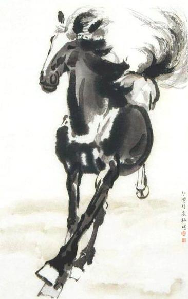

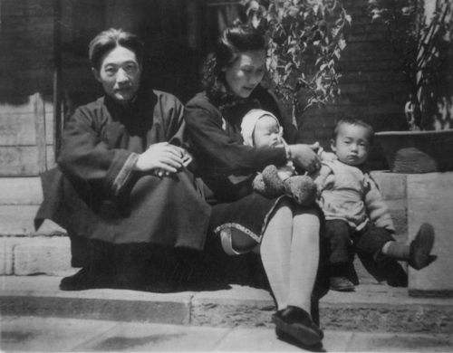

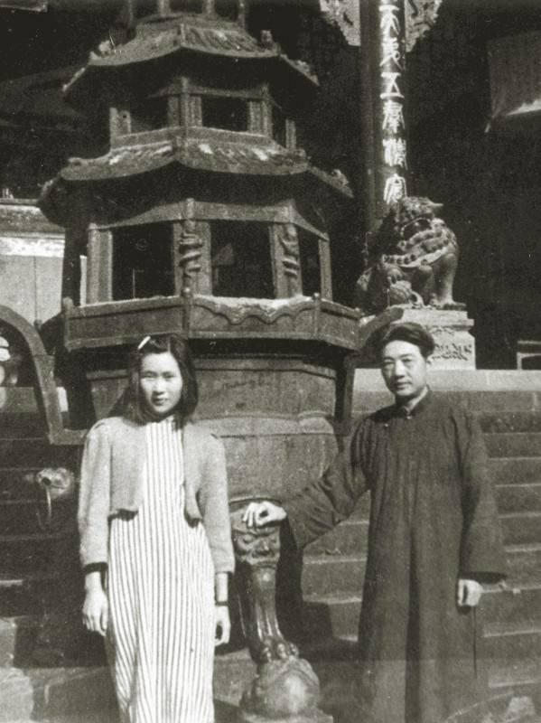

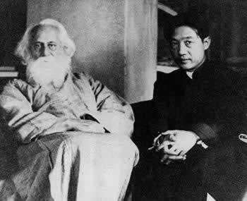

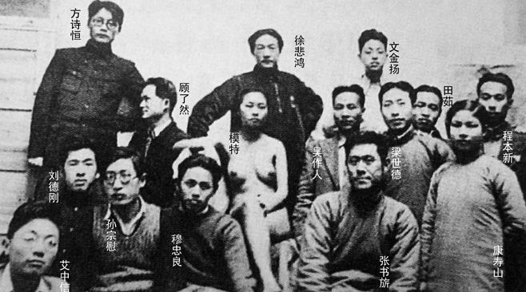

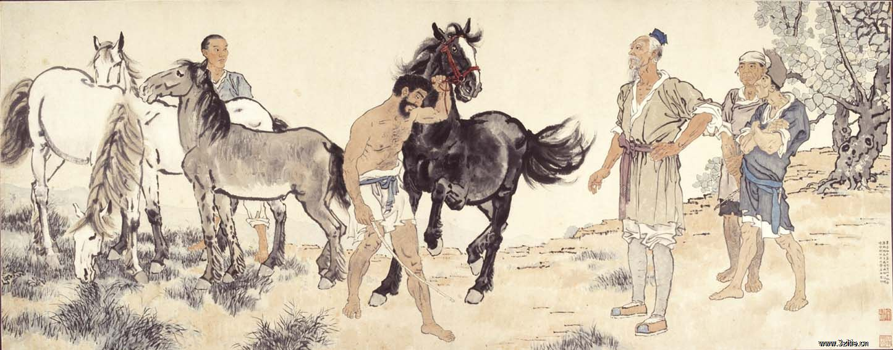