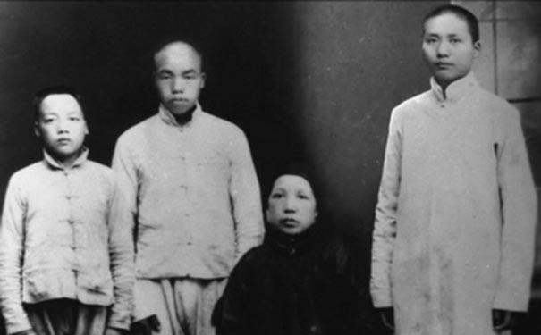
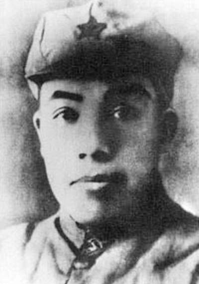
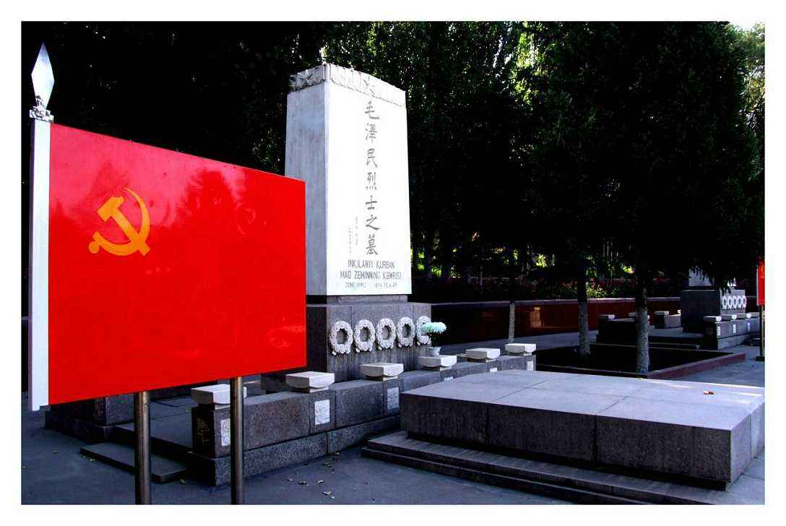

## nnnn姓名（资料）

### 成就特点

- 毛泽东之弟
- 中国共产党财经干部
- 抗日战争时期被转而采取反苏反共政策的盛世才势力杀害。
- 中华苏维埃国家银行行长

### 生平

74年前的今天，毛泽东的亲弟弟，革命的钱袋子毛泽民被秘密杀害

【跟着哥哥闹革命】

1896年4月3日，毛泽民出生于湖南湘潭韶山，比哥哥毛泽东小3岁。毛泽民只读了几年私塾，就一直辍学在家务农。

1921年春（25岁），毛泽东回到家里，鼓动全家人参加革命。毛泽民就来到湖南长沙，起初在湖南第一师范附小做教务，后到毛泽东创办的湖南自修大学学习。不久，加入中国共产党。

（毛泽覃、毛泽民（左二）、毛泽东与母亲合影）

【从工人农民到出版发行】

1922年（26岁），被派遣到江西安源煤矿从事工人运动，创办了中国首个工人消费合作社。1925年2月，随毛泽东回到湖南湘潭、湘乡开展农民运动。9月，被派到彭湃主持的广州农民运动讲习所学习。

1925年底（29岁），从广州到上海，从事地下工作，任中共中央出版发行部经理。任内，他在中国各地奔波建立发行网，使上海、武汉、广州、长沙、宁波等地都设有书店。1929年冬，到天津创办了秘密印刷厂。

【苏维埃的“钱袋子”】

1931年初（35岁），进入中央苏区，出任闽粤赣军区经济部部长。11月，在中华苏维埃第一次全国代表大会上，并任命毛泽民为中华苏维埃国家银行行长。

1933年5月（37岁），兼任闽赣省苏维埃政府财政部部长。1934年9月，兼任对外贸易总局局长。在中央苏区，毛泽民兼钨矿任总经理，扩大了3个矿场，将钨出口到香港。1933年钨产量1800百吨，1934年产值200余万元。毛泽民还兼任没收征集委员会的领导之一，常赴前线随部队筹粮、筹款。

1934年10月（38岁），中央红军开始长征，财政部和国家银行组成十五大队，毛泽民任队长，负责整个中央红军的筹粮、筹款及全部供给工作。红军长征到达陕北后，1936年2月，毛泽民任国民经济部部长。

【稳定新疆的财政工作】

抗日战争爆发后，1937年底（41岁），毛泽民积劳成疾，胃病严重，身体虚弱，于是决定取道亲苏联的盛世才统治下的新疆省，赴苏联治病。1938年2月1日，毛泽民抵达新疆省迪化（今乌鲁木齐），但因中苏边境地区发生鼠疫，导致交通断绝，一时无法赴苏联。于是化名“周彬”，担任新疆省财政厅副厅长、代理厅长。

当时，新疆省由于连年战乱，呈现出经济衰弱、财政混乱、通货膨胀的景象。毛泽民上任后改革税收及币制，稳定物价，发行建设公债，财政上开源节支，在三年内对新疆省财政进行了大力整顿。

1939年（43岁），盛世才批准毛泽民到苏联治病。1940年1月22日，回到新疆。1941年2月，任新疆省民政厅厅长。

和钱希均(右二)在兰州八办..jpeg)

（1938年，毛泽民(右一)和钱希均(右二)在兰州八办）

【被盛世才秘密杀害】

1942年（46岁），盛世才投靠蒋介石，转而采取反苏反共政策。9月17日，盛世才以“督办请谈话”为名，扣押了毛泽民、陈潭秋、林基路等在新疆工作的140多名中国共产党党员及家属，软禁在迪化满城邱公馆。

1943年2月7日（47岁），毛泽民等人被投入监狱。9月27日深夜，毛泽民、陈潭秋、林基路在迪化被盛世才秘密杀害。对于毛泽民等人的遇害，中共一直不知情，外界也有种种揣测。

1946年7月11日，经张治中努力，被盛世才关押的129名中国共产党党员及家属从新疆集体出狱，回到延安。其中有毛泽民的妻子朱旦华、儿子毛远新，他们马上去看望了毛泽东。

（毛泽民与妻子朱旦华、儿子毛远新合影）

【君子复仇十年不晚】

1949年秋，中国人民解放军第一野战军攻占甘肃武威、张掖、酒泉，进逼新疆。1950年初，中共新疆分局社会部部长刘护平发现了当年审讯毛泽民的记录，记录时间是1943年5月5日。

不久，抓捕了当年盛世才手下的执法队长张思信。经审讯，张思信交代了1943年9月27日深夜处决毛泽民等人的情况，以及同年10月扒坟拍照的情况。张思信还在六道湾坟场指认出毛泽民、陈潭秋、林基路的遗骸。

1950年冬，李英奇（盛世才手下的公安管理处处长）、富宝谦、张思信等杀害毛泽民等人的凶手被公审处决。1953年清明节，毛泽民、陈潭秋、林基路的灵柩被移至乌鲁木齐市革命烈士陵园重新安葬。

（新疆乌鲁木齐市革命烈士陵园毛泽民烈士之墓）

