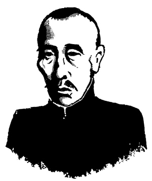
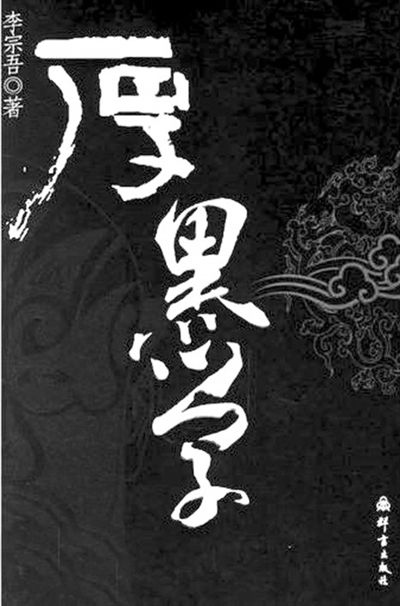
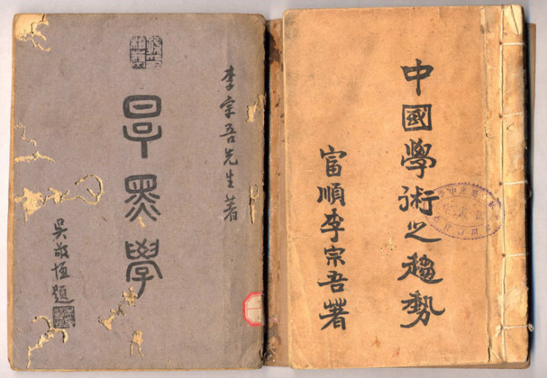
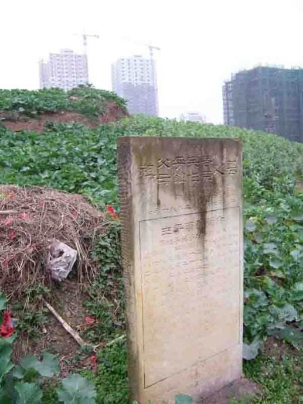

## nnnn姓名（资料）

### 成就特点

- 以其著作《厚黑学》一书闻名于世，更由此自号“厚黑教主
- ​

### 生平

74年前的今天，为官清廉、一点也不厚黑的厚黑教主李宗吾病逝

【宗法儒学不如宗法自己】

1879年2月3日，李宗吾出生于今四川自贡市。8岁时，开始从师读书。原名为宗儒，意在宗法儒教，尊奉孔夫子。25岁，思想大变，认为与其宗法孔孟之道，不如宗法自己，故改名为宗吾。

早年加入同盟会，长期从事教育工作，历任富顺中学校长、省议员、省长署教育厅副厅长及督学等职。其为人正直，治学严谨，为官清廉，其职位油水丰厚，而离任时清贫潦倒。

（四川自贡市富顺中学的李宗吾塑像）

【唯我独尊的厚黑学】

1912年（33岁），他以“独尊”之名（意思是“天上地下，唯我独尊”），撰写了轰动一时的《厚黑学》。《厚黑学》最早的版本仅含三卷：上卷《厚黑学》、中卷《厚黑经》、下卷《厚黑传习录》。之后又陆续补充了《求官六字真言》、《做官六字真言》、《办事二妙法》等。

1936年（57岁），他将历年文字，融合自己的新观点和想法，重新以随笔体裁整理为文，在成都《华西日报》上开辟《厚黑丛话》专栏，连载发表，以后同名结集单独成书。1938年，又将以前曾发表过的短文《心理与力学》重新整理成书发表。因作者认为此文是厚黑学在学理上的根据，所以称其为《厚黑原理》。

【成功学不外“面厚心黑”】

李宗吾提出的厚黑学，宣扬脸皮要厚如城墙，心要黑如煤炭，这样才能成为“英雄豪杰”。书中列举了曹操、刘备、孙权、司马懿、项羽、刘邦等人物为例，阐述当中各人之脸皮厚薄与心地黑白如何影响他们的成败。虽然厚黑学原本是李宗吾以嘲讽手法提出的戏谑性学说，却意外引发热烈回响。

他自诩学说与道、儒、释相提并论，认为古代帝王将相权谋成功之道和英雄豪杰，不外"面厚心黑"而已，触类旁通二十四史都可一以贯之。厚黑学从某个角度而言，反映了人性黑暗自私的一面，然而也反映了人们的处世之道。厚黑之说在抗战末期以后，曾风行一时。李宗吾被誉为蜀中奇人，自号“厚黑教主”。

【厚黑学之外的研究】

他自己认为：世人多注意其“厚黑学”，而对其他作品“不甚注意”，其实，后者才是作者更为着重的作品。1927年，发表的《我对圣人之怀疑》。1928年，发表的《社会问题之商榷》。1936年（57岁），发表了被人称为扛鼎之作的《中国学术之趋势》。

1943年9月28日（64岁），李宗吾中风不治去世。成都、重庆、自贡的各报馆均报道了“厚黑大师”辞世的消息，各界人士闻讯赶往李家吊唁，场面极为隆重。安葬于距他居所不到300米的富台山上。

（如今是一片菜地的李宗吾之墓）

【低调的奇才怪杰】

李宗吾非常低调，去世后竟没有一张照片，一页手迹，一件遗物，一篇遗稿留存于世。网上只有几张疑似照片而已。

《厚黑学》的后续，名曰《老婆经》（怕老婆的哲学），认为怕老婆才能有大发展。“教主曰：为人夫者，朝出而不归，则妻倚门而望，暮出而不归，则妻倚闾而望，是以妻子在，不远游，游必有方。”

他誉为“影响中国文化的20大奇才怪杰”之一。

（网上流传的李宗吾疑似照片）

