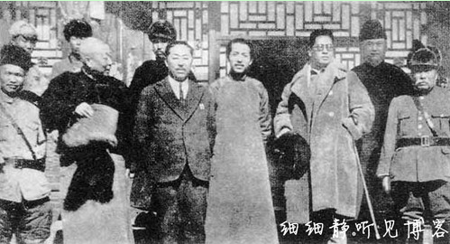
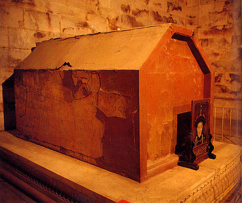
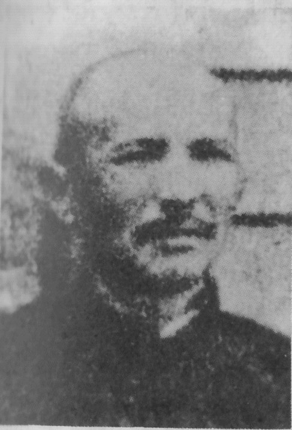

## nnnn姓名（资料）

### 成就特点

- 盗掠清东陵
- 多次投降​
- ​

### 生平

孙殿英（1889年－1947年），字魁元，又字科元，乳名金贵，河南永城人，民国初年军阀，初为直系，历降镇嵩军、国民军、奉军、国民革命军、日军、汪精卫政府，二次大战日本投降后，又归顺蒋介石，成为国民革命军中将，国共战争中被解放军所俘，毒瘾发作而卒。其部队军纪败坏，杀掠无数，还曾盗掠清东陵，侵吞、毁损文物无数，恶名昭彰，人称东陵大盗。

讽刺的是，其子孙天义曾任陕西省政协副主席、黄帝陵基金会会长，专门保护、收藏古文物。

1889年，孙殿英出生于河南永城马牧乡孙庄村人。因出过天花而得外号“孙大麻子”，其父亲为乡里出头与旗人争执而入狱，当日被打死于狱中。

幼年在私塾学习。因为和同学吵架，被教师批评，乃放火烧私塾校舍，被退学。以后，青年孙殿英成为赌徒，并染上鸦片烟瘾。

他先参加民间秘密组织“庙道会”，成为会首；

1922年，他拉着会众投入河南陆军第一混成团团长兼豫西镇守使丁香玲部，先当副官，后升任机枪连连长。

【降镇嵩军】到1924年，第二次直奉战争时，他趁前线打仗扩大队伍到数千人。直系孙殿英趁直军败北，在陕西省及河南省掠夺以维持军队。不久，加入刘镇华的镇嵩军憨玉琨部。

【降国民军】1925年3月，憨玉琨被国民军胡景翼部击败，孙殿英投降国民军，升任师长。

【奉系】不久，脱离国民军。东进沿途掠夺，最终成为奉系山东省张宗昌的部下，任褚玉璞手下的第五师师长。南口大战中，孙殿英勇战国民军。因此受到张宗昌、褚玉璞赏识，被任命为直鲁联军第二十五师师长。此后抵抗国民党北伐。

1927年，任第十四军军长兼大名镇守使。

【国民革命军】1928年，张宗昌最终败北。5月，孙殿英赶紧向蒋介石投诚，被收编委任为国民革命军第六军团第十二军军长；

他率部退守蓟县和遵化一带，清东陵所在地。孙殿英为筹措军饷，以军事演习为名，盗掘乾隆皇帝与慈禧太后的陵墓，收罗大批珍宝，一时间舆论大哗，但孙殿英不惜血本给民国上下人等行贿，压下这桩民国最大盗墓案，不了了之。

1928年夏，孙殿英率部驻扎蓟县马伸桥，这里与清东陵只有一山之隔。随后，军阀孙殿英在河北省遵化县成功的完成了盗陵。所盗的两座墓葬中，一座是清朝乾隆皇帝的裕陵，一座是慈禧太后的定陵。

早在盗陵之前，孙殿英就曾以“体谅地方疾苦，不忍就地筹粮”为名，向遵化县征调大车30辆，可想而知这30辆大车要装多少宝物。

1928年8月4日，青岛警察厅侦探队在大港码头缉获孙殿英部逃兵张岐厚等三人，查获其携带的宝珠36颗。据张交待，其还在天津卖了10颗，得币1200元，这46颗宝珠是在慈禧地宫捡到的。一个士兵尚且能拥有46颗宝珠，那连、营、团、旅、师、军长所得的宝物就可想而知了。

孙殿英掘墓盗宝被发现后，满人哗然。部分旗人团体，以及逊清皇室，包括居住在天津日租界(张园)的溥仪等满人上告到蒋介石那里，要求严惩。此事一时轰动全国。

东陵盗案于1928年12月中旬由军事法庭开庭调查，此后即归于沉寂。直至次年4月20日方开庭预审，至6月8日终审。军事法庭上报几个月过去了，因案情盘根错节，难以判决。

【冯阎】

1930年春，阎锡山和冯玉祥联合反蒋，声势极大，孙殿英赶紧依附于冯玉祥、阎锡山名下，被委任为第四方面军第五路总指挥兼安徽省政府主席。

【张学良】同年9月，张学良南下支援蒋介石，阎败退。张学良武装入关调停，孙殿英投入张学良，当上第四十师（东北军暂编陆军第二师）师长。1931年11月，孙殿英升任第四十一军军长。

1933年2月，日军三万余人进攻热河，孙殿英奉张学良之命率第四十一军由山西驰援热河，向赤峰前进；东北军汤玉麟部和万福麟部与敌一触即溃。孙殿英进抵赤峰，即展开阻击战，相持达七昼夜，后退往猴头沟门，继续与敌作战十余日，最终战败而后撤察哈尔；孙殿英趁机吞并汤玉麟两个骑兵旅、一个步兵团以及其他各路义勇军。孙殿英同日军交战，最终败北，但其勇敢作战赢得了舆论称赞。

同年5月，蒋介石委任孙殿英为“青海屯垦督办”；那时青海是军阀马步青、马步芳，马鸿宾、马鸿逵（宁夏省政府主席、马鸿宾兄长）等“四马”之天下。在蒋介石支持下，1934年1月，孙殿英部自绥远省西部欲进入宁夏省，参与青海、甘肃、宁夏方面统治。“四马”联合起来，武力抗拒孙殿英；“四马”联军约4万余人，孙殿英兵力约7万人。双方作战三个月，孙殿英战败。

【阎锡山收编】1934年3月，孙殿英军队回退时不意又受山西省阎锡山手下的傅作义晋绥军攻击而缴械投降，军权被剥夺。閰锡山出兵斩断孙殿英回山西之路，蒋介石明令撤销其本兼各职，孙殿英被阎锡山收编。自此孙殿英隐退山西晋祠及太原。5月，何应钦任命孙殿英为国民政府军事委员会北平分会高等顾问。

1936年6月，冀察政务委员会委员长宋哲元任命孙殿英为察北保安司令。

【蒋介石】翌年，抗日战争爆发，孙殿英任冀北民军司令，抗击日军。孙殿英发展队伍到一万多人；到1938年夏，蒋介石委任他为新编第五军军长。孙殿英同驻扎河南省林县的日军交战，战绩良好，八路军和日本傀儡政权都想争取他。

【日军】1943年4月，日军出动二十万人进攻太行山区；4月23日，日军包围孙殿英防地（林县），孙殿英率部投降日军，当上“和平救国军”司令。孙殿英任新五军军长，兼任第四方面军指挥官、豫北保安司令。孙殿英利用职权贩卖鸦片，牟取暴利，另一方面秘密投靠蒋介石。

1945年8月，日本投降，孙殿英投诚蒋介石，免去汉奸罪名。孙殿英任新编第四路军总指挥，收夺华北的汪精卫政权公有财产。

1946年7月，随着第二次国共内战全面开始，孙殿英任第3纵队司令官。

1947年4月，在豫北战役中，同中国人民解放军在河南省汤阴激战，5月2日败北被俘。
同年冬，孙殿英在河北省武安县解放军战俘营中因毒瘾发作而死去。时年59岁。

【】

### 照片

,孙殿英(前右)与日军.jpg)

