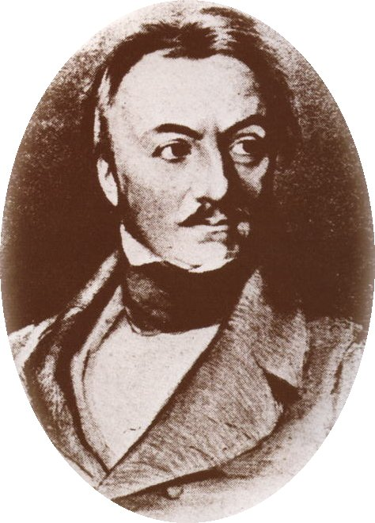
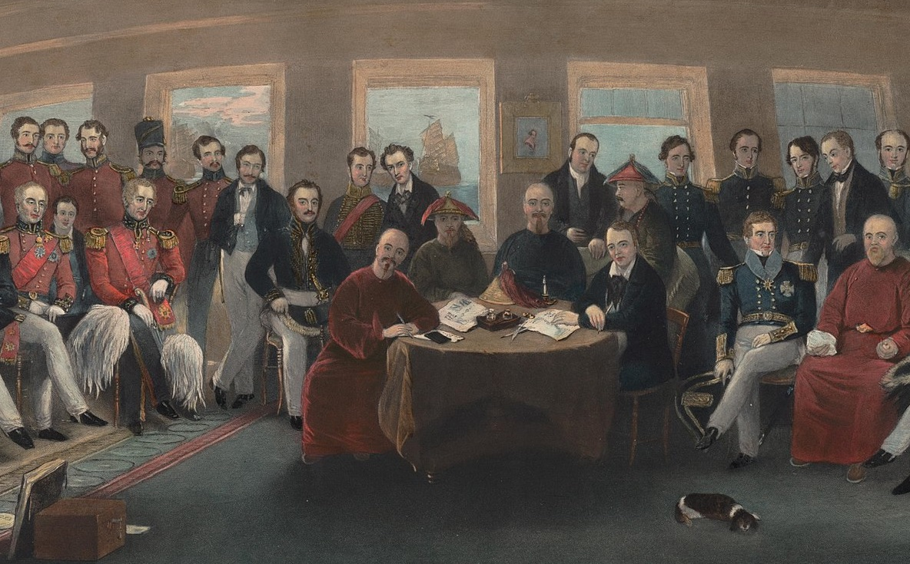
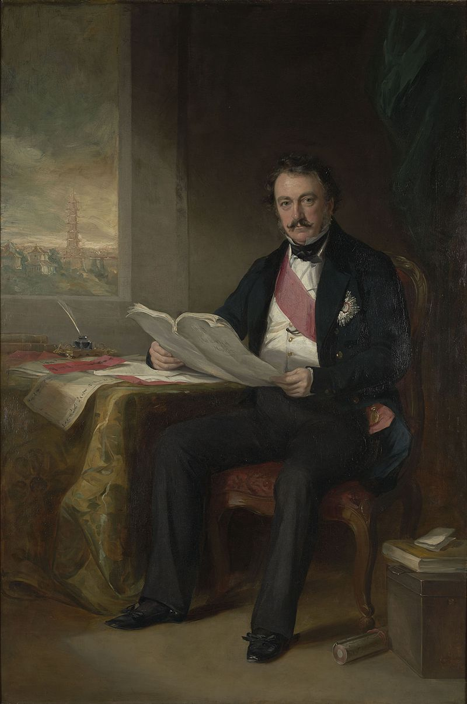
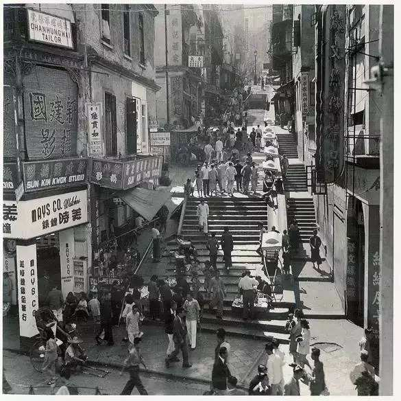

### 228年前的今天，名字类似“哈利波特”的“开埠港督”璞鼎查爵士出生

228年前的今天，签订南京条约，打开中国大门，最短命香港总督璞鼎查出生

228年前的今天，结束鸦片战争，敲开中国大门的短命总督璞鼎查出生

（万象特约作者：一一）

璞鼎查爵士（Sir Henry Pottinger，香港译作砵甸乍，1789年10月3日－1856年3月18日），英国军人及殖民地官员。1841年4月，第一次鸦片战争期间，接替义律为全权代表，打败清政府，签订了《南京条约》。

璞鼎查爵士被称为“开埠港督”，他的任期仅持续了一年，是二十八任总督中任期最短的总督。他因不准英商在通商口岸以外的地方走私鸦片，而受到孤立，黯然离开香港。

【36年的印度生涯】

1789年10月3日，璞鼎查生于爱尔兰。璞鼎查早年就读于贝尔法斯特皇家学院，后来因为家庭陷入财政拮据而中途缀学，从而前往东方寻找发展机会。1804年（15岁），璞鼎查抵达印度并参军，1806年加入了东印度公司。1809年，以中尉身份在马拉他（Mahratta）参与战事。

1820年（31岁）起，璞鼎查被委任为印度地方的行政官长达20年。后因健康原因回国休养，并于1840年4月27日（51岁）被册立为从男爵。

【打开中国大门的南京条约】

1840年，第一次鸦片战争爆发，清朝和英方代表义律私拟《穿鼻草约》。然而，草约送到伦敦后，外务大臣认为《穿鼻草约》过于宽松，英方得益太小，责斥义律办事不力，予以撤换，并改派璞鼎查接任。

璞鼎查接任香港的行政官、驻华商务总监及英方全权代表后，在1841年8月抵华，并随即出兵，先后攻占厦门、定海、镇海和宁波等地，并打败了“扬威将军”的还击。随后，英军进入长江口，攻克吴淞、宝山和上海，至1842年7月又占领镇江，同年8月兵临南京城下。

璞鼎查与清方代表在南京静海寺议约四次后，1842年8月29日（53岁），与清廷代表耆英等人在英舰HMS皋华丽号（HMS Cornwallis）上签订《南京条约》，正式结束了第一次鸦片战争。

（签订《南京条约》的场景）

【与“挚友”耆英的友好】

清朝的签约代表耆英在签订《南京条约》时，与璞鼎查建立友谊。有一次，耆英看到璞鼎查的全家福时，对其儿子大为赞赏，表示希望收为养子。璞鼎查同意下来，并将儿子改名为腓特烈·耆英·璞鼎查。两人互换礼物，耆英赠送了金手镯，而璞鼎查则回赠了一柄宝剑和腰带一条。自此，耆英常在信中以“挚友”称呼璞鼎查。

鸦片战争结束后，璞鼎查以战时英国人流落台湾被杀为由，要求已改任两江总督的耆英代为“伸冤”。清廷派伊里布到广州交涉，但不久伊里布病故，璞鼎查扬言率舰北上。清廷只好派耆英为钦差大臣，到广州继续谈判。

耆英到香港完成《南京条约》换约外，双方在1843年7月22日在香港签订《中英五口通商章程》。10月8日，又在虎门签订《五口通商附粘善后条款》。

（与耆英无关，用来表彰老人的杖国耆英匾）

【任期最短的第一任香港总督】

《南京条约》后，香港成为英国的殖民地。1842年10月27日，璞鼎查在香港发出告示：“香港乃不抽税之埠，准各国贸易，并尊重华人习惯”。

1843年4月5日，英国维多利亚女王颁布《英皇制诰》，正式任命璞鼎查为香港首任总督。12月2日，向璞鼎查颁赠GCB勋衔。

璞鼎查上任总督后，由于驻港军官不满璞鼎查干预军务，英国商人又不满他严守《南京条约》，不准英商在通商口岸以外的地方走私鸦片。结果璞鼎查备受孤立，终在1844年5月7日卸任总督一职，返回英国，成为任期最短的港督。

【每年1500镑政府津贴】

璞鼎查返国后，受到热烈欢迎。1844年5月23日（55岁），获委任为枢密院顾问官。在1845年6月，英国下议院投票通过终身向他每年发放1,500镑津贴。

1847年，璞鼎查出任开普殖民地总督。1848年至1854年出任马德拉斯总督，并于1851年获擢升为中将军衔。璞鼎查退休后居住在地中海岛国马耳他，于1856年3月18日，准备启程回国前去世，享年67岁。

（香港砵甸乍街，以第一任总督命名）