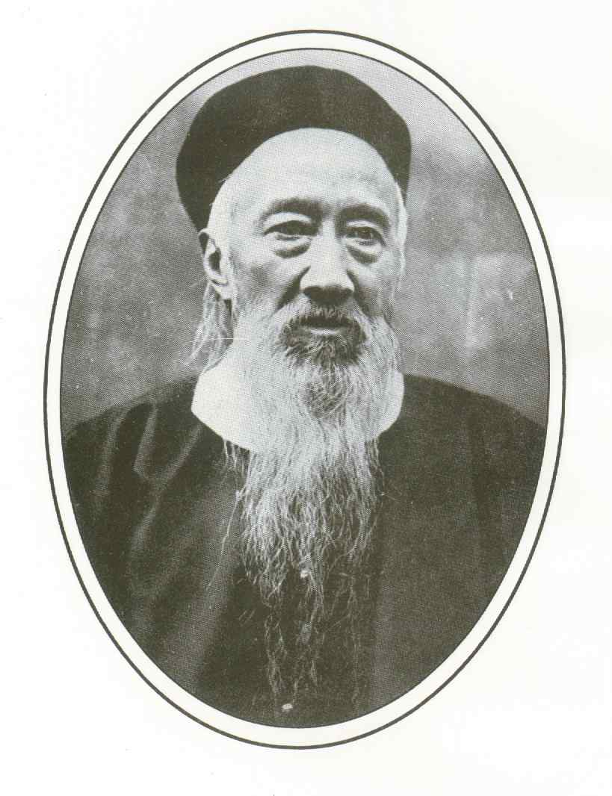
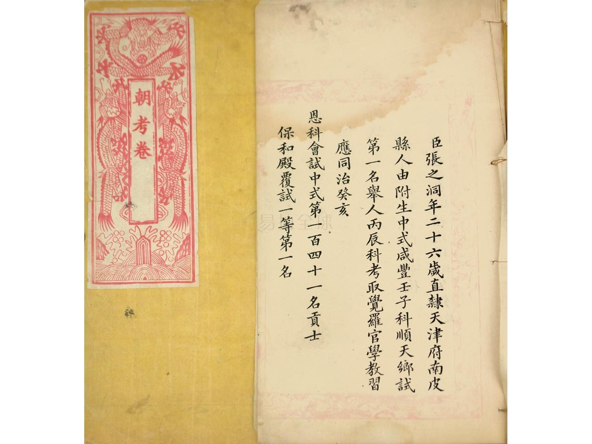
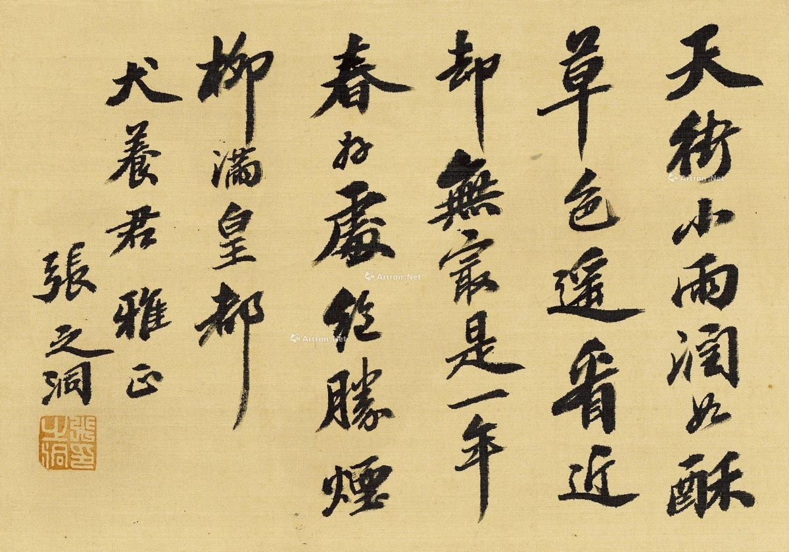
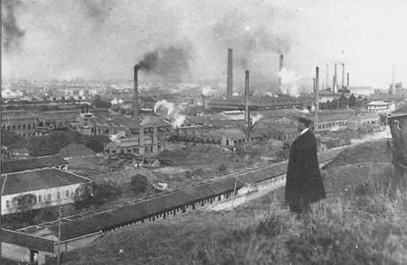
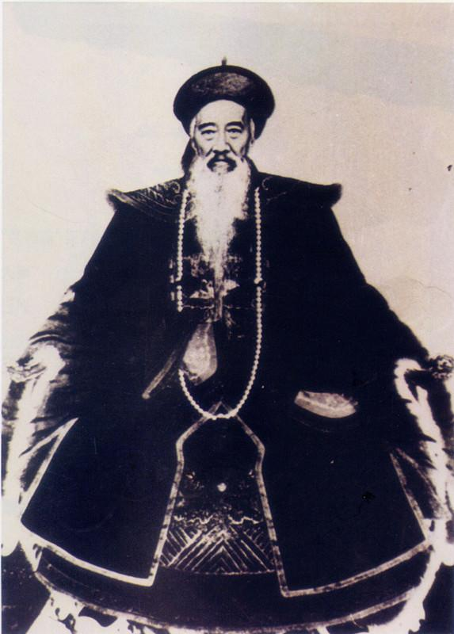

## nnnn姓名（资料）

### 成就特点

- 探花
- 清流派健将，洋务派的主要代表人物
- 晚清四大名臣
- 启用冯子才，打败法国

### 生平

108年前的今天，不言革命的革命家、晚清四大名臣之一张之洞病逝

【少年秀才探花郎】

1837年9月2日，张之洞生于贵州，今河北南皮人。7岁时，父亲任兴义府（今贵州省兴义市）知府，随同前往。13岁，回河北原籍，考取秀才。15岁，赴顺天府乡试，中举人第一名，成“解元”。

此后帮父亲办理军务，结婚生子，不久又父亲去世，为之守丧。直到11年后，26岁的张之洞才考取进士，获第三名探花。第二年，参加会试、殿试，中一甲第三名，授翰林院编修。

1866年（29岁）后，他曾担任浙江乡试副考官、湖北学政、四川乡试副考官、四川学政等职务。

（张之洞的朝考卷）

【出入总理衙门的清流派】

1879年（42岁），俄国侵占新疆伊犁，签定了丧权辱国的《里瓦几亚条约》。张之洞上折，分析条约有十不可许，坚持要求治签约人崇厚的罪。上折后被慈禧、慈安太后召见，特许进入总理衙门。

他同张佩纶、陈宝琛等，频繁起草奏折，提出了筹兵筹饷、筹防边备的积极建议。他们拥戴军机大臣、大学士李鸿藻为领袖，号为清流派。1881年，张之洞擢升内阁学士，任山西巡抚。

（张之洞送给日本人犬养毅的书法）

【打赢中法战争的两广总督】

1884年（47岁），中法战争时，张之洞主战，被调任两广总督。他起用退休老将冯子才，在广西边境击败法军，取得对外战争的难得的一次胜利。

1886年（49岁），张之洞在广州创办广东水陆师学堂、广雅书局和广雅书院。

【成为洋务派的湖广总督】

1889年（52岁），张之洞建议修芦汉铁路，自芦沟桥至汉口，以贯通南北。朝廷准奏，计划北段由直隶总督主持，南段由湖广总督主持。于是，调张之洞任湖广总督。到武汉后，在英国、德国的支持下，张之洞成为后起的洋务派首领。

他扶持民族工业，先后开办汉阳铁厂、湖北兵工厂、马鞍山煤矿、湖北织布局、湖北缫丝局等重轻工业企业。他主持修筑的武昌南北长堤和汉口后湖长堤，划定武汉三镇，为武汉自近代以来的繁荣奠定了基础。

1890年，创建两湖书院。1893年，创办自强学堂（武汉大学前身）。1893年建成的汉阳铁厂，是近代中国第一个大规模机器生产的钢铁工业，在亚洲也是首创的最大的钢铁厂，日本的钢厂建设还比这晚几年。

（张之洞俯瞰汉阳铁厂）

【支持和反对维新派】

1894年（57岁），中日甲午战争期间，张之洞调署两江总督。战败后，张之洞上折，希望总结失败教训，变法图治。捐5000两支持康有为组织强学会。他与帝师翁同龢成了强学会的两大支柱，当时有“内有常熟（翁同龢），外有南皮（张之洞）”之称。

1896年（59岁），回武昌任湖广总督。他虽然大力支持维新派，但又反对康有为的今文经学、孔子改制说、民权思想等。1898年，发表《劝学篇》，提出“旧学为体，新学为用”，维护中国传统，与维新派的激进主张保持距离。戊戌政变后，张之洞以先著有《劝学篇》，得以避难。

【不对联军开战的东南自保】

1900年（63岁），义和团运动期间，张之洞与刘坤一、李鸿章等实行东南自保，不理会慈禧太后对联军开战的命令，并镇压唐才常自立军起义（康有为“保皇派”与孙中山革命派合作的产物）。

1902年，张之洞再度署理两江总督，创办三江师范学堂，强调办学首重师范，为南京大学的前身。1903年，回武昌任湖广总督。1906年，湖北新军改编为陆军第八镇和第二十一混成协。

【临终力保袁世凯】

1907年（70岁），清廷把当时地方权力最大的袁世凯和张之洞调到北京。授大学士和军机大臣，兼管学部。1908年10月，光绪帝、慈禧太后相继死去，溥仪继位。张之洞力劝摄政王载沣不杀袁世凯，认为“主少国疑，不可轻于诛戮大臣”。

1909年10月4日（72岁），在北京白米斜街寓所去世，谥文襄。

【不言革命的大革命家】

张之洞是慈禧扶植起来以抗衡湘军和淮军势力的重要人物，是清流派重要成员，试图改革中国而又不动政制。他与以康有为、梁启超为代表的激进改良派持有不同主张，镇压革命党。

另一方面，他又是继曾国藩、李鸿章后，洋务运动的领袖人物，推动清朝军工改革，因此在清亡后被遗老们视为清朝灭亡的“祸首”。他在湖北的建树是为日后辛亥革命的基础。孙中山曾称“张之洞是不言革命之大革命家”。

张之洞的作息与常人不同，每天下午二时睡觉，晚上十时起床办公，家中卧室常有十几只猫。张之洞为官清廉，家族只有薄田若干，至死亦不增一亩。张之洞与曾国藩、李鸿章、左宗棠并称“晚清四大名臣”。

### 照片

