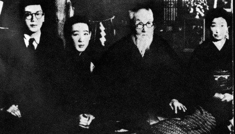
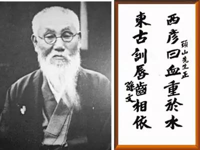
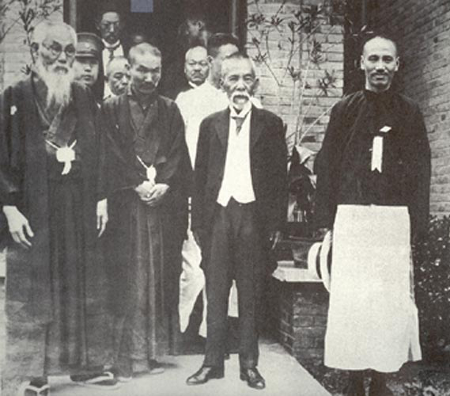

73年前的今天，主张大亚细亚主义、创办了日本近代最神秘组织黑龙会的头山满逝世

73年前的今天，近代史上最神秘组织黑龙会的创立人头山满去世

（万象特约作者：一一）

头山满（1855年5月27日－1944年10月5日）是日本20世纪初右翼政治领袖、军商，极端国家主义秘密团体黑龙会创办人。他是位复杂、非常有争议性的人物。头山满与孙中山、朝鲜的金玉均等革命者关系密切，帮助成立同盟会，支持建立中华民国。

头山满的绰号包括“幕府将军”、“间谍头子”、“老板里的老板”等，可见其影响力。他写了数部明治武士的传记，特别是“三舟传记”（三个名字有“舟”的武士：胜海舟、高桥尼舟及山冈铁舟），传播很广，影响很大。后来，他退出黑龙会，不再过问江湖世事，开始灵修和慈善救济工作，但是他在日本政坛上的影响力丝毫未减。

头山满常说：“我的一生就像是大风吹过，什么都没有留下”。

【坚持对外侵略的浪人】

1855年4月12日，头山满出生在日本九州福冈的一个破落武士家庭。19岁时，被母亲娘家的头山家收为养子，遂称头山满。

头山满早年参加主张对外侵略的“征韩派”与主张先发展国内的“内治派”的斗争。1875年（20岁），头山满与数人，按三国桃园结义的方式在福冈组织矫志社，拥护征韩派的西乡隆盛。1876年，警察发现矫志社企图暗杀内治派首领大久保利通，将头山满等十余人逮捕入狱。但此时他手下已有一大帮追随者，政府为了不引起骚乱，将他拘留一段时间后，便释放了。

1877年（22岁），政府军与西乡军爆发了一场史称为“西南战争”的大规模内战，西乡军战败，使得浪人们一时无所依归。头山满满怀惆怅的心情，加入了著名政治家板垣退助创建的爱国社。

【主张大亚细亚的玄洋社】

1881年（26岁），在筑前共爱公众会的基础上，他建立了日本第一个右翼政治团体——玄洋社（社长是平冈浩太郎）；玄洋社取日本海波涛澎湃、玄洋壮观之意，主张“勤皇报国敬天爱人”。这个玄洋社就是外人所称的黑龙会的前身。

玄洋社积极主张“大亚细亚主义”、“支那保全论”，主张“日支一家”，要帮助汉族推翻满清统治，要联合汉族一起对付俄罗斯的威胁。头山满所说的“亚洲同族相提协，以确保东洋和平，维护世界的文明”。

虽然它是民间团体，但它十分注意在政府官员及内阁中发展成员，加上头山满自己担任社长的机关报《福陵新报》（后称《九州日报》）的影响，使得玄洋社在政界有不可忽视的地位。

（黑龙会徽标）

【甲午战争中的积极分子】

1890年代，中日甲午战争前夕，头山满组织“天佑侠”，安排他们到韩国，绘制韩国详细地图，标识出“韩军”与“清军”位置、军事设备位置等，并为日军安排后勤，提供翻译，向导等。玄洋社在东北和韩国为“天佑侠”提供庇护。

中日甲午战争后，李鸿章与德、俄、法三国交涉，迫日本政府归还辽东半岛。在签署《马关条约》前，日本人小山六之介持手枪刺伤李鸿章，盛传是头山满所安排的。

（头山满书法）

【源自黑龙江的黑龙会】

义和团运动失败后，日俄两国争夺中国东北。1900年9月，头山满等人组织国民同盟会，主张“支那保全论”，排挤俄国势力。1901年2月23日，由头山满、内田良平等人在原玄洋社基础上成立黑龙会，会名即从黑龙江而来。

1902年4月，中俄签订《东三省交收条约》，规定驻东北俄军分三期撤兵，国民同盟会解散。1903年，俄国未执行第二期撤兵规定。8月，头山满组织对露（俄）同志会，主张对俄开战，并给伊藤博文发出警告书。在日俄战争前，资助招募日本浪人、满洲马贼组织游击队，攻击俄军。

（头山满与川岛芳子（左二）合影）

【对孙中山的大力支持】

头山满支持中国革命党推翻满清，并给予孙中山的革命运动大量资助。1905年7月30日（50岁），在黑龙会的斡旋下，中国各派革命组织在东京黑龙会总部，共同成立了中国同盟会。在武昌起义前，潜入中国的黑龙会也提供了大量支持。

1912年初（57岁），头山满等人到南京总统府拜访孙中山。头山满担心袁世凯当总统不利于日本，极力主张北伐，反对南北议和。孙中山逝世后，头山满深致悼念，并应邀参加1929年的奉安大典。奉安大典，1929年6月1日，中华民国国民政府在南京举行的孙中山先生的葬礼。

（1924年，孙中山到访神户与头山满合影）

【带头山呼希特勒万岁】

1936年11月25日（81岁），头山满发起在日比谷公园召开日、德、意签订防共协定的庆祝会。会上，头山满亲自带头山呼希特勒万岁！其后订立的日、德、意军事协定，头山满也完全拥护。

1941年秋（86岁），头山满让刀匠用黄金锻成大刀，赠给希特勒和墨索里尼，并在给他们的信中说，日本进行的大东亚战争有了很大的进展，将把英、美势力驱逐出东亚。

1944年（89岁），头山满在他静冈县御殿场市避暑别墅逝世。

（1929年，头山满（左一）到访中国，蒋介石侧立一旁）