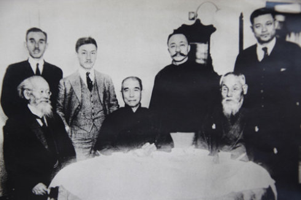
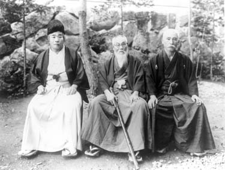
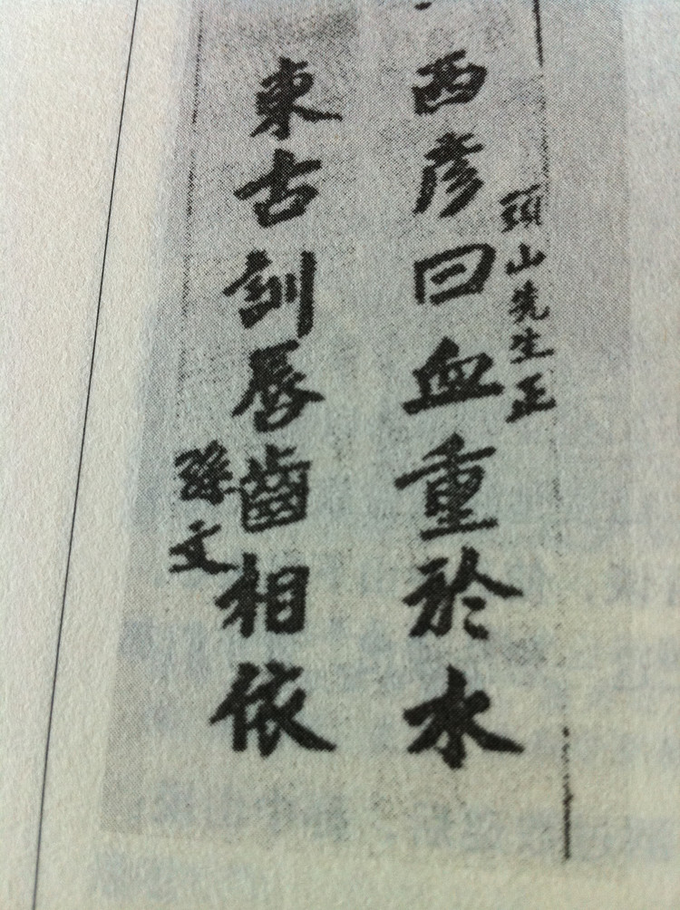
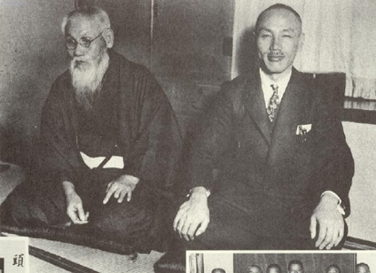
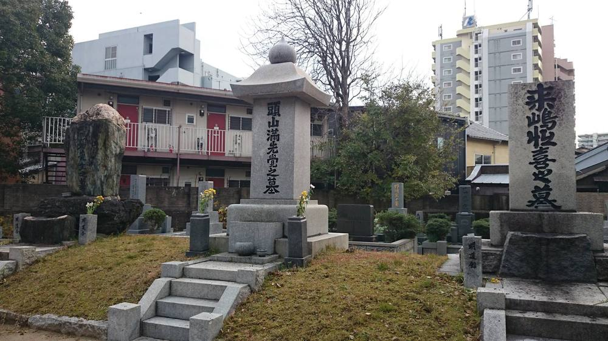

## nnnn姓名（资料）

### 成就特点

- 日本大亚细亚主义之提倡者
- 极端国家主义秘密团体黑龙会创办人
- 曾“支持”革命党建立中华民国
- ​

### 生平

头山满（1855年5月27日－1944年10月5日）是日本在20世纪初右翼政治领袖、军商，极端国家主义秘密团体黑龙会创办人；日本人认为他是慈善家，被日本侵略国则或有多种看法。头山与孙中山、金玉均（朝鲜历史学家一般将他称作‘亲日派’，因为他试图引日本人的势力推翻当时的朝鲜政权）等东亚的有志改革者颇为友好，支持革命党建立中华民国。

1855年4月12日，头山满出生在日本九州福冈城下西町一个破落武士家庭。19岁时，他被母亲的娘家头山家收为养子，遂称头山满。

头山满早年参预主张对外侵略的“征韩派”与主张先发展国内政治经济的“内治派”的斗争。1875年，头山满与平冈浩太郎、箱田六辅等人，按中国三国时刘、关、张桃园三结义精神在福冈组织矫志社，拥护征韩派的萨摩藩士西乡隆盛。1876年，警察发现矫志社企图暗杀内务卿内治派首领大久保利通，将头山等十余人逮捕入狱。但那时他手下已有一大帮追随者，政府为了不致引起骚乱，将他拘留一段时间后，便释放了他。西乡因内治派中的缓征论者得势，于1873年辞去参议官回乡召集军队。1877年，政府军与西乡军爆发了一场史称为“西南战争”的大规模内战，西乡军战败。

西乡隆盛叛乱受挫，使得浪人们感到一时无所依归。头山满怀惆怅的心情，加入了著名政治家板垣退助创建的爱国社。后来爱国社派生出许多社团，板垣把这些社团联合起来，组成一个“议会促进社”，社员多达9万人。

【黑龙会】

1881年，他成为“玄洋社”发起人之一（社长是平冈浩太郎）。

1879年，他与箱田六辅、平冈浩太郎等人组织了筑前共爱公众会。两年之后，在这两个政治结社的基础上，他与前述两人建立了日本近代第一个右翼政治团体——玄洋社（社长是平冈浩太郎）；玄洋社取日本海波涛澎湃、玄洋壮观之意，主张所谓“勤皇报国敬天爱人”，这个社就是外人所称的黑龙会。

对外，这个右翼团体积极主张所谓“大亚细亚主义”。“支那保全论”，主张“日支一家””，要帮助汉族推翻满清统治，要联合汉族一起对付俄罗斯的威胁，头山满所说的“亚洲同族相提协，以确保东洋和平，维护世界的文明”。

虽然它标榜为民间团体，但由于它十分注意在政府官员及内阁中发展成员,加上头山满自己担任社长的机关报《福陵新报》（后称《九州日报》）的影响，这使玄洋社在政界有不可忽视的地位。

【刺杀外务大臣】

外务大臣大隈重信，以图修改不平等条约，但因为条约草案中有外国法官的条款而遭到反对派的抗议。明治22年（1889年）10月18日，遭到国家主义组织玄洋社成员来岛恒喜的炸弹袭击，虽然保住一命但右脚仍需截肢。因此事大隈辞职。

头山满因涉嫌幕后指使暗杀大隈外相而被捕，后又因证据不足被释放。

【天佑侠】

1890年代中日甲午战争前夕，头山满组织“天佑侠”，先行布置于韩国辅助“日本帝国皇军”侵韩：他们绘制韩国详细地图，把“韩军”与“清军”位置图与军事设备标绘，并为日军安排后勤，并由“黑龙会”于韩国与东北罩护天佑侠所作所为，天佑侠还为日本皇军提供翻译与韩境内向导协助侵韩作战。

【刺杀李鸿章嫌疑】

签署《马关条约》前，李鸿章谋交德、俄、法三国，干涉还辽，迫日本政府归还辽东半岛，导致头山满大表不满，日人小山六之介持手枪刺伤李鸿章，亦盛传是头山满唆使所为。

【东北】

义和团运动失败后,日俄两国争夺中国东北。头山满等人于1900年9月组织国民同盟会，高唱“支那保全主义”，鼓吹对俄实行强硬外交，排挤俄国势力，让日本独占。1902年4月，中俄签订《东三省交收条约》，规定驻东北俄军分三期撤兵，国民同盟会解散。1903年，俄国未执行第二期撤兵规定，旧国民同盟会人员集会，主张采取对俄强硬态度。8月成立对露（俄）同志会。头山满担任对露同志会主要负责人。他主张对俄开战，并给枢密院议长伊藤博文发出警告书。

头山满是甲午战争以后日军控制中国东北的灵魂人物；并且在1903年日俄战争前夕资助对俄同志会招募日本浪人、满洲马贼组织游击队，先行攻击俄军，予以军事挑衅。

【刺杀伊藤博文嫌疑】

日本首相伊藤博文原与头山满为政坛上相同派阀；伊藤博文政敌大隈重信即曾被头山满暗杀失败，但仍因右脚必须截肢而被迫辞去外务大臣之职。

1908年10月，日首相伊藤博文于东北哈尔滨为韩国志士安重根枪杀于车站；识者皆知为伊藤博文意图东北利益，招惹头山满遂遭不测。

【与孙中山】

头山满曾支持中国革命党推翻满清，并予孙中山大量资助革命运动。

1905年7月30日，在黑龙会的斡旋下，各派中国革命组织在东京黑龙会总部共同成立了中国同盟会。

1911年中国青帮、洪门哥老聚集武昌起义前，头山满也亲自潜入中国指挥黑龙会相机行事；革命成功后他继续支持孙中山中华民国新政权，起了稳定新政府庞大功用。

1912年初，头山满等人到南京总统府拜访孙中山，主张北伐，反对南北议和。因为头山满等人认为袁不是亲日派，担心袁统一中国有利于英国，不利于日本。所以他极力主张南北分立。

孙中山也同意南北和谈。使头山满等人非常失望，败兴归国。

孙逝世后，头山满深致悼念，并应邀参加1929年的奉安大典。奉安大典，即民国十八年（1929年）6月1日，中华民国国民政府在南京举行的孙中山先生的葬礼。

【隐身，退出江湖】

1910年代起，他先是辞去在日本政府里所有公职，接着也为黑龙会组训接班人后退出黑龙会，不再过问江湖世事；开始灵修并著作，并继续原先即有的慈善救济工作；即便如此，他只是自台面上隐身幕后，在日本政坛上影响力、甚至权力丝毫未减，续发挥作用。

【】

1936年11月25日，头山满发起在日比谷公园召开日、德、意签订防共协定的庆祝会。会上，头山满亲自带头山呼希特勒万岁！其后订立的日、德、意军事协定，头山满也完全拥护。

1941年秋，头山满让刀匠用黄金锻成大刀，赠给希特勒和墨索里尼，并在给他们的信中说，日本进行的大东亚战争有了很大的进展，将把英、美势力驱逐出东亚。

【】

虽然头山满一辈子看来像是个平凡不过的人，可是自他知名的绰号“幕府将军”、“间谍头子”、“老板里的老板”不难窥知他生平之一、二，因为他庞大隐密的日本国家主义影响力，及一统“日本黑帮”共同尊重之“共主”；他撰写了数部明治维新日本武士著作勉励教育日本社会极具影响力，特别是“三舟传记” （名字有“舟”：胜海舟、高桥尼舟及山冈铁舟）；除此法西斯权力掘取掌控以外，晚年他与灵学家出口王仁三郎学灵修也令人津津乐道。他的历史定位与一生评价，到今天仍然是位领袖、复杂、具争议性的人物。

1935年满州国皇帝溥仪访日，日本政府本来请头山担任接待要员，但对满州国成立不抱好感的头山以“无此心情”的理由拒绝了。

生前常对旁人提及“我的一生就像是大风吹过，什么都没有留下”。1944年，头山满在他静冈县御殿场市避暑别墅逝世。

【】

### 照片

