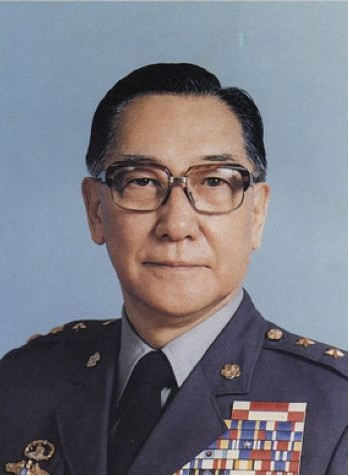
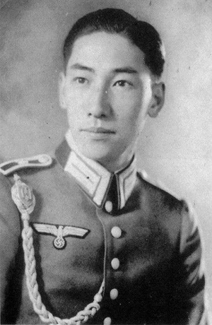
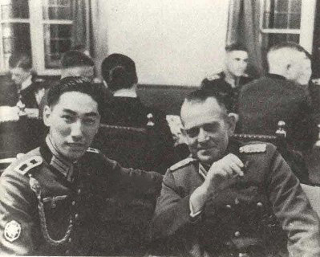
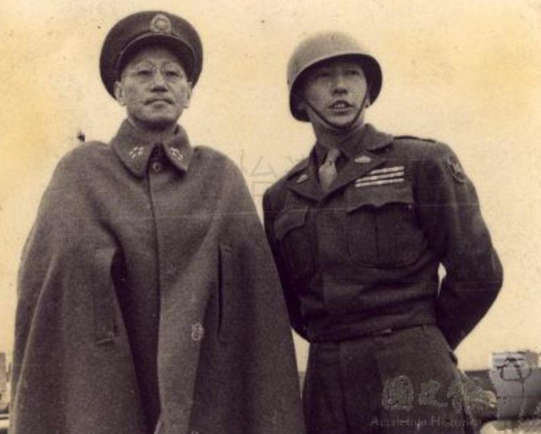
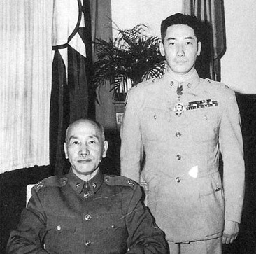
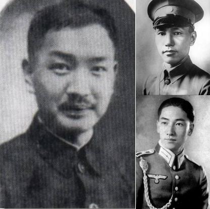
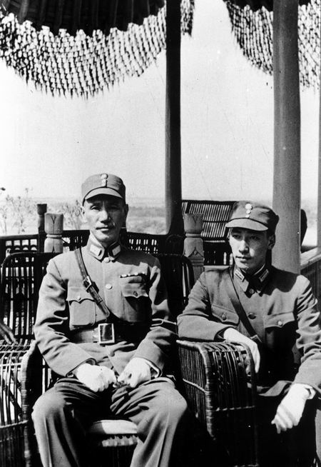

101年前的今天，中日混血、身世成谜的蒋介石“二太子”蒋纬国出生于东京

（万象特约作者：一一）

蒋纬国（1916年10月6日－1997年9月22日），蒋介石的“二太子”，母亲为日本人。因蒋介石与戴季陶的密切关系，双方互相认养子。因此，一直有传闻戴季陶才是蒋纬国的亲生父亲。但未有确凿证据，蒋纬国身世成谜。

蒋介石与幼年蒋纬国感情非常亲昵，远胜蒋经国。成年后，送到德国参军，从二等兵做起，有意磨练蒋纬国。回国后，进入装甲部队。1964年，蒋纬国旧部赵志华策动了湖口装甲兵事件，蒋纬国被认为不善识人，从此远离权力中心。

（蒋介石和蒋经国、蒋纬国父子三人合影）

【相伴黄埔、父子情深】

1924年（8岁），蒋介石创立黄埔军校，以校为家，蒋纬国陪伴蒋介石3年，父子感情颇深。1934年（18岁），蒋纬国在苏州东吴大学就读物理系。

【德国参军、基层锻炼】

1936年9月，蒋纬国赴欧洲留学。1937年夏，蒋纬国随蒋百里到德国考察军事，担任少尉副官。4个月后，加入德意志国防军九十八山岳步兵团入伍，然后从二等兵干到实习班长、排长、连长等职。

1938年（22岁），正式到慕尼黑军官学校受训，授德意志国防军少尉，学习德国习新式战法，夜间踢足球自娱自乐。

【二战爆发、转入美国】

1939年（27岁），德国与日本、意大利组成轴心国，希特勒入侵波兰，欧战爆发。蒋纬国毕业后，原本分发到德国步兵第八师，蒋介石命蒋纬国转赴美国，进入美国陆军航空队及美国空军参谋大学受训，又进美国装甲兵训中心。

【回国抗战、装甲参谋】

1940年冬，他返回中国，参加抗日战争。1946年起，进入装甲部队（战车第一团），任陆军装甲兵司令部参谋长。

1948年12月23日，蒋纬国携带蒋介石亲笔信到北平，劝傅作义南撤。12月25日，蒋纬国飞返南京。1949年2月，蒋纬国晋升为上校副司令，随国民党败退台湾。

【湖口事变、炖中将汤】

1964年（48岁），蒋纬国旧部赵志华策动了湖口装甲兵事件，叛变未遂。赵志华召集“装甲第一师”军官训话时，力斥“政府”和军界贪污无能、生活腐化，号召部队跟他一起开到台北去，“清除蒋总裁身边的坏人”。结果被周围的人一拥而上抓住送进了司令部。

这是国民党迁台以来第一次将领号召哗变的事件，因此被视为谋反案处理。蒋介石对主导装甲部队的蒋纬国怨言颇大，认为他他不善识人，中将军衔被冻结，也从此再未授与军权。

此后，蒋纬国奉命在三军大学任职，先后任陆军指挥参谋学院院长，后任三大副校长。1969年，创设战争学院，任院长。1975年（59岁），蒋介石去世后，蒋纬国才晋升为陆军二级上将，并担任战争学院院长兼三军大学校长。这段时间蒋纬国自嘲是“炖了14年的中将汤”。

【中华战略、足协会长】

1980年（64岁），蒋纬国担任联合勤务总司令部总司令。1984年，改调国防部联合作战训练部主任。1986年，蒋纬国自军中退役，担任国家安全会议秘书长。1993年（77岁），受聘为中华民国总统府资政。

蒋纬国在民间社团中颇为活跃，是中华战略学会创办人，并任中德文化经济学会理事长、中华民国足球协会理事长等；著有《国家战略概说》

1997年9月22日（91岁），蒋纬国因糖尿病并发症，于台北逝世，安葬于汐止五指山国军示范公墓。

【亲生父亲之谜】

蒋纬国到底是谁的儿子在历史上一直是众说纷纭的，有一种较为普遍的说法是戴季陶的儿子。戴季陶是民国煊赫一时的风云人物，曾被蒋介石称为“笔杆子”，任考试院院长长达 20年之久。

蒋纬国小时候，拜戴季陶为义父。他称蒋中正为“父亲”，称戴季陶为“亲爸”。戴季陶，原籍浙江湖州，湖州人称“义父”为“亲伯”，因而讹传为“亲爸”。同时，戴季陶的儿子戴安国（1913年生）也拜蒋介石为义父。戴安国是戴季陶与“黑龙社”的津渊美智子所生。蒋纬国一直亲热地称他为“安国哥”，情逾手足。蒋纬国曾说：“我与安国，情同手足，血浓于水。” 更是引发怀疑。

（戴季陶、蒋介石、蒋纬国三人对比）

蒋纬国晚年时在自传《千山独行——蒋纬国的人生之旅》中表示：生父乃戴季陶，生母为津渊美智子（但津渊美智子其实是戴安国的母亲，重松金子的名字出自蒋介石日记，非常可信）。可见蒋纬国也未必清楚自己的身世。

戴季陶则一直表示否认。1943年11月12日，戴季陶在重庆国民党中央政治学校的孙中山诞辰纪念会上，发表过一次有关此事的重要的谈话。他说：“我和校长共居一室，雇一日本下女服侍生活。那日本下女供奉得我们非常体贴，于是我们两个青年人竟然遏制不住自己，就和她同居了。我因为过去在沪长期纵欲，已经染上恶疾，丧失了生育能力，所以翌年日本下女生了一个男孩，他就是校长的二公子纬国。”

（神似的蒋介石和蒋纬国合影）

