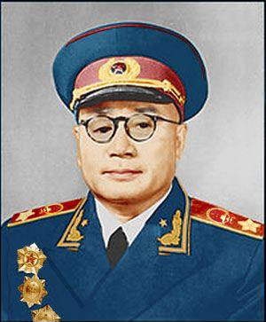
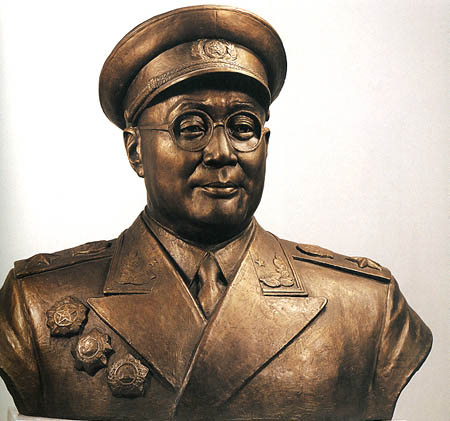
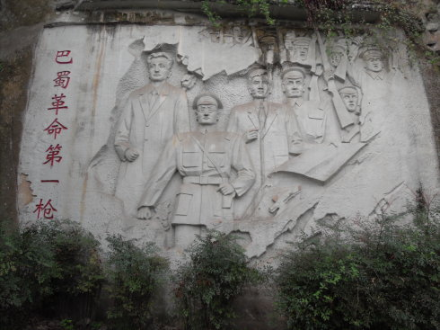
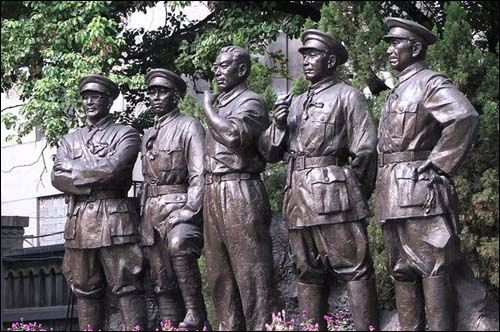
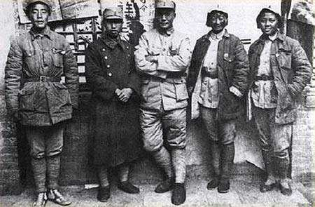
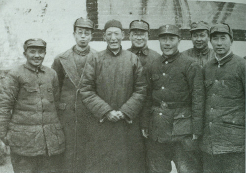
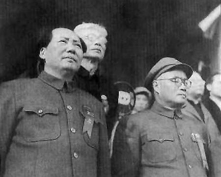

## nnnn姓名（资料）

### 成就特点

- 加入孙中山中华革命党
- 右眼中弹致残
- ​

### 生平

31年前的今天，右眼中弹不打麻药的开国元帅刘伯承逝世

【加入中华革命党】

1892年12月4日，刘伯承出生于四川开县（今重庆市开州区）赵家场。5岁读私塾，12岁开始接受新式教育。15岁时因父病故、家庭困难，被迫辍学务农。

1912年（20岁），考入蜀军政府陆军将校学堂。年底毕业后，被分派到川军，先后任司务长、排长、连长。1913年，二次革命爆发，参加四川讨袁军，失败后，流亡上海。1914年（22岁），刘伯承在上海加入孙中山的中华革命党。

【护国护法的军神】

1915年底（23岁），奉命返回四川，组建“四川护国军第四支队”。1916年3月，刘伯承在率部攻占酆都时，右眼中弹致残。在疗伤过程中，他坚持不施麻药，被为其主刀的德国医生赞叹为“军神”。

1917年，刘伯承任川军第五师第九旅参谋长，参加护法战争。其后，他担任四川督军署警卫团副团长。

（1920年代供职于川军时的刘伯承）

【考虑两年加入共产党】

1923年（31岁），刘伯承参加讨伐吴佩孚的战争，任四川讨贼军第一路前敌指挥官。8月，刘伯承在作战中右腿负重伤。在成都养伤期间，认识杨闇公、吴玉章，开始接触中国共产党。1925年，随吴玉章赴广州、上海、北京等地考察。

1926年5月（34岁），刘伯承经过两年时间考虑，决定加入中共，经杨闇公、吴玉章正式介绍加入，任中共重庆地委军事委员会委员。12月，与杨闇公、朱德、陈毅等发动泸顺起义。1927年5月，被迫撤离，辗转前往汉口。

（泸顺起义塑像）

【南昌起义后奔赴苏联】

1927年7月下旬，刘伯承秘密转赴南昌。8月1日，与周恩来、朱德、贺龙等人发动南昌暴动，任起义总参谋长，率部南下。起义军队在潮汕失败后，刘伯承与吴玉章、林伯渠等赴上海。

1927年11月，与吴玉章等30人赴苏联学习，先后在高级步兵学校、伏龙芝军事学院学习。1930年8月，从苏联伏龙芝军事学院毕业，任中央军委参谋部部长、长江局军委书记，协助周恩来处理军委日常工作，举办短期军事训练班，并负责讲授暴动方略、游击战、运动战等课程。

（南昌起义主要领导人塑像，左一为刘伯承）

【升升降降的总参谋长】

1932年1月，刘伯承到达瑞金，被任命为红军学校校长。10月，任中央军委总参谋长。1933年，刘伯承协助朱德、周恩来在前方指挥作战，取得第四次反围剿战争的胜利。期间，刘伯承撰写《现在游击队要解答的问题》、《到敌人后方开展游击战争的几个教训》等。

1934年，在第五次反围剿战争中，刘伯承因为与博古、李德等人的意见相左，而被降为红五军团参谋长。1934年10月，中央红军开始长征，刘伯承复任中央军委总参谋长。1935年1月，指挥先遣部队突破乌江，攻取遵义，随后参与遵义会议。此后指挥了强渡金沙江等战斗。

【生死兄弟小叶丹】

5月，刘伯承任红军先遣队司令，同聂荣臻率部进入大凉山，与彝族首领小叶丹结为兄弟，使全军顺利通过彝族聚居区，继而指挥部队强渡大渡河，摆脱了追兵。

1935年6月，红一、四方面军会合后，刘伯承随红四方面军行动。因为反对张国焘的南下主张，而被张国焘免去总参谋长职务，改任四方面军红军大学校长。

1936年10月，他随红二方面军到达陕北。12月，刘伯承再次恢复任中央军委总参谋长。

（彝海结盟纪念碑）

【刘邓大军的麻雀战术】

1937年，抗日战争全面爆发。刘伯承任八路军129师师长，被授予中华民国中将军衔。1938年1月，邓小平调任129师政委。在随后的13个年头里，两人一直并肩战斗，129师和晋冀鲁豫野战军（即二野、中野）后来也被称为“刘邓大军”而载入史册。

1938年，刘邓大军将日军赶出了晋东南，在河北南部开展平原游击战，共同创造“麻雀战术”。1940年8月，百团大战中，129师破毁正太铁路三分之二以上，攻占沿线大部分据点。1941年6月，刘邓大军进入中条山开辟新的根据地。

抗战开始时只有9000人的129师，到抗日战争结束后，已发展成为近30万人的大型野战军。

（1938年，八路军129师领导人合影，左三为刘伯承）

【千里跃进大别山】

1945年8月，刘伯承出任晋冀鲁豫军区司令员。刘邓大军在上党战役中，歼灭阎锡山的3.5万人，随后又赢得平汉战役。1946年6月，全面内战爆发。刘伯承率军支援山东，先后取得一系列胜利，在一年内消灭国军100个旅，取得了内线作战的胜利。

（1946年2月，刘伯承与邓小平、薄一波等人合影）

1947年6月30日，刘邓率军南渡黄河，千里跃进大别山，将战场从解放区引向国民党控制区。蒋介石则派白崇禧调集大军围攻大别山，自此开始了全国性的战略进攻。

【淮海渡江大西南】

1948年2月，刘伯承率主力转出大别山地区，进入中原。5月9日，中共中央中原局和中原军区正式成立，刘伯承任中原局常委和中原军区司令员。1948年11月，刘伯承指挥中原野战军参与淮海战役。

（1948年夏，中原野战军部分领导人合影，站立右三为刘伯承）

1949年2月，中原野战军改编为第二野战军，刘伯承任司令员。4月21日，他与邓小平、粟裕指挥的部队渡过长江，旋即占领了中华民国首都南京，并担任南京市军事管制委员会主任。

1949年下半年，刘伯承和邓小平率军进军大西南，攻下了四川、云南、贵州、西康等西南省份。1949年底，任西南军政委员会主席，负责西南剿匪、建设和进军西藏。

【开国元帅】

1951年1月，任中国人民解放军军事学院院长。1954年6月19日，被任命为中央军委副主席。10月31日，任训练总监部部长。1955年9月27日，刘伯承被授予元帅军衔。1962年，中印战争中，刘伯承担任解放军参谋顾问。

1972年，刘伯承左眼失明；1980年以后，刘丧失了自理生活能力。1982年，刘伯承因年龄和健康原因辞去党、国家和军队领导职务。8月6日，中共十一届七中全会通过了《给刘伯承同志的致敬信》。

1986年10月7日，刘伯承在北京逝世，享年94岁。

（刘伯承与毛泽东在天安门城楼上）

