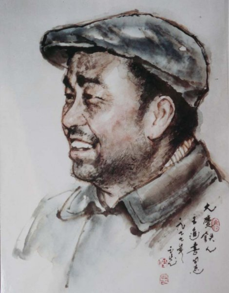
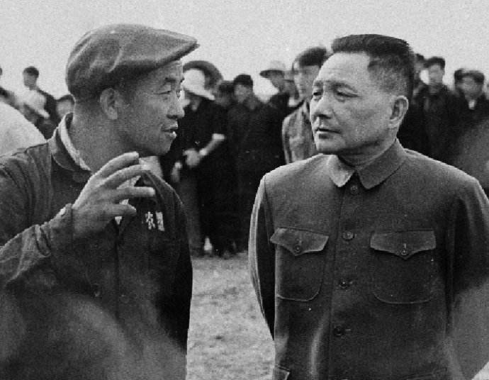
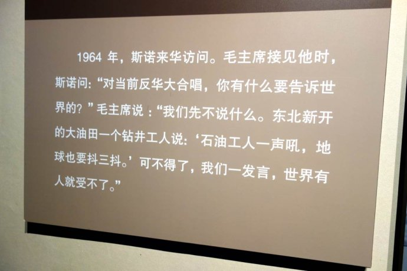
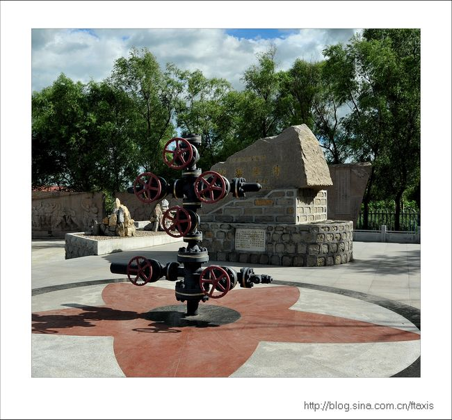
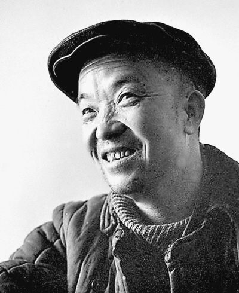
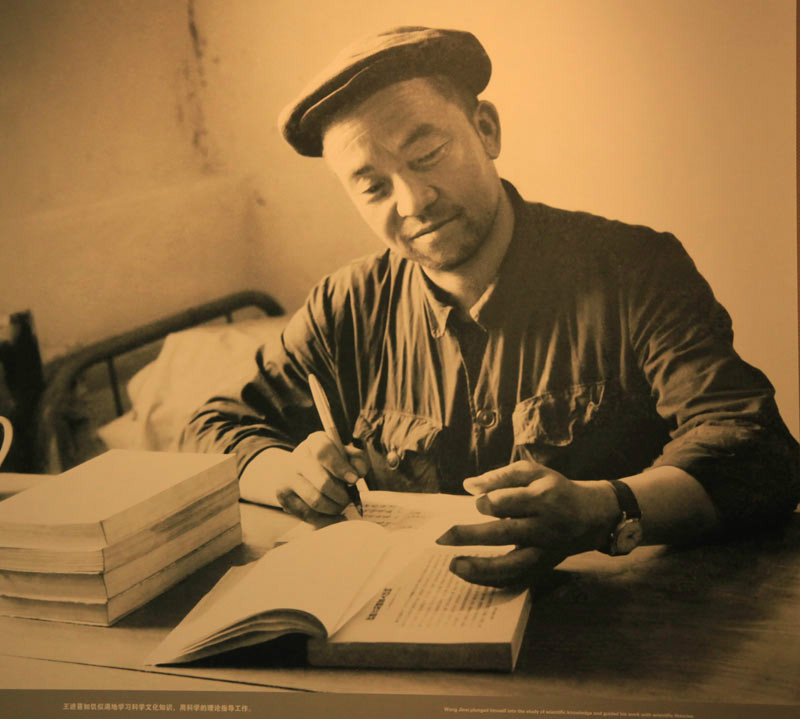
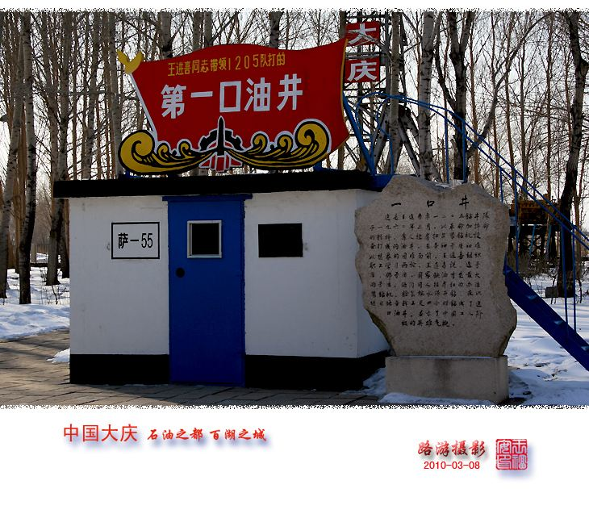
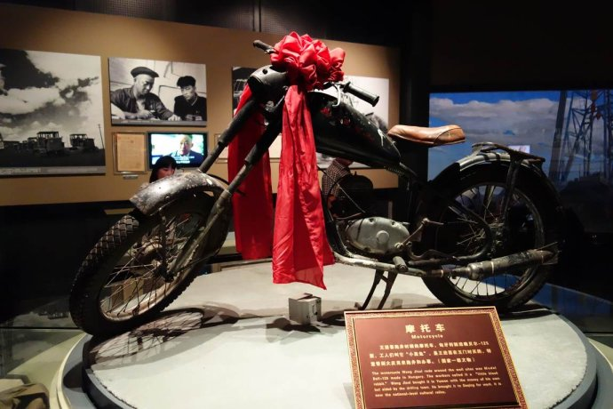
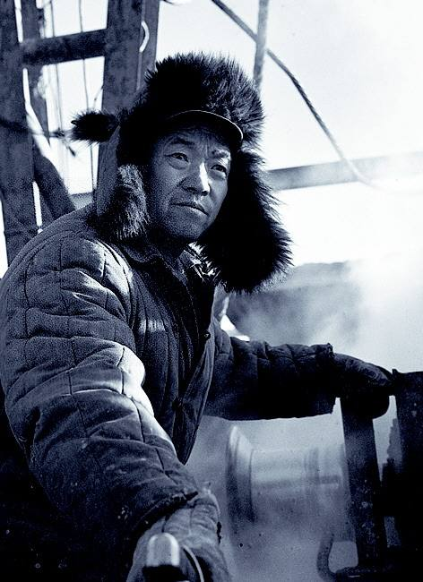
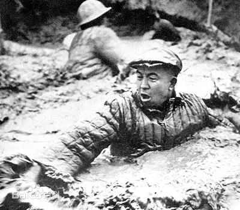

## nnnn姓名（资料）

### 成就特点

- ​
- ​

### 生平

王进喜（1923年10月8日－1970年11月15日），出生于中华民国甘肃省玉门县赤金堡一个贫苦农民家庭。1950年春，他成为中华人民共和国第一代钻井工人，先后任司钻、队长等职，1956年4月加入中国共产党。1959年9月，王进喜被评为中华人民共和国全国劳动模范。
1960年3月，王进喜率队从玉门到大庆，组织职工用“人拉肩扛”的方法搬运和安装钻机，用“盆端桶提”的办法运水保开钻，跳进泥浆池，用身体搅拌泥浆压井喷，被称为“铁人”。 同年4月11日、4月29日，会战指挥部先后两次号召全体会战职工向铁人王进喜学习。
王进喜先后任1205钻井队队长、钻井指挥部装建大队、钻井二大队大队长、钻井指挥部副指挥、大庆革委会副主任、中共大庆核心小组副组长等职务。1964年12月，出席第三届中华人民共和国全国人民代表大会。1969年4月，出席中国共产党第九次全国代表大会并被选为中共中央委员。1970年11月15日，患胃癌医治无效在北京逝世。

1923年10月8日，王进喜出生于甘肃省玉门县赤金堡，乳名“十斤娃”。

1938年，王进喜在玉门油矿当徒工。
1950年春，玉门矿招工，王进喜通过考试成为中华人民共和国第一代钻井工人。

1956年4月29日，王进喜加入中国共产党。
6月，任贝乌五队（1205队前身）队长。
11月，在玉门油田试验钻机“整拖搬家”成功。

1958年9月，王进喜带领全队月钻井进尺5009.3米，创当时中国大陆最高纪录。
10月，荣获石油工业部颁发的“钻井卫星”红旗。

1959年10月1日，王进喜参加中华人民共和国建国十周年国庆观礼，第一次见到毛泽东。10月26日至11月8日，在北京参加中华人民共和国工交“群英会”。

1958年2月石油部对松辽平原进行地质普查。同年11月，石油部批准大庆第一口油井钻探。

大庆第一口油井，位于大庆市大同区高台子镇永胜村，原名松基三井，是新中国成立后的第一口油井。1959年9月26日喷出石油，日产原油9—12吨。为纪念这一历史时刻，中共黑龙江省委将油井所在的大同镇改名为大庆镇，“大庆油田”因此而得名，“大庆第一口油井”载入史册。从此，中国摘掉了石油工业落后的帽子，结束了贫油国的历史。

1960年3月15日，王进喜带领1205队（贝乌五队）从玉门出发，赴大庆参加石油大会战。3月25日，到达大庆萨尔图火车站。

4月2日，“人拉肩扛”安装钻机。4月9日到11日，大庆油田首次技术座谈会号召向铁人王进喜学习。4月14日，组织全队破冰取水，萨55井开钻。19日完钻。

铁人第一口井属于探井，井深1200米。40多年来，这口井一直保持自喷状态，累计产油15万多吨。

4月29日，王进喜参加“五一”万人誓师大会，喊出“宁肯少活二十年，拼命也要拿下大油田”的口号。

7月1日，在油田万人大会上，被树立为“五面红旗”之一。10月，被任命为钻井指挥部装建大队大队长。

1961年2月，王进喜调任钻井指挥部生产二大队大队长。秋，在解放村建起大庆第一所小学。

1963年12月，周恩来总理在第二届全国人民代表大会第四次会议上庄严宣布：“我国需要的石油，现在可以基本自给了。”

1964年12月21日，王进喜出席第三届全国人民代表大会。12月26日，参加毛泽东71岁生日宴会，毛泽东称赞铁人是“工业带头人”。

1965年4月，王进喜被中共大庆会战工委任命为钻井党委常委、钻井指挥部副指挥。
7月24日，参加石油工业部政工会，首次提出“全国每人每年半吨油”的奋斗目标。

1966年2月16日，王进喜参加中华人民共和国工交工作会议和工交政工会议。同月，被国务院任命为大庆石油会战指挥部副指挥。
4月6日，被石油工业部授予“石油工业部五好标兵”。

6月4日至7月25日，出访阿尔巴尼亚。
9月3日，带领石油工业部报捷团赴京，向中共中央、国务院报捷。
10月1日，登上天安门城楼，参加国庆观礼。
12月30日，去北京反映“文革”中大庆的情况。

1967年1月4日，王进喜在北京向周恩来当面汇报大庆油田形势。1月10日，回到大庆，积极传达周恩来指示精神，呼吁要坚持抓革命、促生产。
2月，受到批斗。
3月下旬，周恩来在北京宣布王进喜在大会战中立了大功，不准再批斗。

1968年4月27日，王进喜被推选为钻井革委会副主任。
5月31日，被推选为大庆革委会副主任。

1969年2月，王进喜担任中共大庆的核心小组副组长。
4月，参加中共第九次全国代表大会，被推选为主席团成员，并被选为中共中央委员。

1970年3月18日，王进喜在北京向周恩来汇报了大庆情况和油田生产存在的问题，周恩来批示大庆要“恢复‘两论’起家基本功”。
4月，到玉门参加中华人民共和国石油工作会议。4月19日，在解放军301医院被确诊为胃癌晚期。
10月1日，以中共中央委员身份登上天安门城楼参加国庆检阅。

11月15日，在北京逝世，享年47岁。11月18日上午，大庆油田举行隆重追悼大会。11月18日下午，在北京八宝山公墓举行遗体告别仪式。

【】

### 照片

