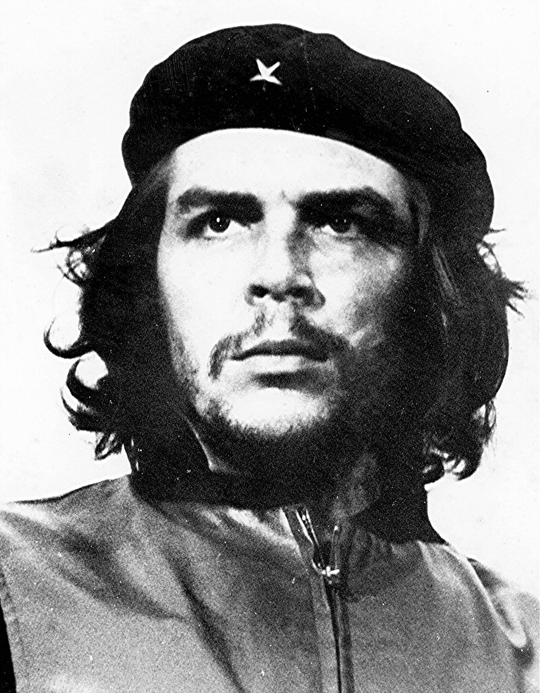
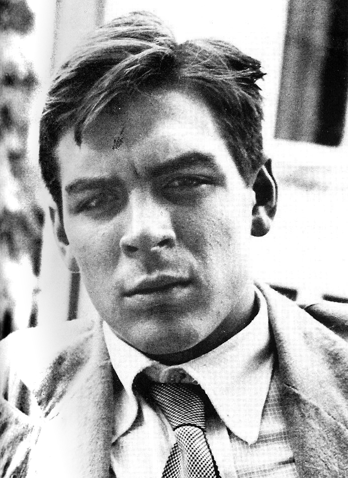
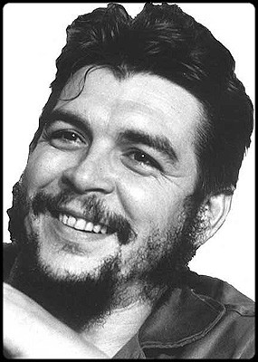
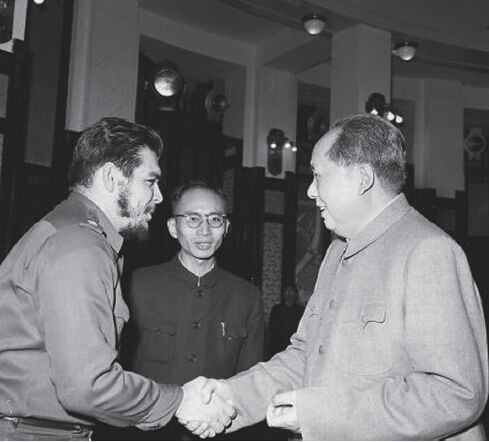
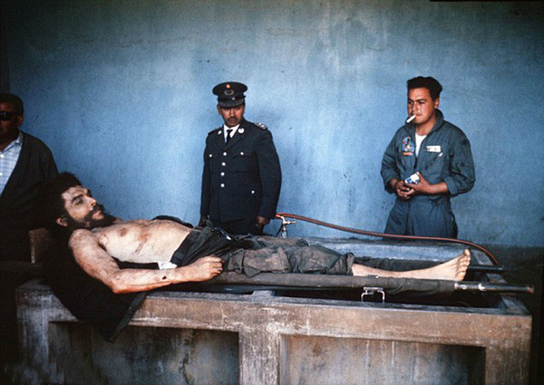

## nnnn姓名（资料）

### 成就特点

- 世上最知名的照片
- ​

### 生平

50年前的今天，不当部长，全世界打游击的切·格瓦拉被射杀

【爱好旅行的大学生】

1928年6月14日，切·格瓦拉出生于阿根廷。1948年（20岁），进入布宜诺斯艾利斯大学学习医学，并于1953年3月毕业。

1950年1、2月暑假时，他游历了阿根廷北部的12个省，走过4000多公里的路程。1951年，他与好友决定休学1年环游整个南美洲，他们的交通工具是一辆1939年产的摩托车。

（1951年的格瓦拉）

【改变人生的旅途】

1951年12月29日（23岁），他们出发，计划的线路为：沿着安第斯山脉穿越整个南美洲，经阿根廷、智利、秘鲁、哥伦比亚，到达委内瑞拉。路途中摩托车坏掉了，他们曾在秘鲁的一个麻风病人村作了几个月的义工。

在这次旅行中，切·格瓦拉开始真正了解拉丁美洲的贫穷与苦难。1952年9月，切·格瓦拉乘飞机回到了阿根廷。他在日记中他写到：“写下这些日记的人，在重新踏上阿根廷的土地时，就已经死去。我，已经不再是我。”

1953年6月1日（25岁），他正式成为医生。他本可成为一位受人尊敬的医生，可是，这次旅行彻底改变了他。

【来自危地马拉的切】

由于阿根廷正处在贝隆政府的独裁统治时期，母亲担心儿子被征用为军医，就让格瓦拉逃离阿根廷。1953年7月7日，格瓦拉开始了他的第二次拉美之旅。

1953年12月24日，格瓦拉到达了危地马拉。他和一些危地马拉劳动党党员结为朋友，并给他取了知名的绰号“切 ”（Che）。“Che”是一个西班牙语的感叹词，在阿根廷和南美被广泛使用，是打招呼和表示惊讶的常用语，也有“朋友”、"兄弟"的意思。

1954年3月（26岁），美国扶持阿马斯，推翻了政府，阿马斯成为危地马拉总统，开始对左翼人士进行残酷镇压，几个月之内近万人被捕或杀害。从此，格瓦拉坚定了自己的共产主义信仰，认为共产主义是解决目前拉美各种困难的唯一途径。

（第二次拉美之旅路线）

【成功的古巴革命】

随后，他前往墨西哥避难，并在此结识了流亡的古巴革命者卡斯特罗兄弟。1956年11月25日（28岁），“七二六运动”的82名战士挤在“格拉玛号”小游艇上，从墨西哥出发，驶向古巴。

在战斗中，格瓦拉凭著超人的勇气及毅力、出色的战斗技巧和对敌人冷酷无情而得到了越来越多人的赏识，包括卡斯特罗。他很快成为了卡斯特罗最得力和信赖的助手。

1958年初（30岁），游击队员约有280人，到年底，革命军拥有了8000平方公里土地和50万公民的支持。1959年1月2日，革命军成功占领古巴首都哈瓦那。

【见过毛主席的银行总裁】

战争结束后，格瓦拉被授予“古巴公民”身份，被任命为卡瓦尼亚堡军事监狱的检察长。1959年10月，并不懂经济学的格瓦拉被任命为国家银行总裁，负责对古巴经济体系进行社会主义改造。

1960年11月19日，到访中国，得到毛泽东接见。1961年，格瓦拉又被任命为工业部长。

【黯然神伤的导弹危机】

在古巴遭到美国经济封锁后，格瓦拉与苏联签定了贸易协定。他因对美国的强硬态度而逐渐闻名于西方。在古巴导弹危机中，他是1962年赴莫斯科谈判的古巴代表团的成员之一。格瓦拉认为，安置苏联的导弹将捍卫古巴独立，免于遭受美国的侵略。

1965年3月14日，他出席联合国第19次大会，访问非洲8个国家后，回到古巴。他与卡斯特罗在诸如对苏关系、援助第三世界革命等问题上的分歧日趋严重。不久他辞去了自己的职务。4月1日，他乘飞机离开了古巴，前往刚果。

【走出可怕的刚果】

1965年4月23日，格瓦拉从坦桑尼亚穿越坦噶尼喀湖，前往刚果。

格瓦拉向刚果起义军传授游击战术，他的计划是：利用刚果的解放区为基地，训练刚果及周边国家的革命武装，向当地人灌输古巴共产革命思想及游击战术，将他们训练成一批骁勇善战的游击队。

然而，在非洲丛林吃足了7个月的苦头之后，病弱的格瓦拉沮丧地与他剩存的古巴战友离开刚果（有6个伙伴没能活着离开）。事后他回忆，当地人组织起来的乌合之众愚笨、漫无纪律、内部纷争不休是失败的主要原因。

【丛林中的射杀】

1966年至1967年间，格瓦拉开始在玻利维亚带领游击队员进行革命活动。格瓦拉的组织大约有50名游击队员，命名为“玻利维亚民族解放军”，有着精良装备。早期他们与玻利维亚正规军作战取得了不少胜利。

10月8日，美国CIA训练的特种部队包围了格瓦拉的营地，格瓦拉在腿受伤后投降。9日下午，被射杀。

10月11日，玻利维亚当局正式报告了切·格瓦拉的死讯。10月15日，卡斯特罗宣告古巴全国哀悼三天。30年后，1997年，切·格瓦拉的骸骨被掘出，由DNA辨认吻合后，并运返古巴。10月17日，他的遗体以顶级荣誉安葬。

【最有名的照片】

切·格瓦拉死后，随着他的尸体的照片的传播，他的事迹也开始广泛为人所知。全球范围内发生了抗议将其杀害的示威，同时出现了许多颂扬他，和记录他生平以及死亡的文学作品。

他之所以被广大西方年青人与其他革命者区别对待，原因就在于他为了全世界的革命事业而毅然放弃舒适的家境。当他在古巴大权在握时，他为了自己的理想放弃了高官厚禄，重返革命战场，并战斗直至牺牲。

特别是在60年代晚期，在年轻人中，他成为公众偶像，是革命的象征和左翼政治理想的代名词。阿尔贝托·科尔达在1960年为切·格瓦拉拍摄的照片《英勇的游击队员》，迅速成为20世纪最知名的图片之一。

