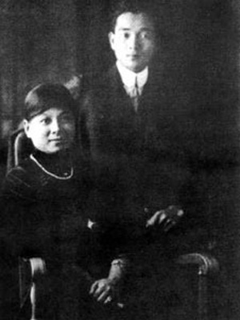
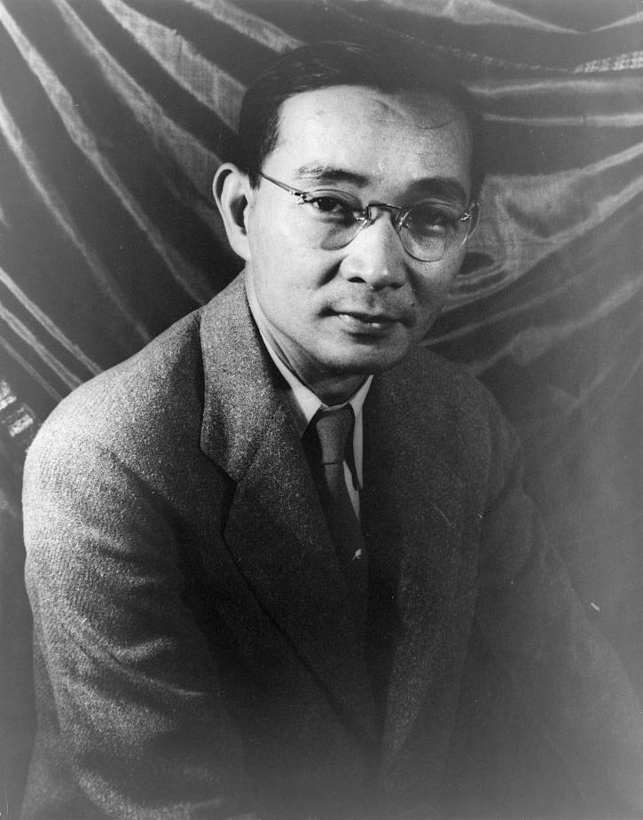
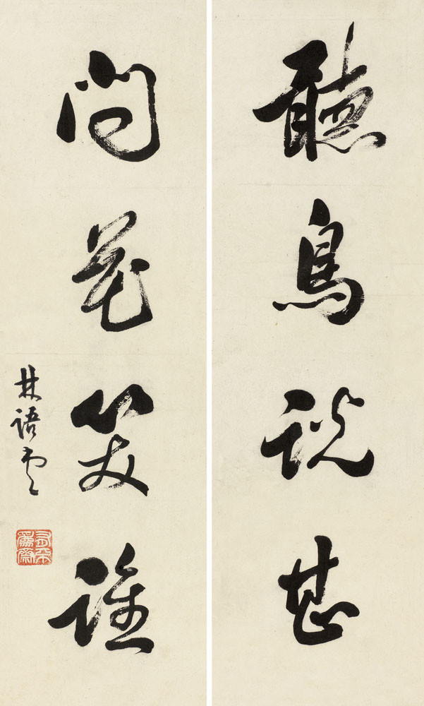
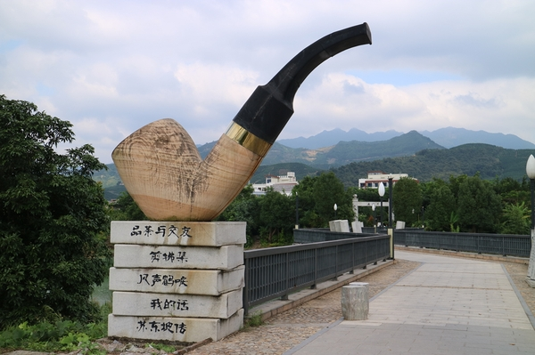
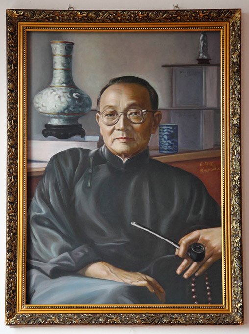
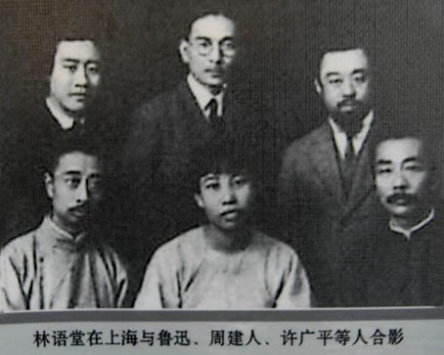
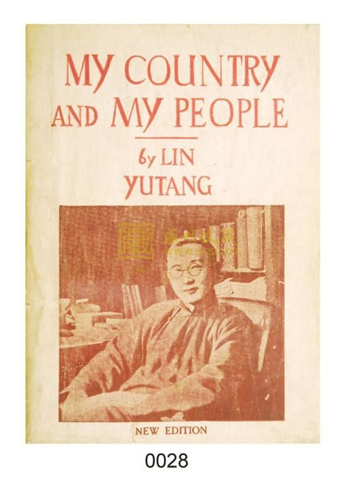
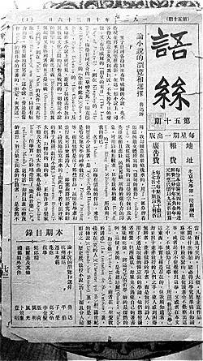

## nnnn姓名（资料）

### 成就特点

- 1940年和1950年两度获得诺贝尔文学奖的提名
- 英文的“humor”译为“幽默”
- 用英文撰写《吾国与吾民》，《京华烟云》

### 生平

林语堂（1895年10月10日－1976年3月26日），中国文学家、发明家。

1895年10月10日，林语堂生于中国福建省漳州市平和县坂仔镇。父亲是林至诚牧师，有9个小孩，林语堂排行第5。

1912年，林语堂在上海圣约翰大学学习英文，1916年获得学士学位，毕业后于清华大学英文系任教。

1919年，赴哈佛大学文学系留学，并于1921年获比较文学硕士学位。

1920年，与廖翠凤女士结婚，廖翠凤出生于富裕的基督教家庭，两人相伴一生。

1921年转赴德国攻读语言学，先入耶拿大学，后转入莱比锡大学并于1923年以《古汉语语音学》为博士论文获该校博士学位。

1923年回国，任北京大学教授和英文系主任。

1924年后，为《语丝》主要撰稿人之一。1924年5月，将英文的“humor”译为“幽默”，有人说这是中文“幽默”一词首次出现，其实并非如此，这只是首次把英文中的humor对译为中文中的“幽默”。

1926年，出任北京女子师范大学教务长，同年到厦门大学任文学院长。

1927年，到武汉任中华民国外交部秘书。

随后的几年当中，他创办多本文学刊物，提倡“以自我为中心，以闲适为格调”的小品文，对之后的文学界影响深远。

1930年代，林语堂所编著开明英文读本，与张其昀所编初高中地理和戴运轨所编着初高中物理教科书鼎足而立，成为全国各校通用之教材。

1935年后，在美国用英文撰写《吾国与吾民》（My Country and My People，1935年）、《京华烟云》（Moment in Peking，1939年）、《风声鹤唳》 （1941年）等作品。

《吾国与吾民》介绍和译述中国的传统思想、哲学和文化艺术，对中国社会的发展和中华民族的性格、精神作出了叙述，为当代欧美人士了解中国文化的重要著作。他的许多著作都被再翻译成其他语言，作品风行各国。

《生活的艺术》更是所有著作中，译本最多，销路最广的作品。

1944年，到重庆讲学。

1947年，林语堂任联合国教科文组织美术与文学主任；后到巴黎写小说《唐人街家庭》。

1948年返回美国从事写作。

1954年新加坡筹建南洋大学，受聘担任首任校长，但后来由于经费等问题，与南洋大学董事会意见不合，在大学开学前离职。

【输入法研究】

有鉴于那个时代的中文检字技术不够发达，学术界普遍不满意康熙字典之部首检字法，乃倾家荡产全心研究中文检字法则，历经“汉字索引制”、“汉字号码索引法”、“国音新韵检字”、“末笔检字法”、“上下形检字法”等，终在1947年，发明了“明快中文打字机”，这架打字机高9英寸、宽14英寸、深18英寸，储有7000字（常用的汉字约5000字），1952年获美国专利，历时长达六年半。“上下形检字法”后来也用于《当代林语堂汉英词典》，并曾授权神通电脑作为其中文电脑之输入法，神通电脑称其为“简易输入法”。

由于研制打字机导致破产，林语堂曾向赛珍珠（1938年获得诺贝尔文学奖）借钱，却遭到拒绝。林语堂和赛珍珠的合作不融洽已是后话，当时美国出版社一般是拿10%左右的版税；而赛珍珠代理林语堂的书却拿了50%，并且版权还不属于林语堂。林语堂和赛珍珠打官司，赛珍珠打电话给林语堂的二女儿林太乙问“你爸爸是不是疯了”，最后两人形同陌路。林语堂说一句话：“我看穿了一个美国人！”

1966年定居台湾，论古说今的杂文后来收集在《无所不谈》一集、二集（1967）中。1967年受聘为香港中文大学研究教授。1975年被推举为国际笔会副会长。

1976年3月26日在香港逝世，同年四月移灵台北，葬于台北阳明山仰德大道林语堂故居后园中。

【】

林语堂的中英文作品质量都很高，而风格却截然不同。他的中文著作多为各种形式的杂文。这些作品体现出他深厚的古典文学修养之余，亦显露出他忱挚的真性情。其笔锋犀利而笔力刚劲，其见解深刻而其言辞恣意酣畅不拘一格；行文随意随情随性，痛快淋漓处让人喝彩，幽默诙谐处使人莞尔，真情流露处令人动容，嬉笑怒骂间每每发人深省。

相对而言，他的英文作品则题材更为宽泛。其小说及人物传记主要以英语写成：小说《京华烟云》以纯正的英文讲述纯乎中国人的故事，英文传记《武则天传》、《苏东坡传》则以中国著名历史人物为主角。他另外一部分作品（包括最广为人知的《吾国与吾民》、《生活的智慧》）则着力于对中国文化传统的介绍、对中国社会现象以及民族特性的分析与探讨[9]。此外，他还通过《孔子的智慧》等书阐述了对孔孟、老庄等思想的理解；又以中国民间传说及古典文学作品为素材，写成了英文版的《故事新编》。他对翻译领域亦有所涉猎，以流畅优美的英文翻译了《浮生六记》等文言作品。

根据诺贝尔奖官方数据库，林语堂曾于1940年、1950年被赛珍珠及斯文·赫定提名为诺贝尔文学奖候选人

作为一名华人学者，他有意于将中国的古典文学、传统文化乃至中国式的生活理念介绍到国外，并始终为此不遗余力。他的英文著作，以渊博的学识、深刻的洞察力、豁达的胸怀为根基，以一片赤诚之心贯彻始终，语言通达典雅，措辞机智幽默，行文灵动潇洒，在文学界获得很高的评价，在英语读者当中也相当受欢迎，遂为西方人士认识中国搭建起一道桥梁。在当时西方世界对中国普遍缺乏了解的情况下，这一点尤显难能可贵。事实上，《吾国与吾民》及《生活的智慧》在美国甫一出版即登上纽约时报畅销图书排行榜，成为一时热点；之后很长一段时间，销量居高不下；多年后仍数次重新出版，成为了华人作家的作品畅销于美国的先例。

【】

以发明家言，林语堂早年即已立志发明中文打字机。当时，科学严谨的汉字检索系统仍未建立起来；又由于汉字本身是符号文字而非字母文字，长期以来人们对制成中文打字机的可能性多持怀疑态度。为解决这一难题，林语堂在数十年间锲而不舍地研究探索，自斥资金，购置设备，坚持不懈地一再尝试，以致一度倾尽家财、负债累累，而最终成功发明了“明快中文打字机”，幷于1946年在美国申请专利。六年半以后，到了1952年，他才取得该项发明的专利权。此打字机以“明快”命名，乃取其明易快捷之意，寄托了他希望人人都能顺利操作使用的心愿。除开“明快中文打字机”，他另有若干项小发明亦获得了专利——例如，其中一件是可以挤出牙膏的牙刷。

【部首检字法、汉语拼音方案】

他并首创了汉字笔划、笔顺、汉字偏旁部首的概念，进而开辟了以笔划、笔顺、偏旁部首为依据对汉字进行拆分、解构、归类的全新理念，更在此基础上发明了“上下形检字法”。这套系统性、普适性、操作可行性并具的全新方略，不仅为汉字研究提供了一个崭新的视角，为当时中文输入法的研究开发创造了条件，更被后来者继承改进，而演变成如今全国通用的标准化“部首检字法”。

他曾向另一位语言学家赵元任提议制定一套以罗马字母来标注汉字读音的方法。赵定下基本方案后，带同林语堂及另外三名语言学家作进一步的研究设计，历时两年，创造出“国语罗马字”的汉字注音方法。“国语罗马字”曾被定为国家正式推行的注音方案，并为当时及后来国内外的一些学者所接纳采用。它对现行通用的“汉语拼音方案”产生了一定程度的影响；在某种意义上，它对后者的诞生起到了启发与促进的作用。

林语堂晚年的心愿是编写一套汉英辞典，将毕生所学凝聚其中，以供后人之用。为此，他倾注了大量心血，虽渐年高体弱而未尝放弃，终于以七十七高龄完成了他最重要的作品之一——《当代汉英词典》

【信仰】

林语堂父亲林至诚是一个基督教牧师，但他详尽探索中西方哲学思想后，于晚年才真正成为一名基督徒，其哲学探索历程记载于《信仰之旅》一书，他尝自提一副对联曰：“两脚踏东西文化，一心评宇宙文章”。

### 照片

