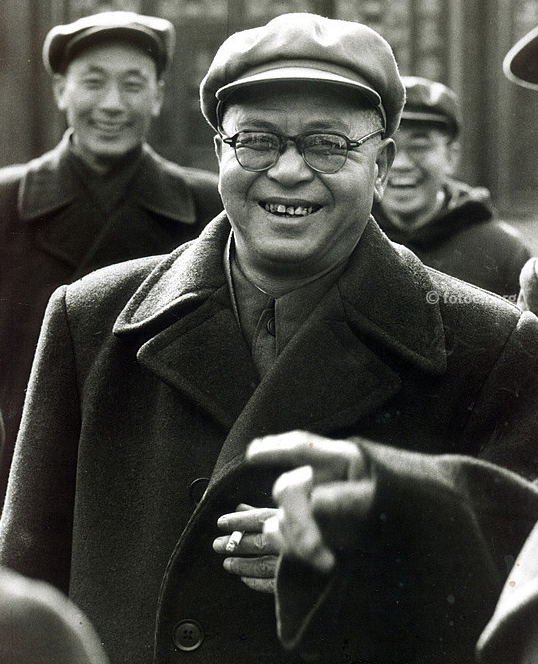
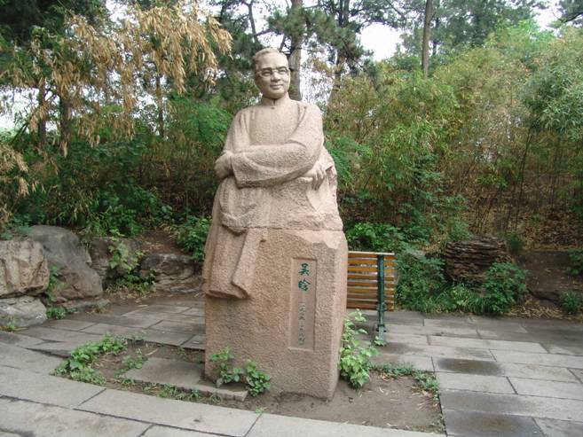
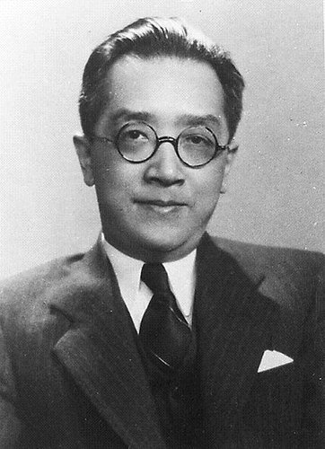
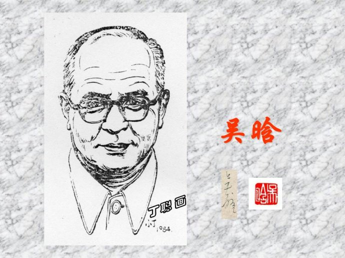
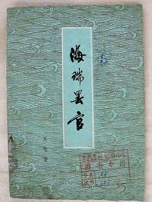
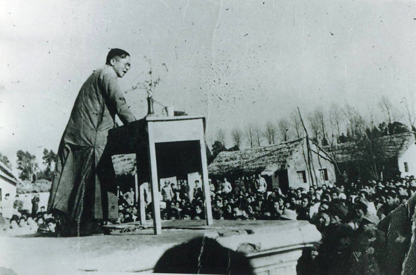
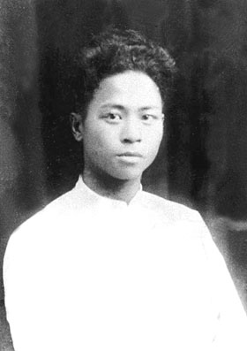
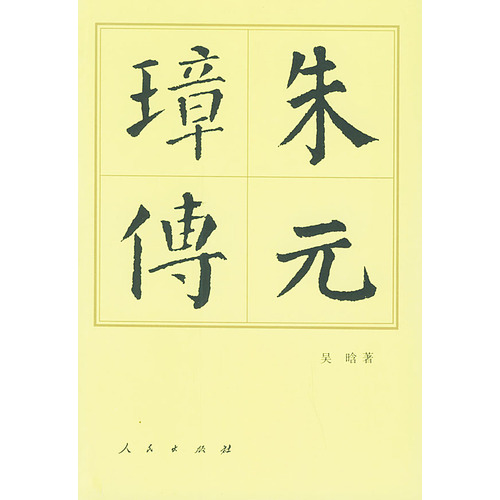

## nnnn姓名（资料）

### 成就特点

- 北大考试因数学零分
- 现代明史研究的开拓者和奠基者 
- 《朱元璋传》在史学界有重大影响
- ​

### 生平

吴晗（1909年8月11日－1969年10月11日），浙江金华义乌人，是中国近代的历史学家。吴晗先加入民盟，再入中国共产党，曾任云南大学、西南联合大学、清华大学教授，中国科学院历史研究所学术委员，中国科学院哲学社会科学部学部委员，北京市政协副主席，北京市副市长。

文化大革命期间因为《海瑞罢官》这部剧而被批斗，精神上和肉体上都惨遭摧残。1968年3月被捕入狱，1969年10月在狱中被迫害致死，其骨灰至今下落不明。

吴晗于1909年8月11日出生于浙江义乌，原名吴春晗，字伯辰。家庭经济时常颠簸于温饱与小康之间。其父吴滨珏，秀才出身，家道颇严。

1925年，吴晗中学毕业，因家道衰落，遂在本村小学教书，赚取一点工资贴补家用。

1929年，考入上海吴淞中国公学（校长胡适）大学部预科。吴晗即成为胡适门生，不久写下《西汉的经济状况》一文，深得胡适赞赏。

不久，胡适离开中国公学，吴晗则追随北上，经人介绍。1930年，经顾颉刚帮助，于燕京大学图书馆任职馆员。

1930年，因写成《胡应麟年谱》，并以此成为他正式研究明史的开端。受到胡适赏识，希望能够获得推荐直接进入北京大学读书，但胡适希望参加考试。

1931年7月13日至22日，几乎同时参加了北京大学和清华大学的转学生入学考试。其北大考试因数学零分而未被录取，而清华的转学生入学考试仅考党义、国文、英文、中史、西史，以及物理、化学、生物、论理“任选一门”，故此顺利录取清华大学史学系（主任蒋廷黻）。胡适写信推荐其当工读生，专治明史。

大学期间，吴晗写下四十多篇文章，其中《胡惟庸党案考》、《〈金瓶梅〉的著作时代及其社会背景》、《明代之农民》等文，颇受当时史界名流青睐。

1934年毕业，留校专讲明史。颇受顾颉刚、胡适、傅斯年等提携。

1937年起，先后任教于云南大学、西南联合大学。

1939年10月，在云南与袁震结为夫妇。

1943年7月，在昆明加入中国民主同盟。开始全面抛弃胡适的“读书救国”论。至此，吴晗从一名历史学家变身为社会活动家。

1946年5月，西南联大停办，返回北平，任清华大学教授，担任北平民盟的主任委员。其在清华的住所旧西院12号，是中共地下党的联络站。

1946年7月17日和18日晚，吴晗两次在张君劢住处见到了周恩来。

回到清华后，吴晗担任民盟北平市支部主委，更多的是宣传中共的政治主张。许多知名教授都受其影响，思想渐渐左转，其中受影响最大的是朱自清——一位不问政事的教授，也参加了各种反蒋反美的通电、签名等活动。

由于他活动频繁，引起了国民党当局的注意，上了抓捕名单。经中共地下党安排，1948年秋，奔赴解放区西柏坡，见到毛泽东，并且就《朱元璋传》进行了长谈。

1949年1月，北平和平解放，参加接管北大、清华的工作，任清华大学校务委员会副主任、文学院长、历史系主任等职。11月任北京市副市长。

1953年，任中华全国青年联合会副主席。以后还历任中国科学院历史研究所学术委员，中国科学院哲学社会科学部学部委员，北京市政协副主席等职。

1954年起，主持改绘杨守敬的《历代舆地图》，标点《资治通鉴》和《二十四史》，明十三陵中定陵的发掘等工作，后主编《中国历史小丛书》、《外国历史小丛书》等系列。

1957年，积极参加反右斗争，6月亲自主持对储安平的批斗，8月又揭发批判罗隆基。1957年3月，吴晗加入中国共产党。

1959年4月，鉴于大跃进期间出现的各级官员虚报成绩的现象，毛泽东提出要学习明代著名清官海瑞“刚正不阿，直言敢谏”的精神。之后，作为明史专家的吴晗随即发表了《海瑞骂皇帝》、《论海瑞》、《海瑞罢官》等作品。当时毛泽东对于这些作品大加赞许，并赠送自己亲笔签名的《毛泽东选集》给吴晗。吴晗也因此成为当时中国最出名的知识分子之一。

1959年9月，他发表《论海瑞》、《海瑞骂皇帝》等文章，提倡敢讲真话的精神。并在1960年写成新编历史剧《海瑞罢官》。之后，吴晗和邓拓、廖沫沙用“吴南星”笔名，在《前线》杂志发表杂文《三家村札记》专栏，以歌颂正义光明、匡正时弊为宗旨。1965年，他的代表作《朱元璋传》第四次修改稿出版，在运用历史唯物主义观点研究历史方面达到新的高度，有较高的学术价值。

1965年11月10日，由姚文元执笔的《评新编历史剧〈海瑞罢官〉》在上海《文汇报》发表，突然对多年来受到肯定的《海瑞罢官》进行批判。文章认为《海瑞罢官》宣传了错误的阶级思想，“并不是芬芳的香花，而是一株毒草”。

1966年3月28日至30日，毛泽东在杭州三次同康生、江青等人谈话，严厉指责北京市委、中宣部是“阎王殿”包庇坏人，不支持左派，并点名批评邓拓、吴晗、廖沫沙担任写稿的《三家村札记》和邓拓写的《燕山夜话》是反党反社会主义的。

1966年4月，《人民日报》、《红旗》杂志等报刊先后发表《〈海瑞骂皇帝〉和〈海瑞罢官〉的反动实质》、《〈海瑞骂皇帝〉和〈海瑞罢官〉是反党反社会主义的大毒草》等文章，进而把皇帝罢了海瑞的官，同庐山会议上撤消了彭德怀职务一事联系在一起，使对《海瑞罢官》的批判带上更为浓重的政治色彩。史学界、文艺界、哲学界等社会科学领域开始进行全面的“揭盖子”。由毛泽东指示、各方对《海瑞罢官》的批判，为中国的文化大革命掀开了序幕。吴晗在文化大革命被认为反毛泽东路线，遭到批斗。

1966年5月10日，《解放日报》、《文汇报》发表《评“三家村”──〈燕山夜话〉〈三家村札记〉的反动本质》，以此揭开“文革”的序幕。这篇文章一出，中国报刊立即转载。此文分7个部分系统全面地批判“三家村”。

1968年3月，经康生、谢富治批准被捕入狱。
1969年3月18日，妻子袁震被迫害致死。
1969年10月11日早晨，在狱中死去，死因不明。骨灰至今下落不明。
1976年9月23日，养女吴小彦在精神病院自杀。

1979年7月，北京市委为“三家村反党集团”冤案平反，为吴晗恢复党籍，恢复名誉。

1980年，吴晗好友、“三家村”作者之一廖沫沙，在吴晗一张摄于1964年的照片上题写了一首诗：“鬼蜮为灾祸已萌，天真犹自笑盈盈；可怜一觉金陵梦，留得身前身后名。”

文化大革命结束后，中华人民共和国官方对吴晗的评价多为正面结论。吴晗在1950及60年代批斗其他知识分子时，非常投入和卖力，最后也在政治斗争中落得同样的下场。

吴晗主张拆除北京城墙和北京的古建筑，甚至更提出过改建故宫的构想。这也让他与以梁思成为代表的反对拆毁北京古建筑派发生激烈的交锋。

1984年，在吴晗诞辰75周年，清华大学决定在校园内近春园遗址内建造吴晗纪念亭，1984年8月31日，邓小平同志亲笔为纪念亭题写“晗亭”两个大字，1984年10月26日纪念亭落成。1984年10月27日，清华大学举行了“晗亭”落成典礼。

【】

### 照片

