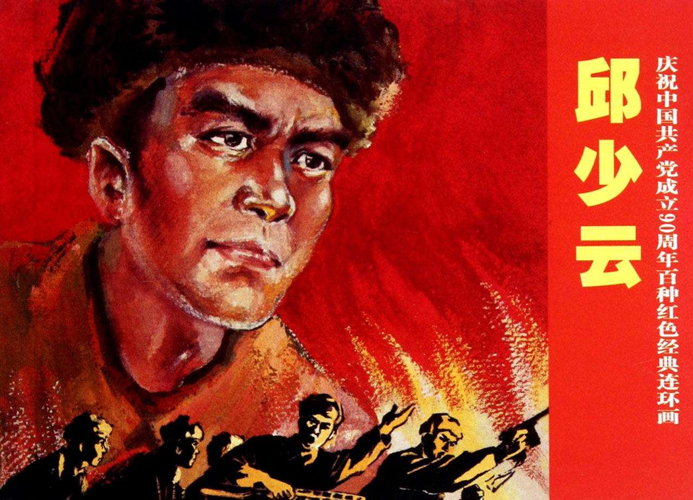
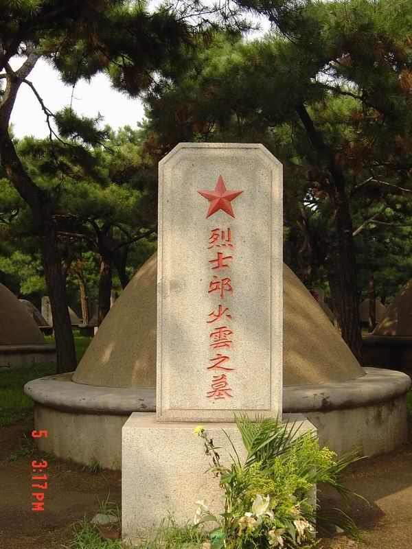
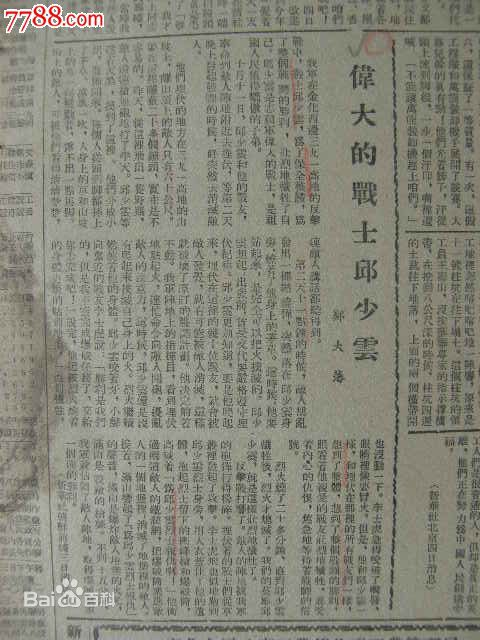
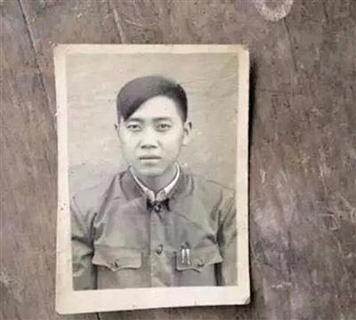
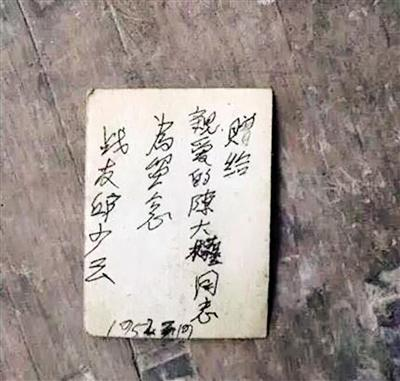
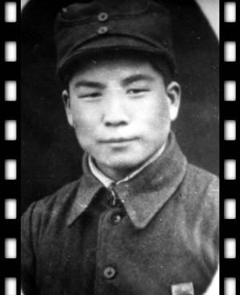
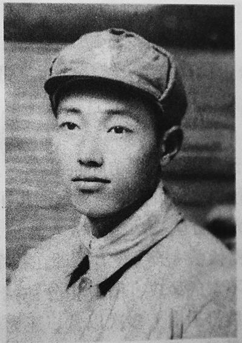

## nnnn姓名（资料）

### 成就特点

- ​
- ​

### 生平

65年前的今天，三等功变为特等功的抗美援朝英雄邱少云牺牲

【国民党抓壮丁的孤儿】

1926年7月12日，邱少云出生于今重庆市铜梁县少云镇少云村。13岁时，父母先后离世，邱少云成为孤儿。为了糊口，邱少云给地主当长工、泥瓦匠、木匠、餐馆跑堂等。

1948年6月（22岁），邱少云被国民党政府抓了壮丁。在川军第21军112师18团，先后干过马夫、伙夫。

【活捉土匪司令的英雄】

1949年12月7日（23岁），成都战役中，川军投诚，他被补进了解放军第10军29师87团9连（连长朱斌）一排三班战士。

成都战役后，29师开往内江驻防，邱少云随军驻防资中县城，随即开始了三个月的政治学习和诉苦教育。1950年，剿匪战斗中，邱少云与战友化装成乡下农民，深入匪窟，活捉了内江的“反共救国军”司令匪首刘海东。为此，9连被师部授予“剿匪先锋连”光荣称号，集体荣立大功一次。

【烈火中永生】

1951年3月15日（25岁），在河北内丘给家里写了一封长信表示要赴朝参战。入朝后，首战第五次战役。邱少云所在的第九连，首战涟川郡罗家山，担任团主攻连。邱少云被抽调到连集训队，担负为前线输送弹药、抢运伤员等任务。此战伤亡较大，连长牺牲。战后补充大量新兵重建9连，邱少云担任三班战斗组长。

1952年10月11日夜（26岁），邱少云所在部队在朝鲜平康以南的391高地执行战斗任务。邱少云及战友500余人在敌阵地前沿的草丛中潜伏。12日12时左右，美军向邱少云潜伏地发射燃烧弹，其中一发落在他潜伏点附近，火势蔓延到他身上，但邱少云为了不暴露部队埋伏的地点，他忍受着剧痛，坚持不动，壮烈牺牲。

（邱少云烈士遗体下残留的棉军衣碎片）

【三等功变为特等功】

上甘岭战斗后，对此前的391高地之战进行总结。邱少云和许多参与潜伏作战的战士一样，在87团的总结中被报了三等功。9连指导员王世明被评为29师模范指导员。他在自己的汇报材料中，写了大量邱少云的事迹。29师的领导看到后十分激动：“这样的英雄怎么才三等功？应该报特等功！”随后整理材料，向志愿军司令部为邱少云申报特等功。

1952年11月6日，志愿军总部给邱少云追记特等功。

【我的战友邱少云】

1952年12月底，一位名叫郑大藩的随军记者到部队采访，他就邱少云的死提出了两个问题：一是燃烧弹落在什么地方？是打中头部死亡还是一点一点烧死的？二是他身边有无水沟？谁看见了邱少云牺牲的全过程？

当时，战士李元兴讲述了邱少云牺牲时的情景：“燃烧弹打在邱少云前方两米左右，燃烧液溅到了他的身上，是一寸一寸烧过来的，从头烧到脚，当时我伏在他身后5米左右，亲眼见到大火一点一点把邱少云活活烧死。”大家还证明，在邱少云右面3米处有一条小水沟，当时如果他愿意，只需滚过去即可活命。

李元兴后来写了篇回忆录，《我的战友邱少云》，被选入人教出版社的小学五年级语文教材。

【一级战斗英雄】

1953年5月18日，《人民日报》发表了郑大藩的长篇通讯《伟大的战士邱少云》，邱少云的英雄事迹传遍全国，“纪律高于生命”的口号成为一个时代的强音。

1953年6月，追授他“一级战斗英雄”称号，理由是“邱少云同志严守纪律，为了整体胜利而自我牺牲”。并追认他为中国共产党党员，还授予他“模范共青团员”的称号。

1953年，四川省铜梁县建立邱少云烈士纪念馆，并在凤凰山顶树立邱少云烈士纪念碑，朱德为之题词。

【我永远忘不了那一天】

有人提出邱少云被烧死的情节并不符合生理学和其他常识，即人体在受到剧烈刺激时会产生意识无法控制的神经性痉挛；人体含有油脂，被点燃后火势明显会比杂草旺很多并冒出黑烟；随身携带的弹药会在烈焰中爆燃，等等。

邱少云当时的任务是剪断铁丝网，身上并未携带武器。也有解释：“邱少云烈士被大火烧着不久，就因为吸入大量浓烟窒息死亡。”

《我的战友邱少云》，最后一句：我永远忘不了那一天——1952年10月12日。

（疑似邱少云的证件照及照片背面签字）

【】

### 照片

