## nnnn姓名（资料）

### 成就特点

- ​
- ​

### 生平

李叔同（1880年10月23日－1942年10月13日），出家后法号弘一。晚号晚晴老人。晚晴--取李义山诗“天意怜幽草，人间重晚晴”。

生于天津，祖籍山西洪洞，明初迁到天津，因其生母本为浙江平湖农家女，故后来李叔同奉母南迁上海，每每自言浙江平湖人，以纪念其先母。精通绘画、音乐、戏剧、书法、篆刻和诗词，为现代中国著名艺术家、艺术教育家，中兴佛教南山律宗，为著名的佛教僧侣。

1880年10月23日，李叔同出生于天津。父亲李世珍是清同治四年进士，官任吏部主事，又是天津大盐商，还兼营银号，家财万贯。李叔同为其三姨太所生，生母本为浙江平湖农家女，常自称浙江平湖人。

5岁，父亲去世。李叔同小时候难免有一些自卑倾向，他沉默寡言的性格。入读私塾，15岁入辅仁书院。

1897年，李叔同奉母之命，与天津卫芥园俞家茶庄的茶商之女俞氏成婚。俞氏长叔同二岁，端庄淑静。

他对维新变革感到很兴奋，积极鼓吹新说，并刻了一方“南海康梁是吾师”的印章，以示对变法的支持。

这场维新运动以失败告终。外界哄传李叔同是康、梁同党，为了避祸，他带着母亲、妻子，迁居上海，在法租界租了一套房子，安住下来。由于他家在上海有钱庄，他可以凭少东家的身份任意支取生活费用，手头相当阔绰，他以富家公子身份，与沪上名流交往。

1898年，他到上海，参与“上海书画公会”、“沪学会”，曾就读于南洋公学（交通大学前身）。

1903年，南洋公学发生罢课风潮，蔡元培先生同情学生运动，自动辞职，全体学生相继退学。李叔同也退学了。

1905年，叔同生母王氏病逝。携眷护柩回津。随后，他把妻子和两个孩子留在天津，自己东渡日本留学。

1905年，东渡日本，留学于东京美术学校和音乐学校（东京艺术大学前身），专攻西洋绘画和音乐。

1906年，与同学曾孝谷创办业余话剧团体“春柳社”，此乃中国第一个话剧团体。演出话剧《茶花女》、《黑奴吁天录》、《新蝶梦》等，李叔同是中国话剧运动创始人之一。李叔同饰茶花女一角。此为中国话剧实践第一步。

1907年，与日本女子福基相爱。

1910年，携日本妻子福基回国，福基是李叔同的庶妻，李叔同日本房东的女儿。当年，也是第一个愿意给李叔同做裸体模特的女人。

之后他任天津北洋高等工业学堂、直隶模范工业学堂教员。翌年任上海城东女子学校音乐教员。

1912年，任浙江省立第一师范学校音乐、美术教师。

1915年，执教于南京高等师范学校（后改为国立东南大学、中央大学、南京大学），教授图画、音乐；兼教于浙江两级师范。

1916年（丙辰民国五年）37岁因日本杂志介绍“断食”以修养身心之方法，遂生入山断食之念。冬，入杭州虎跑定慧寺，试验断食17日，有《断食日志》详记。

1918年，于杭州虎跑寺剃度出家，吃素念佛，弘扬律宗，著有《南山律在家备览》。

出家后的弘一法师，在艺术方面，只保留了书法，其书法质朴无华，独具一格。他的日本妻子福基在他出家之后回到日本，后不知所踪。

1927年春，丰子恺等编《中文名歌五十曲》出版，内收李叔同在俗时歌曲13首。丰子恺在序言中说：“李先生有深大的心灵，又兼备文才与乐才。据我们所知，中国作曲作歌的只有李先生一人。”

1942年10月10日下午六点，他于福建泉州的百原寺写下“悲欣交集见观经”几字，将其托付妙莲法师。10月13日晚7时45分呼吸急促，8时安详西逝，圆寂于泉州不二祠温陵养老院晚晴室。

【】

在中国近百年文化发展史中，弘一大师李叔同是学术界公认的通才和奇才，作为中国新文化运动的先驱者，他最早将西方油画、钢琴、话剧等引入国内，且以擅书法、工诗词、通丹青、达音律、精金石、善演艺而驰名于世。

“二十文章惊海内”的大师，集诗、词、书画、篆刻、音乐、戏剧、文学于一身。其书法“朴拙圆满，浑若天成”。

他是向中国传播西方音乐的先驱者，所创作的《送别歌》，历经几十年传唱经久不衰，成为经典名曲。

并谱曲南京大学历史上第一首校歌。

他主编了中国第一本音乐期刊《音乐小杂志》。国内第一个用五线谱作曲的也是他。他在国内最早推广西方“音乐之王”钢琴。

1905年（清光绪三十一年），他编辑出版的《国学唱歌集》，被当时的中小学取为教材，他创作的歌曲内容广泛，形式多样，主要分三类。一是爱国歌曲，如《祖国歌》、《我的国》、《哀祖国》、《大中华》等；二是抒情歌曲，如《幽居》、《春游》、《早秋》、《西湖》、《送别》等；三是哲理歌曲，如《落花》、《悲秋》、《晚钟》、《月》等。李叔同的歌曲大多曲调优美，歌词琅琅，易于上口，因此传布很广，影响极大。

同时，他也是中国第一个开创裸体写生的教师，先后培养出了名画家丰子恺、音乐家刘质平等。

佛门弟子奉其为中兴南山律宗第11代世祖。

赵朴初先生评价大师的一生为：“无尽奇珍供世眼 一轮圆月耀天心。”

李叔同，中国油画之鼻祖，是最早在中国介绍西洋画知识的人，也是第一个聘用裸体模特教学的人。李叔同在西画创作上卓有建树，人们在今天仍能看到其炭笔素描《少女》和水彩画《山茶花》等；但存世可靠的油画可能只有三幅：油画珍品《祼女》创作于1909年（佚名发表），为中央美院美术馆镇馆之宝；《李叔同自画像》现藏于日本东京艺术大学；第三幅风闻疑似出家后作品，至今下落不明。

【】

弘一大师对佛学的贡献，主要体现在他对律宗的研究与弘扬上。弘一大师为振兴律学，不畏艰难，深入研修，潜心戒律，著书说法，实践躬行。他是近世佛教界倍受尊敬的律宗大师，也是国内外佛教界著名的高僧。

中国佛教律学，故译有四大律，即《十诵律》、《四分律》、《摹诃借祗律》、《五分律》。为弘扬律学，弘一大师穷研《四分律》，花了4年时间，著成《四分律比丘戎相表记》。此书和他晚年所撰的《南山律在家备览略篇》，弘扬佛法，合为精心撰述的两大名著。

【送别】

《送别》是一首由艺术家李叔同作词、编曲的中文歌曲。

长亭外，古道边
芳草碧连天
晚风拂柳笛声残
夕阳山外山

天之涯，地之角
知交半零落
一瓢浊酒尽余欢
今宵别梦寒

1915年在浙江省立第一师范学校任教时便以J.P. 奥德威的曲调配上中文歌词，作成了在中国传颂至今的《送别》一歌。但李叔同本人在作词时对曲子作过少量修改。

20世纪20年代到40年代，《送别》是作为在新式学堂中教授的学堂乐歌，广为传唱，受到大众的深爱。

1970年代和1980年代，《送别》作为插曲或主题曲分别出现在电影《早春二月》和《城南旧事》中，更使其脍炙人口，传唱不息。

【】

### 照片

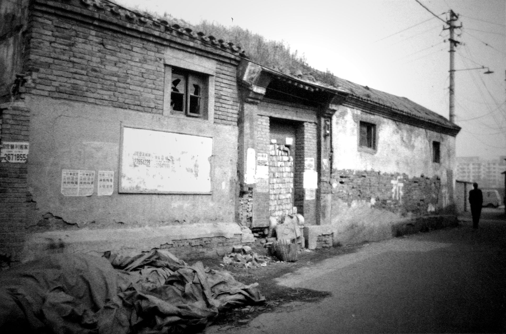

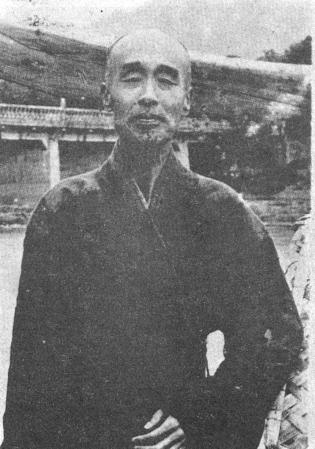

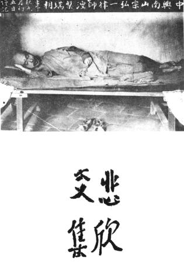

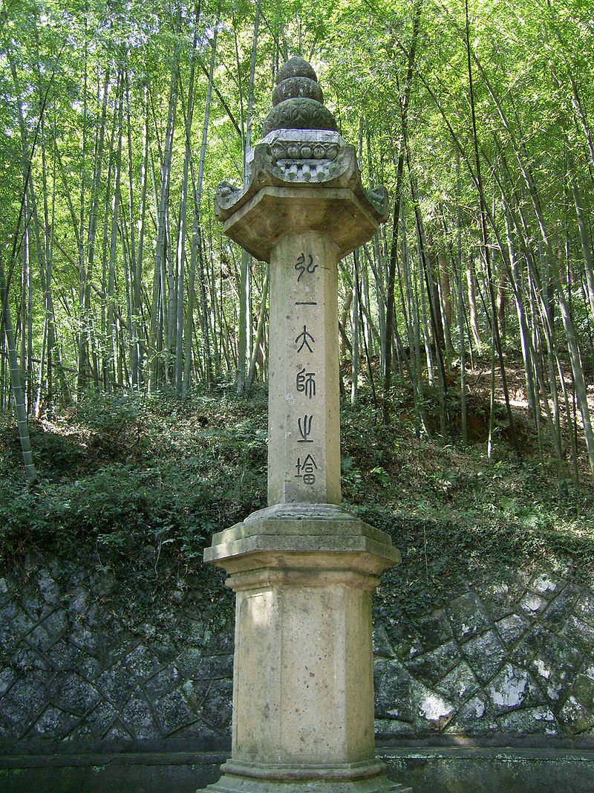

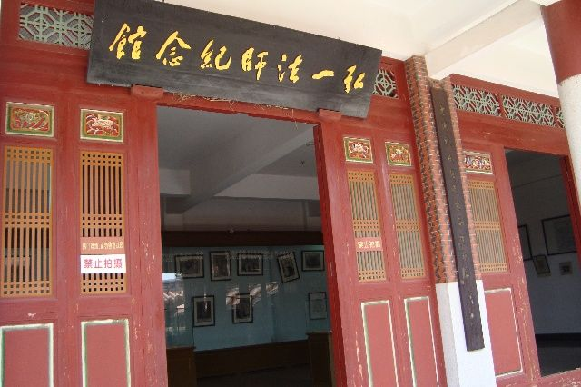

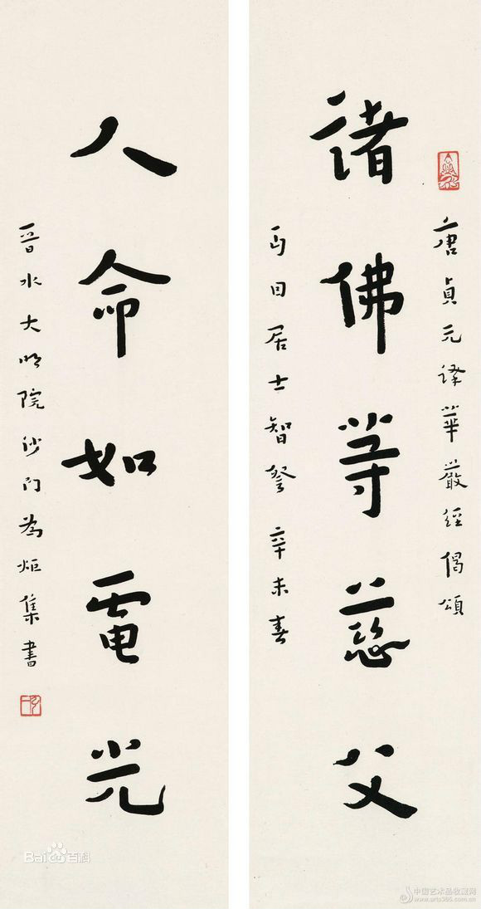

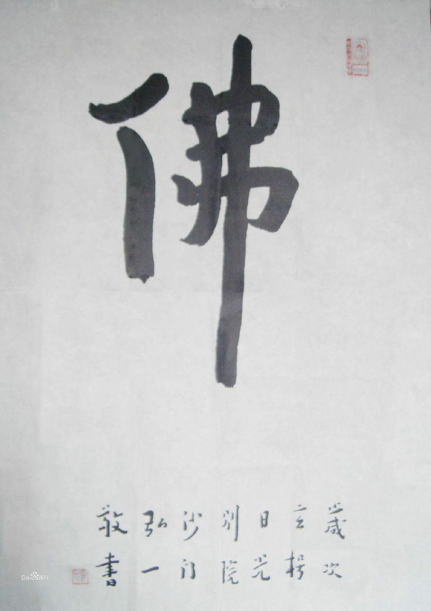

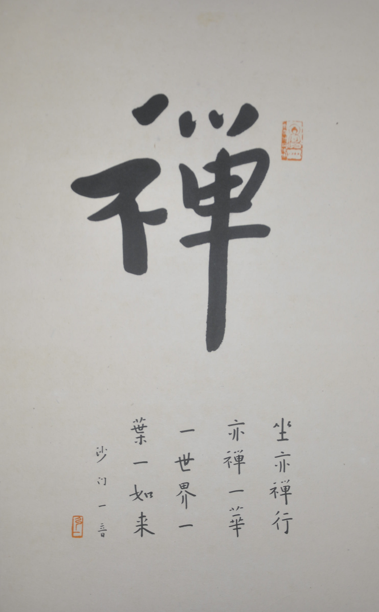

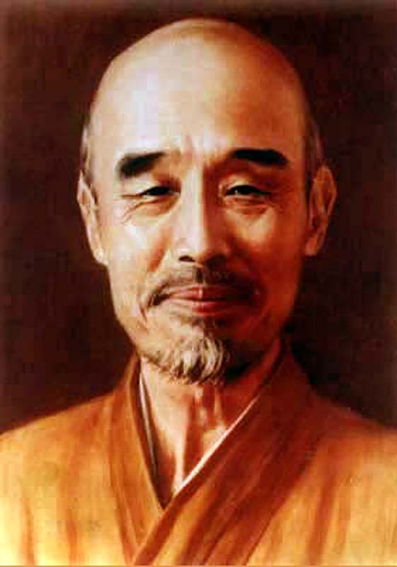

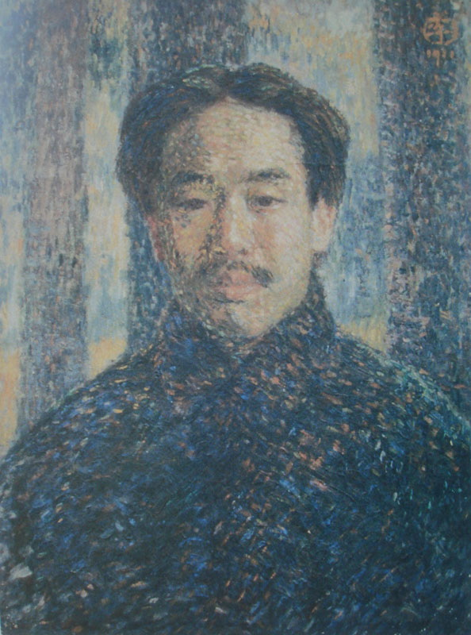

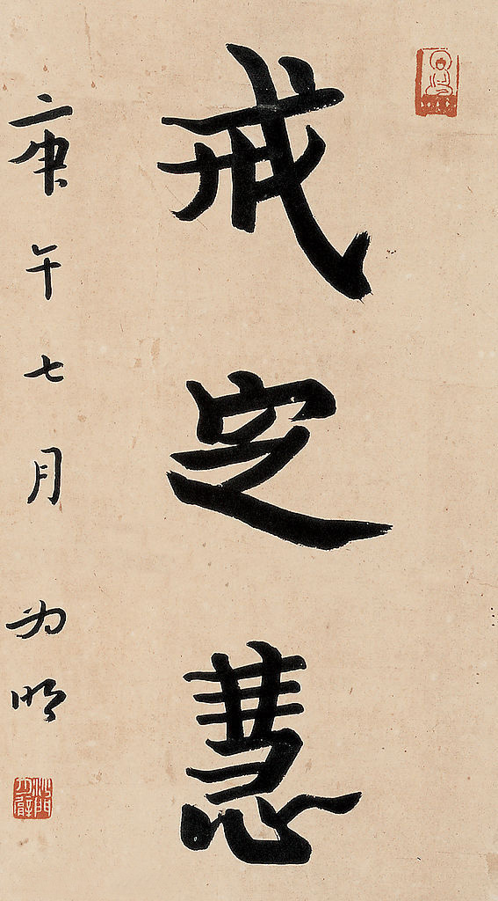

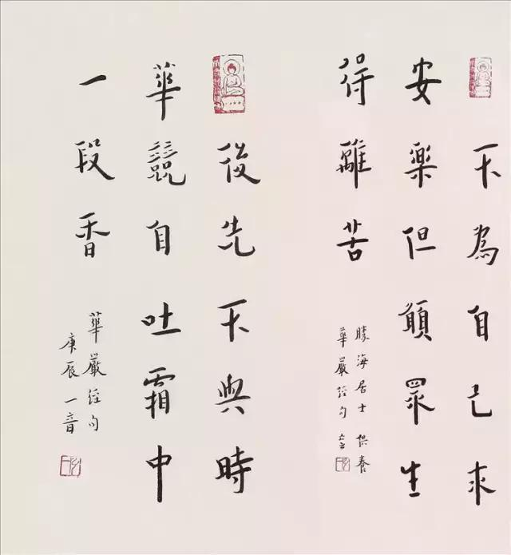

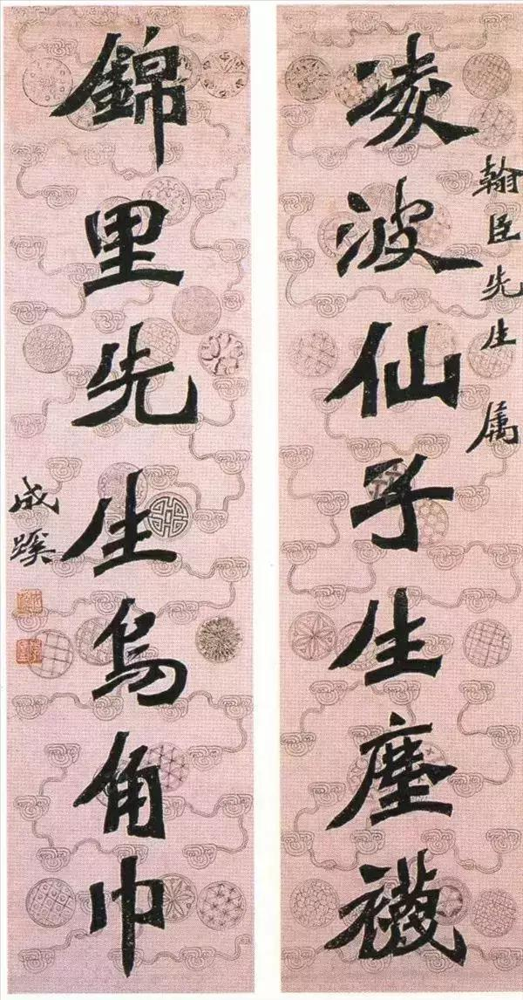

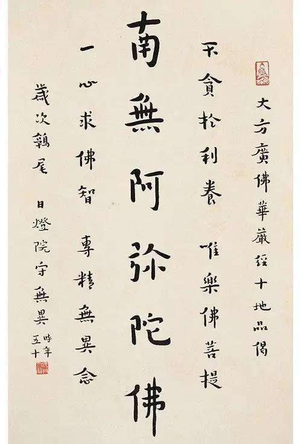

