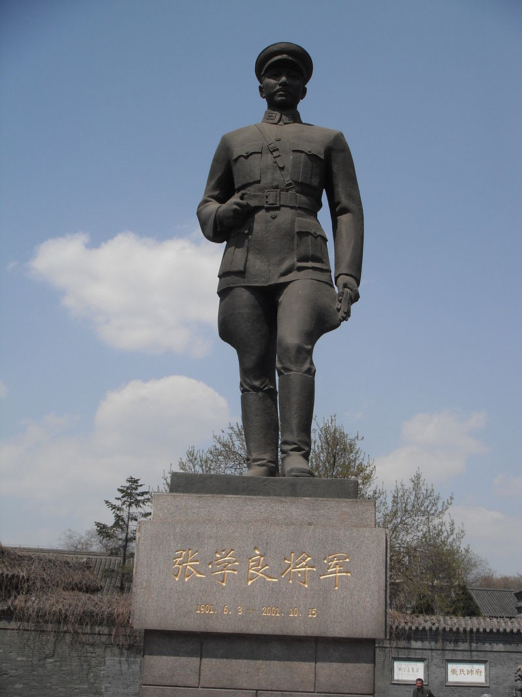
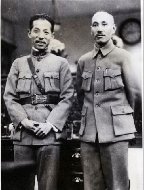
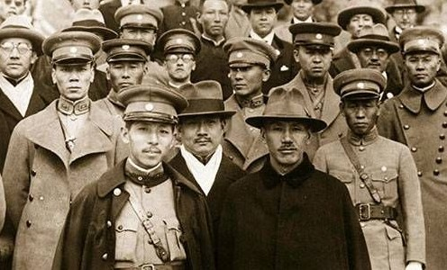
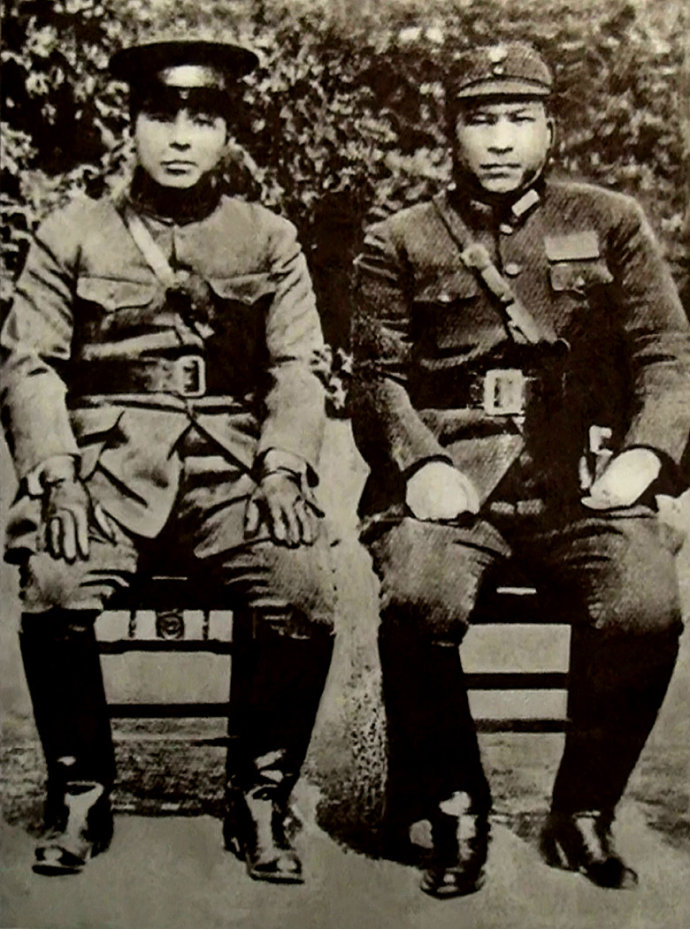
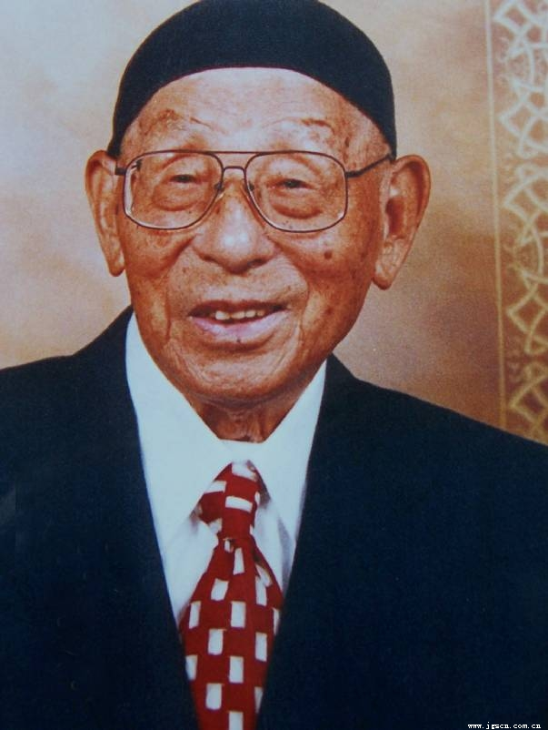

## nnnn姓名（资料）

适合所有人的历史读物。每天了解一个历史人物、积累一点历史知识。三观端正，绝不戏说，欢迎留言。  

### 成就特点

- ​
- ​

### 生平

16年前的今天，多次左右中国命运的传奇少帅张学良百年而去

张学良（1901年6月3日－2001年10月14日），乳名小六子，奉系军阀领袖张作霖长子，人称“少帅”，“民国四公子”之一。多次处于风口浪尖的传奇人物。

张作霖被炸死后，东北易帜，使民国得以统一。中东路事件，被苏联击败。中原大战，拥护蒋介石，巩固了蒋介石的地位。九一八不抵抗，日本占领东三省，成为民族罪人。再失热河，引咎辞职，赴欧洲，戒鸦片。西安事变，促成抗日统一战线，中华民族团结在一起。此后被软禁半个世纪，终年100岁。

（沈阳大帅府前的张学良塑像）

【东北大帅的公子司令】

1901年6月3日，张学良生于台安县桑林。1920年（19岁），张学良由讲武堂炮兵科第一名结业，任东三省巡阅使（张作霖）的卫队旅旅长。

1922年，第一次直奉大战爆发。张学良为东路军第二梯队司令，是奉军唯一取胜的部队。奉军战败后，张学良负责整个东北军调整与军纪（实际由郭松龄代理），史称“整军精武”。

【助张作霖入主中央】

两年后，东北军军威大振，第二次直奉战争获得胜利。奉系夺得中央政权，张作霖成为北洋军阀领袖。奉系军事实力达到顶点，张学良升为京榆地区戍卫总司令。

1925年11月，东北军主力郭松龄反戈，进攻奉天，势如破竹。张学良在巨流河（沈阳西南）与其对峙。日本关东军突然发动袭击，郭松龄被击败，被就地枪决。

【可疑的皇姑屯和东北易帜】

1928年6月4日，张作霖乘火车在皇姑屯车站被炸死，史称皇姑屯事件。一般认为是日本关东军所为，但颇有争议。

1928年12月29日，成为东北军领袖的张学良，宣布服从国民政府领导，除去北洋政府五色旗，升上青天白日满地红旗，史称东北易帜。此举标志北伐战争正式胜利结束，中华民国形式上完成统一。

1929年1月10日，张学良诱杀张作霖的老部下奉系将领杨宇霆与黑龙江省省长常荫槐。有人怀疑，这两人才是皇姑屯事件的真正执行者。

（皇姑屯事件中被炸的列车车厢残骸）

【被苏联将一军的中东路事件】

1929年7月，在蒋介石的强力支持下，张学良执行“革命外交”政策，提出要取消苏俄在东北特权，查封哈尔滨苏联商业机构，着手收回中东铁路。8月14日，斯大林命令苏联军队沿中东路向东北军进攻，东北军败北。这场冲突持续近5个月之久，双方动用的一线兵力超过20万。

张学良被迫在伯力签订议定书，恢复苏联在中东铁路的特权。在整个中东路事件过程中，中央未给予东北军任何援助，此事对九一八事变的处理方式有相当影响。

颇有讽刺意味的是，张学良因此获得民国政府颁发的第一座青天白日勋章。该勋章是颁授给有功于保家卫国，抵御外敌的军职人员。

【助蒋介石一臂之力的中原大战】

北伐结束后，国内军阀派系林立，矛盾重重。1930年4月，阎锡山、冯玉祥对蒋介石发动了中原大战，拟定任张学良为陆海空军副总司令。张学良观望一段时间后，选择站在蒋介石一边。9月20日，东北军进入山海关，胜负立分，蒋介石获胜。

【不抵抗的九一八事变】

1931年9月18日（30岁），日本关东军发动震惊中外的“九一八”事变，张学良带领东北军约40万人退入关内，日军占领东三省全境。蒋介石9月19日到达南昌，晚间才从上海方面得知“事变”消息。张学良事后也说，“是我们东北军自己选择不抵抗的。”

历史学家唐德刚曾当着张学良感慨道：“我们听了五十多年了，都是这个说法呢，都说是蒋公给你的指令呢！”“……都说蒋公打电报给你，说吾兄万勿逞一时之愤，置民族国家于不顾（所谓铣电的关键语句）。又说你拿着个皮包，把电报稿随时放在身上。”

张学良回答说：“瞎说，瞎说，没有这事情。我这个人说话，咱得正经说话。这种事情，我不能诿过于他人。这是事实，我要声明的。最要紧的就是这一点。这个事不是人家的事情，是我自个儿的事情，是我的责任。”

（1931年9月6日，张学良决定不抵抗的“鱼电”）

【名不副实的剿匪副总司令】

1933年2月25日，日军进攻热河（今承德），没想到东北军主将汤玉麟（第55军军长）放弃抵抗，不战而退。3月10日，张学良发布通电，引咎辞职。1933年至1934年间，张学良戒鸦片，去欧洲游历。旅欧期间，张学良会见了希特勒与墨索里尼，非常欣赏德意全民团结的精神，认为只有法西斯主义才能救中国。

回国后，张学良被推到“剿共”第一线，担任西北剿匪副总司令。由于对“剿共”政策的不满，东北军开始与红军协商合作抗日问题。

1936年3月2日，张学良亲自驾机飞到洛川和李克农会谈。洛川会谈结束后，东北军为苏区提供一批重要战略物资。4月8日，周恩来与张学良在肤施共商救国大计，达成“停止内战、共同抗日”的协议。9月，张学良向红军提供大量过冬棉花、药品、新鲜食物等物资，解决了红军过冬燃眉之急。

【西安事变的50年幽禁】

1936年12月12日，张学良和杨虎城在西安，扣押了蒋介石，发动“兵谏”。最终，蒋介石接受“停止剿共，一同抗日”的主张而获释，国民政府放弃“攘外必先安内”的国策，抗日民族统一战线在形式上建立。

1936年12月30日，李烈钧任审判长，对张学良进行军事审判，判决如下：“张学良首谋伙党，对于上官暴行胁迫，判处有期徒刑十年，褫夺公权五年”。

（张学良与杨虎城）

【半个世纪的幽禁生活】

1937年1月4日，林森对张学良特赦，发布命令：“张学良所处十年有期徒刑，特予赦免，仍交军事委员会严加管束。”从此，张学良被管束，失去自由，过上了半个世纪的幽禁生活。

1949年，蒋介石撤退台湾时，杨虎城全家被杀，张学良则被押解到台湾。张学良晚年表示，蒋介石原本是要枪毙他的，是宋美龄求的情。

1964年7月4日，张学良与赵四小姐（赵一荻）正式举行婚礼。1975年4月5日，蒋介石逝世。1988年1月13日，蒋经国逝世。1990年，张学良终于重获自由。

（张学良与赵四小姐）

【终获自由的百年人生】

1993年12月15日，张学良夫妇定居夏威夷。2000年6月22日，赵一荻逝世，享年88岁。2001年10月14日，张学良在美国夏威夷逝世，享年100岁。

10月19日，台湾总统府发布褒扬令，全文如下：
　　东北耆宿张学良，早预戎行，勇略聿昭，英隽秀发，蜚声于时。民国十七年临危授命，主政东北，怀民族大义，秉爱国志节，勇拒日人威逼利诱，毅然宣布易帜，拥护中央，促成统一，奠定训政时期建设根基。旋于中原大战期间，通电支持国民政府，调停各方，止息战祸，厥功至伟。综其生平，爱国情殷，慷慨贞固；淡泊恬静，寿登期颐。遽闻殂谢，悼惜良深，应予明令褒扬，以示政府笃念耆贤之至意。（总统　陈水扁）

　

