## nnnn姓名（资料）

适合所有人的历史读物。每天了解一个历史人物、积累一点历史知识。三观端正，绝不戏说，欢迎留言。  

### 成就特点

- ​
- ​

### 生平

5年前的今天，让位给爸爸，又让位给儿子的国王西哈努克病逝北京

西哈努克（1922年10月31日－2012年10月15日），柬埔寨国王。

【19岁的混血国王】

1922年10月31日，西哈努克出生于柬埔寨金边。1941年（19岁），西哈努克的外祖父柬埔寨国王病逝，正在越南西贡市（现胡志明市）留学的西哈努克回国继承王位。。

当时，柬埔寨由法属印度支那控制。王室分为两支，分别是诺罗敦和西索瓦两大王族。老国王死后，两个家族为继承权争执不休，最终决定由同时继承了两个家族的血统西哈努克继位。（西哈努克的父亲出自诺罗敦家族，母亲出自西索瓦家族）

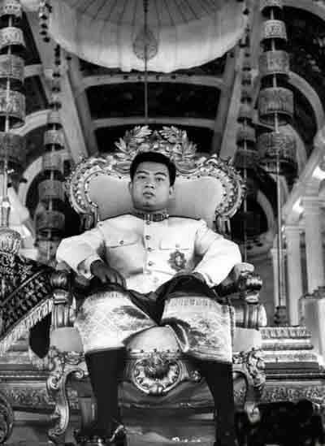

【柬埔寨的独立之父】

1945年（23岁），日本打败法国，占领法属印度支那全境，西哈努克宣布柬埔寨独立。8月15日，日本无条件投降，法军的重新回归。此后，西哈努克一直通过外交途径谋求独立，1949年获得在法兰西联邦内的独立地位，但警察权和军事权依然掌握在法国手中。

西哈努克对此状况无法满意，1953年，在离宫发表了“在完全独立达成之前绝不返回首都金边”的宣言，使得全国范围内的反法示威运动达到高潮。11月9日（31岁），新生的柬埔寨王国成立，西哈努克也在国民的欢呼声中返回金边的王宫，被国民尊为“独立之父”。

.jpg)

【让位给父亲的国家元首】

1955年3月3日，西哈努克将王位让给父亲。4月7日，组建社会主义人民共同体任总裁。随后，社会主义人民共同体在选举中获得压倒性胜利，控制了国会中的全部议席，西哈努克出任首相并兼外交大臣。

1960年3月，父亲苏拉玛里特国王去世。西哈努克就任新设的“国家元首”之职，成为柬埔寨的最高政治领袖。

【国内政变流亡中国】

1970年3月，西哈努克在苏联国事访问，首相兼国防大臣朗诺发动政变，解任了西哈努克国家元首的职位，建立高棉共和国，朗诺任总统。西哈努克被迫流亡中国，并组建了流亡政府。

在中国和朝鲜领导人的说服下，西哈努克与红色高棉的波尔布特结成统一战线。西哈努克的这一决定，使红色高棉的征兵数量大增。许多人都愿意为国王而战。

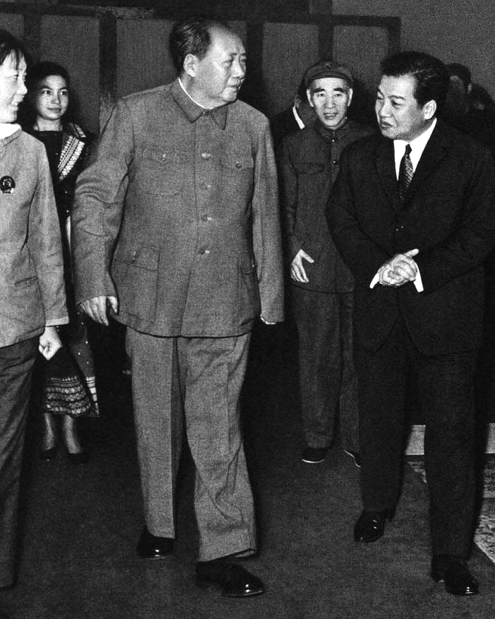

【被红色高棉软禁皇宫】

1975年，红色高棉终于占领柬埔寨全境，朗诺政权崩溃。西哈努克以国家元首的身份宣布社会主义国家民主柬埔寨成立，并由平壤归国。西哈努克表面上是国家的最高领导人，但并无任何实权。

1976年4月，西哈努克辞去国家元首之职，被幽禁在王宫中，与外界失去联系。

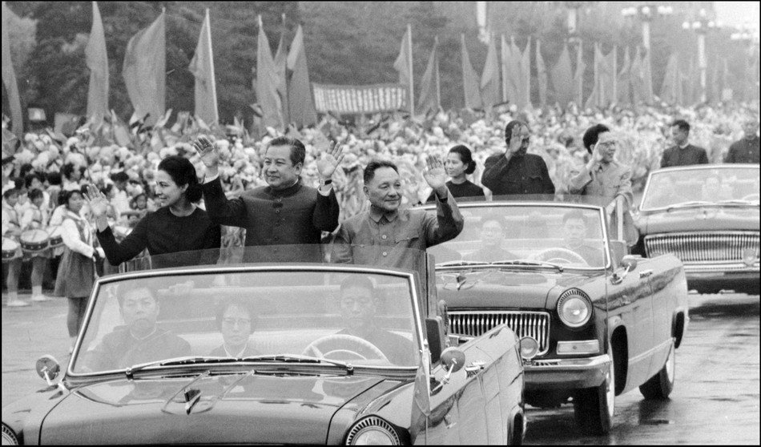

【重回柬埔寨再当国王】

1979年1月7日（57岁），越南入侵柬埔寨，建立柬埔寨人民共和国。西哈努克逃离柬埔寨后，创建了奉辛比克党，出任流亡政权民主柬埔寨的首脑。

1991年10月23日，在巴黎召开了柬埔寨问题国际会议，签订了柬埔寨和平协定。1993年4月至6月，柬埔寨在联合国监督下进行选举，结果奉辛比克党成为第一大党，但未能取得过半数议席，与柬埔寨人民党组建联合政府。

1993年9月（71岁），颁布新宪法，重新实行君主立宪制，西哈努克再次复位为国王。

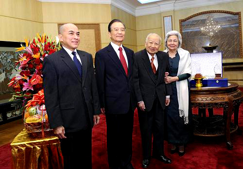

【天安门降半旗的太皇】

2004年10月7日（82岁），西哈努克宣布再次退位，由王子诺罗敦·西哈莫尼继位。西哈努克被尊称为“王父”（中国官方则称其为“太皇”）。退位后西哈努克身体状况不佳，往返于中国与柬埔寨之间接受治疗。

2012年10月15日，西哈努克在北京病逝，终年90岁。17日，北京天安门广场、新华门为西哈努克亲王逝世降半旗。

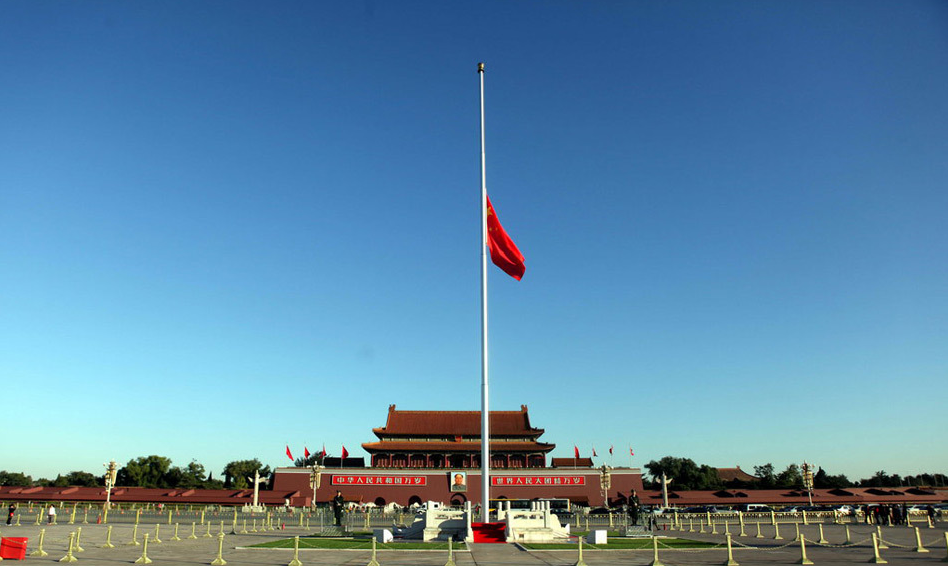

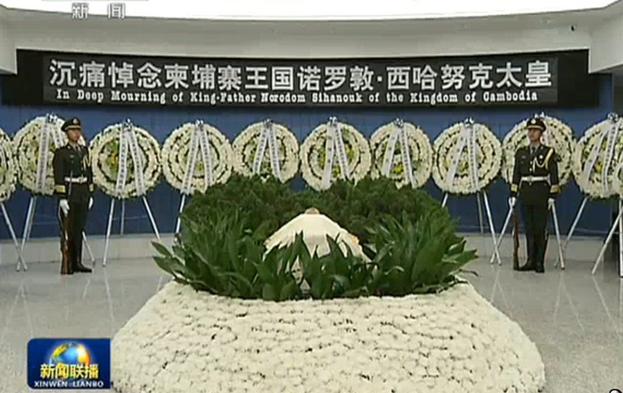

【】

### 照片

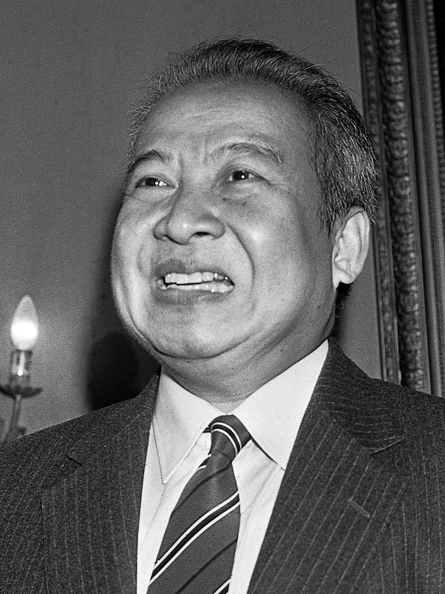

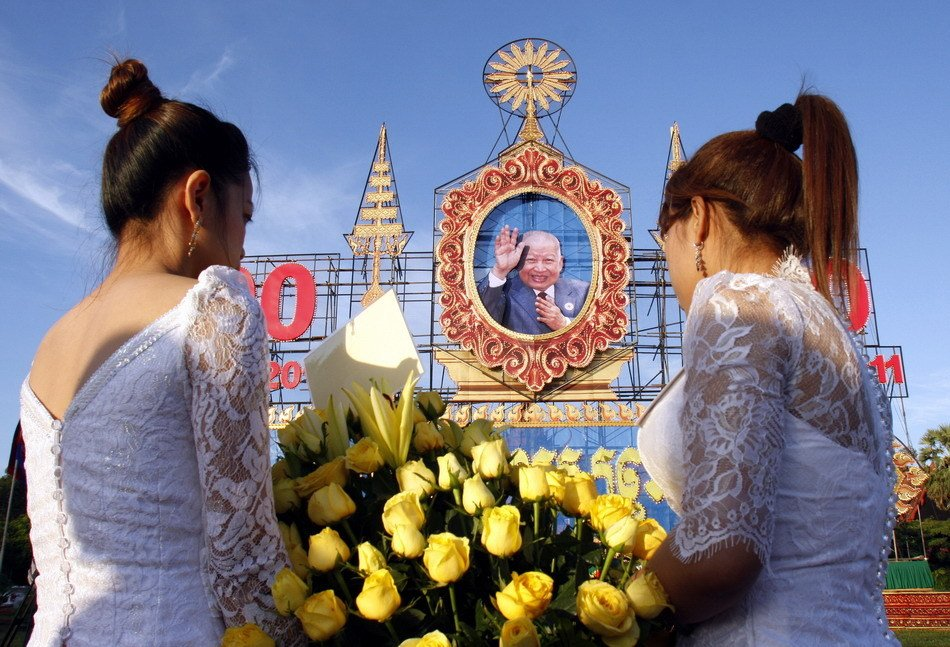

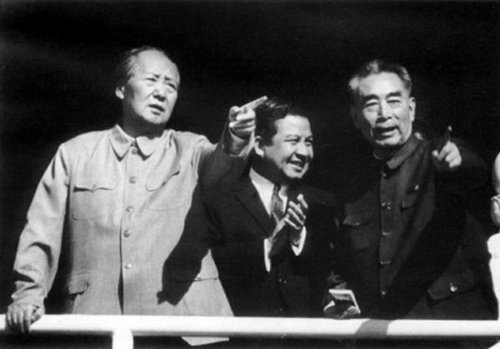

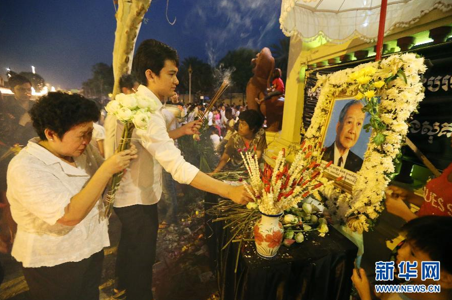

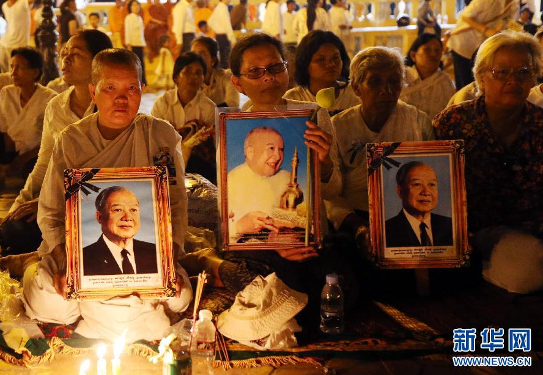

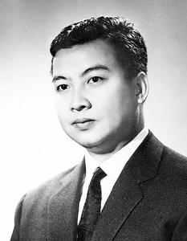

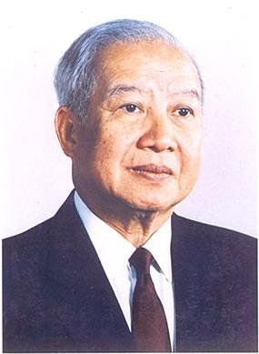

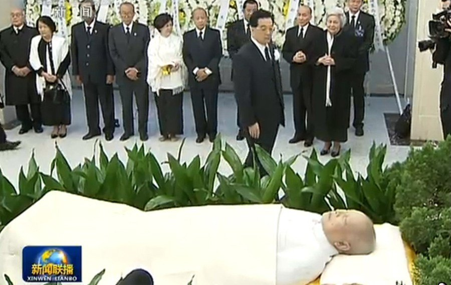

