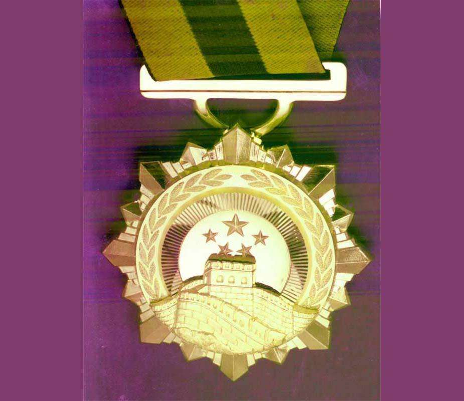

## nnnn姓名（资料）

适合所有人的历史读物。每天了解一个历史人物、积累一点历史知识。三观端正，绝不戏说，欢迎留言。  

### 成就特点

- ​
- ​

### 生平

（万象特约作者：一一 ）

104年前的今天，与居里夫人有缘的中国原子弹之父钱三强出生

钱三强（1913年10月16日—1992年6月28日），浙江绍兴人，中国原子能事业的创始人，“两弹一星”元勋。

1964年10月16日，中国第一颗原子弹爆炸成功，这一天正是钱三强的51岁生日。钱三强也被称为：中国原子弹之父。妻子是大学同学，被称作中国的居里夫人。去世后7年，钱三强被追授由515克纯金铸成的“两弹一星功勋奖章”。

【中国“居里夫人”的同学】

1913年10月16日，钱三强出生于浙江绍兴，父亲是著名的语言文字学家钱玄同。少年时随父在北京生活，就读于蔡元培任校长的孔德中学。

1929年（16岁），考入了北京大学理科预科。1932年（19岁），从北大预科毕业后，没有上北京大学，却考入清华大学物理系。同班同学何泽慧，后来成为他的妻子，被称作中国的居里夫人。

1936年（24岁），毕业后，在北平研究院物理研究所作助理员，不久被推荐到法国留学。

（1936年，清华大学毕业照，后排左一为钱三强，前排左四为何泽慧）

**【法国“居里夫人”的学生】**

1937年9月（24岁），到巴黎大学镭学研究所居里实验室攻读博士学位，导师是居里夫人的女儿和女婿，两人曾获1935年诺贝尔化学奖。

1939年（26岁），钱三强完成了博士论文——《α粒子与质子的碰撞》，获法国国家博士学位，并留在实验室工作。

（1934年，居里夫人的女儿和女婿合影）

**【中国“居里”爱情的力量】**

1946年4月（33岁），与何泽慧在巴黎结婚，婚后二人一同在实验室里工作。期间，或许是爱情的力量，钱三强经过反复实验，在研究铀核三裂变中取得了突破性成果。

1946年底，荣获法国科学院亨利·德巴微物理学奖。1947年，升任法国国家科学研究中心研究员、研究导师，并获法兰西荣誉军团军官勋章。

**【中国原子能的开拓者】**

1948年（35岁），两人一同回到中国。1949年，钱三强先后任中科院近代物理研究所（后改名原子能研究所）的副所长、所长，开始了原子能事业。1954年（41岁），加入了中国共产党。

1955年（42岁），钱三强被选聘为中国科学院院士（学部委员），成为原子能规划的制定人。1956年，钱三强与钱学森等科学工作者，一同赴苏联实习考察。

1956年11月，成立主管原子能工业的第三机械工业部（1958年2月11日改为二机部），钱三强被任命为副部长。

（钱三强和朱德的合影）

**【在没有苏联的日子里】**

1958年（45岁），他参加了苏联援助的原子反应堆的建设，并汇聚了一大批核科学家。

1959年，苏联单方面终止了两国签定的新技术协定，拒绝提供原子弹的有关资料及教学模型，撤走了全部专家。钱三强想尽办法，自力更生，又号召周光召等数十名海外专家，回国效力，克服了重重苦难。

**【中国原子弹之父】**

1964年10月16日（51岁），中国第一颗原子弹爆炸成功，这一天正是钱三强的51岁生日。他被称为：中国原子弹之父。1967年6月17日，氢弹爆炸成功。

1992年6月28日，钱三强在北京病逝，终年79岁。1999年，被追授了由515克纯金铸成的“两弹一星功勋奖章”。

【】

### 照片

