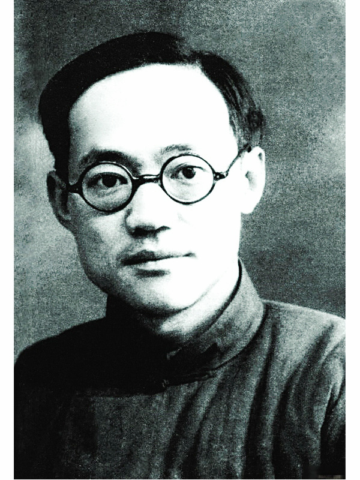
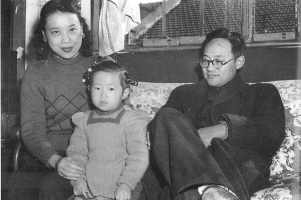
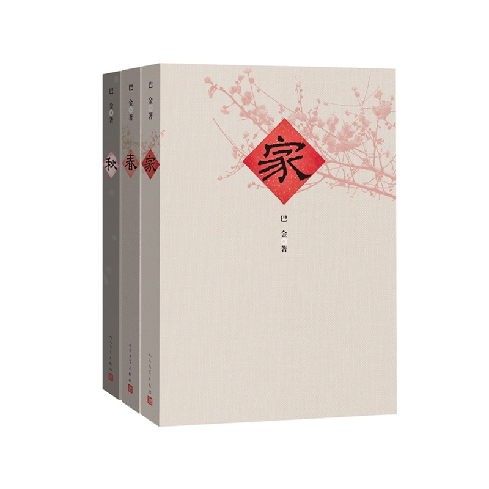
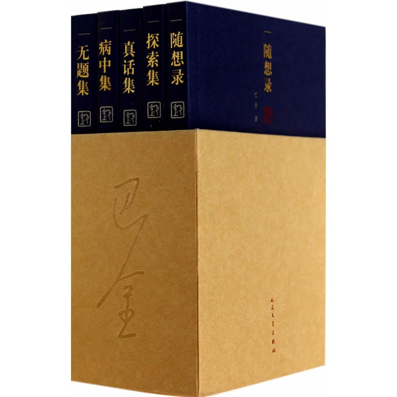
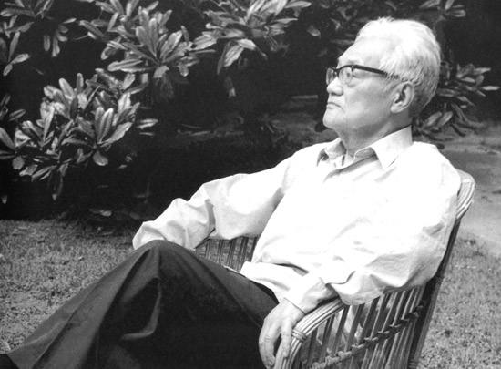

## nnnn姓名（资料）

适合所有人的历史读物。每天了解一个历史人物、积累一点历史知识。三观端正，绝不戏说，欢迎留言。  

### 成就特点

- ​
- ​

### 生平

12年前的今天，用《家》赢得一个家的人民作家巴金逝世

巴金（1904年11月25日－2005年10月17日），四川成都人，现代文学家。被誉为是“五四”新文化运动以来最有影响力的作家之一，是20世纪中国杰出的文学大师、中国当代文坛的巨匠。

【17岁发表的第一篇文章】

1904年11月25日，巴金出生于四川成都。1920年8月（16岁），考入成都外语专门学校。1921年4月（17岁），发表第一篇文章《怎样建设真正自由平等的社会》（《半月》杂志1921年第17号）。1923年（19岁），先到上海入读南洋中学，随后考入南京国立东南大学附中，1925年（21岁）毕业。

1925年9月，组织上海民众社，并出版《民众》半月刊。1927年至1929年，赴法国巴黎求学，留学期间开始使用“巴金”这个笔名。

【激流三部曲之《家》】

1933年5月（29岁），在上海开明书店出版《家》，这是激流三部曲的第一部，是巴金的代表作，在我国现代文学史上占有极其重要的地位。《激流三部曲》以成都为背景，描写了1919年至1924年中国历史处在转折时期这一风起云涌的动荡时代中，封建大家庭高家四代人的生活。

1934年11月（30岁），赴日本学习。1935年8月，从日本回国。主持上海文化生活出版社编务，主编《文化生活丛刊》、《文学丛刊》、《文学生活小丛刊》等。

【从《家》到家的小读者】

1936年8月（32岁），一位15岁的上海爱国女校的小读者萧珊（原名陈蕴珍），在通信半年后，提出：“笔谈如此和谐，为什么就不能面谈呢？”于是，两人约在一家咖啡馆见面，然后开始了8年的恋爱长跑。

到1944年，已经40岁的巴金在贵阳花溪与萧珊结婚，两人的婚礼极其简朴，没有任何仪式，只有一桌宴席。此后，两人相濡以沫28年从未吵过一次架。

【抗战中的《春》《秋》】

1937年（33岁），抗战全面爆发，巴金任《救亡日报》编委，与茅盾共同主编《呐喊》（后改名《烽火》）杂志。1938年3月，出版激流三部曲的第二部《春》。

1940年起，辗转于昆明、重庆、成都、桂林、贵阳等地，从事抗日文化宣传活动。7月，出版激流三部曲的第三部《秋》。

抗日战争胜利后，巴金主要从事翻译、编辑和出版工作。

【赴朝鲜访问的收获】

1949年7月（45岁），中共在北平市召开第一次全国文艺工作者代表大会，巴金当选为文联常委。建国后，担任上海市文联副主席。1950年11月，他参加了华沙第二次世界保卫和平大会，后又多次访问苏联。

朝鲜战争期间，巴金两次赴朝鲜访问，写有《生活在英雄们中间》、《保卫和平的人们》两本散文通讯集。

1957年7月，巴金主办大型文学刊物《收获》，并担任主编。1960年8月（56岁），当选中国文联副主席。

【被点名批评的随想录】

1966年8月（62岁），被上海作家协会“造反派”批判，并被《人民日报》文章点名批评，关进“牛棚”，随后在上海奉贤县“五七干校”劳动两年半。1972年8月13日（68岁），妻子萧珊罹患直肠癌过世。

巴金在文革后撰写的《随想录》，内容朴实、感情真挚，充满着作者的忏悔和自省，巴金因此被誉为“二十世纪中国文学的良心”。

【20多年的老领导】

1983年起（79岁），连续五次当选全国政协副主席，任职达22年之久，是共和国成立以来唯一一位超过百岁且在任上去世的党和国家领导人。

1984年10月（80岁），获香港大学授予荣誉文学博士学位。12月，当选中国作家协会主席，任职至逝世，达21年。

【99岁的人民作家】

1999年2月8日（95岁），因呼吸道感染发高热并出现急性呼吸衰竭，病情反复，从此未能出院。2003年11月25日（99岁），国务院授予巴金先生“人民作家”荣誉称号。

2005年10月17日19时6分，巴金在上海华东医院逝世，享年101岁。2006年11月25日，巴金诞辰102周年之际，根据巴金的遗愿，他和妻子萧珊的骨灰被撒入上海长兴岛附近的东海海域。

【】

### 照片

