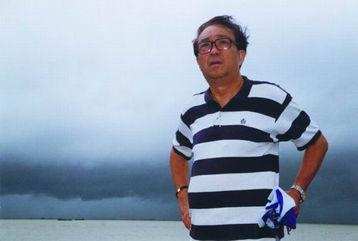
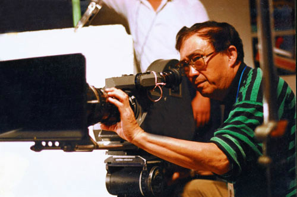
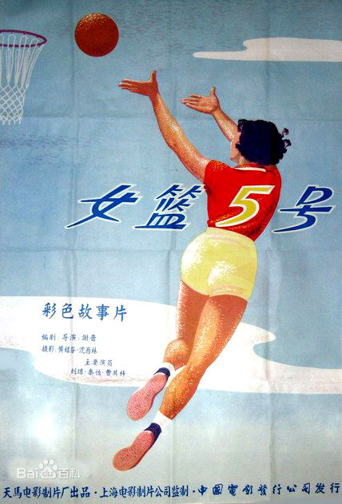
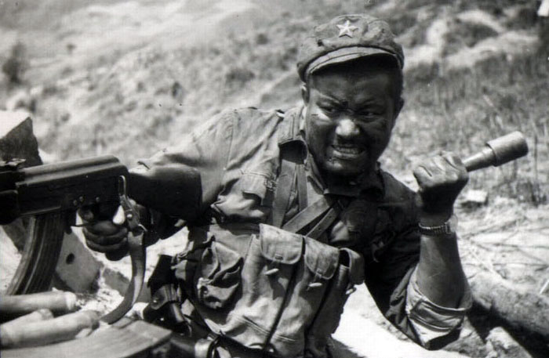
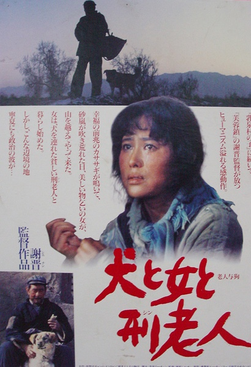
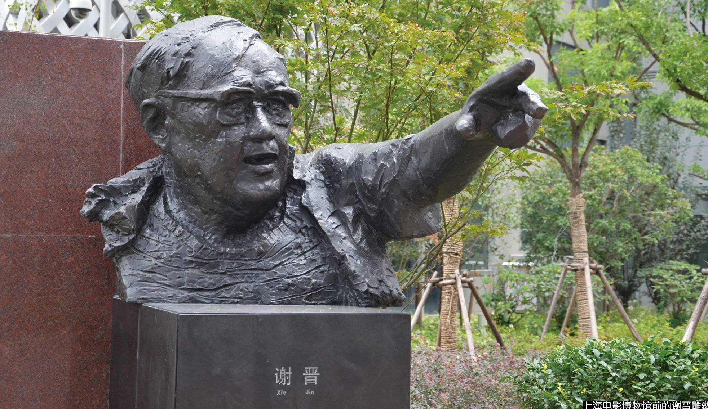

## nnnn姓名（资料）

适合所有人的历史读物。每天了解一个历史人物、积累一点历史知识。三观端正，绝不戏说，欢迎留言。  

### 成就特点

- ​
- ​

### 生平

9年前的今天，中国第3代电影导演谢晋在母校百年校庆时去世

【只想演戏的小伙子】

1923年10月23日，谢晋出生于浙江上虞，父亲是香港有名的会计师。在家乡度过童年后，随父母到上海读小学。1938年（15岁），曾到香港读中学，但第二年就返回上海，先后就读于大夏附中、稽山中学。谢晋在中学时代就酷爱表演，曾在华光戏剧专科学校、金星电影训练班学习。

1941年（18岁），高中毕业时，尽管父母坚决反对，他坚持报考戏剧学校。谢晋义考入四川江安国立戏剧专科学校，受到中国著名戏剧家曹禹、焦菊隐、马彦祥等师辈教导和培育。

【从演员变为导演】

1943年（20岁），谢晋主动辍学，跟随马彦祥、焦菊隐去重庆中国青年剧社工作，在《少年游》等戏中担任剧务、场记和演员。这一时期，逐渐确立向导演发展。

1947年（23岁），考入南京国立戏剧专科学校导演系，导师余上沅。1948年，毕业，并加入大同电影企业公司任副导演。

【传奇的女篮5号】

1953年（30岁），谢晋开始在上海电影制片厂任导演。1954年，独立执导淮剧短片《蓝桥会》。

1957年（34岁），谢晋执导的《女篮五号》是他的成名作，这是中国第一部彩色体育故事片。在第6届世界青年联欢节上获得银质奖章  、1960年获得墨西哥国际电影节银帽奖。

【红色娘子军和舞台姐妹】

1960年（37岁），谢晋决定把梁信的小说《琼岛英雄花》拍成电影，名字定为《红色娘子军》。谢晋凭借《红色娘子军》获1962年首届中国电影百花奖最佳影片、导演奖，1995年“中国电影世纪奖”。

1965年（42岁），谢晋开拍了展现越剧演员在新旧中国命运转折的影片《舞台姐妹》。《舞台姐妹》1980年获英国第24届伦敦国际电影节英国电影学会年度奖；1981年获菲律宾马尼拉国际电影节金鹰奖。

【高山下的花环】

1981年（58岁），导演了《天云山传奇》，该片讲述现实生活的真实反映，公映当年轰动一时。

1984年（61岁），执导的《高山下的花环》是谢晋的代表作之一，影片表现了当代军人“位卑未敢忘忧国”的崇高精神。《高山下的花环》获第5届中国电影金鸡奖最佳编剧奖、最佳男主角奖、最佳剪辑奖；第8届大众百花奖最佳故事片奖、最佳男演员奖；文化部1984年优秀影片一等奖。

【芙蓉镇】

1986年（63岁），作家古华拿着被北京电影制片厂“枪毙”的剧本《芙蓉镇》，找到谢晋执导拍摄。《芙蓉镇》获第7届中国电影金鸡奖最佳故事片奖、最佳女主角奖；第10届大众百花奖最佳故事片奖、最佳男演员奖、最佳女演员奖。

【老人与狗】

1987年（64岁），谢晋获全国五一劳动奖章，并被美国电影艺术与科学学会接纳为会员。1992年8月8日（69岁），谢晋恒通影视有限公司成立于上海，任公司总经理、法人代表。

1993年（70岁），谢晋拍摄了影片《老人与狗》。这部电影获得了上海电影评论学会1993年“十佳影片奖”。

【鸦片战争】

1997年（74岁），凭借影片《鸦片战争》 获第17届中国电影金鸡奖最佳故事片奖、最佳摄影奖；1997年度中国电影“华表奖”优秀故事片奖；加拿大蒙特利尔国际电影节“美洲特别大奖”。 该片是为纪念香港回归一周年而创作的一部献礼片，投资达一亿多，创下当时国内电影投资的纪录，也创下了国产片在国内的票房纪录。

2005年（82岁），获第25届金鸡奖终身成就奖。2007年（84岁），获第10届上海国际电影节华语电影杰出艺术成就奖。

【无法参加的百年校庆】

2008年10月18日（85岁），谢晋原拟参加母校上虞市春晖中学建校100周年庆典，但该日早上7点40分左右，服务员发现他已经停止了呼吸。

10月26日，谢晋的追悼会在上海龙华殡仪馆隆重举行。师出谢晋门下的刘晓庆、赵薇、范冰冰等人前来送行。

