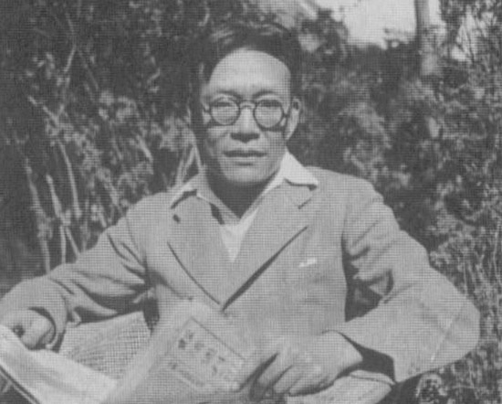
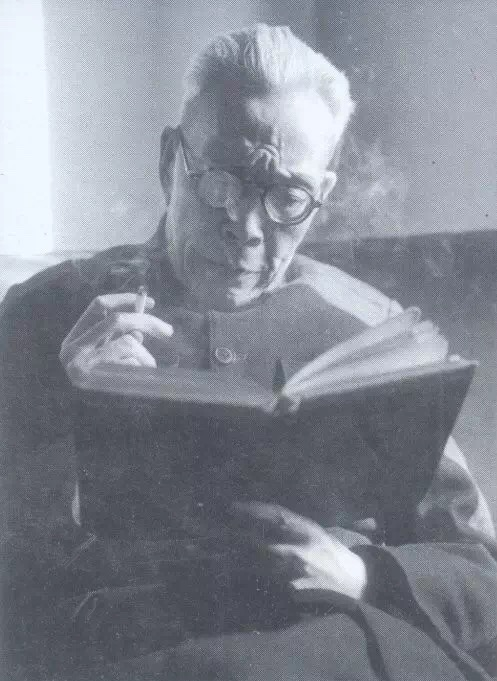
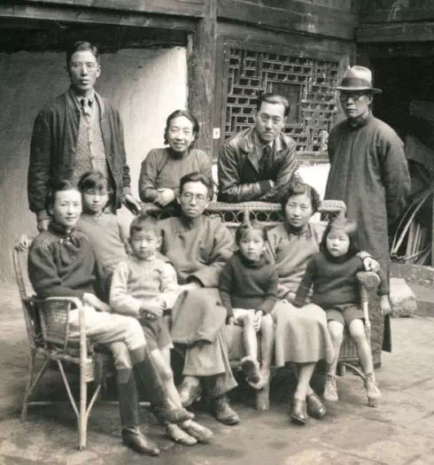
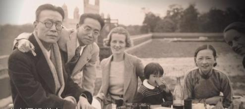

## nnnn姓名（资料）

适合所有人的历史读物。每天了解一个历史人物、积累一点历史知识。三观端正，绝不戏说，欢迎留言。  

### 成就特点

- ​
- ​

### 生平

33年前的今天，终身未娶、逐林而居的中国哲学界第一人金岳霖去世

【留学美国的哲学界第一人】

1895年7月14日，金岳霖出生于湖南长沙。父亲是浙江人，太平天国时期为避战乱来到湖南。6岁，进入长沙私立明德学堂读四书五经，接受传统教育。1907年（12岁），进入美国教会创办的雅礼大学预科。1911年（16岁），考入清华学堂。1914年（19岁），毕业，获官费留学美国。

1920年（25岁），获美国哥伦比亚大学的政治学博士学位。后到英国学习，在伦敦大学经济学院听课。1925年（30岁），金岳霖回国，到清华大学讲授逻辑学。随即与冯友兰等创办清华大学哲学系，任教授兼系主任，被誉为“中国哲学界第一人”。

【逐林而居的生活】

美国人Taylor（秦丽莲）是金岳霖在哥伦比亚大学的同学。秦丽莲跟随金岳霖到欧洲，又一同来到中国定居，两人长期保持伴侣关系。

1931年，林徽因因病在北平休养，老朋友徐志摩带金岳霖一同前去探望，从而两人相识。不久，金岳霖与秦丽莲分手，而金岳霖住到了梁思成的后院，开始“逐林而居”。

（1938年，西南联大教授合影，左二梁思成、左四林徽因、左五金岳霖）

【纯逻辑的中国哲学】

1936年（41岁），由商务印书馆出版《逻辑》一书。金岳霖是最早把现代逻辑系统地介绍到中国来的主要人物。1938年（43岁），抗战期间，任西南联大文学院心理学系教授、清华大学哲学系主任。

1940年（45岁），出版学术专著《论道》。这是中国现代哲学中系统最完备，最富有创造性的本体论专著。书中采用逻辑学书写形式，每一条都是一个逻辑命题，通过纯逻辑的推演建构出独特的本体论。这本书的问世使中国学术史产生了方法论上的革命，在重感悟而轻逻辑的中国文化中有划时代的意义。

【哲学研究的前沿领导】

1948年（53岁），金岳霖被选为第一届中央研究院院士。1949年后，任清华大学文学院院长。

1952年（57岁），全国高校院系调整，全国6所大学哲学系合并为北京大学哲学系，金岳霖历任北京大学哲学系教授、系主任。

1955年（60岁），被聘为中国科学院哲学社会科学部学部委员，9月底，任哲学研究所副所长。1956年（61岁），加入中国共产党；

【终身未娶的金爸】

金岳霖一直与林徽因比邻而居。金岳霖始终是林家沙龙的座上常客。金岳霖对林徽因人品才华赞羡至极，十分呵护；林徽因对他亦十分钦佩敬爱，他们之间的心灵沟通可谓非同一般，甚至梁思成和林徽因吵架，也是找理性冷静的金岳霖仲裁。

（后右一金岳霖，前左一林徽因，前左四梁思成等人合影）

1955年4月1日，林徽因去世。林徽因死后，有一年，金先生在北京饭店请了一次客，老朋友收到通知，都纳闷：老金为什么请客？到了之后，金先生才宣布：“今天是徽因的生日。

金岳霖终身未娶。晚年也一直与其子梁从诫一家住在一起，梁从诫则称其为“金爸”，情同父子。

（左一金岳霖，左二梁思成，左五林徽因合影）

【40年重写的知识论】

1965年（70岁），《罗素哲学批判》一书完稿；

1983年（88岁），《知识论》一书时隔40余年，终于由商务印书馆正式出版。金岳霖曾说过：“这本《知识论》是一本多灾多难的书。抗战期间，我在昆明时已经把它写完了。有一次空袭警报，……稿子已经没有了。这是几十万字的书，重写并不容易。可是，得重写。《知识论》是我花精力最多、时间最长的一本书！”

1984年，金岳霖在北京寓所逝世，享年89岁。1990年，设立金岳霖学术奖，是我国逻辑学研究的最高学术奖项。

