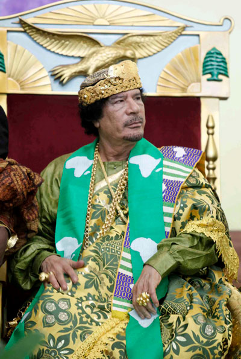
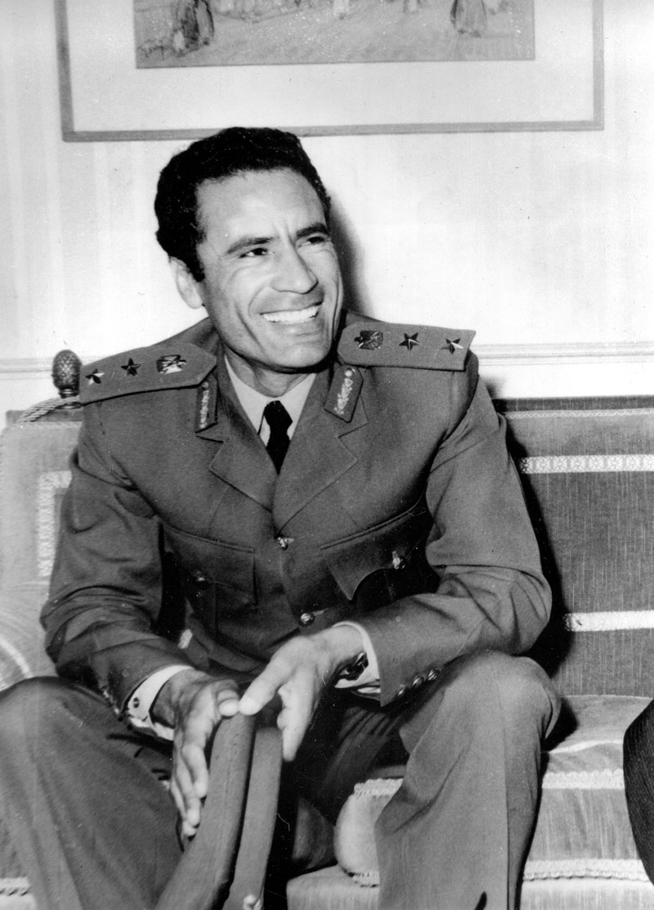
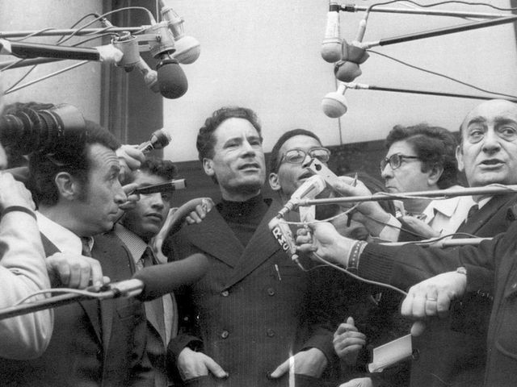
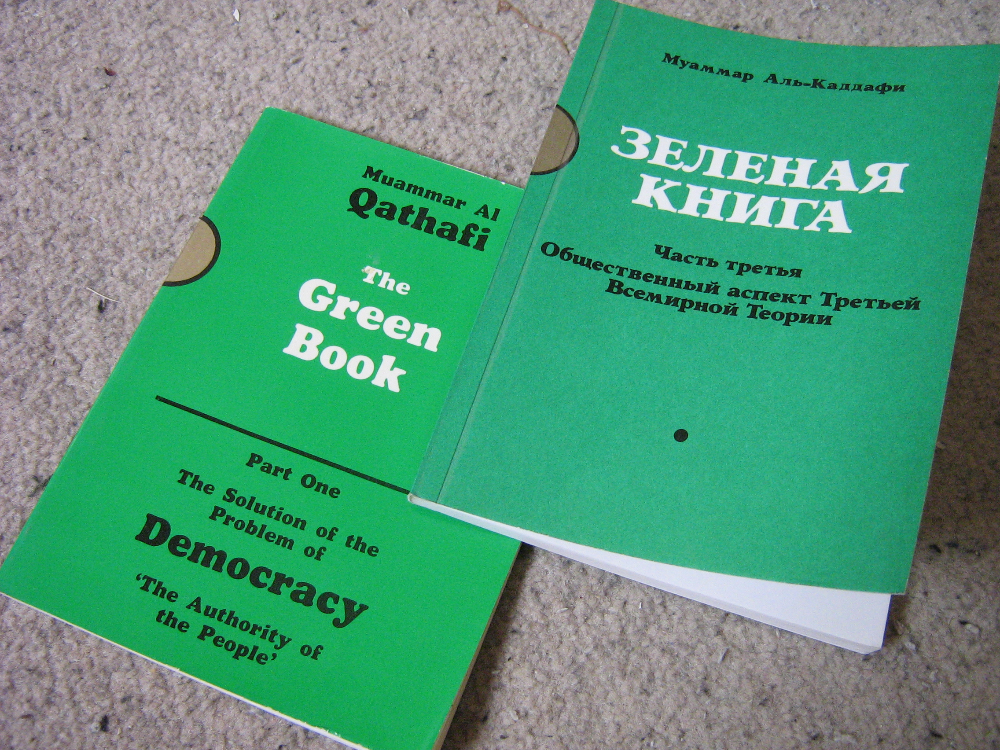

## nnnn姓名（资料）

适合所有人的历史读物。每天了解一个历史人物、积累一点历史知识。三观端正，绝不戏说，欢迎留言。  

### 成就特点

- ​
- ​

### 生平

6年前的今天，统治利比亚42年，非洲的万王之王卡扎菲被击毙

【有领袖气质的沙漠浪子】

1942年6月7日，卡扎菲出生于利比亚沙漠中部，家里是游牧的贝都因人。小学在临近的小镇就读，每天单程步行1.5小时上学。中学时，家境更为困苦，每周末走三个半小时回沙漠与家人团聚。

在学校时，卡扎菲已显露了一定的“领袖气质”，善于表达，具有感召力。卡扎菲还建立了有严格的层级制度的组织，因而被学校开除，不得不转学。

1961年（19岁），卡扎菲进入班加西利比亚大学主修历史。就读一年后，转学到军校。毕业后，赴英国桑赫斯特皇家军事学院，接受装甲兵训练半年。回国后，卡扎菲成立了以中下级军官为核心的“自由军官”组织，积极谋划革命。

【42年统治的九一革命】

1969年8月31日（27岁），卡扎菲等人从班加西出发，利用夜间训练为掩护，率领三营装甲部队进军的黎波里，突击禁卫军。他抢先攻下广播台和电视台，使禁卫军无法向外求援。9月1日，卡扎菲对外宣布革命成功。

9月5日，王储宣布放弃王位，利比亚王国被推翻，从此卡扎菲成为利比亚的最高领导人。他对利比亚统治长达42年，是阿拉伯国家中执政时间最长的领导人。

（九一革命成功后，卡扎菲接受媒体采访）

【带领利比亚脱贫致富】

在卡扎菲执政期间，凭借石油、天然气资源带来的丰厚收入，利比亚经济得到迅速发展，使得这个拥有600万人口的国家在非洲率先摆脱贫困。

卡扎菲笃信伊斯兰教，他亲自设计了一面只有绿色的利比亚国旗，这是全世界最简单的国旗。

卡扎菲上台后推行亲苏政策，收回美国的空军基地，废除前政权同美国签订的多项协议。而且卡扎菲试图拥有核武器，与美国矛盾重重。

（1973年，卡扎菲向支持者挥手）

【人人都要学的绿皮书】

1975年（33岁），卡扎菲把他的政治哲学，写成《绿皮书》并出版。

《绿皮书》全书约有110页，包括三部分：民主问题的解决方案：人民的监督（1975年年底出版）；经济问题的解决方案：社会主义（1977年年初出版）；第三国际理论的社会基础（1981年9月出版）。

该书要求“所有的利比亚人民阅读”，学生每周要花2小时阅读本书，电视台和电台每天播放。

【震惊世界的洛克比空难】

1988年12月21日（46岁），泛美航空公司PA103航班在英国边境小镇洛克比上空爆炸解体，航班上259名乘客和机组人员无一幸存，史称洛克比空难。

这次空难被视为是利比亚针对美国的一次恐怖袭击，是9·11事件发生前针对美国的最严重的恐怖袭击事件。此次事件，使得泛美航空三年后宣告破产。

在伊拉克战争后，卡扎菲对美国的态度有明显改变。1993年，卡扎菲同意赔偿泛美空难死者家属。2004年9月，美国正式终止对利比亚的贸易禁运。2006年，美国和利比亚恢复外交。

【非洲的万王之王】

2008年9月，在地中海港口城市班加西，200多位顶着王冠或手握黄金权杖的非洲国王、酋长们将“万王之王”的头衔授予了利比亚领导人卡扎菲。

2009年9月23日，卡扎菲在联合国大会上发表长达94分钟的演讲《革命事业的领袖弟兄》（Brother Leader of the Revolution）。

【回到沙漠深处】

2011年2月17日，利比亚爆发“愤怒日”大规模示威抗议，要求政府下台。3月17日，关于制裁利比亚卡扎菲政权的联合国安理会第1973号决议，获得安理会全票通过。3月19日起，英国、法国、美国等多国军队发动对利比亚的空袭。

.jpg)

卡扎菲在电话中警告英国前首相布莱尔，如果自己丢掉政权，恐怖集团将在中东崛起并必将攻击欧洲。 8月22日，反政府武装攻入首都的黎波里，卡扎菲政权倒台。10月20日，执政当局占领苏尔特，卡扎菲被捕后死于枪杀。

卡扎菲死后，为了避免其墓地成为“圣地”或者遭到蓄意破坏，决定将卡扎菲秘密埋葬在沙漠深处，没有任何墓碑等标识。

