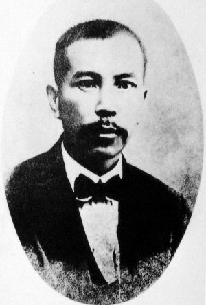
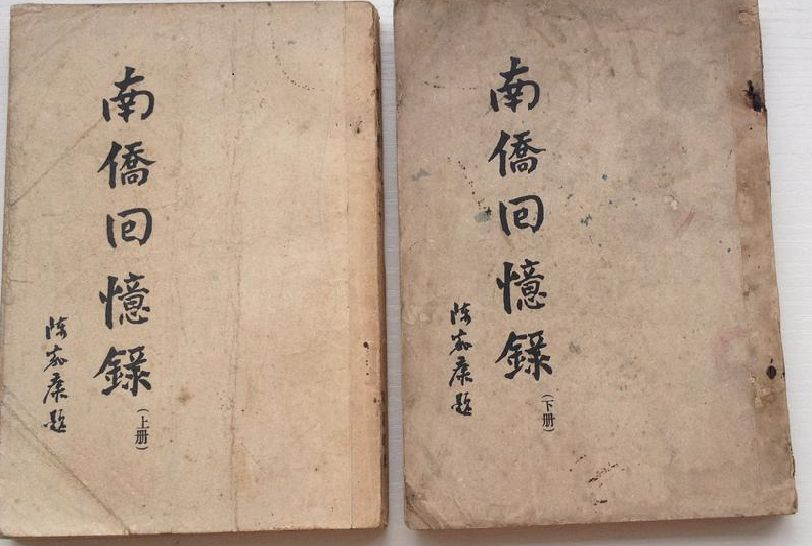
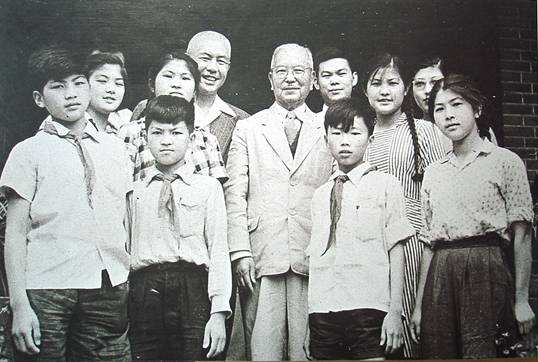
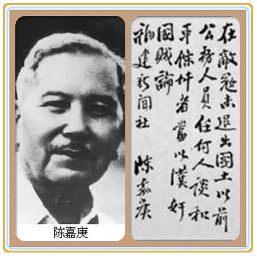
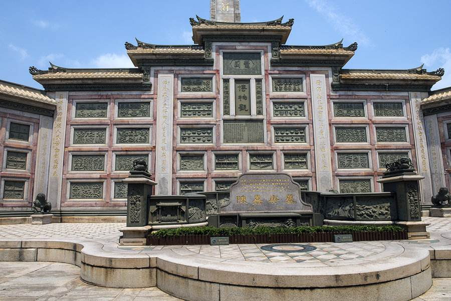
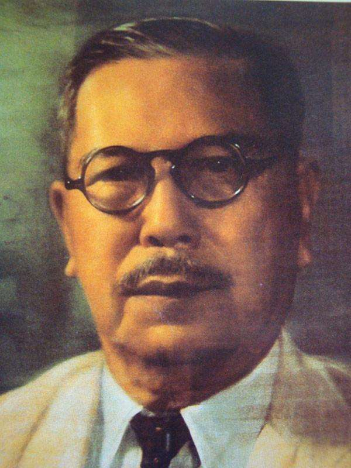
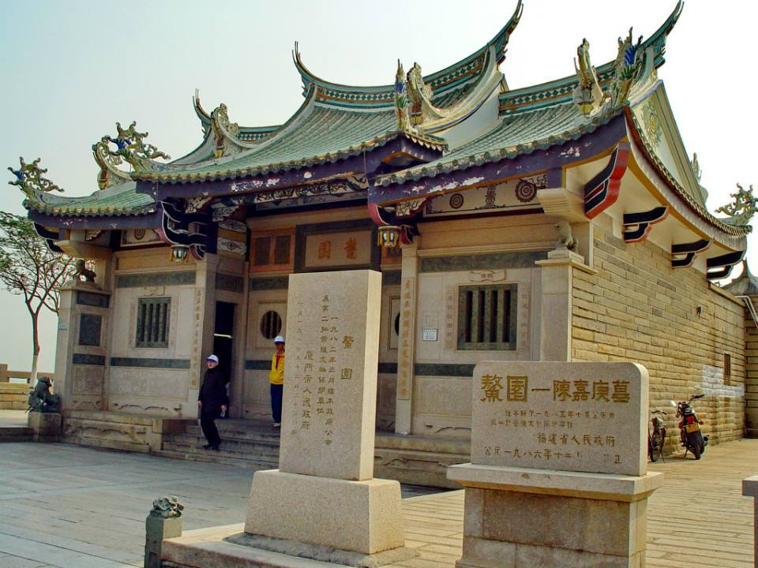
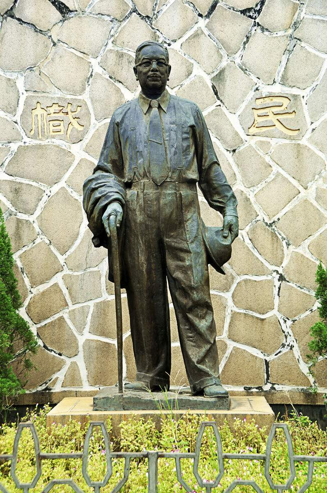

## nnnn姓名（资料）

适合所有人的历史读物。每天了解一个历史人物、积累一点历史知识。三观端正，绝不戏说，欢迎留言。  

### 成就特点

- ​
- ​

### 生平

143年前的今天，定义什么人是汉奸的著名爱国华侨陈嘉庚出生

【南洋的生意人】

1874年10月21日，陈嘉庚出生，今厦门市集美区人。父亲早年下南洋谋生，在新加坡经营米店。17岁，陈嘉庚帮父亲经营米店，20岁回福建完婚。

1905年（31岁），米店歇业，陈嘉庚开始自立门户，走上了创业的道路。他首先开设了生产菠萝罐头的“新利川黄梨厂”、“日新公司”，获利丰厚，当年夏天又开设了“谦益号”米店，不久决定经营橡胶种植业。

【橡胶事业的沉浮】

陈嘉庚开始大力发展橡胶事业，到1925年时陈嘉庚已拥有1万5千英亩的橡胶园，是当地华侨中最大的树胶种植者之一。同时他开设了橡胶制造厂，生产胶鞋、轮胎等产品，雇用员工数万人，其经济实力称霸东南亚，是当时马来亚最富有的华侨之一。

到了1929年（55岁），世界经济大萧条，橡胶业遭到沉重打击，陈嘉庚旗下的橡胶事业也一个个倒闭。到1934年，已经资不抵债，陷于崩溃。

【集美教育一条龙】

陈嘉庚非常热心兴办教育。早在1913年（39岁），他在家乡创办小学，1918年又创办师范学校（今集美大学），并设立中学，附设男女小学和幼儿园。随着他的企业兴旺发展，他又继续在集美开办水产航海学校，商业学校，农林学校，幼儿师范等，同时也设立了科学馆，图书馆和医院等。

1919年（45岁），创办了规模宏大的新加坡南洋华侨中学，这是新加坡第一所华文中学。

【呕心沥血的厦门大学】

1921年（47岁），他决定投资100万元创办厦门大学。大学的经营费用300万元，也由他分12年支付。对于厦门大学，他付出了满腔的心血，从聘请校长和教员，到校舍的选址设计施工，他四处奔走，呕心沥血，使厦门大学成为当时中国国内的知名高校。

1941年（67岁），陈嘉庚创办了南侨师范学校。在抗日战争结束后，他又接连创办水产航海学校、南侨女子中学校、光华学校、爱同学校等学校。陈嘉庚一生所捐献的教育经费，总值在1000万元以上，相当于他拥有的全部不动产。

【支持抗日，定义汉奸】

陈嘉庚早年加入同盟会，并积极支持孙中山的革命活动。1937年，抗日战争全面爆发，南洋华侨筹赈祖国难民总会（简称“南侨总会”）在新加坡成立，陈嘉庚被推选为主席。从卢沟桥事变到太平洋战争爆发的4年半期间，共计捐款约15亿元，极大地支援了中国国内的抗日力量。

陈嘉庚还坚持抗日到底，针对汪精卫等人的妥协方案，在国民参政会第二次大会上提出“敌未出国土前，言和即汉奸”的著名提案，对于当时重庆的主战派起着很大的鼓舞作用。

【积极抵制蒋介石】

1940年（66岁），陈嘉庚率领慰劳团到中国访问，他参观了重庆，延安等地，与国共两党都进行了接触。1941年，日军占领新加坡，陈嘉庚被迫辗转到印尼等地避难。

1946年，国共内战爆发后，陈嘉庚反对美国援助蒋介石，以南侨总会主席名义致电美国总统和国会表示抗议。并且抵制蒋介石召开的国民大会。1947年，组织“新加坡华侨各界促进祖国和平民主联合会”（简称“民联社”），积极声援民主党派关于制止内战的斗争。

【华侨旗帜，民族光辉】

1949年5月，陈嘉庚应毛泽东的邀请，回国参加中国人民政治协商会议筹备会议，当年9月，以华侨首席代表身份参加中国人民政治协商会议。10月1日，在天安门城楼参加了中华人民共和国开国大典。1950年，陈嘉庚回中国定居。

1961年8月12日，陈嘉庚病逝于北京，享年87岁。安葬于福建集美鳌园。他的逝世，葬礼的规格极高，由周恩来总理主持，毛泽东主席亲笔题词，“华侨旗帜，民族光辉”。

1988年1月，陈嘉庚基金会成立，设立“陈嘉庚奖金”，它参照诺贝尔奖评奖方法，以促进中国科技事业发展为目的，被称为中国的诺贝尔奖。

【】

### 照片

