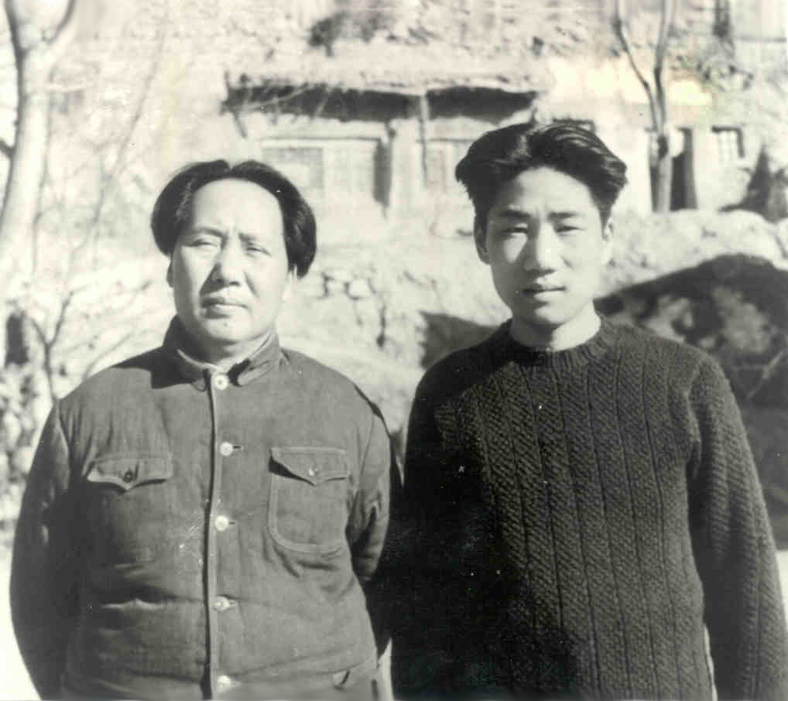
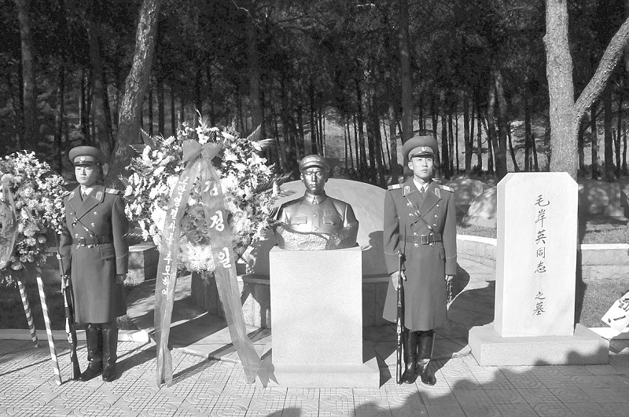
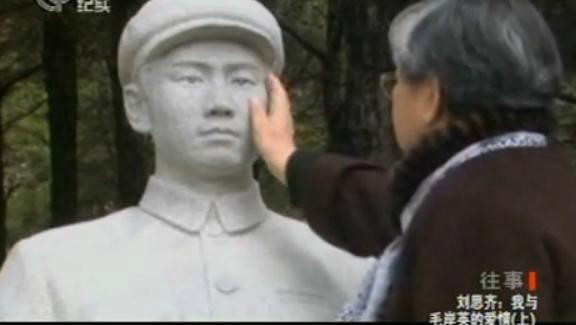

## nnnn姓名（资料）

适合所有人的历史读物。每天了解一个历史人物、积累一点历史知识。三观端正，绝不戏说，欢迎留言。  

### 成就特点

- ​
- ​

### 生平

95年前的今天，参加苏联红军，牺牲在朝鲜的毛岸英出生

【王牧师家的流浪儿】

1922年10月24日，毛岸英生于湖南长沙湘雅医院，是毛泽东与杨开慧的长子，原名毛永福。

1927年（5岁），毛泽东组织发动秋收起义前，杨开慧带着3个儿子到乡下躲避。1930年（8岁），杨开慧被杀后，毛岸英兄弟被保释出狱，并带到上海，进入中共地下党所办的“大同幼稚园”。

1932年（10岁），寄养在被称为“王牧师”的董健吾家中。1933年，中共中央迁往江西省瑞金，经济资助中断，毛岸英和弟弟毛岸青流落街头。

（毛岸英和毛岸青）

【苏联红军的坦克兵】

1937年（15岁），因董健吾的关系，张学良派部下李杜带兄弟俩到法国马赛，并由康生带往莫斯科，进入“国际第二儿童院”。取俄语名为“塞尔盖伊”（Сергей），中文名叫“岸英”。

1942年（20岁），苏德战争爆发后，他参加苏联红军。1943年，加入苏联共产党（布尔什维克），并进入伏龙芝军事学院深造，毕业后任坦克连指导员，参加苏军解放波兰的战斗。

（周恩来邓颖超在苏联看望毛岸英兄弟）

【回到中国的好青年】

1946年1月（24岁），乘飞机回到延安，同年加入中国共产党。不久，到当时著名的劳动模范吴满有家学种地，上“劳动大学”。1947年春，国民党军队进攻延安时，他和康生去山西临县发动土改。

进北京后，出任中共中央社会部部长李克农的秘书兼翻译。1949年10月，与刘松林（即刘思齐）结婚，她的同母异父妹妹邵华与毛岸青后来也组建了家庭。1950年8月中旬（28岁），任北京机器总厂党总支副书记。

【朝鲜战争的噩耗】

1950年6月25日，朝鲜战争爆发。10月下旬，毛岸英随中国人民志愿军越过鸭绿江入朝作战，任志愿军司令部俄语翻译和机要秘书。毛岸英在朝鲜隐姓埋名，被称作刘秘书，只有少数人知晓其真实身份。

1950年11月24日下午，两架绰号“黑寡妇”的美军P-61战斗机机在大榆洞的志愿军司令部上空盘旋了1个多小时进行侦察，志愿军首长因此规定：明晨4时前开饭完毕，除值班者外，其他人在天亮前全部进防空洞。

1950年11月25日上午11时，联合国军四架南非的B—26轰炸机轰炸了大榆洞 ，投下的凝固汽油弹击中茅屋（司令部作战室）而燃烧，毛岸英未能及时逃出，当场死亡，尸体无法辨认，靠他生前戴的苏联手表残骸才确认，年仅28岁。

（毛岸英牺牲60周年，金正日敬献花圈）

（金正恩参拜毛岸英之墓）

【谁叫他是毛泽东的儿子】

起初，彭德怀等官员都不同意毛岸英赴朝鲜战斗，毛回答：“谁叫他是毛泽东的儿子！”

毛岸英阵亡当天，彭德怀向中央军委专门电告此事，周恩来将电报暂时搁下。直到1951年1月2日，第三次战役结束后，才把电报送给毛泽东、江青。

（毛泽东与江青、毛岸英、刘松林、李讷在香山合影）

毛泽东决定不把毛岸英的遗体运回国。毛岸英后被葬于朝鲜平安南道桧仓郡中国人民志愿军烈士陵园，墓碑上题字为“毛岸英同志之墓”。背面刻有碑文：毛岸英同志原籍湖南省湘潭县韶山冲，是中国共产党主席毛泽东同志的长子。

（毛泽东与毛岸英在香山双清别墅）

【难以忘怀的夫妻情深】

1962年2月，毛岸英的妻子刘松林改嫁，生有两子两女，其中长子叫杨小英，是为怀念毛岸英而起名的。

2006年5月27日，《人民日报》刊登刘松林的文章说，在不久前毛岸英烈士亲属代表团访问朝鲜期间，她来到了朝鲜北方靠近鸭绿江的大榆洞，以完成毛泽东的嘱托。

2010年5月，毛新宇、刘松林及亲属赴抗美援朝烈士陵园祭奠毛岸英。

