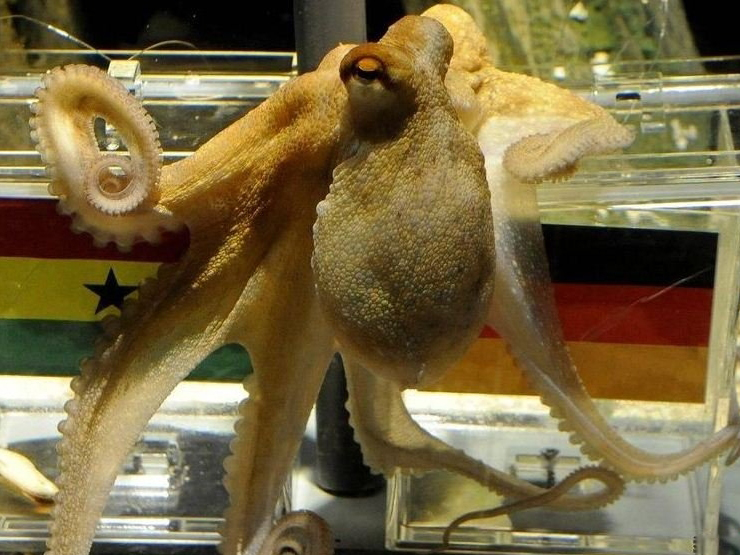
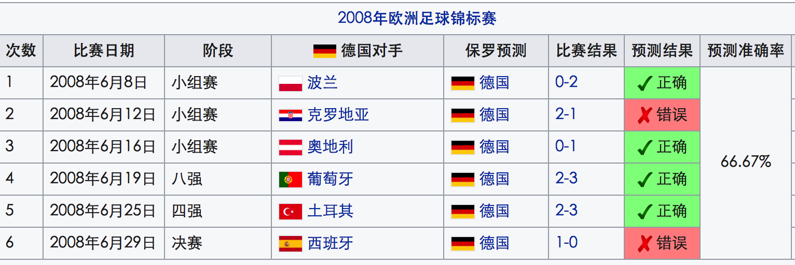
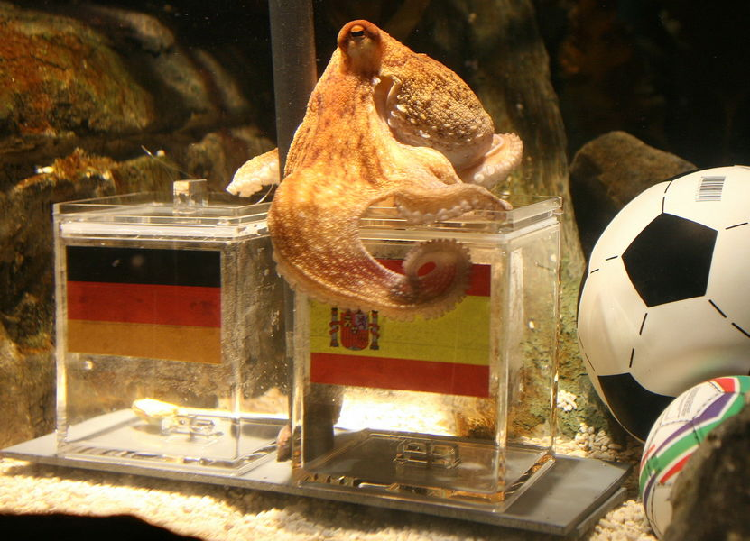
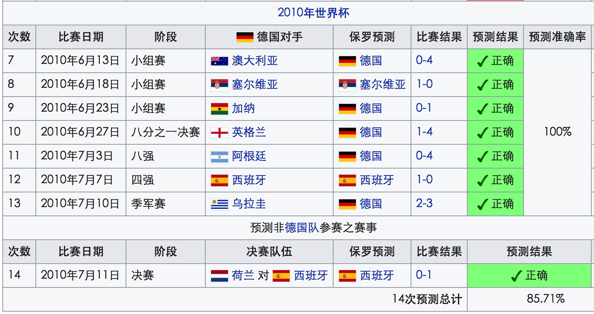

## nnnn姓名（资料）

适合所有人的历史读物。每天了解一个历史人物、积累一点历史知识。三观端正，绝不戏说，欢迎留言。  

### 成就特点

- ​
- ​

### 生平

7年前的今天，世界杯上的100%预测正确的章鱼保罗自然死亡

【生在英国长在德国】

2008年1月26日，章鱼保罗在英国出生。随后，在德国成长，居住在德国奥伯豪森的海洋生物馆。“章鱼保罗”这个名字是取自于德国儿童作家波尔·洛生的一首诗的标题。

【初试身手】

2008年欧洲足球锦标赛小组赛，在德国对波兰的比赛前，不满1岁的章鱼保罗进行了第一次赛果“预测”：德国胜。结果德国队在该场赛事以2:0得胜，章鱼保罗“预测”成功！

随后，章鱼保罗为德国队的全部六场赛事进行了预测，结果有四次预测成功，其中错误的两次预测是对克罗地亚和西班牙。

【大显神通】

2010年6月起，南非世界杯足球赛开赛。章鱼保罗再次亮相，并大显神威，成功预测了德国队参加的全部7场比赛。并最终成功预测，西班牙夺得冠军，成功率100%。一时轰动全球，被誉为“神算子”，“保罗哥”，“章鱼帝”，“预测帝”等称号。

【红颜薄命】

由于章鱼保罗的年龄已经接近章鱼的寿命极限，南非世界杯结束后，水族馆宣布保罗退休，往后也不会预测任何足球比赛或其他事物。

2010年10月25日，保罗于奥伯豪森水族馆自然死亡，享年2岁又8个月多。

2011年1月20日，奥博豪森水族馆门前，设置了一座纪念章鱼保罗的雕像。该雕像高度达2米，外形为保罗用八只爪环抱着一个足球。足球上印有多国国旗，里面放着保罗的骨灰瓮。

【时代大咖】

在比赛前，水族馆的工作人员会准备两个透明玻璃箱，箱上贴着比赛双方的国旗，箱中会事先放入食物（如蚌）。当保罗进行“预测”时，工作人员会先把已准备好的透明玻璃箱放入水缸中，然后等待保罗到“预测”获胜的玻璃箱中获取食物。

章鱼保罗并不是唯一一条预测赛果的章鱼。在英国汉诺威海洋生物水族馆，也有一条章鱼经常“预测”足球比赛；而在新加坡的一只13岁的鹦鹉也有“预测”赛果的能力。但是它们的命中率皆不如保罗。

