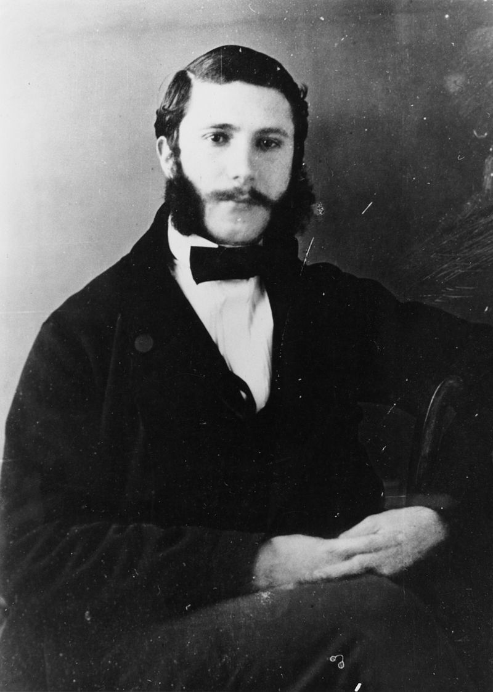
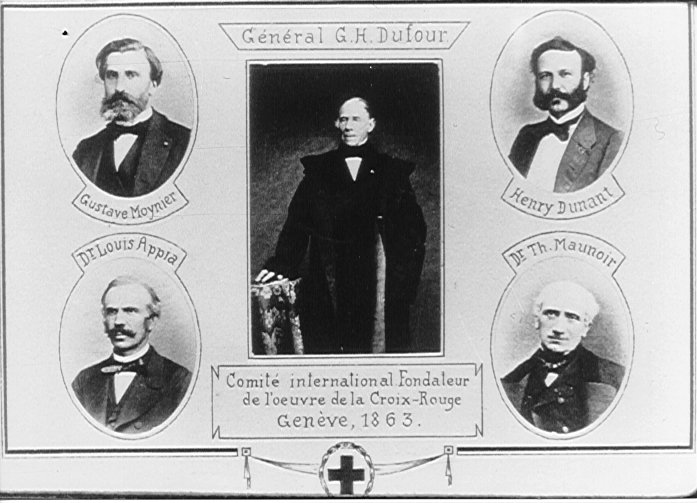
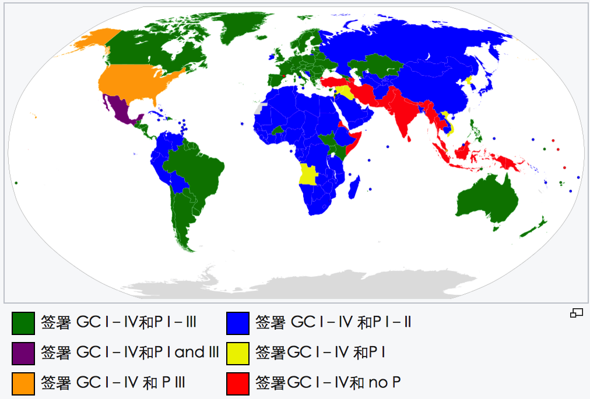
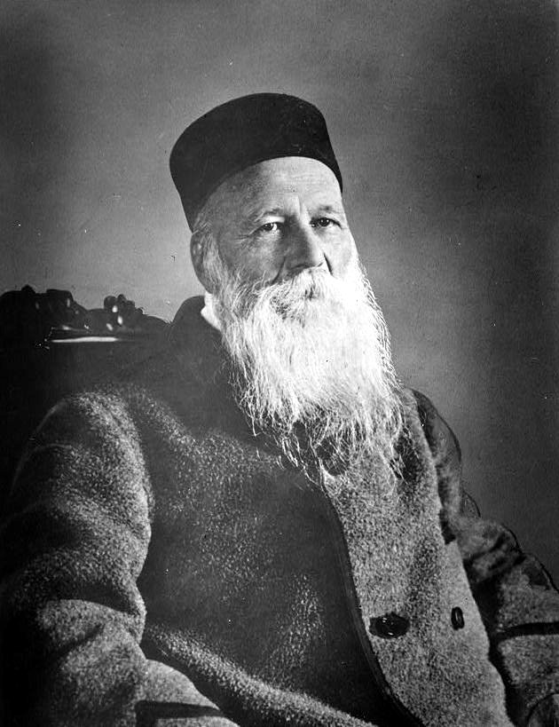

## nnnn姓名（资料）

适合所有人的历史读物。每天了解一个历史人物、积累一点历史知识。三观端正，绝不戏说，欢迎留言。  

### 成就特点

- ​
- ​

### 生平

107年前的今天，没有葬礼的红十字会之父亨利·杜南逝世

【心地慈善的基督徒】

1828年5月8日，亨利·杜南在出生在瑞士日内瓦。父母是生意人，都是虔诚的基督教徒。

18岁时，杜南加入了社会慈善机构，经常帮助穷人、监狱探访和社会工作等。1849年（21岁），杜南去了一家典当行当学徒。随后进入了一家银行成为一名雇员。

1852年11月30日（24岁），他创建了“日内瓦基督教青年会”。3年后，成立了国际组织。

【残酷的索尔费里诺战役】

1856年（28岁），他在被法国占领的阿尔及利亚，创建了一个公司。因没有拿到土地和水资源的权利，杜南决定直接向法国皇帝拿破仑三世提出申请。当时法国正在和奥地利开战，拿破仑的总部设在今天的意大利的小城市索尔费里诺。杜南写了一本恭维赞美拿破仑三世的书，然后前往索尔费里诺。

1859年6月24日晚上（31岁），杜南抵达索尔费里诺，正好遇上法国、萨丁尼亚联军正在对奥地利作战。在那天的战斗中，多达3万8千余人受伤、死亡。

可是战场上几乎无人护理，杜南深感震惊。他主动组织平民百姓，尤其是妇女，帮助受伤的士兵。杜南购买所需材料，架设临时医院。他不考虑受伤的人员是哪一方，按照“全部是兄弟姐妹”的原则予以救助。

.jpg)

【红十字会的前身】

7月初，回到日内瓦后，杜南把自己的经历写成一本书《索尔费里诺回忆录》（1862年11月8日出版）。在书中，他描述了这场战役、它带来的高昂成本，以及战役后的混乱状况。他认为，今后应该有一个中立的组织来照顾受伤的士兵。

他给当时众多欧洲的权势人物分发了这本书，并到欧洲各国，推销他的想法。他的提议得到了法国大作家维克多·雨果的声援，拿破仑三世也表示赞同。

日内瓦公共福利协会主席穆瓦尼埃注意到了这个想法，1863年2月9日（35岁）召开了专题会议。他们创建了一个五人委员会，包括穆瓦尼埃，亨利•杜南，杜福尔将军，阿皮亚医生，莫诺瓦医生。这个委员会就是红十字会的前身。

【欺骗性破产的丑闻】

然而，穆瓦尼埃和杜南很快就产生了严重的分歧。穆瓦尼埃认为建立“中立的组织”并不可行，而杜南坚持他的想法。两人互不相让，竟渐渐成为死对头。1863年10月，14个国家参加了由委员会在日内瓦组织的会议。一年后，由瑞士议会组织的外交会议，促成了有12个国家签署的第一个《日内瓦公约》。

1867年4月（39岁），金融企业日内瓦信贷公司的丑闻将杜南卷进来，他被迫宣布破产。不久，法院裁决他是“采取有欺骗性做法的破产”，引起社会一片哗然。1867年8月25日，杜南迫于压力辞去秘书长，并完全脱离委员会。同时他被“日内瓦基督教青年会”开除。

【与红十字无关的人生】

不久，他离开家乡日内瓦，发誓说有生之年将不会返回。此后20年里，杜南过着清贫的生活，莫瓦尼埃却尽可能利用他的影响力，使杜南得不到任何援助。

红十字运动发展迅速，杜南被奥地利、荷兰、瑞典、普鲁士和西班牙的国家红十字会任命为荣誉会员，却被排除在红十字会官方之外。1887年7月（59岁），他搬到了瑞士北部的度假村海登，并在那里度过余生。

【首届诺贝尔和平奖】

1895年9月（67岁），《东部瑞士人》报的主编撰写了一篇文章记述一个月前在海登遇到的这位国际红十字会创始人。这篇文章被欧洲各国报刊不断转载，引起轰动。他获得了瑞士Binet-Fendt奖和天主教教宗利奥十三世写来的信，他的财务状况也得到大大改善。

1901年（73岁），他和弗雷德里克·帕西（国际和平联盟和各国议会联盟创办人）同获首届诺贝尔和平奖。在诺贝尔委员会上将杜南的10.4万瑞士法朗奖金存在挪威银行，以避免被杜南的债主拿去。在杜南的余生中，他一直没有动用这笔奖金，最后捐给了挪威与瑞士的慈善事业。

【没有葬礼的红十字会之父】

他一直住在海登的养老院，直到他去世。在最后的日子里，他患有抑郁症和妄想症，老是梦见的他的债权人和莫瓦尼埃。甚至害怕有人下毒，而要求厨师当着他的面品尝食物后才肯吃。

1910年10月30日（82岁），杜南逝世，比他的死对头莫瓦尼埃晚两个月。杜南终身未婚，他死后，没有人送葬，也没有葬礼。他的墓碑上没有墓志铭，只有一幅大理石浮雕：一个救护者跪在一个垂死之人的旁边，喂着他生命的甘露。

1948年，也就是杜南逝世之后38年，国际红十字协会理事会决定把5月8日，也就是亨利·杜南先生的生日，定为“世界红十字日”。

