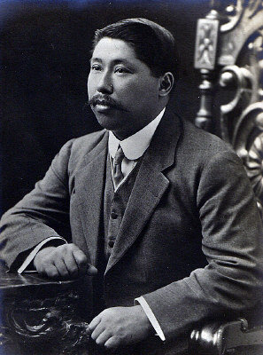
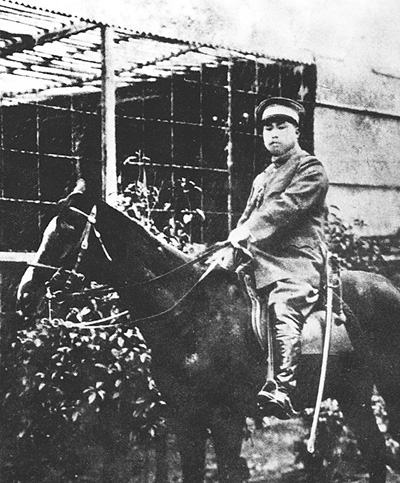
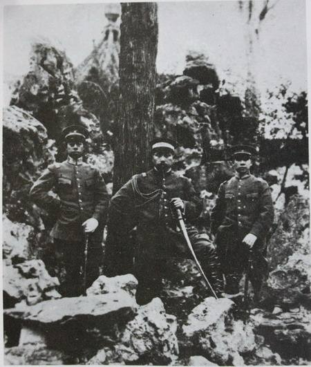

## nnnn姓名（资料）

适合所有人的历史读物。每天了解一个历史人物、积累一点历史知识。三观端正，绝不戏说，欢迎留言。

### 成就特点

- ​
- ​

### 生平

101年前的今天，卖光家产，成事不必在我的民国大元帅黄兴逝世

【文武双全的爱国少年】

1874年10月25日，黄兴出生于今长沙市长沙县，父亲是晚清秀才。黄兴22岁中秀才，受湖南的明末大儒王夫之的影响很深。读书之余喜爱武术，曾拜师学习巫家拳。

1898年（24岁），黄兴得到湖广总督张之洞的推荐，入武昌两湖书院读书。 1902年（28岁），获公费留学日本，入东京弘文学院师范科学习。“深感救国之道，必先有理论，而后有事实，有学术而后有政治”，因此组织“湖南编辑社”，介绍西方科学与文化。

【抗俄的日本留学生】

1903年（29岁），沙俄向清朝提出7项要求，企图侵占中国东北地区，此举触及日本，东京《朝日新闻》首先刊载。500多留日学生决定组织拒俄义勇队，推陆军士官学校蓝天蔚为队长，成员有黄兴、陈天华等，日日操练，准备随时开赴前线。

在清朝压力下，日本政府勒令解散。于是，拒俄义勇队改名为“军国民教育会”，精神不变，并派2名代表回国，请袁世凯主战。5月，黄兴于弘文学院毕业，不久后回国。

【在湖北埋下的革命火种】

1903年6月（29岁），黄兴回到武昌，返回母校两湖书院发表演说，武昌府知府下令将黄兴驱逐湖北。黄兴将随身携带的4千余册《革命军》和《猛回头》分发给军学各界，然后返回湖南。

黄兴到长沙，应聘明德学堂主讲席，创办日语学校“东文讲习所”，并翻印邹容的《革命军》、陈天华的《猛回头》、《警世钟》等大量革命人士的书籍。

【卖光家产创建华兴会】

1903年11月4日，他以三十大寿为由，卖掉自家庄园36亩土地，以兴办矿业为名成立华兴公司，聚集革命同仁。1904年2月15日，华兴会正式成立，黄兴被公推举为会长，“驱逐鞑虏，复兴中华”为革命口号。

华兴会计划当年11月16日，慈禧太后七十岁生日时，发动起义。因华兴会多为学生，与哥老会党众有较多隔阂，黄兴便另设同仇会，接纳哥老会众，人数上万。

10月24日，起义风声走漏，官府派兵查封华兴会。幸而黄兴正好外出，躲于朋友家中，再秘密隐居圣公会三一堂近1个月后，转移到上海，再逃往日本。

（华兴会部分领导人，前排左一为黄兴，1905年于日本）

【不断失败的同盟会】

1905年8月20日（31岁），他结识孙中山，在东京正式成立中国同盟会。黄兴成为同盟会中仅次于孙中山的领袖，当时号称孙黄。

1907年夏（33岁），到越南河内，与孙中山一起策划在南方起义。9月，黄兴参与指挥钦廉防城起义；12月发动镇南关（今友谊关）起义。1908年3月，黄兴率领200余人在钦廉上思起义，与2万清军周旋月余，退回河内。之后，云南河口起义，都遭失败。

1909年（35岁），在香港成立同盟会南方支部，策划次年春广州新军起义，再次失败。

【损失惨重的黄花岗72烈士】

1910年11月3日（36岁），与孙中山等在南洋槟榔屿（马来西亚）集会，决定在广州再举行起义，与清军决一死战。

1911年4月23日，黄兴率领敢死队攻入两广总督辕门，然而总督已逃跑，起义不久失败，100余人牺牲。广东番禺人潘达微冒死收集烈士遗骸，共72具，葬于东郊红花岗。潘达微以秋日黄花喻烈士不屈的品格，改名为黄花岗，因此史称“黄花岗七十二烈士”。

黄兴指挥队伍杀敌，战至最终只剩他一人，右手负伤，断两指，后被称为“八指将军”。他逃到香港就医。这次起义失败，同盟会的精英损失惨重。黄兴时常为之痛心疾首。

【中华民国的大元帅】

1911年10月10日，武昌起义爆发。10月28日，黄兴由上海到达汉口，被推为中华民国军政府战时总司令，指挥民军和清军的战斗。黄兴在汉口、汉阳对清军作战，苦战20余日后，民军退至武昌。黄兴辞职赶往南京指挥战事，于12月2日一举攻下南京城。

随后，上海、苏州、杭州等地相继光复。12月4日，宋教仁、陈其美等召集各省代表，在上海举行独立各省都督府代表会议，议决请孙中山归国主持大政。1912年1月1日（38岁），中华民国南京临时政府成立，黄兴任陆军总长兼参谋总长，授大元帅军衔。

（孙中山率领临时内阁祭拜明太祖陵）

【讨伐袁世凯的总司令】

3月，袁世凯接任临时大总统后，临时政府北迁北京，黄兴留守南京，仍统辖南洋各军。6月，袁世凯另任参谋总长，黄兴辞职，退居上海。

8月13日，孙中山、黄兴联名通电，同盟会改组为国民党，黄兴任理事。1913年3月20日，国民党代理理事长宋教仁遇刺身亡。7月，孙中山发动二次革命，兴师讨袁，黄兴到南京，逼江苏都督宣布独立，任江苏讨袁军总司令。9月，南京被北洋军攻陷，黄兴流亡日本。

与头山满(前排右三)等黑龙会成员在日本合影.jpeg)

（黄兴(前排左四)与头山满(前排左五)等黑龙会成员在日本合影）

【英年早逝的革命元勋】
1914年7月（40岁），孙中山在日本组织中华革命党，黄兴未参加，乘船离开日本赴美国。1915年12月15日，袁世凯称帝。黄兴派人帮助云南讨袁护国军，并在美洲为蔡锷筹措军饷。1916年6月，他由美国赶往日本，筹款购买军火。当月袁世凯忧愤而死。7月4日，黄兴返回上海。

1916年10月10日，黄兴因胃出血入院。10月31日，病情恶化，多次大量吐血（推测是肝硬化）而去世，时年仅42岁。孙中山亲自发布讣告，并主持治丧活动。次年4月15日，国葬黄兴于长沙岳麓山。

（长沙的黄兴铜像）

【成事不必在我】

一般认为，孙中山是思想家、先行者，黄兴是实干家。许多重要的革命活动由黄兴所发动并亲自参与。他多次出生入死，是推翻清朝、开创民国的元勋。革命时，虽然与孙中山有分歧，但以“成事不必在我”的信念，并未夺权，而是甘心居次席，鼎力相助。

黄兴逝世时，在日本疗病的同乡蔡锷万分悲伤，写下挽联：“以勇健开国，而宁静持身，贯彻实行，是能创作一生者；曾送我海上，忽哭君天涯，惊起挥泪，难为卧病九州人。”不久蔡锷也因病逝世。两人一同国葬于岳麓山。

在黄兴的追悼会上，章太炎送的挽联写道：“无公则无民国，有史必有斯人。”

