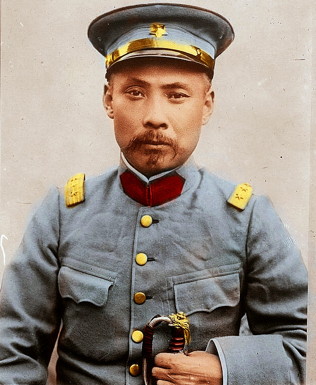
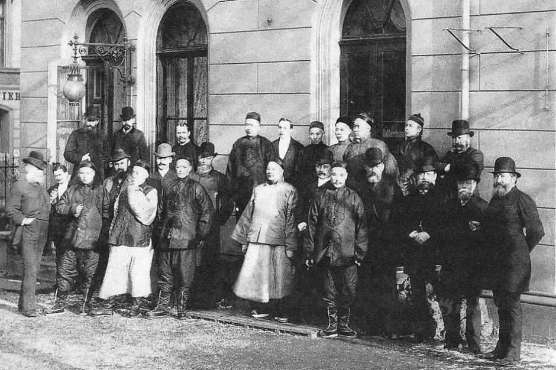
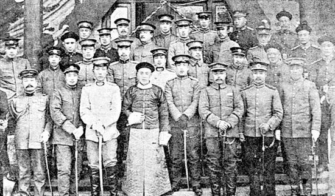
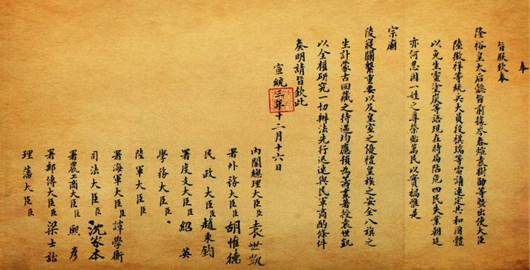
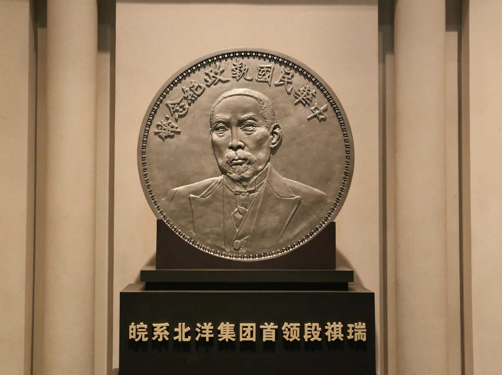
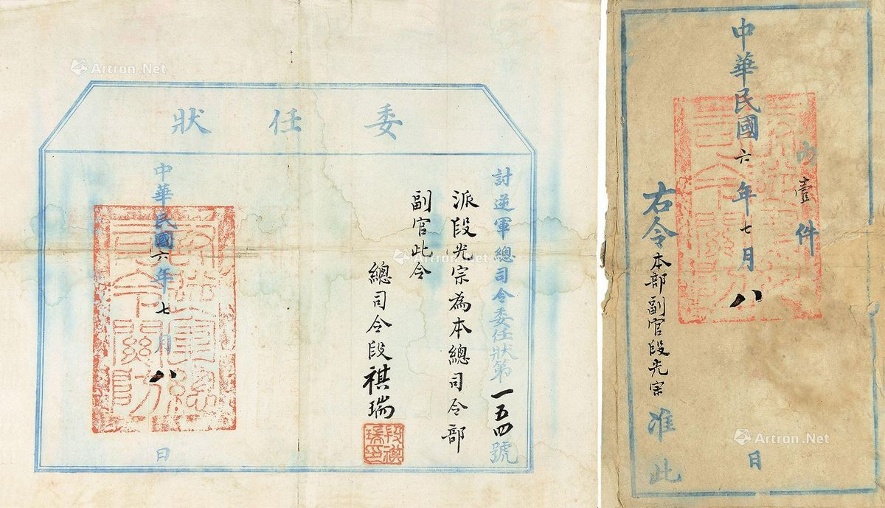

## nnnn姓名（资料）

### 成就特点

- ​
- ​

### 生平

【1936年11月2日】81年前的今天，借日本钱不还，3年当3次总理的段祺瑞逝世

【留学德国的炮兵手】

1865年3月6日，段祺瑞出生于今安徽合肥肥西县。祖父和叔父都是淮军将领，与李鸿章同乡。1885年（20岁），考入李鸿章创设的天津武备学堂，习炮兵科。1889年毕业后，派往德国柏林陆军学院留学。

1890年（25岁），回国。1891年，在威海随营武备学堂，担任教习兼炮兵统带，曾参加中日甲午战争中的威海卫之战。北洋舰队全灭后，1895年12月段祺瑞追随袁世凯，到小站练兵，担任炮兵队统带兼随营学堂监督，成为袁世凯的亲信。

（1890年，中国留学生与德国克虏伯公司人员合影，前排右五为段祺瑞）

【北洋三杰的猛虎】

1901年（36岁），段祺瑞升任武卫右军各学堂总办，因袁世凯升任直隶总督兼北洋大臣，武卫右军更名常备军，移驻保定；1902年6月，段祺瑞升任北洋军政司参谋处总办，负责北洋新军所有编装、训练任务。

1903年10月，清朝政府决定设立练兵处统辖新军训练，因袁世凯推荐，段祺瑞升任练兵处军令司正使；此时王士珍、段祺瑞与冯国璋并称为“北洋三杰”（亦被称为龙、虎、狗）。段祺瑞在北洋军系影响力就是基于他长期主掌军队训练形成的。

【上书逼宣统退位】

1909年1月（44岁），袁世凯一度失势，遭清政府下令回家乡，袁世凯临别前将北京私宅赠与段祺瑞。

1911年，武昌起义爆发后，清朝政府重新启用袁世凯。10月25日，段祺瑞任湖广总督和清军第二军军统，与第一军（军统冯国璋）南下一同清剿革命。不久冯国璋攻克武汉，12月段祺瑞率军退出汉阳，开始南北议和。1912年1月，段祺瑞领衔北洋将领46人上书，要求共和，成功迫使宣统退位。

【反对袁世凯称帝】
1912年3月10日（47岁），袁世凯出任中华民国临时大总统，段祺瑞同时出任陆军总长。1913年7月，段祺瑞一度代理国务总理，调兵镇压二次革命；后任湖北都督兼领河南都督，镇压白朗起义。

1914年2月，袁世凯段祺瑞召回北京述职，两个都督的位置被夺，改任陆军总长。段祺瑞非常不满。1915年5月，袁世凯与日本“二十一条”，段祺瑞告病辞职，赴西山养病。

1915年底，袁世凯推行洪宪帝制，段祺瑞表示不拥护。1916年3月，袁世凯被迫取消帝制，恢复共和制，段祺瑞回任参谋总长兼陆军总长。

（袁世凯时内阁，后排左三为段祺瑞）

【击败张勋复辟，三造共和】

1916年6月（51岁），袁世凯病逝，黎元洪接任大总统，段祺瑞担任国务总理，之后段祺瑞成为北洋皖系领袖。1917年5月23日，与黎元洪因参与第一次世界大战问题引发府院之争。

1917年，辫帅张勋以调停"府院之争"为名，率兵进入北京，于7月1日与康有为拥溥仪复辟。12日，段祺瑞的“讨逆军”将张勋击败。

【3年3次当总理】

段祺瑞再任国务总理，继续组阁。然而，才几个月，与继任的冯国璋总统，就解决南北分裂，统一中国的方式问题，两人发生第二次府院之争，于1917年11月22日辞职。

1918年3月（53岁），复职，第三次任国务总理。10月1，冯国璋总统的任期届满，安福国会选举徐世昌为大总统。段祺瑞与冯国璋约定共同下野。其实，段祺瑞通过安福系继续在幕后操纵政权。1920年7月，在直皖战争中失败，退隐天津。

【不打算还的借款】

1917年7月，段祺瑞重任中华民国国务总理后，为推行“武力统一”政策，镇压孙中山倡导的护法运动，向日本大量借款1.45亿日元。借款的抵押物包括中国山东和东北地区的铁路、矿产、森林等。借款所得款项，用于财政性支出占65.22%，军费占总支出占25.40%，政府财政压力得到缓解。

1925年，国民政府成立后，以“贿选总统之下的北京政府所借的外债，概不负责偿还”而停付本息，日方因此血本无归，日本政府被迫发行债券以救济日本兴业银行。日本国内指责该项借款实乃卖国之举。

【使日本进入东北的协定】

1918年5月，日本与段祺瑞政府，秘密签订《中日陆军共同防敌军事协定》、《中日海军共同防敌军事协定》。“协定”的主要内容是：中国与日本采取“共同防敌”的行动；日本在战争期间可以进驻中国境内；日军在中国境外作战时，中国应派兵声援；作战期间，两国互相供给军器和军需品。

通过“协定”，日本派出大批军队进入中国东北，日本迅速取代了沙俄在东三省北部的侵略地位，中国则面临沦为日本附属国的局面。不过当时许多中国人的判断是：日本比俄国更好。

【潜心佛学的国家元首】

1924年10月23日（59岁），冯玉祥发动北京政变，推翻大总统曹锟，先邀请孙中山北上，后与奉系妥协，请段祺瑞出山，任中华民国临时政府的临时执政（国家元首）。

1926年3月18日，发生了北洋政府镇压北京学生运动的三·一八惨案。同年4月9日，段祺瑞被冯玉祥驱逐下台，退居天津日租界，潜心佛学，自号“正道居士”。1931年，九一八事变后，拒绝与日本人往来。

1933年2月（68岁），段祺瑞移居上海。1935年，被任命为国民政府委员，但没有就职。1936年11月2日，在上海病逝，葬于万安公墓，享年71岁。

【三造共和的英雄】

段祺瑞因致电要求清帝退位、抵制洪宪帝制和讨伐张勋复辟这三件事，有“三造共和”的美誉。

段临终遗言有“八勿”，即：“勿因我见而轻起政争，勿尚空谈而不顾实践，勿兴不急之务而浪用民财，勿信过激言行之说而自摇邦本。讲外交者，勿忘巩固国防；司教育者，勿忘保存国粹；治家者，勿弃国有之礼教；求学者，勿鹜时尚之纷华。”

1924年3月，北京大学纪念25周年活动中，大学生进行国内大人物票选，段祺瑞与胡适同居第四名，前三名为孙中山、陈独秀和蔡元培。

