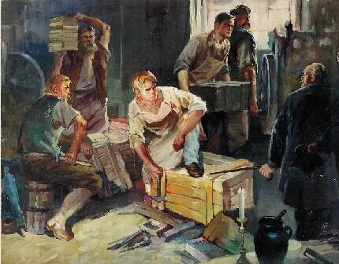
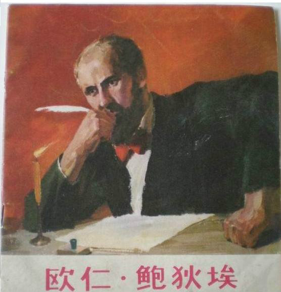
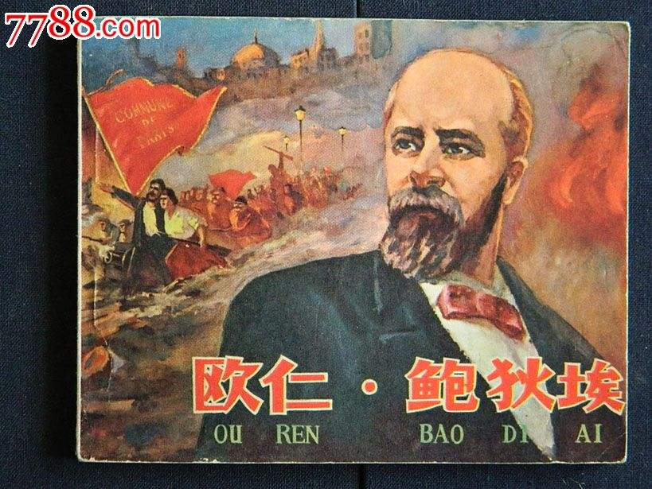
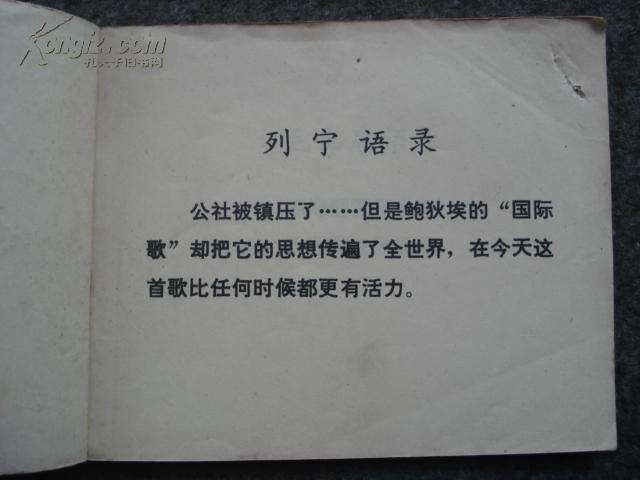

## nnnn姓名（资料）

适合所有人的历史读物。每天了解一个历史人物、积累一点历史知识。三观端正，绝不戏说，欢迎留言。  

### 成就特点

- ​
- ​

### 生平

【1887年11月6日】130年前的今天，中华苏维埃的国歌《国际歌》的作者鲍狄埃逝世

【年轻的工人诗神】

1816年10月4日，鲍狄埃出身于巴黎的一个工人家庭。13岁当童工，后来又当绘制印花布图样的技工，一生过着贫困的生活。

1830年，巴黎人民起来反对波旁王朝的统治，建立了七月王朝。14岁的鲍狄埃，伴随着革命的枪声，写下这次斗争的诗篇——《自由万岁》，开始了自己的创作。1831年，他将《自由万岁》等15首政治诗汇成诗集《年轻的诗神》出版。

【该拆掉的老房子】

1840年（24岁），鲍狄埃创作了《是人各一份的时候了》，体现出平均共产主义思想。1848年（32岁），鲍狄埃参加了二月起义，推翻了七月王朝，并写了《人民》一诗。诗篇描绘了参加武装斗争的工人，表达了他们“不自由，毋宁死”的决心。

二月起义后建立的第二共和国，并不是工人所要求的“劳动共和国”或“社会共和国”。鲍狄埃创作了《该拆掉的老房子》，撕去了共和国骗人的假面具，揭示出他依然是个充满阶级压迫、阶级剥削的资产阶级国家。

6月，巴黎工人又举行了起义，鲍狄埃也参加了。然而起义失败了，鲍狄埃写下诗歌《一八四八年六月》，表达了劳动群众对资产阶级血腥镇压的愤懑与抗议。

【谁将为她复仇？】

1851年12月2日（35岁），路易·波拿巴发动反动政变，埋葬了共和国，建立了法国历史上的第二帝国。在政变后的第三天，鲍狄埃写下了《谁将为她复仇？》，对君主制的复辟表示愤慨。

1865年（49岁），鲍狄埃加入第一国际巴黎支部。第二帝国垮台后，他在《1870年10月31日》一诗中提出“快成立红色的公社”的口号。他被推选为巴黎工人协会联合代表，成为工人运动的活动家。

【巴黎公社的英特纳雄耐尔】

1871年3月，法国巴黎公社革命爆发了，巴黎工人建立了第一个无产阶级政权。在巴黎公社进行革命斗争的72天中，鲍狄埃奋不顾身地投入战斗。他被人们称誉为“最热情的公社委员之一”。在5月“流血周”中，鲍狄埃右手残废，仍坚持战斗，为保卫公社直战斗最后一天。巴黎公社被失败了。

1871年6月，鲍狄埃躲过敌人的搜捕，在郊区小巷一所老房子的阁楼上怀着满腔热血和悲痛，用战斗的笔写下了震撼寰宇的宏伟诗篇：一首诗名为《英特纳雄耐尔（Internationale）》的不朽的无产阶级战歌，即《国际歌》。

【流亡国外的死刑犯】

1871至1880年，鲍狄埃被凡尔赛法庭缺席判处死刑，他只好流亡国外，先后在英国、美国流亡近10年。在这个时期，他以纪念公社、揭露资本主义制度、反映无产阶级的苦难和斗争为中心题材，创作《白色恐怖》《美国工人致法国工人》《巴黎公社》等大量革命诗篇。

1880年（64岁），大赦后回国，参加了法国工人党。1887年（71岁），出版了《革命歌集》，其中包括《国际歌》，是国际歌第一次公开发表。

1887年11月6日，在贫困中逝世，葬于巴黎拉雪兹公墓。

【走向国际的国际歌】

1888年6月，法国工人党里尔支部负责人，要求家具制作工人皮埃尔·狄盖特，从《革命歌集》中选一首谱曲。狄盖特选中了《国际歌》。6月23日，在卖报工人纪念会上第一次演唱。一首表达无产阶级革命意志，庄严雄伟，气势磅礴的《国际歌》就诞生了。

1894年，《国际歌》公开出版，不久被翻译成世界上的许多种语言，传遍了全球。它曾经被第一国际和第二国际选为会歌。

1917年，十月革命后，苏维埃政府决定以俄文版的《国际歌》作为苏联的代国歌。直到1944年卫国战争中，才选择了《牢不可破的联盟》，取代《国际歌》作为苏联的国歌。

【中华苏维埃的国歌】

《国际歌》最早是由耿济之和郑振铎于1921年首次从俄文译成中文，后经瞿秋白改编配曲而成，最后瞿秋白唱着此歌走向刑场。此开始在中国流传，1926年，国民革命军第三军政治部曾经印行《国际歌》传单。

1931年，中华苏维埃共和国成立时，决定以《国际歌》为国歌。《国际歌》对中国共产党影响很大。按照传统，每次中国共产党的重大活动结束时，都会演奏《国际歌》。

2005年9月3日，在北京举行的纪念中国人民抗日战争暨世界反法西斯战争胜利60周年大会结束时奏响《国际歌》。2006年10月22日，在中国工农红军长征胜利70周年大会结束时也演奏了《国际歌》。

