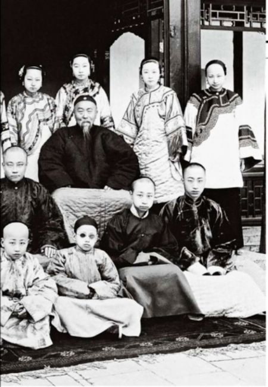
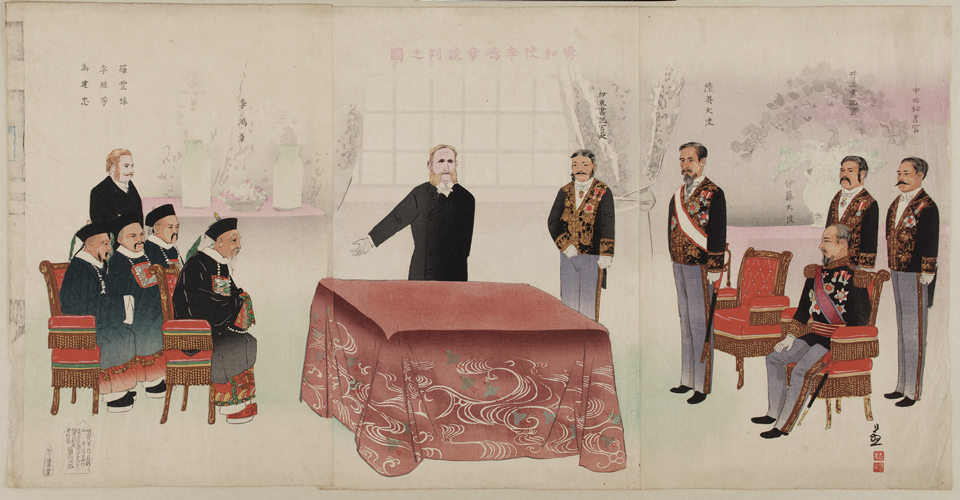
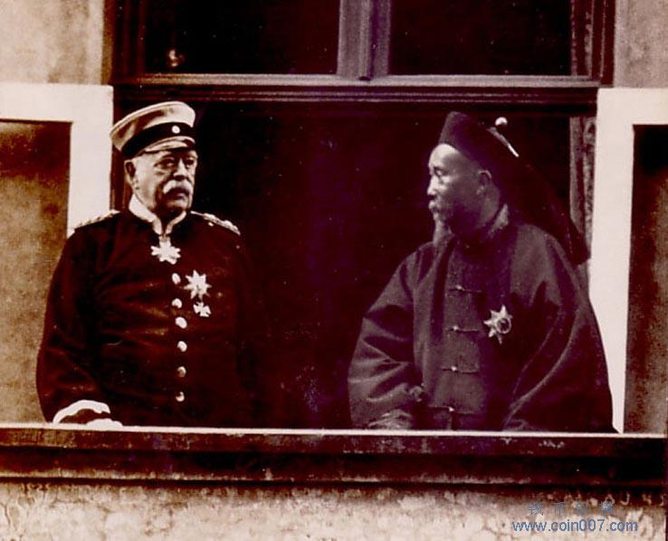

## nnnn姓名（资料）

适合所有人的历史读物。每天了解一个历史人物、积累一点历史知识。三观端正，绝不戏说，欢迎留言。  

### 成就特点

- ​
- ​

### 生平

【1901年11月7日】116年前的今天，中兴名臣李鸿章在辛丑条约上签字后黯然离世

【考中进士的官宦子弟】

1823年2月15日，李鸿章出生于今安徽合肥市瑶海区。父亲为京官，李鸿章兄弟六人，后来都非富即贵。

1844年（21岁），李鸿章到北京，参加中顺天府的乡试，中举人，会试落第，在曾国藩府补习。1847年（24岁），考中进士，选入翰林院任庶吉士。三年后翰林院散馆，获留馆任编修。

（李鸿章与家人的合影）

【潜入上海的淮军】

1851年（28岁），太平天国起义爆发。1853年，李鸿章受命回安徽办团练，多次领兵与太平军作战，官封道台。1858年（35岁），李鸿章入曾国藩幕府，负责起草文书。1860年（37岁），湘军占领安庆后，李鸿章奉命回合肥，招募兵勇。

1862年（39岁），编成淮勇五营。曾国藩命淮勇乘英国轮船，通过太平天国控制的南京长江，抵达上海，自成一军，是为淮军。在曾国藩推荐下，李鸿章任江苏巡抚，开始大力扩军。淮军在2年内，由6千多人增至六、七万人，成为清军中装备精良、战斗力较强的一支地方武装。

【红极一时的中兴名臣】

李鸿章率领淮军，同外国雇佣军、湘军一起包围太平天国。1864年（41岁），太平天国被剿灭，接着李鸿章又参与平定了捻军叛乱，因此被誉为“中兴名臣”。此后，李鸿章出任直隶总督，后又兼北洋通商大臣，授文华殿大学士，成为同治、光绪两朝的重臣，红极一时。

李鸿章主持筹办洋务运动。1865年，成立江南制造总局。1873年（50岁），成立轮船招商局。这是中国最早的一批西式军工企业，影响巨大。李鸿章也建立了中国第一支西式海军：北洋水师。

（1871年的李鸿章）

【一败涂地的甲午战争】

1895年（72岁），中日甲午战争中，陆军叶志超临阵脱逃、海军丁汝昌“只识弓马”，北洋舰队丧师黄海，一败涂地。

当时人认为，纷纷指责李鸿章，认为他应对甲午战败负责。然而客观上，淮军主力部队全都派上战场，并且损失惨重，实在是双方实力悬殊。梁启超认为：“李之失机之处多矣，然不失机亦绝无可胜之理”。

（签订《马关条约》场景）

【不愿签名的马关条约】

1895年3月24日，李鸿章在日本商讨马关条约时，被刺客小山丰太郎开枪击中左面，血染官服，当场昏倒。幸好子弹未击中要害，李鸿章得到护理后，得以恢复。小山丰太郎被捕后供认，他是日本“神刀馆”的成员，不希望清日停战，希望刺杀李鸿章，挑起中日之间的进一步矛盾，战争到底。

最后李鸿章被逼签订《马关条约》，割让台湾、澎湖及辽东半岛并赔偿二万万两白银，李鸿章因此背上卖国贼罪名。在条约上签字的时候，李鸿章故意把自己的名字连在一起，难以辨认，看起来就像是一个“肃”字。

（马关条约上李鸿章的签名）

【环游世界的元首待遇】

1896年（73岁），他环游欧美各国，出访俄国、德国、比利时、法国、英国、美国等，所到之处受到当地元首接待。4月30日，参加尼古拉二世的加冕典礼。6月14日，晋见了德皇威廉二世。6月27日，拜访了已退休的铁血宰相俾斯麦。

在德国期间，他还使用问世仅7个月的伦琴射线（X光）拍照遇刺的伤口。李鸿章亲眼在一张胶片上看见了日本制造的铅弹镶嵌在他左眼下的骨头上，他为这项技术取名为“照骨术”。李鸿章是第一位照X光的中国人。

据说李鸿章曾立誓“终身不履日土”。环游结束，返华途中，经横滨港换乘轮船，他命人在两船之间搭木板而行，终不违当日之誓。为了对付日本，李鸿章力主拉拢俄国，与沙皇俄国签署《中俄密约》。

（李鸿章拜访铁血宰相俾麦斯）

【不如去死的辛丑条约】

1898年10月（75岁），任两广总督。1900年，八国联军进军北京，李鸿章与两江总督刘坤一、湖广总督张之洞等协议东南互保，甚至与革命党人接触，谋图新政局。

光绪、慈禧抵达西安后，多次敦促李鸿章北上收拾残局。李鸿章不得已到北京，全无谈判筹码，在各国严厉要求之下，终于在1901年基本按照各国所提条件签订了《辛丑条约》。

1901年11月7日（78岁），李鸿章心力交瘁，签约不久便即去世。据传李鸿章重病弥留之际，俄国公使还逼他在条款上签字，景况堪怜。

（1900年，李鸿章抵达英国驻华使馆的情景）

【备极哀荣的晚清名臣】

慈禧与光绪得到消息后，痛哭失声。给李鸿章，赠太傅，晋一等肃毅侯，谥文忠。在原籍和立功的省份，建祠十处，并在北京建祠。清代汉人官员北京建祠者，仅此一人。

李鸿章一生共签下30多个条约，大多为不平等条约。他与曾国藩、左宗棠、张之洞，并称“晚清四大名臣”。

