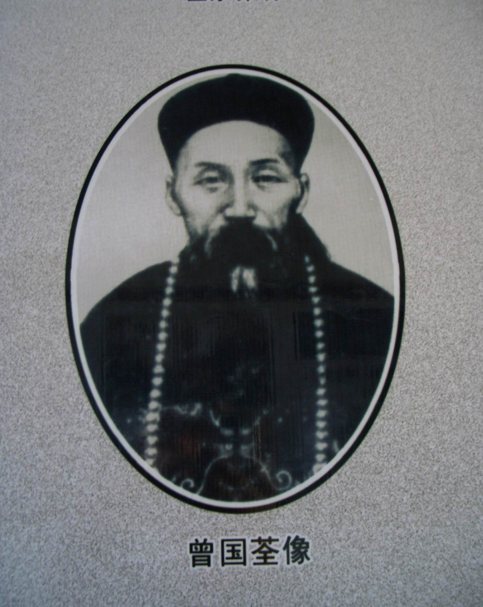
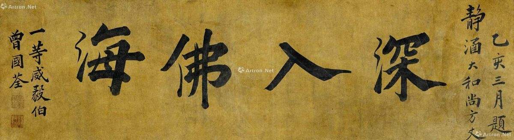
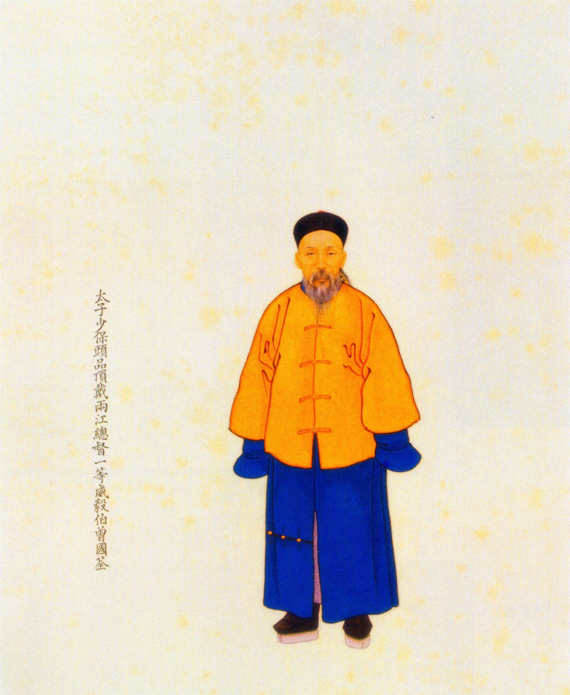
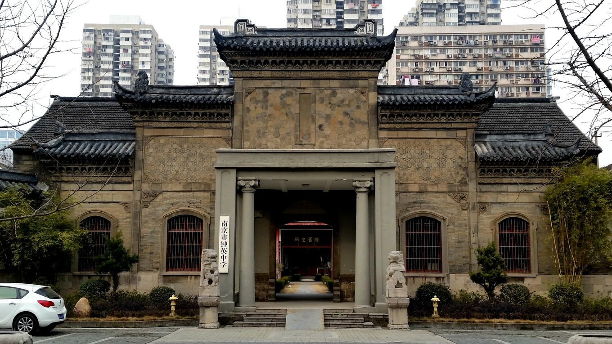

## nnnn姓名（资料）

适合所有人的历史读物。每天了解一个历史人物、积累一点历史知识。三观端正，绝不戏说，欢迎留言。  

### 成就特点

- 曾国藩的九弟，湘军内部称之为曾老九，尊称为九帅。
- 因善于围城，又精于长壕法，人称曾铁桶。
- 在南京滥杀百姓无数，与其兄被称为曾剃头、曾屠户。
- 安庆杀降、南京屠城；是为湘军版的“南京大屠杀”
- 南京抢得大量财物

### 生平

【1890年11月13日】127年前的今天，制造湘军南京大屠杀的曾国荃死于南京

【为救哥哥投笔从戎】

1824年10月12日，曾国荃出生于湖南湘乡，是名臣曾国藩的九弟，两人相差13岁，因此在湘军中被称为曾老九，或尊称为九帅。他早年屡试不第，16岁到北京，跟随曾国藩学习两年。1852年（28岁），方成为优贡生。

1856年（32岁），曾国藩率领的湘军在江西湖口惨败，被太平军围困在南昌，处境十分险恶。曾国荃从湖南招募兵勇3000人，增援江西吉安。第二年攻破吉安，部队称为吉字营，是曾国藩的嫡系部队。

【包围安庆的曾铁桶】

1857年2月（33岁），父亲去世，曾国荃和曾国藩一同回湖南奔丧。幸好此前，太平天国发生了天京事变，无力反击。10月，在江西巡抚的保奏下，曾国荃重新得到起用。1859年5月，在景德镇三战三捷，攻克浮梁，因功升道员。

1860年5月（36岁），曾国荃率军对已被太平军占领了9年的军事要镇安庆进行围攻。曾国荃采取挖壕筑垒的战略，实行长围久困，因此有“曾铁桶”的外号。

【屠杀安庆的曾剃头】

1860年7月，曾国荃和湘军水师互相配合，将太平天国的十八垒全部攻破，太平军8千官兵全部被杀。这段时间了，战争非常激烈、残酷，屠戮惨重。此后，曾国荃每次攻下一个大城市，总要请假回家，置田盖房，归隐一阵子。

1861年9月5日，曾国荃用炸药轰倒了城墙，湘军蜂拥而入，城内太平军由于饥饿，已拿不动刀枪，16000余官兵全部投降。随后，曾国荃将1万多人全部砍头，因此被人称为“曾剃头”。曾国荃因功加布政使衔，赏穿黄马褂，赏“伟勇巴图鲁”名号。

【湘军版的南京大屠杀】

曾国荃率军不断推进，1862年年5月31日，在天京城南门外的雨花台扎下营寨。曾国荃在天京城外深挖壕沟，广筑防御工事。这时，军中开始蔓延瘟疫，湘军元气大伤。曾国荃在极为艰难困苦的条件下，以寡敌众，连战连捷，屡次击退太平军的反扑，天京城外所有的战略据点。

1864年7月（40岁），攻陷天京，擒获洪仁达、李秀成等大小头目三千人，曾国荃火烧南京城，纵兵焚烧抢掠7天7夜，滥杀百姓无数，被称为湘军版的南京大屠杀。曾国荃因功赏太子少保衔，封一等威毅伯。

【死在南京的“刽子手”】

1866年（42岁），曾国荃起任湖北巡抚。1867年，与李鸿章一同分进合击捻军。曾国荃因镇压捻军作战失败，称病退职。

1875年（51岁），重出官场，历任陕西、山西巡抚，任两广总督。1884年（60岁），任两江总督，到南京就任。1890年9月，在南京病卒于任上，终年66岁。谥“忠襄”，入祀北京昭忠祠、聚良祠，并在湘乡、南京建立专祠。

