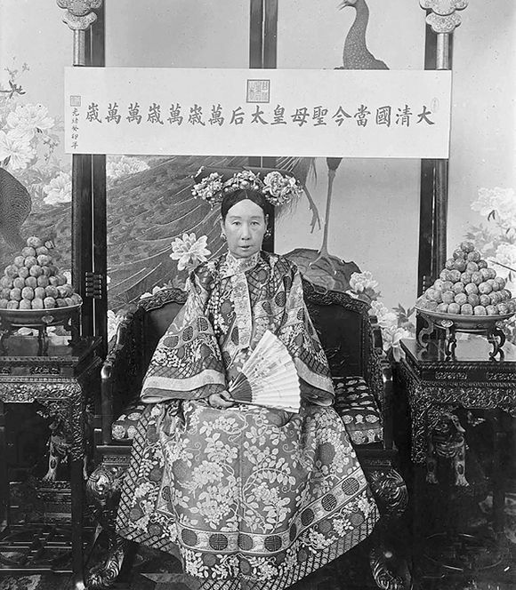
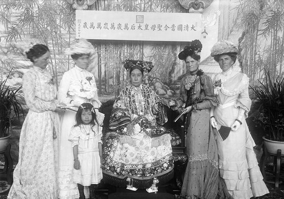
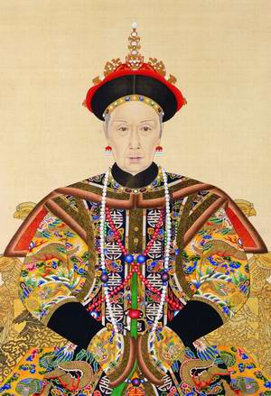
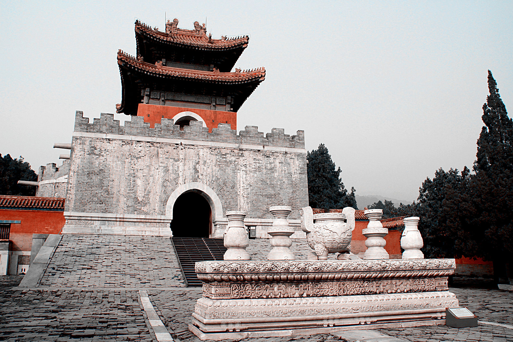
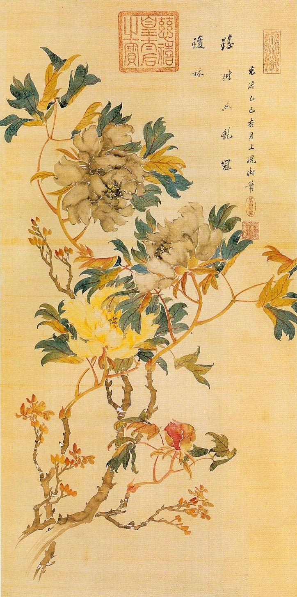

## nnnn姓名（资料）

适合所有人的历史读物。每天了解一个历史人物、积累一点历史知识。三观端正，绝不戏说，欢迎留言。  

### 成就特点

- ​
- ​

### 生平

【】

【1908年11月15日】109年前的今天，敢于政变、勇于改革、统治清朝47年的慈禧太后去世

【选中秀女的懿贵人】

1835年11月29日，慈禧出生，父亲为镶蓝旗的满族贵族。一般称慈禧为叶赫那拉氏，但早期诏书只称那拉氏，可见她并非真正出自叶赫一族。

1852年（17岁），咸丰皇帝选秀女，慈禧被选中，封为懿贵人。同年，太平天国起义，攻克天京。慈禧的父亲正在芜湖任职，临阵逃脱，被罢免。第二年，在镇江病逝。

（慈禧的书法）

【仅次于皇后的懿贵妃】

1854年（19岁），慈禧晋封为懿嫔。不久，慈禧怀孕。1856年，生下皇长子载淳，得以晋封懿妃。1857年，又晋封为懿贵妃。贵妃在清宫妃嫔中属第三等，仅次于皇后和皇贵妃。但咸丰帝只有一个皇后，从未曾册封皇贵妃。

与其他嫔妃相较，慈禧具有较高水准的文化修养，能书写汉文，擅于书法与绘画。咸丰帝体弱多病，又值多事之秋，慈禧逐渐参与政治。慈禧所生的皇长子载淳，是咸丰帝唯一活下来的儿子，使得慈禧的地位更加显贵。

（慈禧的绘画）

【两个人的垂帘听政】

1860（25岁），英法联军攻入北京，火烧圆明园，咸丰帝逃往热河避暑山庄避难。1861年，年仅30岁咸丰帝在避暑山庄驾崩。临终前，咸丰任命“顾命八大臣”辅佐载淳继位。慈禧被加封为“圣母皇太后”尊号为慈禧，因住在烟波致爽殿的西暖阁，被称为“西宫太后”。咸丰的皇后，则尊号慈安，称“东宫太后”。

运回咸丰帝的灵柩时，慈禧与恭亲王奕䜣密谋，抢先一步回到北京，发动辛酉政变，铲除了八大臣。慈禧、慈安两位太后，在养心殿垂帘听政，改年号为同治。此后，慈禧天天召见恭亲王、军机大臣等讨论国事，开始了洋务运动。

（绘画：慈禧）

【一个人的垂帘听政】

两宫太后重用曾国藩、左宗棠、李鸿章等汉族官员，分别于1864年和1868年成功消灭了太平军和捻军。1872年、1873年，又成功镇压云南回变和陕甘回变。清朝混乱的局势逐渐趋于稳定，史称同光中兴。

1873年（38岁），两宫太后归政于同治帝。才1年多，1875年，同治帝就驾崩了。慈禧将亲妹妹和醇亲王的儿子，继给咸丰帝，继承皇位，是为光绪帝。慈禧和慈安再度垂帘听政。1881年（46岁），慈安太后逝世，慈禧独自垂帘听政。

（慈禧肖像，荷兰画家胡博·华士绘）

【没有挪用海军经费】

1895年（60岁），甲午战争爆发，清朝战败，北洋水师全军覆没，被迫签订《马关条约》，将台湾和澎湖割让给日本。普遍流传说慈禧挪用海军经费修筑颐和园，过60大寿，导致军备不足而战败。然而颐和园工程所挪用的“海军”经费，出自总理海军事务衙门，和北洋水师军费并无关系。

海军衙门是清朝一个特别的中央机构，虽冠以海军之名，但与北洋水师并无关联，只是为了分散总理衙门的权力。在修建颐和园时期，北洋水师的军费并没有受到侵占。因此，颐和园工程实际上是以海军名义敛财，却并非直接挪用了海军的经费。

【试图谋杀的维新变法】

1898年（63岁），光绪帝在康有为、梁启超等人的鼓动下，发起改革。而帝党和太后党的矛盾越来越尖锐，康有为等人竟有谋杀慈禧的计划。

9月19日，得到消息的慈禧，突然离开颐和园，回到紫禁城，将光绪帝迁居瀛台。随后，戊戌六君子被斩首，康有为、梁启超则流亡国外，维新变法失败。

【下罪己诏的义和团运动】

此后，慈禧将端王载漪的儿子立为大阿哥，试图撤换光绪皇帝，但由于欧美列强对光绪的支持，不敢骤废。载漪为求其子早日登基，纵容义和拳大举进入直隶、进迫北京，形成“逼宫”的形势。

1900年（65岁），八国联军进入北京。慈禧携光绪帝经过宣化、大同、太原，逃到西安。慈禧派庆亲王奕劻和李鸿章与西方列强议和，签订了《辛丑条约》。慈禧和光绪帝都下罪己诏。端王载漪失势，儿子的大阿哥头衔也被废除。

【庚子新政的全面改革】

《辛丑条约》签订之后，慈禧重新下令改革，是为庚子新政。这次改革比戊戌变法更广更深，实行千年之久的科举制度也被废除。并决定效仿日本，实行君主立宪制，下令“预备立宪”，又派五大臣前往西方列国考察。

1908年11月15日下午5时（73岁），慈禧于仪銮殿（佛照楼）驾崩。就在她死的前一天，光绪帝也在瀛台突然病逝，民间普遍传闻光绪帝是被慈禧毒死的。慈禧的遗言是：“此后，女人不可预闻国政。此与本朝家法相违，必须严加限制。尤须严防，不得令太监擅权。明末之事，可为殷鉴！”

（慈禧太后朝服像）

【被洗劫一空的陵墓】

由于光绪帝无嗣，慈禧让醇亲王载沣的儿子溥仪过继给光绪帝，并登基，是为宣统帝。因溥仪年幼，由载沣担任摄政王，慈禧的侄女隆裕太后则以光绪帝皇后的身份垂帘听政。

慈禧太后是自同治、光绪年间大清帝国的实际统治者，其掌权时间长达47年。死后谥号为“孝钦慈禧端佑康颐昭豫莊诚寿恭钦献崇熙配天兴圣显皇后”，长度为大清皇后之最。在慈禧太后死后4年，清朝覆灭，中华民国成立。

慈禧死后，葬于菩陀峪定东陵，营建过程前后持续了14年，耗银227万两，金碧辉煌、极尽奢华。1928年6月，军阀孙殿英以演习为名，将定东陵内的珍宝洗劫一空，轰动全国。

（定东陵明楼）

### 照片

