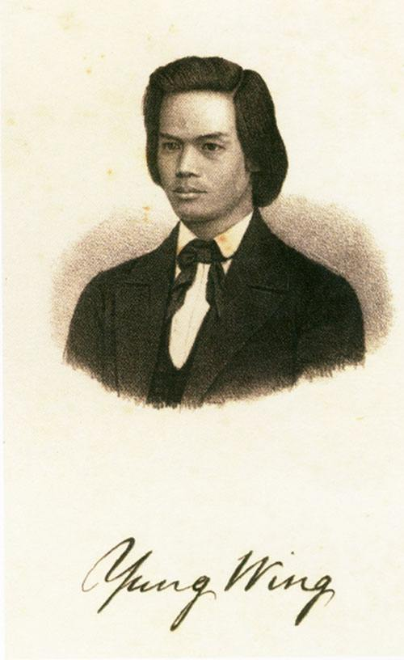
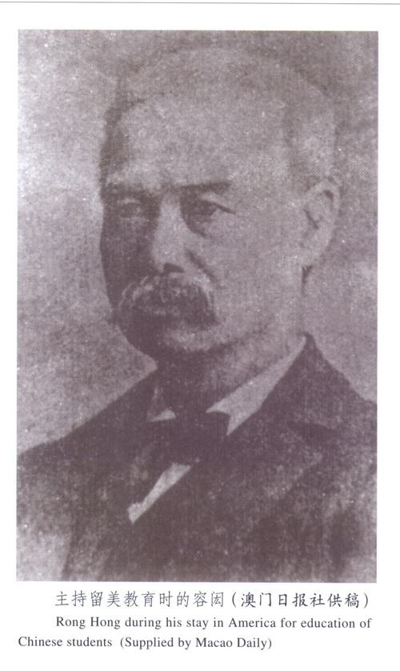

## nnnn姓名（资料）

适合所有人的历史读物。每天了解一个历史人物、积累一点历史知识。三观端正，绝不戏说，欢迎留言。  

### 成就特点

- ​
- ​

### 生平

【1828年11月17日】189年前的今天，为中国倾注一生的留学生之父容闳出生

【第一个留学美国的中国人】

1828年11月17日，容闳出生于广东香山，今珠海市南屏镇。7岁时，跟随父亲前往澳门入读马礼逊纪念学校。1839年（11岁），鸦片战争前夕，中英交恶，学校解散，容闳回乡。父亲在不久后去世。

1841年（13岁），美国教育家勃朗牧师抵达澳门，马礼逊纪念学校重新复课。1842年，香港割让英国，学校迁往香港。1847年（19岁），勃朗牧师返回美国，带容闳等三人到美国留学，但只有容闳一人最终留在美国完成学业。

【拒绝太平天国的耶鲁人】

容闳赴美后于麻省的孟松预备学校就读，1850年毕业后考入耶鲁学院，是首位进入耶鲁的中国人。1852年（24岁），容闳入籍美国。1854年获文学士毕业，随后返回中国，曾在广州美国公使馆、香港高等审判厅、上海海关等处任职，后在上海宝顺洋行经营丝茶生意。

容闳曾到南京，与太平天国的洪仁玕会面，提出以西方文明引入中国的“治国七策”。洪秀全授予他一枚四等爵位的官印，但最后容闳拒绝赐封，选择了离开。

（容闳塑像）

【第一批留美幼童的促成者】

1870年（42岁），容闳倡议派幼童前往欧美留学，得到曾国藩、李鸿章的支持，成立“驻洋肄业局”。“肄业”是学习的意思。1872年起，120名幼童分批前往美国留学，容闳被任命为留美学生监督及清政府驻美副公使。

1881年（53岁），李鸿章本想让这批学生进入军校就读，但美国当时只允许日本人读军校；再加上留美学生沾染西洋风气，甚至归信基督教和剪辫；最终朝廷准奏，召回了大部分留学生。

这一批留学生返国后，对中国的现代化有不俗贡献。当中最著名的有外交官唐绍仪、中国铁路之父詹天佑、刘玉麟、周寿臣等。

【维新派幕后的总参谋长】

1883年（55岁），妻子病重，容闳回美国照顾。1886年，妻子病逝，容闳独自教养两个孩子。

1894年（66岁），中日甲午战争爆发，容闳应召远赴伦敦，向外国商借军费。1895年，他回到中国，定居上海，结识了康有为和梁启超等维新人士。他曾上奏设立国家银行，结果因盛宣怀干扰不了了之。

维新党人对容闳十分倚重，容闳也对维新运动的大小事务，积极参与。“保国会”成立的那一天，容闳亲自到场，年近70岁，比康有为年长30岁。他的住所成了党人聚集商议之地，俨然是维新派幕后的总参谋长。维新失败后，容闳先藏匿于上海租界数月，再辗转逃往香港。

【维新走向革命的转折点】

1900年3月（72岁），建立自立会，同时号召维新派、清军士兵、革命党、以及各会党人员参与。7月26日，在上海召开了中国议会，投票选出容闳为议长，严复为副议长，决定以自立会为基础成立自立军，在汉口、汉阳、安徽、江西、湖南等地同时起事，北上营救光绪皇帝，建立满人天子，汉族执政的君主立宪国家。

然而，由于没有得到康有为许诺的金钱资助、以及张之洞的背叛，致使事败，唐才常等12位起义领导人在汉口被捕斩首。这次“中国议会”与“自立军”的失败，使得维新党放弃了“君主立宪”的想法，走向革命，打造“民主共和”。这是中国革命在思想上的一次重大转折点。

【用生命见证革命的成果】

容闳经历了“太平天国”、“自强运动”、“戊戌维新”、与“君主立宪运动”，也最终投入革命。他亲身参加了三次起义计划。1901年至1903年，与兴中会、太平天国旧部密谋广州起义，拟建立大明顺天国；1909年，与两个美国人，提出中国红龙计划，打算筹款五百万美元，购买十万支枪和一亿发子弹，支持孙中山；1910年，参与长滩计划。

1911年，辛亥革命成功，孙中山请容闳归国。经过这么多年的奋斗，容闳终于亲身见证了中国革命的成果，但1912年4月21日，容闳于美国去世，享年84岁。

1998年，容闳诞辰170周年，耶鲁大学所在的美国康涅狄格州宣布，将9月22日（当年第一批中国幼童在美入学的日子），设为“容闳及中国留美幼童纪念日”。

