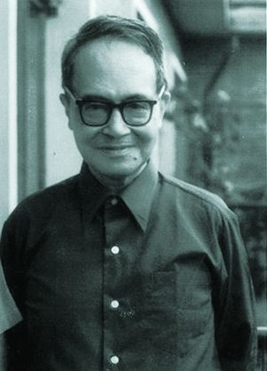
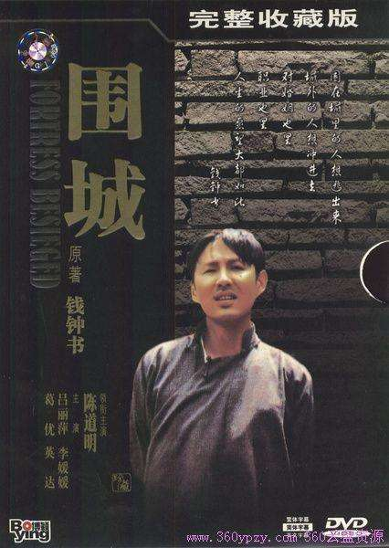

## nnnn姓名（资料）

适合所有人的历史读物。每天了解一个历史人物、积累一点历史知识。三观端正，绝不戏说，欢迎留言。  

### 成就特点

- ​
- ​

### 生平

【1910年11月21日】107年前的今天，数学15分上清华，一部《围城》说人生的钱锺书出生

，

【数学15分上清华】

1910年11月21日，钱锺书出生于江苏无锡。父亲是古文学家，幼年过继给伯父。6岁入学，不久大病一场，在家休养。10岁，进入前身为东林书院的东林小学，同年伯父去世。1923年毕业后，考入苏州桃坞中学。

1929年（19岁），钱锺书考上清华大学，数学只考了15分，但英文、中文俱佳，当时的校长罗家伦破格录取。当时任文学院院长、哲学系系主任的冯友兰曾说：钱锺书“不但英文好，中文也好，就连哲学也有特殊的见地，真是天才。”

【分数最高的公费留学生】

1933年夏（23岁），毕业于清华大学外文系，获文学学士，赴上海光华大学任教。1935年，与杨绛结婚，后考取第三届庚子赔款公费留学资格，名列榜首，平均分数87.95是史上最高。

钱锺书留学英国牛津大学埃克塞特学院，其间女儿钱瑗出生。1937年，获得文学学士学位，随后赴法国巴黎大学从事一年的研究。

【一去不能返的联大教授】

1938年9月（28岁），与杨绛乘法国邮船回国，被清华大学破例聘为教授，不久赴湖南蓝田的国立师范学院（西南联大）任英文系主任，月薪300元，开始《谈艺录》的写作。

1941年（31岁），钱锺书去上海探亲，恰逢珍珠港事件爆发，被困在上海，任教于震旦女子文理学校。1942年，《谈艺录》完稿，广受好评。文史家曹聚仁说：“读了钱锺书先生的《谈艺录》，才算懂得一点旧诗词。”书评家夏志清认为：“《谈艺录》是中国诗话里集大成的一部巨著。”

【最用心经营的小说】

1946年（46岁），钱锺书写成并发表了长篇小说《围城》。《围城》中成功塑造了一批特点鲜明的知识分子，这与他在西南联大的经历是有关系的。书评家夏志清先生认为《围城》是“中国近代文学中最有趣、最用心经营的小说，可能是最伟大的一部”。

“城外的人想冲进去，城里的人想逃出来”。“围城”淋漓尽致地表现了人类的困境：不断的追求和对所追求到的成功的随之而来的不满足和厌烦，两者之间的矛盾和转换，其间交织着的希望与失望，欢乐与痛苦，执著与动摇——这一切构成的人生万事。

【翻译毛泽东选集】

1949年（39岁），任清华大学外文系教授。1950年到1953年，钱锺书担任《毛泽东选集》英译委员会委员，花费了大量精力，几乎没有发表文章。1957年，钱锺书的《宋诗选注》出版。

1960年（50岁），钱锺书参加毛泽东诗词英译本的定稿工作。

【五七干校里的收发员】

1969年11月（59岁），下放至河南的“五七干校”，接受贫下中农再教育。1970年6月，女婿王德一（北师大历史系教师）被逼自杀。7月，杨绛也来干校。在“五七干校”，钱锺书一度担任过信件收发工作。

1972年3月回京，开始写作《管锥编》。1979年，其学术代表作《管锥编》完成，钱锺书不仅通过传统的训诂方法澄清了许多学术史上的公案，更在大量文献梳理与互证的基础上，作了大量精辟与独到的评论，被推为现代中国的文化批评大师。

【不举行仪式不留骨灰】

1979年，参加中国社会科学院代表团赴美国访问。1982年，任中国社会科学院副院长。1990年12月（80岁），电视连续剧《围城》在中央电视台播出，获得普遍好评。1997年3月4日，女儿钱瑗因患脊椎癌去世。

钱锺书晚年饱受多种疾病折磨，接受多次手术，左肾切除。1998年12月19日上午7时38分，病逝于北京医院，享年88岁。钱锺书临终遗言：“遗体只要两三个亲友送送，不举行任何仪式，恳辞花篮花圈，不留骨灰。”

【钱锺书不是钱钟书】

本名原写“錢鍾書”，后因《简化字总表》合并简化成了“钟”字，写成“钱钟书”。自《通用规范汉字表》于2013年颁布起，已将“鍾”字恢复并类推简化成“锺”字，因此最新规范以“钱锺书”为准。

妻子杨绛于2016年，以105岁高龄去世。

