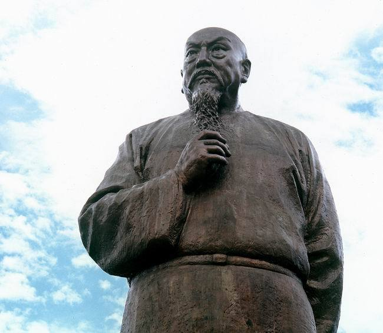
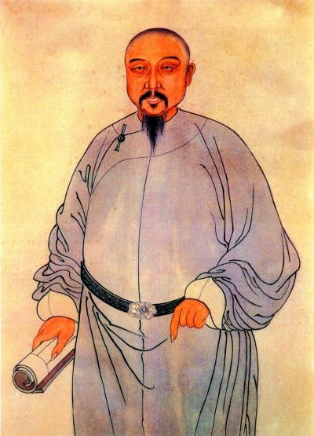
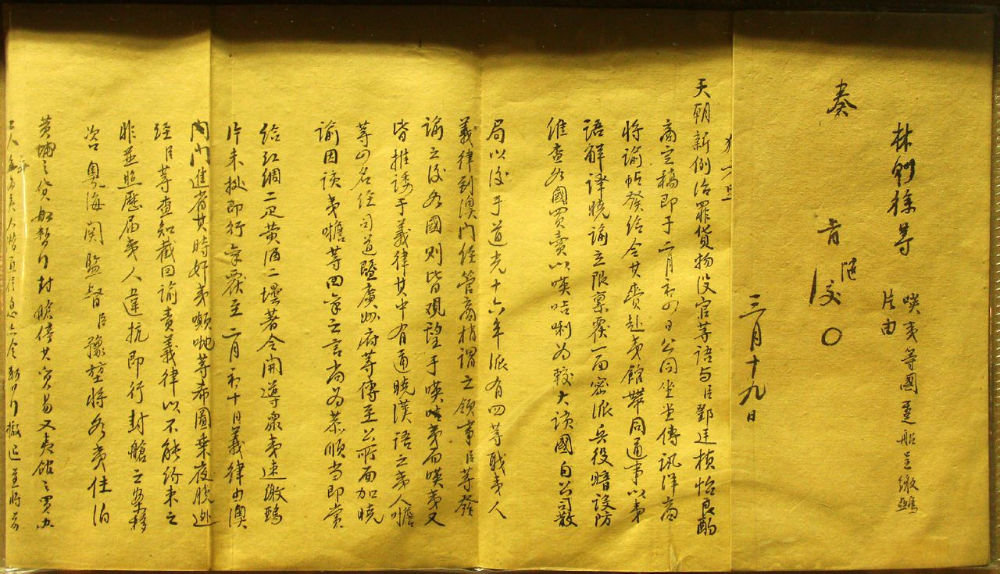
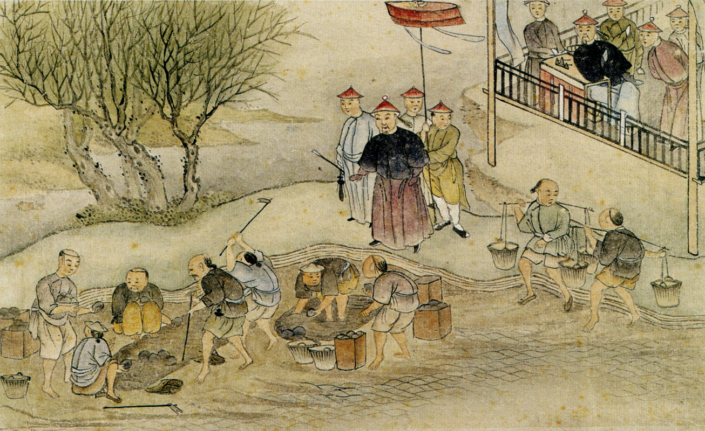
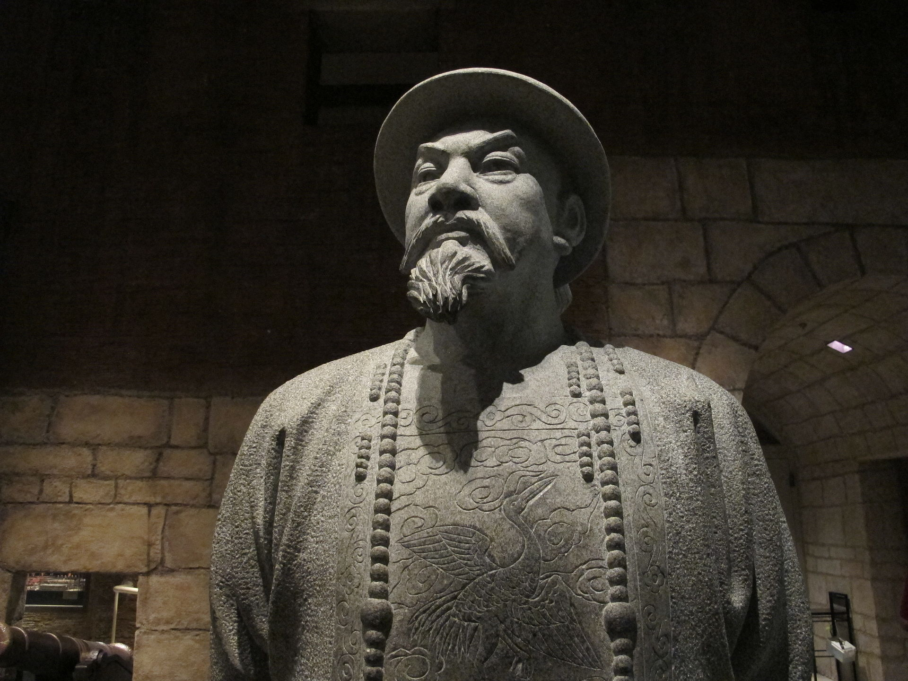

## nnnn姓名（资料）

适合所有人的历史读物。每天了解一个历史人物、积累一点历史知识。三观端正，绝不戏说，欢迎留言。  

### 成就特点

- ​
- ​

### 生平

【1850年11月22日】167年前的今天，引发鸦片战争、造福新疆的民族英雄林则徐逝世

【山登绝顶我为峰】

1785年8月30日，林则徐出生于今福建福州。父亲是秀才，当地的教书先生，共11个子女，家境寒苦。林则徐4岁起随父亲在私塾学习。9岁时，在学堂写出“海到无涯天作岸，山登绝顶我为峰”的诗句，震惊四座。14岁，林则徐考上秀才。

不久，进入福建的最高学府鳌峰书院学习。1804年（19岁），参加乡试中举人。年底，赴京师参加会试，名落孙山。1806年（21岁），林则徐担任厦门海防同知书记，专责处理商贩洋船来往、米粮兵饷的文书记录。得到福建巡抚张师诚赏识，招为幕僚。张师诚位极人臣，他的政治智慧和学问，对林则徐影响很大。

【父亲病危辞官而去】

1811年（26岁），林则徐终于考中进士，殿试高居第二甲第四名，从此踏上官宦之路。

1813年（28岁），林则徐入翰林院任庶吉士。在翰林院的7年里，他被派往不同地方工作，仍是微不足道的小京官。林则徐不善社交，但加入了由小京官组成的宣南诗社，结交黄爵滋、龚自珍、魏源等人。

1816年（31岁），林则徐离开翰林院，往江西南昌任考官。1820年，任江南道监察御史，河南南岸河堤缺口，引发大水灾。林则徐上奏河南巡抚琦善办事不力，遭到打击报复，因此对官场心生厌倦。1821年，父亲病危，林则徐以照顾父亲为由辞官而去。

【重返官场的林青天】

林则徐返回福州时，父亲已病愈，大家都反对林则徐辞官的决定，为他斡旋。正值道光皇帝刚继位，特地召见他，并破格恢复了职位，深受宠重。

1823年2月17日（38岁），林则徐担任江苏按察使，短短在任四个月内，就处理了江苏十之八九的积压案件，被称颂为“林青天”。他认为江苏风气败坏，全因鸦片害人，于是下令江苏禁烟。

【决心禁烟的钦差大臣】

1838年6月2日（53岁），道光帝要各地讨论鸦片问题。时任湖广总督的林则徐表态支持严禁鸦片，在湖北起获烟膏烟土1.2万余两。11月8日，琦善上奏称其在天津拿获鸦片13万两，促使道光帝下定决心禁烟。

1838年11月9日，道光帝令林则徐入京，在十四天内八次召见密谈。12月31日，林则徐被任命为钦差大臣，前往广东禁烟。

【雷厉风行的禁烟行动】

1839年3月10日（54岁），林则徐抵达广东，立即开展了雷厉风行的禁烟活动。他责成所有外国商人三日内交出全部鸦片，并签具结书，声明以后不贩鸦片，宣告：“若鸦片一日未绝，本大臣一日不回，誓与此事相始终，断无中止之理。”

烟商上交少量鸦片，想敷衍了事。3月24日，林则徐下令十三行内所有华人迁出，断绝通信，断水断粮。25日，下最后通牒:《示谕外商速交鸦片烟土四条稿》。28日，英国商务监督义律服从命令，劝告英商将鸦片交给他，然后再以英国政府的名义向清政府上交鸦片共20283箱。

5月12日，民间缴烟完毕，拘捕吸毒者、烟贩1600人，收缴烟膏46万两。5月18日，烟贩缴烟完毕，共收159187箱。6月3日，虎门销烟正式开始，林则徐采取了能够彻底销毁鸦片的“海水浸化法”。至6月20日，共销毁 237 万斤鸦片。

【一个渔民引发的战争】

1839年6月20日（54岁），渔民林维喜被英国人打死。义律以领事裁判权为由，私自开审凶手。林则徐依据《万国公法》，查明义律根本没有治外法权。8月12日，义律在英船上开庭，对五名凶手轻判罚金和监禁后，便送回英国监狱服刑，事后通知中国官方。

林则徐震怒，8月15日，下令封锁澳门，并勒令义律交出凶手。9月4日，九龙之战爆发。战后双方谈判，结果谈判破裂，义律把五名凶手送回英国。11月3日，穿鼻之战爆发。从此，中英贸易完全断绝。

1839年10月1日，英国政府召开内阁会议，决定“派遣一支舰队到中国海去”。

【第一次鸦片战争】

1840年1月5日（55岁），林则徐接任两广总督。6月22日，英国的远征军由义律堂兄懿律任海军统帅，军舰十六艘，士兵4000人正式集合。林则徐早有准备，于澳门、虎门、尖沙咀及内河要道设重兵驻守。但英军并无攻打广州之意，而是沿海岸北上。

8月11日，英军主力北上，驶到天津大沽口外，清廷罢免林则徐，改任琦善为两广总督，进行谈判。1841年1月20日，琦善与义律拟订《穿鼻草约》，草约的其中一项条款就是割让香港岛给英国。此事，引发地方官员的不满，琦善不敢签约。

1841年2月25日，英军进攻虎门，关天培以身殉国。随后英军北攻广州，乌涌炮台、潖州炮台、猎德炮台相继失陷。琦善被迫签字。道光帝得知香港岛被琦善私自割让，下令将琦善革职锁拿，押京治罪。

【战败被流放新疆】

1841年5月1日（56岁），林则徐调任浙江，负责浙东防务。不久，英军以死9人代价击败2万中国军队，签订《广州协定》，支付了600万银元的赎城费。林则徐承担战败罪责，革去四品官衔，遣戍新疆伊犁。

林则徐会见了魏源，把自己搜集的《四州志》以及有关的资料交给他，希望他编撰介绍西方情况的著作，这书就是后来的《海国图志》。

1841年7月14日，林则徐由镇海出发，前往新疆，途中因病在西安滞留2个月。1842年12月10日，终到伊犁惠远城。

【造福新疆的林公】

林则徐用4个月，修建成一条长六里，宽三丈的大水渠，即龙口新渠（今人民渠），足足运行123年。其间，林则徐改进推广了坎儿井，使得大片荒野变成沃土。林则徐又引进数以万计的树苗，绿化沙漠。此外，教当地民众制纺车织布。当地人称坎井为“林公井”、渠为“林公渠”、纺车为“林公车”、植林为“林公林”。

1844年（59岁），林则徐前往南疆勘荒，行程约三万余里。1845年10月，得以从新疆返回，先后任陕甘总督、陕西巡抚、云贵总督。1849年10月12日（64岁），正式卸任，返回原籍，过着平淡的生活。。

【谜一般三呼星斗南】

1850年，太平天国起事，咸丰帝再起用林则徐前去平事。可林则徐身体未康复，疝气不时发作。1850年11月22日，经福建到达广东普宁时，已病入膏肓，林则徐指天三呼“星斗南”之后，与世长辞，享寿65岁。

咸丰帝赐谥号“文忠”，安葬在福州市郊的金狮山。而各地皆兴建林则徐祠，至今可见。中华民国将林则徐开始销烟的日子6月3日定为不放假的禁烟节，而销烟结束翌日即6月26日也正好是“国际禁毒日”。

