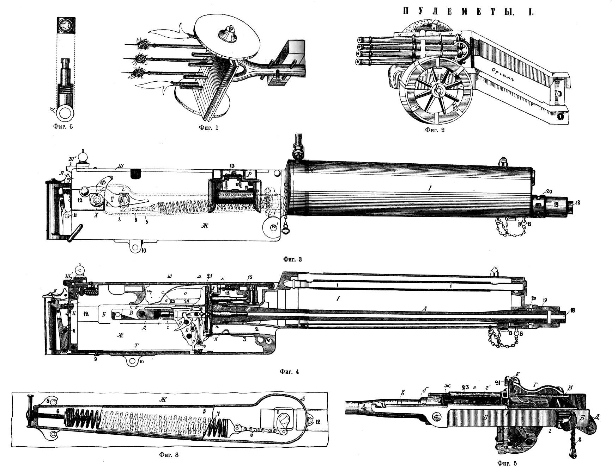
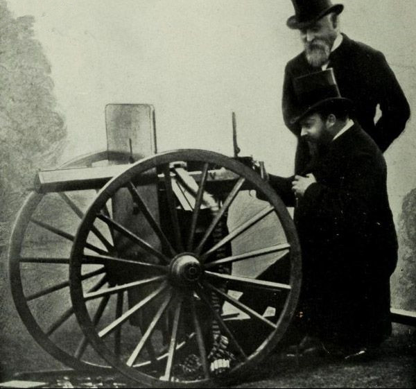
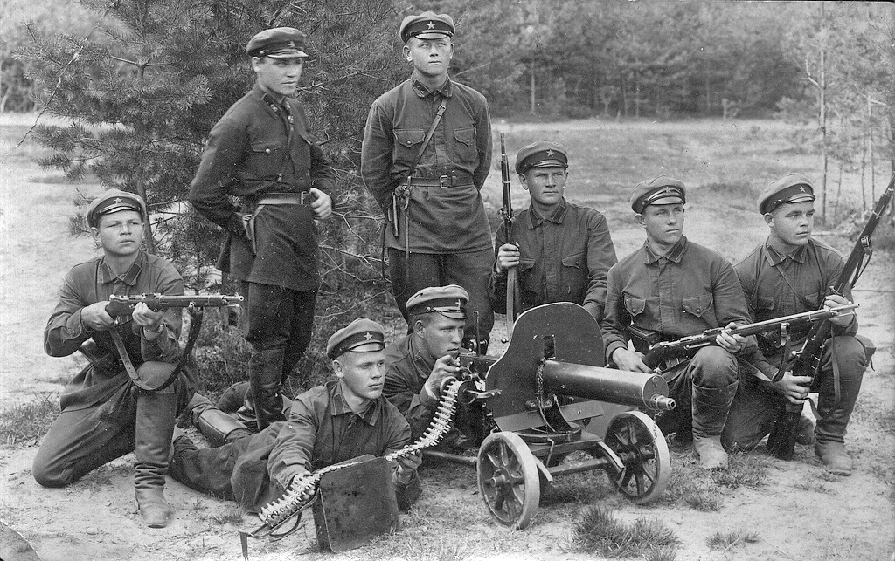
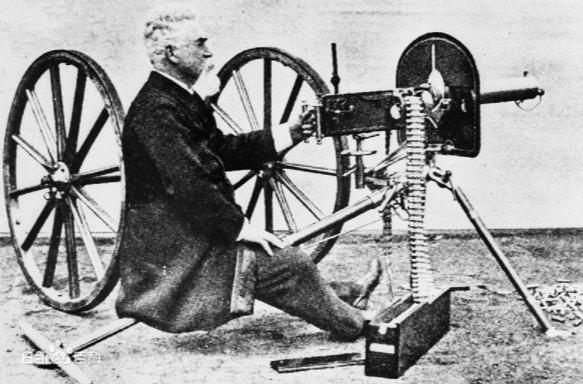
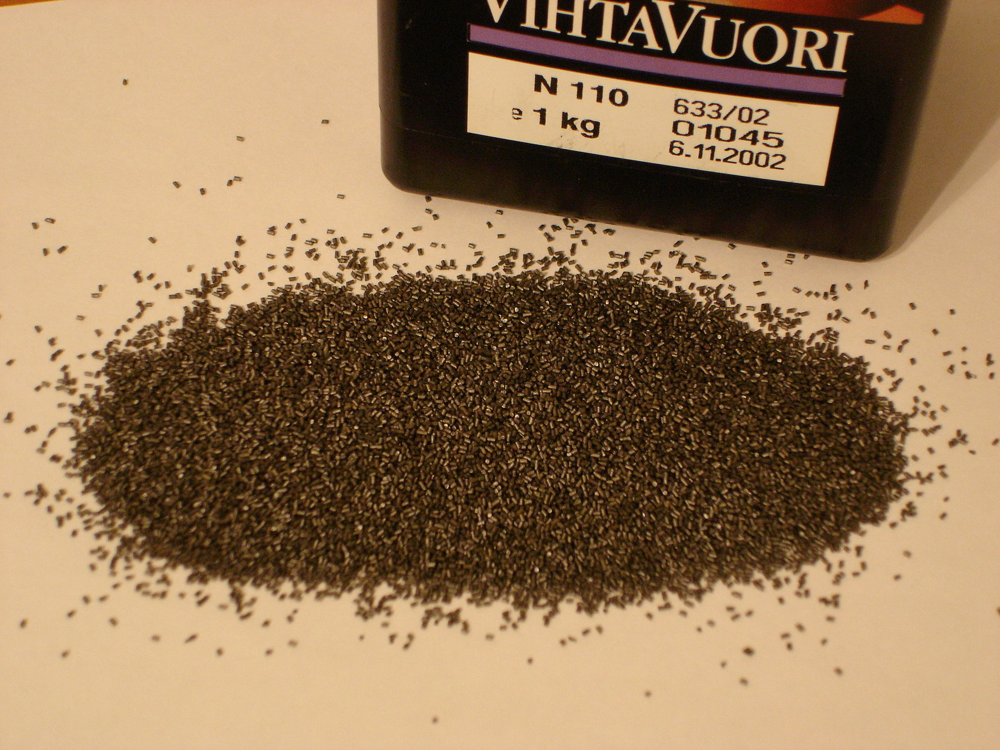

## nnnn姓名（资料）

适合所有人的历史读物。每天了解一个历史人物、积累一点历史知识。三观端正，绝不戏说，欢迎留言。  

### 成就特点

- ​
- ​

### 生平

【1916年11月24日】101年前的今天，制造大杀器，导致一场战役伤亡130万的马克沁去世

【被爱迪生赶走的发明家】

1840年2月5日，马克沁生于美国缅因州。14岁时，跟一个马车制造商学徒，在马萨诸塞州他叔叔的工厂里开始他的发明事业。

1864年（24岁），南北战争后期，他受聘于波士顿专门从事机械生产的奥林福公司。他对气体照明灯做出了重大改进，并发明了自动灭火器。现在的自动灭火装置仍然采用马克沁的基本原理。他利用这一专利，与当时的富翁合伙成立了一个气体照明灯生产公司。

1880年（40岁），在市政照明的投标中，爱迪生想尽一切办法排挤掉了马克沁这个强力竞争对手。马克沁被迫卖掉公司，离开美国，移居欧洲。

【完全自动射击的武器】

在战火纷飞的欧洲，一位朋友对他说：“把你的化学和电学扔到一边吧，如果你想发大财，就发明一种可以让欧洲人更容易自相残杀的武器吧。”这句话给了马克沁很大的启发。

经过两年的研究，1884年（44岁），马克沁的机枪设计基本完成。他首创采用射击产生的后坐力，进行自动循环的自动系统。射击时，火药燃气驱动枪机后坐，压缩弹簧，使枪机开锁并退子弹壳，弹簧回弹，将下一发弹推入弹膛并使枪机闭锁，实现全自动射击。

一个多世纪过去了，马克沁的这一基本设计很少改动，在许多现代自动武器上，仍能见到它的影子。 

【以一敌百的大杀器】

马克沁注册了专利，原型枪于1884年10月首次展示，1885年成立马克沁公司开始销售。一开始各国并未接受这种新武器，只有一些探险家采购作为防卫。第一个采用马克沁的军方单位为1889年新加坡志愿军。1893年后，开始陆续装备英国军队，正规军每营装备2挺。

马克沁真正开始成名的时间为1893年底。在非洲的第一次马塔别列战争中，英军以50人的军队操作四挺马克沁机枪击退了5000祖鲁人的进攻，使3000名祖鲁人丧命。有个英国诗人兴奋地写道：“不管发生了什么, 我们已经有了马克沁机枪, 而他们没有。（Whatever happens, we have got The Maxim Gun, and they have not.）”

（1885年，英王爱德华七世观看马克沁操作机枪）

【杀人如麻的绞肉机】

1898年，英国远征苏丹，在恩图曼战役中，与当地的伊斯兰教马赫迪军交战。数万名苏丹骑兵一窝蜂冲向英军防线，但是在机枪连续射击下，短短数分钟内骑兵接连的倒下。当晚丘吉尔在日记中提起：“在马克沁机枪前有2万具尸体密密麻麻地躺在地上”。

1901年（61岁），马克沁被维多利亚女王封为爵士。

1904年爆发的日俄战争，俄国陆军配备了450挺马克沁机枪，虽然数量不多，但是在防卫旅顺的作战中，成为屠杀日军的绞肉机。日军以“肉弹”战术冲锋肉搏，最后夺取203高地，但付出了死伤 1.7 万人的惨重代价，其中近半是由于马克沁机枪造成的。

【伤亡130万的大战役】

早期马克沁机枪，有个较大的问题是，连续射击产生的火药硝烟，让枪支布置的地点极易暴露。马克沁的一个化学家亲戚开发出了无烟火药，使得马克沁机枪的战术价值得到飞跃性的改善。这种改进型在第一次世界大战的索姆河战役中得到应用。

索姆河战役是第一次世界大战中规模最大的一次会战，时间发生在1916年7月1日到11月18日间，英、法两国为突破德军防御，在位于法国北方的索姆河区域进行作战。这次会战，双方伤亡共130万人，是一战中最惨烈的阵地战，坦克也第一次投入实战。

【无法收回的潘多拉之盒】

后来，马克沁不再研发武器，致力于大型游艺机械的研究与发明，并在英格兰西北部建设了世界上第一座游乐场。

1916年11月24日（66岁），130万人伤亡的索姆河战役刚刚结束，马克沁离开了人世。然而他留给世界的自动武器，仍然在各个战场上啸叫，夺去了无数人的生命。

（2010年，时任俄罗斯总统的梅德韦杰夫试射老式马克沁机枪）

【】

### 照片

