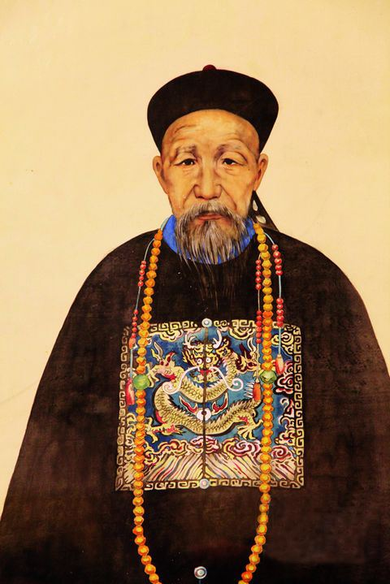
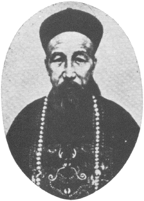
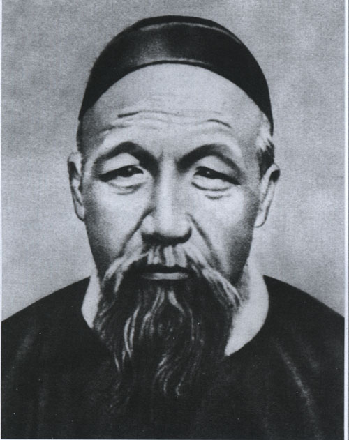
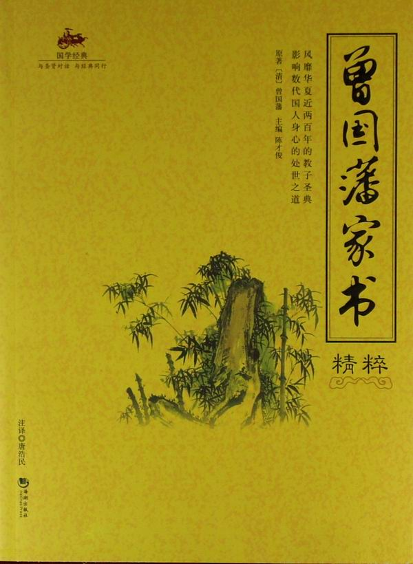
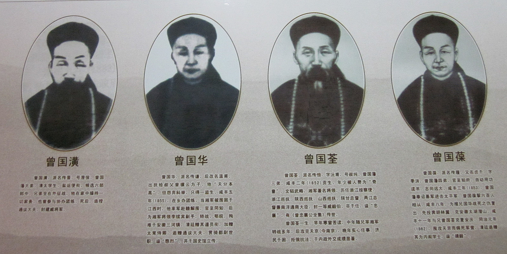
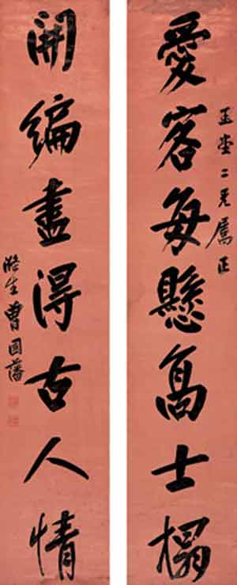
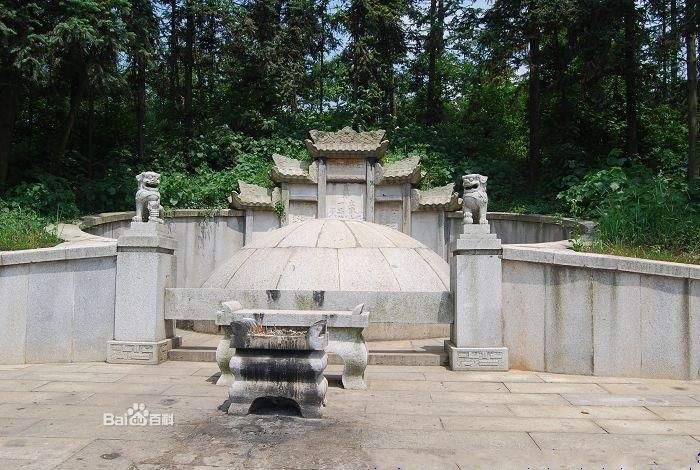

## nnnn姓名（资料）

适合所有人的历史读物。每天了解一个历史人物、积累一点历史知识。三观端正，绝不戏说，欢迎留言。  

### 成就特点

- ​
- ​

### 生平

【1811年11月26日】206年前的今天，被骂为曾剃头、曾国贼的晚清名臣曾国藩出生

【考试、考试、考试】

1811年11月26日，曾国藩生于湖南省长沙府湘乡县。父亲是私塾老师，连考17次，方才中秀才。1833年（22岁），曾国藩应湘乡县试，考取秀才。第二年，进入著名的岳麓书院学习，同年参加湖南乡试，中举人。然后，赴京连续参加两次会试未中。

1838年（27岁），曾国藩再次参加会试，终于考中，殿试位列三甲第四十二名，赐同进士出身，并成为军机大臣穆彰阿的得意门生。朝考列一等第三名，选为翰林院庶吉士。

1843年（32岁），出任四川乡试正考官。1845年，升侍讲学士。不久，李鸿章入京会试，投其门下受业。1847年，升任内阁学士。1849年，授礼部右侍郎，不久署兵部右侍郎。

【对付太平天国的湘军】

1851年1月（41岁），太平天国运动爆发。1952年，生母去世，丁忧回籍。此时太平军已攻入湖南，气势正盛。1853年1月，曾国藩奉旨帮办湖南团练。

曾国藩依靠师徒、亲戚、好友等复杂的人际关系，以湖南同乡为主，建立了一支地方团练，并整合湖南各地武装，称湘军。1853年，曾国藩获准在衡州练兵，派人赴广东购买西洋火炮，筹建水师。

【攻入天京的曾剃头】

1854年（43岁），发布《讨粤匪檄》，率师出征，不久在靖港水战中被太平军击败，投水自尽，被部下所救。休整后，重整旗鼓，当年攻占岳州、武昌。咸丰帝大喜过望，但仅赏曾国藩兵部侍郎头衔。

1856年（45岁），被困南昌。9月2日，太平天国发生天京事变，南昌解围。1858年5月，湘军攻占九江；1860年，湘军围安庆。

1864年（53岁），湘军攻破太平天国的天京（南京），焚毁南京城，大肆屠杀无辜平民，死伤无数。许多人因此称曾国藩、曾国荃兄弟为“曾剃头”、“曾屠户”。

【被裁撤的钦差大臣】

1864年7月，朝廷加曾国藩太子太保、一等侯爵。8月，裁撤湘军25000人。

1865年，僧格林沁被捻军击毙，清朝令曾国藩为钦差大臣，进剿捻军。这时湘军大部分已被裁撤，只能用李鸿章的淮军，因此协调不力。不久，捻军突破湘军、淮军的包围，进入湖北，又突破河南防线，东走山东。曾国藩被撤钦差大臣，由李鸿章继任。

【天津教案的曾国贼】

1868年（57岁），曾国藩改任直隶总督。1870年，有人怀疑法国天主教的育婴堂杀死婴儿，聚众数千人到教堂示威。法国领事丰大业，公然开枪恫吓，击伤随从一名。群众怒不可遏，殴毙丰大业，攻击杀死了10多名外国教徒和30多名中国信徒，焚毁法、英、美、俄、西教堂及法领事署。

事件发生后，英、美、法等七国军舰集结天津、烟台一带，强烈抗议，发出最后通牒。清政府派曾国藩到天津查办。曾国藩认为责任在中国人，将天津知府和知县革职充军，处死为首杀人的18人，充军25人，赔款修建教堂，并派人赴法国道歉。

全国舆论大哗，纷纷上书指责曾国藩对外妥协。连左宗棠、李鸿章也大骂曾国藩卖国。北京的“湖南同乡会馆”中，所悬曾国藩“官爵匾额”被捣毁。曾国藩名声扫地，被骂为“曾国贼”。

【死在南京的曾剃头】

1870年（59岁），两江总督马新贻被平民张汶祥刺杀，朝廷命曾国藩任两江总督，前往南京审理该案。

1872年3月12日（61岁），心情抑郁的曾国藩在南京的总督辕门病逝。朝廷追赠太傅，谥文正。7月19日葬于长沙南门外的金盆岭，次年12月13日移葬于善化县湘西坪塘伏龙山，与夫人欧阳氏合葬。

【传诵一时的家书】

《曾国藩家书》是曾国藩的书信集，近1500封。所涉及的内容极为广泛，是曾国藩一生的主要活动和其治政、治家、治学之道的生动反映，流传甚广。

在为人处世上，曾国藩以“拙诚”、“坚忍”行事。在家教方面，主张勤俭持家，努力治学，睦邻友好，读书明理。在治军用人方面，认为“用兵之道，在人不在器”。在战略战术上，认为战争乃死生大事，应“先求稳当，次求变化”。

在用人上，讲求“仁孝，血诚”原则，选拔经世致用的人才。曾国藩的幕府就是一所人才培训基地，李鸿章、左宗棠、彭玉麟、华蘅芳等都出自其中。

### 照片

