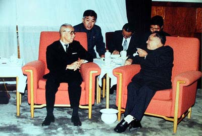
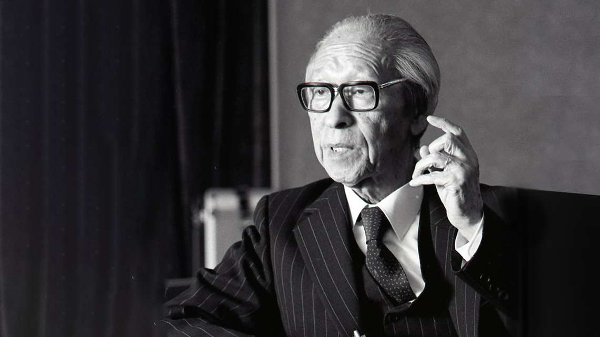

## 123年前的今天，获得日本最高奖章、和邓小平有个“君子之约”的经营之神松下幸之助出生

适合所有人的历史读物。每天了解一个历史人物、积累一点历史知识。三观端正，绝不戏说，欢迎留言。  

万象作者：一一 

【1894年11月27日】123年前的今天，获得日本最高奖章、造木头轰炸机的经营之神松下幸之助出生

### 成就特点

松下幸之助（1894年11月27日－1989年4月27日），出生于日本和歌山县，是横跨明治、大正、昭和三代的日本企业家，是松下电器的创办者。“终身雇佣制”、“年功序列”等日本企业的管理制度都由他首创，在日本被称为“经营之神”。

松下曾连续40年在日本缴税排名前100名，86岁时，获日本国最高奖章“一等旭日大绶勋章”。

松下幸之助是新中国成立后第一位访问中国的国际级企业家，受到了国宾级别的接待。在别的日本公司对中国投资畏手畏脚的时候 ，松下电器成为中国首个日本投资的外企公司（北京松下显像管）。

【30岁的日本首富】

松下是和歌山的一户农家的最小的小孩，松下幸之助为老幺（老八），其上有5个姐姐、2个哥哥，少年时代的松下幸之助只受过4年小学教育。

1915年（21岁），与19岁的井植小姐结婚，1918年3月7日，松下幸之助在大阪创办了松下电器的前身“松下电气器具制作所”，生产自行车用电灯等产品。创业之初曾典当妻子的和服以筹集资金。

1925年（31岁），首次成为日本最高收入者。同年，“松下电气器具制作所”创立了“National”品牌，生产电池及收音机。1935年（41岁），“松下电气器具制作所”改名为“松下電器産業株式会社”，松下幸之助出任社长（总经理）。

【为日军研制木头轰炸机】

1943年4月（49岁），受军方邀请设立松下造船株式会社、松下航空机株式会社。松下电器也开始生产军用品。松下还与妻舅井植岁男，一同参与研制木造训练轰炸机的计划。可是结构强度不足，到战争结束时只造出7架。

1945年日本投降，所有参与军事生产的企业被驻日盟军关闭，松下幸之助被解除社长职务。在小舅子井植岁男承担与日军合作的责任而辞职后，松下幸之助于1947年回到社长的位置。（井植岁男后来创立了三洋电机）。

【登上时代封面的跨国公司】

二战之后，日本正遭受严重的经济危机，百业凋敝，松下为了鼓励大家消费，刺激经济的复苏，罕见地买了一辆汽车——这在当时并不多见。

松下电器靠着三宝——洗衣机、冰箱及电视机──快速发展，成为世界知名的大公司。1961年（67岁），松下幸之助升任为会长（董事长）。1965年 2月23日，松下登上《时代》杂志的封面人物，

【我的梦，日本的梦】

1970年 4月（76岁），大阪举办了万国博览会，松下电器专设“松下馆”，受到日本政府的“一等瑞宝奖章”，这是专门为企业家所设的最高奖章。1973年，松下幸之助退休，转任松下电器的顾问。

松下幸之助热心公益，在他的捐献下，于1865年12月被大火烧毁的浅草寺雷门得以重建，成为当今的造形。

1977年（83岁），出版《我的梦，日本的梦，21世纪的日本》。

【新中国的第一家日资外企】

1978年，邓小平访问日本期间参观松下电器，邓小平认真的问：“松下老先生，你能否为中国的现代化建设帮点忙？”松下不假思索地答道：“无论什么，我们都将全力相助。”邓小平高兴的邀请松下幸之助去中国考察，松下欣然接受。

这个君子约定使得松下电器成为中国首个日本投资的外企公司（北京松下显像管）。松下在中国进行的技术合作项目160多项，建立合资独资企业53家（上海7家公司），总投资近15亿美元。其他日本公司纷纷前来参观访问，并追随着松下公司迈出了进入中国的步伐。

1981年（87岁），松下接受日本政府颁发的“一等旭日大绶勋章”，这是日本国最高的奖章。1989年，松下去世，享年94岁，个人财产估计约5000亿日元（约合50亿美元）。

【松下的经营之道】

松下幸之助为人谦和，他用一句话概括自己的经营哲学：“首先要细心倾听他人的意见”。松下坚持薄利多销的原则，多考虑消费者和代理商的利益，并能兼顾企业的利益。

松下幸之助很注重对员工的教育。每周都要在员工大会上作演讲，并制订了松下员工守则，创作松下的歌曲，使团队凝聚力大大提升，每个松下员工都以自己是松下的一员而自豪。所以在松下的公司很少出现劳资纠纷。

“终身雇佣制”、“年功序列”等日本企业的管理制度都由他首创。

【松下的名言】
1．人的生存意义不在于赚多少钱，而在于你为你的民族做了多少事。
2．企业即人，成也在人，败也在人。
3．经营者必须兼任端菜的工作。
4．工作本身如果是对的，是对社会有益的，金钱会自然而来。
5．我们可以为金钱而工作，但不可为金钱而出卖尊严。
6．谦和的态度，常会使别人难以拒绝你的要求，这也是一个人无往不胜的要诀。

###

