## nnnn姓名（资料）

适合所有人的历史读物。每天了解一个历史人物、积累一点历史知识。三观端正，绝不戏说，欢迎留言。  

### 成就特点

- 毛泽东和田汉等著名人士的老师
- ​

### 生平

徐特立（1877年2月1日－1968年11月28日）

【破产读书】

1877年2月1日出生于湖南省长沙府善化县四都观音塘（今长沙县江背镇观音塘），4岁时，徐特立的母亲逝世，1885年，徐特立9岁，父亲决定让他去读书，虽然家徒四壁，最终父亲和个哥哥还是用劳动的血汗钱为他缴纳了学费。

18岁时，徐特立决定做私塾先生对自己比较合适，就在五美山小塘湾设馆开学。一次，徐特立去拜访长沙城的举人陈云峰，陈云峰告诫他“读书贵有师，尤贵有书”，并且推荐他去阅读清朝张之洞的《书目问答》和《輏轩语》，阅读完这两本书后，徐特立觉得自己以前读书的方法是错误的，漫无目的、杂乱无章，决心从头读书。徐特立用家中的30石谷水田买了《十三经注疏》、《御批资治通鉴》、《读史方舆纪要》等书籍，时人称为“破产读书”。

他甚至制订了“十年破产读书计划”，一心“读书求学问，进学不进学不去管他”。

1905年，徐特立28岁时，他十年的“破产读书”计划进行到了第八年，这时，清政府取消了八股文考试制度，取而代之的是考经义、历史、地理，地点是岳州，徐特立参加了这场3000多人的考试，名列第19名。

1905年入长沙城宁乡速成中学，毕业后在长沙周南女校任教。后兴办私学（如梨江学校、长沙平民夜校等）。

【断指】

1909年，各省咨议局已经成立，于10月份首开常会，江苏省咨议局议长张謇发表《请速开国会建设责任内阁以图补救书》，并呼吁各省组织起来联合请愿。徐特立于此背景下，于1909年12月8日（农历十月二十八日）断指写血书，以为湖南代表送行，可谓合情合理合历史真相。

1909年12月8日(农历十月二十六日)，徐特立在湖南修业学校作报告，痛外交种种失败，非组织责任内阁无以救亡，断指沥血，书此八字，为请愿人送行：请开国会断指送行”。

上海《申报》、《时报》刊登。顿时蜚声全省，徐特立也被当时有进步思想者誉为最有血性的激进人物。血书原文，藏于国家博物馆。

1911年辛亥革命爆发，被选为湖南临时议会副议长。翌年又任省教育司的科长。

1912年，徐特立受长沙县首任知县姜济寰之邀，创办长沙县立师范（今长沙师范学校的前身）。

1919年至1924年6月，42岁时徐特立远赴法国勤工俭学，在巴黎大学学习自然科学，并考察了比利时和德国的教育。

1924年夏，徐特立回到长沙，创办长沙女子师范（1926年并入长沙县立师范），担任校长，同时兼任湖南省立第一女子师范（即稻田师范）校长；

1927年，大革命失败，在不少共产党员叛变脱党时，徐特立却以50岁年龄入党。

1927年夏，白色恐怖泛滥成灾，徐特立却毅然加入了中国共产党，徐特立参加南昌起义，担任革命委员会委员、第二十军第三师党代表兼政治部主任。

1928年，徐特立被派往苏联莫斯科中山大学学习。部队失败后，他决定同贺龙一起上山打游击，只是因病未能跟随，被派赴莫斯科入中山大学。

他学通俄语后，系统研究了马列主义，并同吴玉章、瞿秋白共同研究了汉语拉丁化拼音。

1930年末，徐特立回国赴江西根据地，后在中华苏维埃共和国政府任教育部副部长，苏维埃大学副校长。 

1934年，徐特立参加长征。

到达陕北后，中共中央为他庆祝60岁寿辰。毛泽东写信致贺，称徐老“今后还将是我的先生”。

1937年，徐特立任中共中央驻湘代表、八路军高级参议，在湖南开展统战工作。

1940年，徐特立在延安任延安自然科学研究院院长（他是延安自然科学院创建时期任职时间最长的院长）

时人把他和吴玉章、林伯渠、谢觉哉、董必武誉为“延安五老”。据曾在陕北和他一起生活过的人说，他六十岁之后，仍常常跳到大河里游水数小时之久。

1947年，中央为他庆贺70岁诞辰，毛主席的题词是“坚强的老战士”，朱总司令的题词则是“当今一圣人”。

1949年中华人民共和国成立后，徐特立任中共中央宣传部副部长，一些日子之后，因身体原因请辞。

1968年11月28日，徐特立在北京逝世，享年91岁。

【评价】

毛泽东对他的评价很高，曾在给他的一封信中说：“你是我二十年前的先生，你现在仍然是我的先生，你将来必定还是我的先生。当革命失败的时候，许多共产党员离开了共产党，有些甚至跑到敌人那边去了，你却在一九二七年秋天加入共产党，而且去的态度是十分积极的。从那时至今长期的艰苦斗争中，你比许多青年壮年党员还要积极，还要不怕困难，还要虚心学习新的东西。什么“老”，什么“身体精神不行”，什么“困难障碍”，在你面前都降服了。”
周恩来称他是“人民之光，我党之荣”。
朱德称他为“当今一圣人”。

【】

### 照片

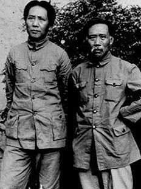

。.jpg)

与徐特立(中)合影.jpeg)

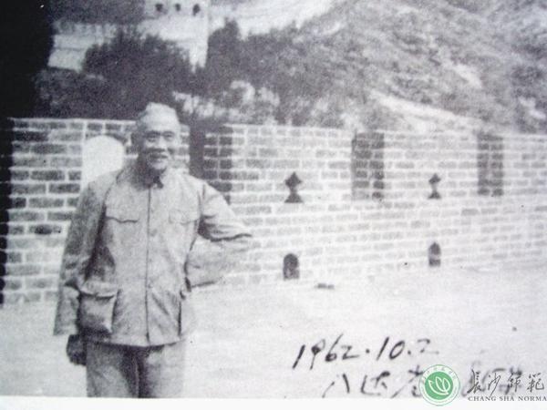

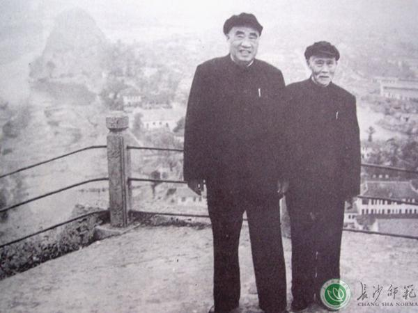

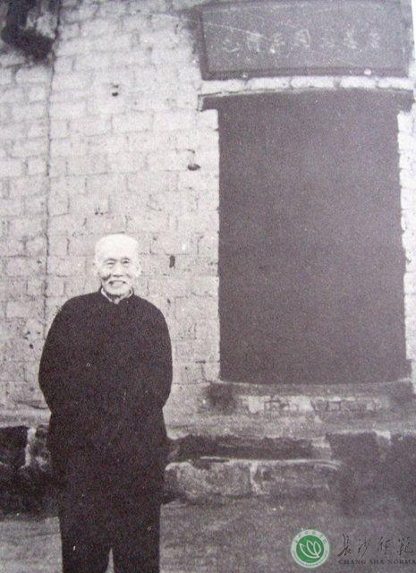

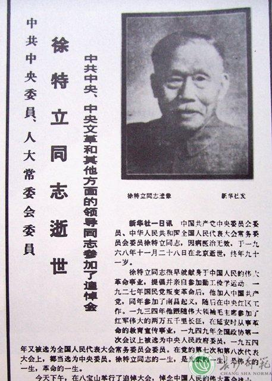

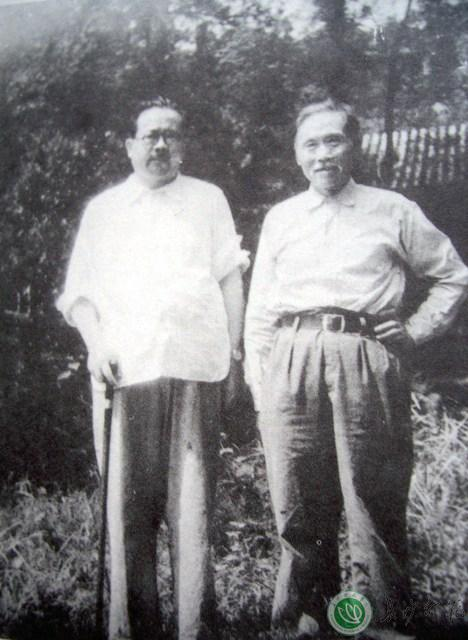

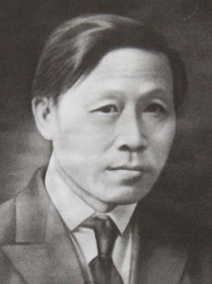

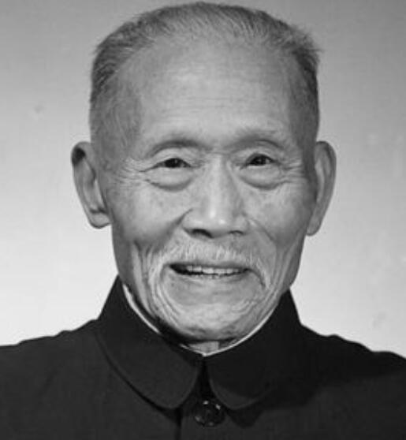

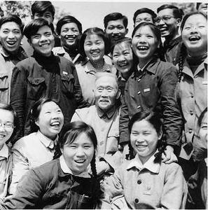

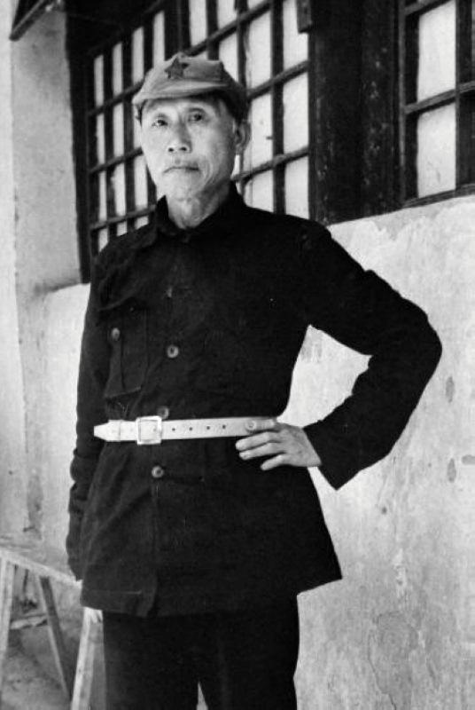

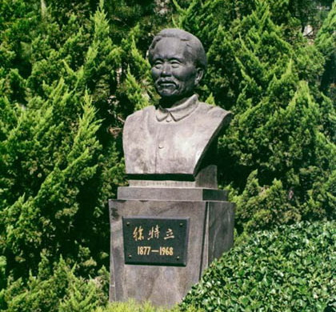

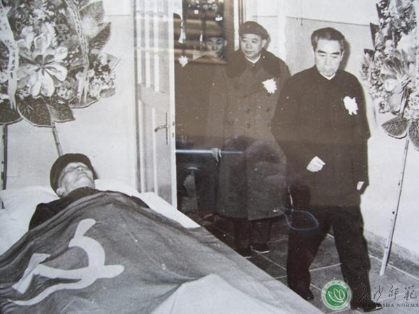