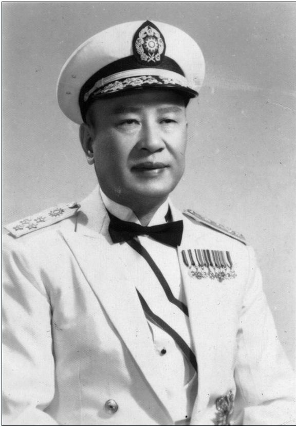
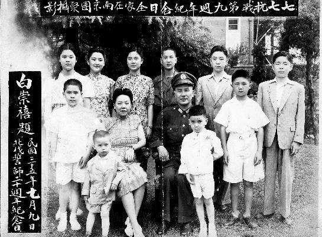
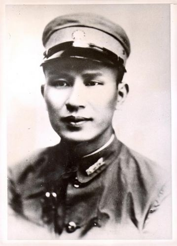
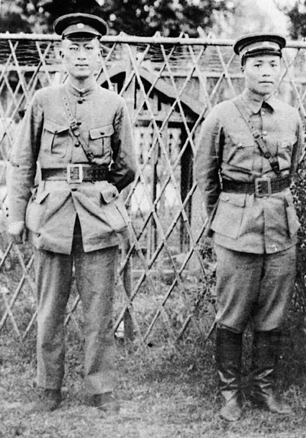
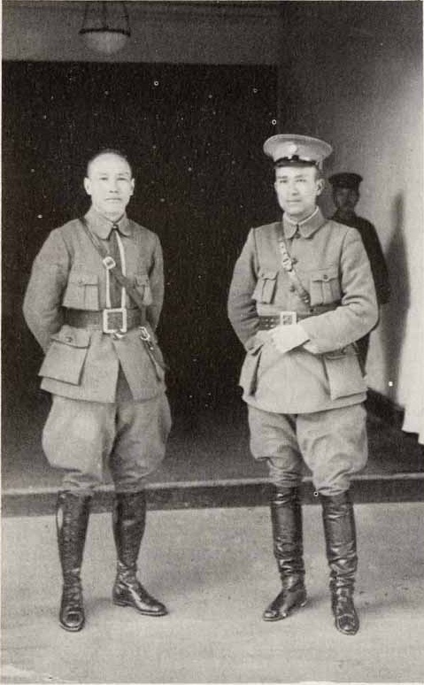
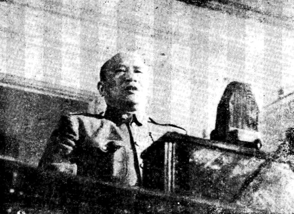

## 被称为小诸葛的穆斯林抗日英雄白崇禧去世（资料）

适合所有人的历史读物。每天了解一个历史人物、积累一点历史知识。三观端正，绝不戏说，欢迎留言。  

- ​

### 生平

（万象特约作者：一一）

【1966年12月2日】51年前的今天，被称为小诸葛的穆斯林抗日英雄白崇禧去世

白崇禧（1893年3月18日－1966年12月2日）广西桂林临桂人，穆斯林，伊斯兰教名奥马尔。中华民国陆军一级上将，有“小诸葛”之称。

李宗仁和白崇禧人称“李白”，是国民党内最具实力的地方军事势力──桂系的中心。多年来两人合作无间，联手统一广西，率广西军队北伐打到山海关。之后，和蒋介石等地方势力多次开战，败退回广西。

抗战爆发后，两人重归国民政府，动员广西军队抗击日军，合作指挥多场大战，如台儿庄战役等，屡有胜果。抗战胜利后，白崇禧担任国防部长。在解放战争中，损失了几乎所有桂系军队。1966年病逝台北。

【统一广西的半个小诸葛】

1907年（14岁），白崇禧考入广西陆军小学，后因病转读师范学校。1911年，辛亥革命爆发，白崇禧加入广西学生军，开赴湖北，随后进入武昌陆军预备学校，保定陆军军官学校第三期毕业。

1923年3月（30岁），白崇禧谒见孙中山大元帅，孙中山委任黄绍竑为广西讨贼军第一军总指挥，白崇禧为参谋长。

黄、白二人与李宗仁合作，于1924年分别打败旧桂系军阀－陆荣廷和沈鸿英。在统一广西的过程中，白崇禧充分表现出谋略和军事能力，被称为“半个小诸葛”。

【打到山海关的革命军总司令】

1926年（33岁），国民革命军在广州誓师北伐，白崇禧出任国民革命军参谋长，1927年，国民革命军总司令蒋介石任命白崇禧为东路军前敌总指挥，4月，白崇禧任淞沪卫戍司令，配合蒋介石在上海清党。

宁汉分裂后蒋下野，孙传芳部乘中国国民党内部分裂，回头反扑，白崇禧指挥第一军、第七军与孙军在南京龙潭激战6昼夜，毙敌2万余人，俘虏3万余人，孙传芳主力几全部覆灭。

1928年3月（35岁），白崇禧收编湖南唐生智部后，代行国民革命军总司令职权。白崇禧领军挥戈北上，9月直达北平、天津，东北张学良宣布易帜，北伐结束，桂系势力范围猛增至两广、湖北、平津。

（白崇禧与李宗仁）

【为了抗战重回中央】

1929年3月（36岁），蒋桂战争开始，同年11月，李、白、黄联同张发奎进攻广东。1930年，李、白在中原大战中，出兵支持冯玉祥和阎锡山反对蒋介石。战败后，退回广西。

中原大战之后，广西与中央对峙，直至1937年抗战爆发，广西出兵参加抗日为止，其间6年，广西在白崇禧领导下，实施“自卫、自给、自足”、“寓供兵团、寓将于学、寓征于募”政策，全省皆兵。

【抗日战争中的英雄】

1937年（44岁），抗日战争前夕，蒋中正任李宗仁为第五路军总司令，白崇禧为副总司令。“七七”芦沟桥事变，中日大战爆发，蒋号召全国抗日。8月4日，白崇禧出任国民政府军事委员会副参谋总长。

1938年3月，白崇禧协助李宗仁取得“台儿庄大捷”，这是中国八年抗战中第一次大捷。6月，白崇禧指挥“武汉保卫战”，与日本军盘桓5个月。1939年，先后指挥部下获得第一次长沙会战和昆仑关战役的胜利。

【内斗和桂系的覆灭】

1946年（53岁），国共再次开战，蒋介石派白崇禧飞往中国东北督战。杜聿明攻下四平后，白崇禧主张乘胜追击，一举歼灭林彪所部，但由于美国总统特使马歇尔连续三次给蒋发电，并以断绝美援相威胁，迫使停战。

1948年5月20日，李宗仁在南京就任中华民国副总统。白崇禧任华中剿匪总司令部总司令，同年底，白崇禧在淮海战役中推托救援杜聿明部队，致使全军覆灭，蒋介石愤掷电话筒、掀桌，骂粗话。

1949年1月21日，蒋介石被迫下野，由李宗仁接任代总统。至12月，白崇禧华中剿总所辖60万国军，陆续被渡长江后的共军消灭，仅有18万部队抵达海南岛，最后仅存2万余人退入越南。桂系军队近乎覆灭。

【终老台湾举行国葬】

李宗仁曾警告白崇禧：“桂系到台湾无用武之地”，但白崇禧仍按原定计划飞抵台北。1950年，白崇禧任总统府战略顾问委员会副主任委员，负责台湾党务改组工作，并任“中国回教协会理事长”等职。1954年3月10日，第一届国民大会第六次会议罢免李宗仁副总统职，白崇禧举起双手表示赞成。

1966年12月2日，白崇禧因心脏病发在台北去世，终年73岁。丧礼举行国葬仪式，蒋介石第1个前往祭悼。

### 

