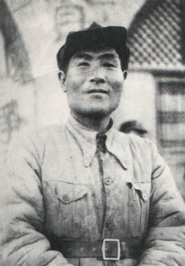
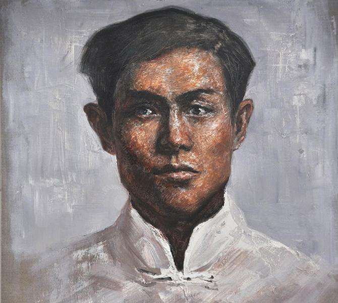
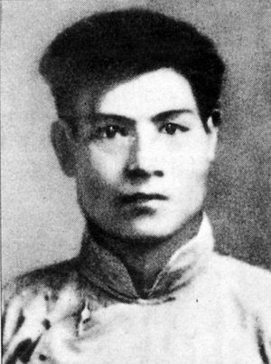
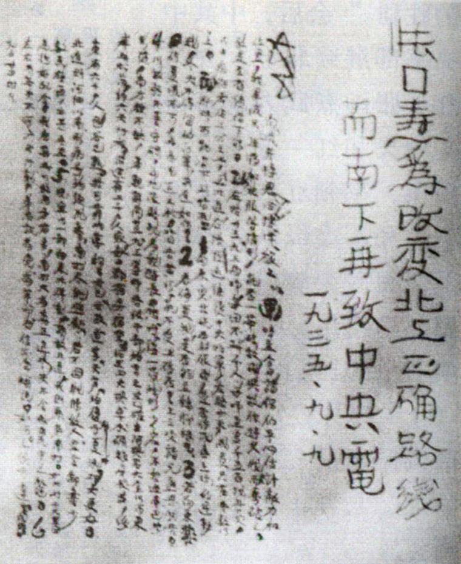
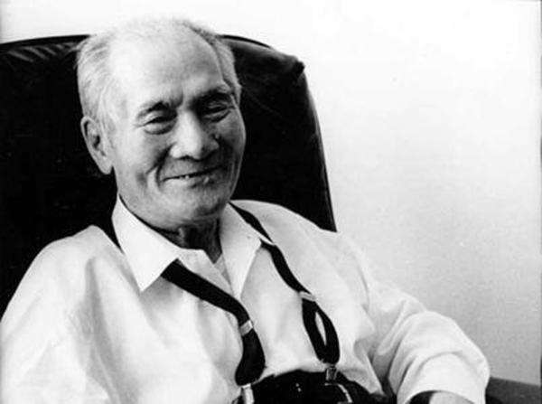
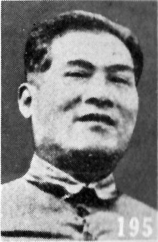
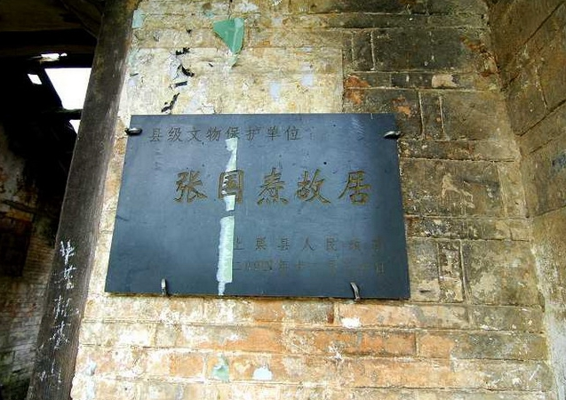
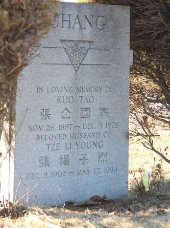

## nnnn姓名（资料）

适合所有人的历史读物。每天了解一个历史人物、积累一点历史知识。三观端正，绝不戏说，欢迎留言。  

### 成就特点

- ​
- ​

### 生平

【1979年12月3日】38年前的今天，带给毛泽东最黑暗时刻的共产党创始人之一张国焘去世

张国焘（1897年11月26日－1979年12月3日），江西萍乡人，中国共产党创始人之一。张国焘在党内资历很深，长征时他领导的红四方面军的实力在中央红军之上，与毛泽东发生严重分歧，另立第二中央。后来由红四方面军主力组成的西路军，在河西走廊几乎全军覆灭，张国焘在党内失势，向国民党叛变。

【中途辍学的共产党创始人】

1897年11月26日，张国焘出生于江西萍乡。少时进私塾读书，1916年（19岁），考入北京大学理工预科，1919年从预科毕业转入本科。在校期间参加了五四运动，担任北京学联主席，是学生领袖之一。他没有读完本科，转身成为了革命家。

1920年（23岁），他跟随李大钊参与北京共产主义小组活动，参与创建中国共产党。1921年7月下旬，在中共一大当选为中国共产党中央局三人团成员（任组织主任，另外两人是陈独秀任书记，李达任宣传主任），是中国共产党的创始人之一。

【逃脱牢笼的燕尔夫妻】

1921年8月11日（24岁），中国劳动组合书记部（中华全国总工会前身）成立，总部设在上海，张国焘任总主任。1922年，中共二大任中共中央执行委员会委员、中央组织部长。1923年6月，中共三大上，因反对与国民党合作，被批判左倾。

1924年5月11日，张国焘与他新婚不久的妻子杨子烈在北京被直系军阀政府逮捕。10月，冯玉祥发动“北京政变”，张国焘夫妇结束了5个多月的铁窗生涯，重返中共中央并继续担任重要职务。

【红四方面军的领导人】

1925年1月（28岁），中共四大当选为中央执行委员会委员，中央农工部主任，参与领导五卅运动。1927年，中共五大当选为中央委员会委员，中央政治局常委。1928年6月，前往苏联参加中共六大，选为中央政治局委员，并与瞿秋白一起任驻共产国际代表团代表。

1930年11月（33岁），回国，进入鄂豫皖根据地，担任红四方面军主要领导人。1931年11月，中华苏维埃共和国成立，当选为中央执行委员会副主席。

【南下北上的分裂】

在长征时期，1935年4月（38岁），为策应中央红军（红一方面军），红四方面军放弃了川陕根据地。6月，中央红军与张国焘领导的红四方面军在四川懋功地区会师。当时的红四方面军有近八万人，而中央红军经过长征，只剩不足三万人。会师后，张国焘取代周恩来出任红军总政委。

张国焘坚持南下而中共中央坚持“北上路线”，中央红军与红四方面军分裂。9月9日，毛泽东等率领红一军团和中央机关等组成的中央纵队北上，张国焘则率红四方面军及部分中央红军第二次过雪山草地南下。

【被迫取消的第二中央】

1935年10月5日（38岁），张国焘在四川马尔康县卓木碉开会，决定另立“中国共产党中央委员会”（史称“第二中央”），张国焘任中共中央主席，宣布开除毛泽东、周恩来、博古、洛甫的党籍。张国焘以“党团中央”的署名对陕北中央宣称：“你们应称北方局，陕北政府和北路军，不得再冒用党中央名义”。

1936年1月22日，中共中央在陕北作出《关于张国焘同志成立“第二中央”的决定》，坚决反对。1月23日，朱德致电张闻天，希望“党内急谋统一”。1月24日，共产国际代表林育英（林彪堂兄）进行调合，致电张国焘、朱德，电文称：“兄处可即成立西南局，直属代表团”，命令取消“第二中央”。

6月6日，南下损兵折将的张国焘正式宣布取消“第二中央”。

【几乎全军覆没的西路军】

1936年7月27日（39岁），红二、四方面军成立中央西北局，由张国焘任书记，任弼时任副书记。不久，张国焘带领红四方面军第3次过草地北上。1936年10月，在甘肃静宁县将台堡（今属宁夏）与红一方面军会师。红军三大主力会师后，张国焘仅带数十人的警卫排进入根据地，解除了他对红四方面军的指挥权。

不久，由红四方面军主力以及红九军团等组成红军西路军，在陈昌浩、徐向前等率领下，奉命向北，试图打通与苏联的补给线。然而，由于指挥错误，致使西路军在河西走廊东突西冲，犹豫徘徊，始终不能摆脱被动局面，经数月浴血拼杀后，将近3万人的西路军最终几乎全军覆没。

张国焘进入陕甘宁边区之后，张国焘被边缘化，1937年3月遭到批判后，任边区政府副主席。

【收效甚微的投奔国民党】

国共第二次合作全面抗日后，1938年4月3日（41岁），张国焘借祭拜黄帝之名逃离延安，遇上“蒋介石的五虎上将” 之一的蒋鼎文，到了西安，投奔国民党。4月11日，中共特工李克农率人在汉口火车站拦截并扣押起来，周恩来到武汉，多次劝张国焘回延安未果。4月18日，中共中央开除他的党籍。

张国焘投奔国民党后，蒋中正视其为“对延安的致命打击”，交给军统领导人戴笠“妥善运用”，但此后张国焘对中共进行的策反工作收效甚微。

1948年6月（51岁），张国焘在上海创办创进周刊社，出版《创进》周刊，对共产党多有指责。

【带给毛泽东最黑暗的时刻】

1948年底，举家迁到台北市；1949年冬，又移居香港，任《中国之声》杂志社长；1966年（69岁），开始撰写《我的回忆》连载文章。1968年，举家飞往加拿大。1979年12月3日，在加拿大多伦多一养老院病逝，后葬于多伦多，终年82岁。

1960年10月，美国作家埃德加·斯诺，在北京中南海采访毛泽东时问道：“您一生中最黑暗的时刻是什么时候？”毛泽东回答：“那是在1935年的长征途中，在草地与张国焘之间的斗争。”

【】

### 照片

