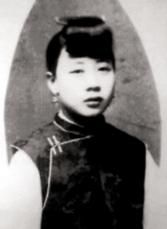
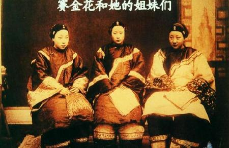
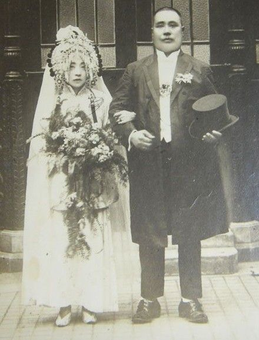
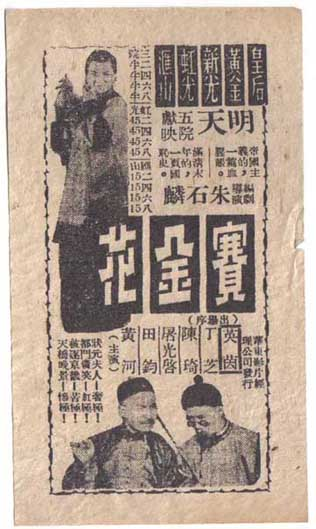

## 81年前的今天，连江青都争着出演的清朝最出名妓女赛金花凄惨离世

适合所有人的历史读物。每天了解一个历史人物、积累一点历史知识。三观端正，绝不戏说，欢迎留言。  

### 成就特点

【1936年12月4日】81年前的今天，连江青都争着出演的清朝最出名妓女赛金花凄惨离世

【1936年12月4日】81年前的今天，称为九天护国娘娘的状元夫人、传奇名妓赛金花离世

赛金花原名赵彩云，出道于苏州花船，成名于上海书寓，在天津改名为赛金花后来到北京。关于她和八国联军统帅瓦德西的故事，让她成为中国历史上最富传奇色彩的妓女。1905年，以她为主要人物的晚清四大谴责小说之一《孽海花》出版，风靡一时，“再版不下十五次，行销不下五万部”。

北大教授刘半农认为赛金花是晚清史上一个关键的线索人物，曾让他的学生用了很长时间和她访谈。然而访谈中，完全未提及在欧洲与瓦德西相识；而另一部访谈后写的《赛金花外传》，她却明白表示二人是老相识。

八国联军进京后，赛金花可能不像晚清笔记小说里的“九天护国娘娘”那么神通广大，但她确实与德国官兵为伴交游，在有些场合帮助了京城百姓，赢得了很多人的赞赏。

### 

【出使欧洲的公使夫人】

1872年，赛金花生于安徽徽州黟县，后随父亲移居到苏州。1886年（14岁），在苏州河上的花船上接客。同年，前科状元洪钧回苏州守孝，被赛金花美色所倾倒。1887年正月十四日，洪钧纳赛金花为三姨太，为其改名为洪梦鸾。

1887年5月，清政府委派洪钧出使德、俄、荷、奥欧洲四国。洪钧的正室夫人因病不能随同前往，赛金花以公使夫人的名义出使四国，受到德皇威廉二世和皇后的接见。在柏林居住期间，赛金花与洪钧生一女，取名德官。1892年底（20岁），洪钧任满回国。

【名扬上海滩的花榜状元】

1893年（21岁），洪钧因病去世。赛金花在护送洪钧棺柩南返苏州途中，离开洪家，留在上海，挂牌书寓，改名曹梦兰，花名傅彩云。她因状元夫人和公使夫人的招牌而名扬上海滩，被称为花榜状元。

1898年夏天（26岁），苏州状元陆润庠串通上海知府，强迫赛金花离开上海。赛金花北上天津，在滨江北道的旧“金花”妓院原址租房，挂牌“赛金花书寓”，并改名赛金花，并组织“金花班”。

【九天护国娘娘的赛瓦情史】

1899年搬往北京，住在西单石头胡同，先后在高碑胡同、陕西巷挂牌营业。她在京城风靡一时，与名儒、巨商卢玉舫结拜，排行老二，人称赛二爷。1900年前，她就是小报上的常客，时常连载她的花边八卦。

1900年，八国联军攻陷北京时，赛金花曾与部分德国军官有过接触，也曾改换男装到皇家园林西苑（今中南海）游玩。1900年之后，赛金花从一个普通的名妓升格为“九天护国娘娘”，关于她与瓦德西的故事，在晚清笔记、小说中到处可见。

1905年，以她为主要人物贯串全篇的小说《孽海花》出版，风靡一时，“再版不下十五次，行销不下五万部”，她的知名度再上层楼。书中大肆渲染她在随洪钧出使德国时，就已与“雄赳赳的日耳曼少年”瓦德西私通。

【魏赵灵飞的婚姻】

1903年4月（31岁），金花班一姑娘不忍卖淫为生服鸦片自杀，赛金花因涉嫌虐待幼妓致死而入狱，5月被递解回苏州，后被释出狱。赛金花出狱后，花班散了，家财也散尽，只好返回上海重新挂牌。

1911年（39岁），赛金花嫁给了沪宁铁路段稽查曹瑞忠做妾。次年曹死，再次为娼。1918年6月20日（46岁），赛金花与曾任参议院议员、江西民政厅长的魏斯炅在上海正式结婚，改名魏赵灵飞。1921年7月，魏斯炅因病去世。

【被遗忘后的赛金花热】

1933年（61岁），她为了免除房产税写了一张呈文，被北平《小实报》记者发现，立即前往采访，大加炒作。早就被人遗忘的赛金花又出现在大众视野里。随后各方名人络绎不绝去看她，犹如欣赏出土的古玩，大众兴趣所在，仍然是那一段赛瓦情史。

在“赛金花热”下，许多人将她搬上舞台，如上海的“性学博士”张竞生与大明星胡蝶，曾约她上电影。夏衍的话剧《赛金花》的上演，使得赛金花热达到高潮。连此时尚是演员的江青，也曾争演赛金花角色。

1934年，《申报》记者采访赛金花，失望地发现她“甚且并不知道国家为何物，更无论爱国与否矣”，“今日之赛，不但不聪明，甚至说话毫无条理，使人有疑为神经病者之感”。

【张大千画的彩云图】

赛金花的晚年贫困潦倒，1936年12月4日，赛金花因病于北京过世，终年66岁。赛金花死后，由齐白石、张大千、刘半农等名人募集丧银，才得以在陶然亭“香冢”旁下葬。

陶然亭还有记述赛金花生平的三块石刻：彩云图、前彩云曲和彩云后曲。彩云图是著名书画家张大千为赛金花画的画像，《前彩云曲》和《彩云后曲》为樊增祥为赛金花作的长诗。

（陶然亭的彩云图）

