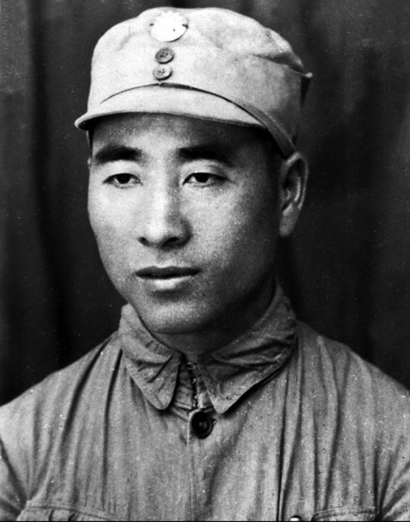
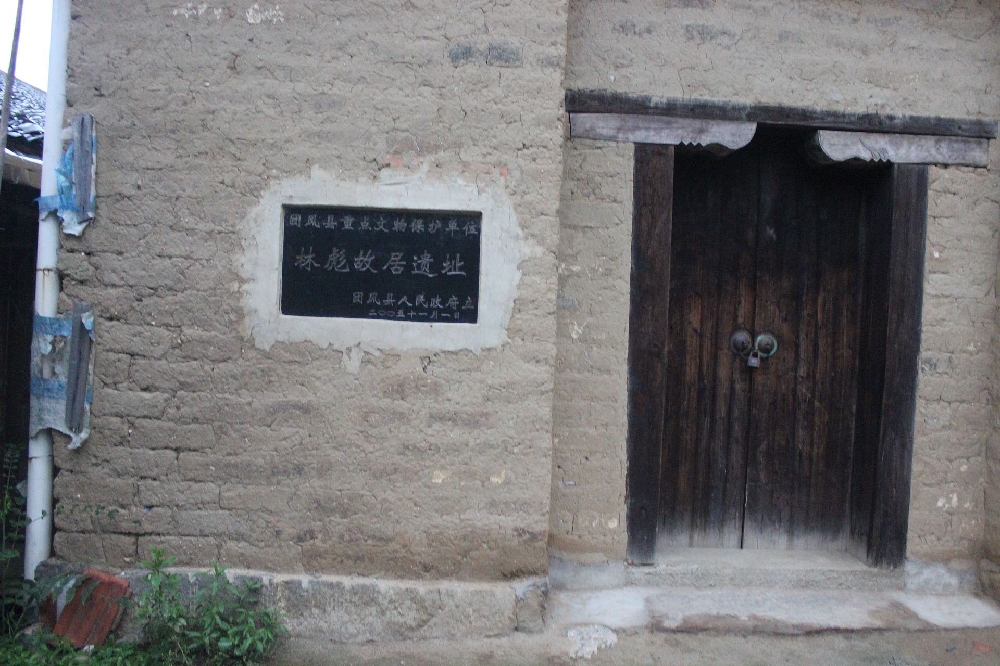
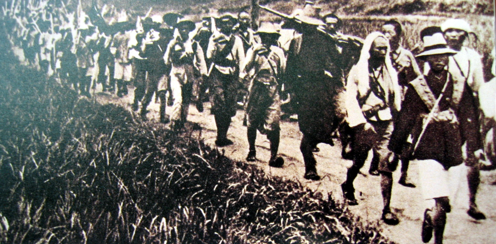
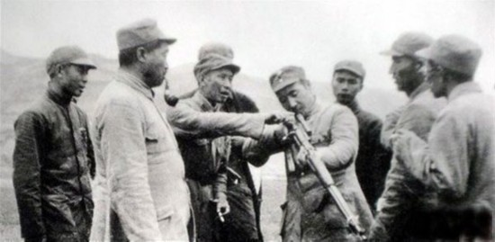
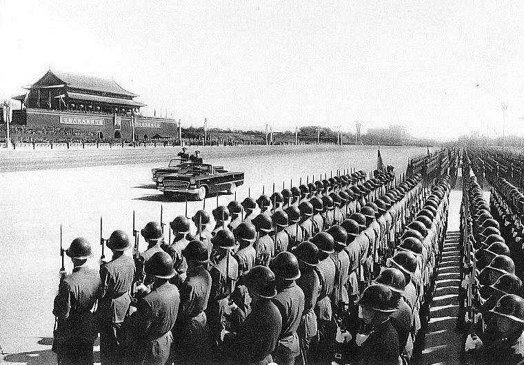
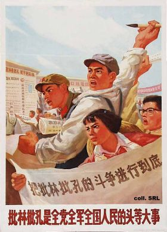

## nnnn姓名（资料）

适合所有人的历史读物。每天了解一个历史人物、积累一点历史知识。三观端正，绝不戏说，欢迎留言。  

【1907年12月5日】110年前的今天，战无不胜的共和国元帅、当代韩信林彪出生

林彪（1907年12月5日－1971年9月13日），湖北黄冈人，中华人民共和国开国元勋，共和国元帅。

林彪早年投考黄埔军校第四期，加入中国共产党，并参加北伐战争。1927年8月，他参加南昌起义，转战井冈山，年仅20出头就担任红军第一主力红四军军长，参加历次反围剿战争，屡屡获胜，战功卓绝。

参加长征，到达陕北。抗日战争时期，平型关战役中，打败“日军不可战胜的神话”。不久，因身穿缴获的日本军大衣，被误伤，赴苏联养伤。

解放战争期间，任东北民主联军总司令，时隔6年重新带兵。经过两年“卧薪尝胆”的准备后，指挥辽沈战役、平津战役等作战，势如破竹，从黑龙江一直打到海南岛。

建国后，离群索居、低调的林彪，进入政治最高层。文化大革命爆发后，他成为二号人物，作为毛泽东的接班人被破天荒地写入《中国共产党章程》及1970年宪法草案。

1971年，林彪携妻、子出逃，飞机坠毁于蒙古。2007年，解放军建军80周年前夕，林彪的照片30年来第一次出现在中国人民革命军事博物馆。蒋介石评价林彪时说：“当代韩信”。

（115师时期照）

【名字像女孩子的黄埔军校生】

1907年12月5日，林彪出生于湖北黄冈，原名林育蓉。他的堂兄林育英和林育南是中共历史上的重要人物。9岁读私塾，老师李卓侯是“中国地质学之父”李四光的父亲。

1925年秋（18岁），五卅运动中，他带头参加游行示威。经林育南介绍，他成为中国共产党党员。随后投考广州黄埔军校被录取。到广州后，因不满名字像女孩子，自行改名为林彪。

1926年1月，被编入步兵科第2团2营3连，他是少数公开身份的中共党员，担任3连中共党支部书记。10月4日，黄埔四期学生提前毕业，补充进国民革命军参加第二次北伐战争。

【菩萨心肠霹雳手段的主力团长】

1927年4月（20岁），蒋介石宣布清党后，林彪依然选择跟随共产党。8月2日，林彪由聂荣臻、周士第直接率领到达南昌，加入之前一天举行的南昌起义。

1928年1月，南昌起义部队败退到江西后，朱德将其改编为工农革命军第1师，林彪任1团2营2连连长。不久，朱德、陈毅率部发动湘南暴动，林彪被提拔为1营营长。

1928年4月28日，朱德、陈毅部与毛泽东秋收暴动部队会师井冈山，部队改称工农红军第四军（简称红四军）。8月25日，林彪代理红四军第一主力红28团参谋，团长王尔琢不久牺牲，11月林彪升任团长，年仅21岁。林彪为人严谨，从来不和下级漫谈、说笑话。他说“带兵要严，以菩萨心肠，行霹雳手段”。

【反围剿的红四军军长】

6月22日，红四军召开第七次代表大会，毛泽东和朱德两人对红军的建军问题爆发分歧。朱德反对毛的“党管一切”观点，而林彪支持毛的观点。会议上，毛泽东被选下前委总书记，离开红四军“养病”。

12月29日－30日，古田会议。会议通过决议，接受了毛泽东的建军主张。毛泽东重获得红四军领导权，重新当选前委总书记，林彪当选总前委委员，进入红军决策层。

1930年2月（23岁），林彪任红军第一主力红四军军长。参加了历次反围剿的斗争，屡屡获胜，战功卓绝。1932年3月12日，红四军、红十二军合编为红一军团，林彪升任军团总指挥（后称军团长）。

（装备简陋的红一方面军在反围剿战争中）

【打破神话的平型关大捷】

在反围剿失败后，红军开始长征，随红一方面军到达陕北。1936年6月1日，红军大学成立，林彪调任校长进行教学，不再任军团长。

1937年7月（30岁），中日全面战争爆发后，国共第二次合作，红一军团和红十五军团改编为国民革命军第八路军第115师，林彪任师长。

9月25日，林彪指挥115师主力在平型关东北数十公里处，全歼日军板垣征四郎师团第21旅一部及辎重部队，合共歼灭日军1000余人。此役取得中国军队主动出击作战的首次大捷，打破了“皇军不可战胜”的“神话”。

（1937年5月，部分红军将领于陕西旬邑织田镇合影。前排右一为林彪）

【穿日本军大衣的误伤】

1938年3月2日（31岁），林彪因为穿日本军大衣而被阎锡山部下开枪误伤，经检验脊髓神经受伤，并因此留下了困扰终生的植物神经紊乱症。林彪被送回延安治疗，毛泽东罕有的骑马15公里迎接。11月，林彪赴苏联继续就医。

1942年初（35岁），林彪回国。2月8日林彪返回延安，惯于晚睡晚起的毛泽东破例起个大清早去迎接（朱德、周恩来、任弼时从前线或苏联回来时毛都没有迎接）。回来的林彪继续任“抗大”校长、中共中央党校副校长，参加了延安整风运动。

（1945年延安七大期间，林彪和贺龙等人在把玩一支狙击步枪）

【重新带兵的东北总司令】

1945年9月9日，日本正式投降。10月31日，来到东北的中共部队和当地的东北抗日联军等整编为东北人民自治军（后称东北民主联军、东北野战军），已经6年半没带过兵的林彪任总司令。

1946年4月4日，进至东北的国军精锐进攻东北民主联军，发起第二次四平战役及本溪战役。5月18日，林彪被迫下令撤退，而之后由于美国干预，蒋介石下达了停止追击的命令。

6月16日，林彪升任中共中央东北局书记，兼东北民主联军政委，集党、政、军大权于一身。他用两年的时间发动土改，征兵练兵，成功的将国军压缩在几个大城市范围。1948年1月1日，东北民主联军改称东北人民解放军，林彪任司令兼政委。

（1946年，中共东北局高层领导在哈尔滨召开军事会议。左一为林彪）

【从黑龙江打到海南岛】

1948年9月12日－11月2日（41岁），林彪指挥东北野战军70余万和民兵进攻55万余国军，发起震惊中外的辽沈会战。辽沈战役东北野战军歼灭国军47万余人，自伤亡6.9万余人，占领全东北。

1948年11月29日至次年1月31日，林彪统一指挥东北野战军、华北军区部队发动平津战役。平津战役歼灭国军52.1万人，自伤亡3.9万人。

1949年3月11日，东北野战军改称中国人民解放军第四野战军（简称“四野”）。4月到次年6月，林彪统一指挥四野大部及兄弟部队，对在中国南方的国军主力发动了安新战役、宜沙战役、湘赣战役、衡宝战役、广东战役、鄂西战役、广西战役、海南岛战役，攻占湖南、湖北、江西、广东、广西五省。衡宝战役后期，林彪病倒，在担架上指挥。

【进入最高层的低调元帅】

中华人民共和国建国后，林彪一直离群索居，从不介入将帅圈子，“他不串门，不见客，登门来拜访的人多数也被叶群挡驾”。1954年，林彪任国务院副总理、国防委员会副主席。1955年4月4日，补任弼时与高岗之缺，与邓小平一起当选中共中央政治局委员。9月27日，被授予元帅军衔。

1958年5月（51岁），林彪参加八届五中全会，毛泽东提议补选长期养病的林彪为中共中央副主席（十大元帅中仅朱德当过）、中共中央政治局常委，被通过，从此林彪进入中共最高层。

1959年9月17日，由毛泽东提议，林彪接替彭德怀成为国防部长。26日，林彪成为中共中央军委第一副主席。1961年10月，张爱萍向林彪汇报，不少中央领导人要求原子弹下马，林指示：“原子弹一定要搞下去，一定要响，就是用柴火烧也要把它烧响了”。

（1959年，10周年大阅兵的林彪巡视车）

【写入党章的接班人】

1966年8月1日（59岁），中共八届十一中全会在毛泽东的主持下匆匆召开。4日、5日，毛两次要林彪回北京出席，周恩来赶来亲自请林彪。6日上午，毛泽东宣布休会“等待”林彪。6日晚上，林彪一到毛便来迎接与他“说事”。

8日，全会通过《中国共产党中央委员会关于无产阶级文化大革命的决定》，文革正式开始。由周恩来提议，全会通过林彪取代刘少奇，成为唯一的中共中央副主席，中央政治局常委排名跃升至毛泽东之后。

1969年4月1日（62岁），中国共产党第九次全国代表大会在北京召开，破天荒地在新修订的《中国共产党章程》中加入“林彪同志是毛泽东同志的亲密战友和接班人”。

（1966年，林彪和毛泽东）

【身败名裂的外逃事件】

1971年9月13日，林彪和妻子叶群、儿子林立果搭机外逃，在蒙古坠机，机上人员全部丧生。林彪死后被中国驻蒙大使馆草草土葬，后苏联情报人员将其挖出，头盖骨送往苏联检查，确认死者身份为林彪无疑。目前林彪遗骸仍然未能回国。在文革后期，有声势浩大的批林批孔运动。

作家舒云描述，曾有人建议给九一三事件平反，但邓小平拒绝并下死命令禁止给林彪翻案，他强调要把林彪和江青绑在一起。1980年11月20日－1981年1月15日，中共组织特别法庭“并案”审判“林彪、江青反革命集团”。

2007年，解放军建军80周年前夕，林彪的照片30年来第一次出现在中国人民革命军事博物馆，展览馆处长明确表示：“以后不再丑化林彪”。

（1974年宣传画）