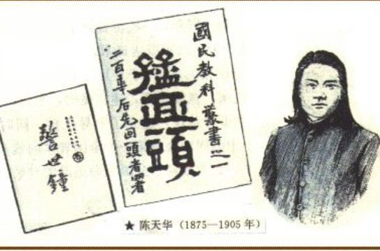
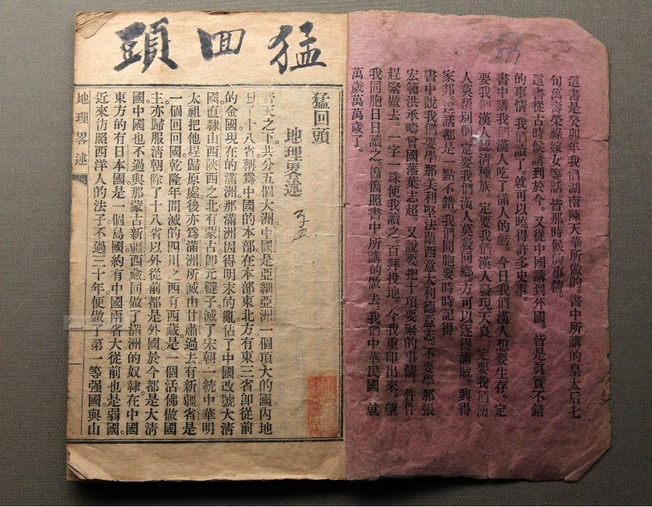
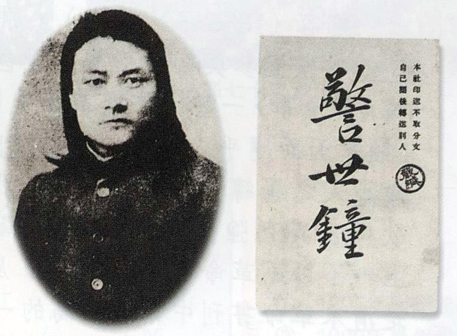
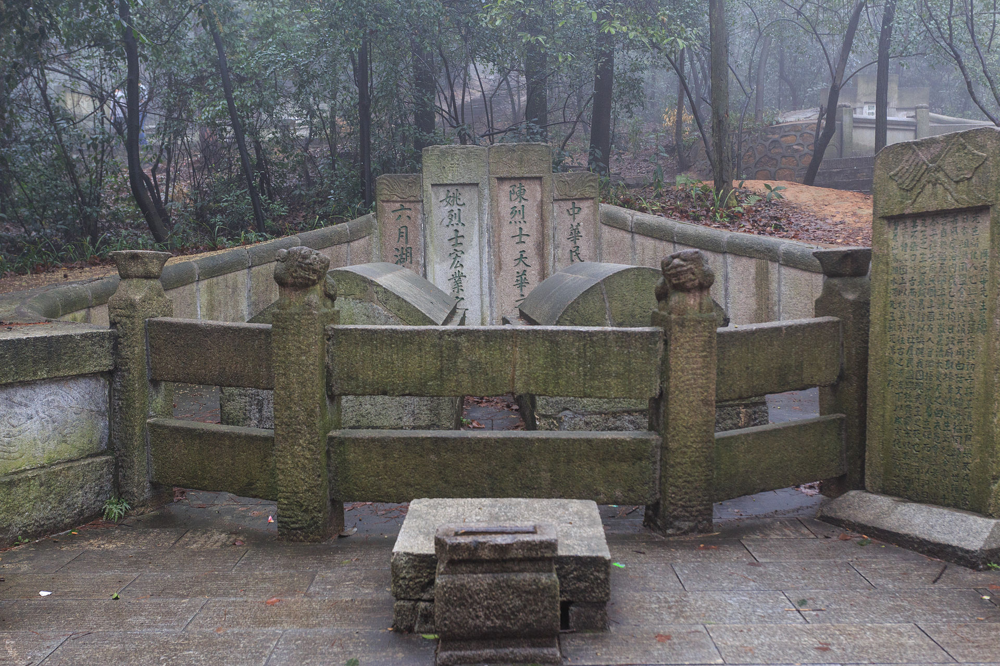

## 112年前的今天，影响毛泽东一生的《警世钟》作者陈天华自杀

适合所有人的历史读物。每天了解一个历史人物、积累一点历史知识。三观端正，绝不戏说，欢迎留言。  

（万象特约作者：一一）

【1905年12月8日】112年前的今天，影响毛泽东的《警世钟》作者陈天华在日本投海自尽

112年前的今天，猛回头、警世钟的神州痛哭人陈天华在日本投海自尽

112年前的今天，痛恨空谈误国的神州痛哭人陈天华在日本投海自尽

陈天华（1875年3月6日－1905年12月8日），湖南省新化县人，近代革命家，同盟会会员。曾写下《警世钟》、《猛回头》等文，在清末风靡一时，对中国近代民主革命起到极大的推动作用。包括毛泽东等人，深受其影响。

陈天华在日本东京投海自尽前，写下《绝命书》一篇。耐人寻味的是，长达4千字的《绝命书》几乎没有一句抨击日本的话，通篇悲情激荡的文字说：“因为自己志行薄弱，不能大有所作为，空谈救国，人皆厌之。惟有以死报国，使学子们有所警动，去绝非行，共讲爱国，卧薪尝胆，刻苦求学，中国或许可以不亡。”号召大家不要空谈，应该行动起来。

【猛回头已是洋人天下】

1875年3月6日，陈天华出生于湖南新化。1896年（21岁），在族人的资助下，进入新化资江书院，1898年，入新化实学堂（今新化县一中），深受维新思想影响，倡办不缠足会，成为变法运动的拥护者。

1900年（25岁），就学于长沙岳麓书院。1903年初，入省城师范馆，不久获官费留学日本东京弘文学院师范科，参与组织拒俄义勇队和国民教育会，从事反清活动。

1903年（28岁），由日本东京出版社出版了《猛回头》。本书用白话文写成，通俗浅显，富于激情，以强烈的爱国精神和革命勇气，揭露帝国主义列强瓜分中国已迫在眉睫，指出清朝政府已成为“洋人的朝廷”，号召全国各阶层民众团结起来，实行排满，“杀那洋鬼子”，在社会上产生强烈反响。

【神州痛哭人的惊呼】

1903年秋，陈天华蘸着革命激情挥笔写下《警世钟》，署名"神州痛哭人著"。书中名句： "长梦千年何日醒，睡乡谁遣警钟鸣"。

《警世钟》以说唱文艺形式出现，作者就惊呼国破家亡的惨景即将来临：“来了！来了！甚么来了！洋人来了！不好了！不好了！大家都不好了！……从今以后，都是那洋人畜圈里的牛羊，锅子里的鱼肉，由他要杀就杀，要煮就煮，不能走动半分。唉！这是我们大家的死日到了！苦呀！苦呀！苦呀！我们同胞辛苦所积的银钱产业，一齐要被洋人夺去；我们同胞恩爱的妻儿老小，活活要被洋人拆散，……枪林炮雨，是我们同胞的送终场；黑牢暗狱，是我们同胞的安身所。大好江山，变做了犬羊的世界；……唉！好不伤心呀！”

【影响毛泽东的警世钟】

毛泽东在1936年与美国作家斯诺谈话中，回忆少年时代时说："这本书谈到了日本占领朝鲜、台湾的经过，我读了以后，对国家的前途感到沮丧，开始意识到，国家兴亡，匹夫有责。"（见《西行漫记》）毛泽东说的这本书，就是盛行一时的《警世钟》。

1904年（29岁），回国与黄兴、宋教仁等在长沙创立华兴会，策划武装起义，事泄逃亡日本。1905年，加入同盟会，任《民报》编辑。

（1905年年底，同盟会机关报《民报》的同仁在日本东京的合影。前排右二为陈天华）

【警醒国人的绝命书】

1905年10月（30岁），日本文部省公布《取缔清韩留日学生规则》。这时的留日学生，一派以秋瑾和宋教仁为代表，主张全体同学罢学回国；一派以汪精卫和胡汉民为代表，主张忍辱负重留在日本继续求学，两派发生了激烈争吵。当时的《朝日新闻》攻击中国人缺乏团结力，说中国留学生是“放纵卑劣”的一群。

1905年12月8日晨，陈天华在东京大森海湾投海自尽。自尽前，他写下《绝命书》一篇。耐人寻味的是，长达4千字的《绝命书》几乎没有一句抨击日本的话，通篇悲情激荡的文字说：“因为自己志行薄弱，不能大有所作为，空谈救国，人皆厌之。惟有以死报国，使学子们有所警动，去绝非行，共讲爱国，卧薪尝胆，刻苦求学，中国或许可以不亡。”

他用自己的死，号召大家不要空谈，意识到族人的缺陷与陋习，积极行动起来，加以改变。他的死深深触动了所有留学生和革命先人。

1906年春天，当陈天华的灵柩运回上海后，中国公学为他和另一位投黄浦江自尽的同盟会员姚宏业举行了一次公葬会议，到会千余人，会上宣读了姚宏业的遗书和陈天华的绝命书。会议决定将两人灵柩一起送回家乡湖南，举行公葬，葬于长沙岳麓山。

