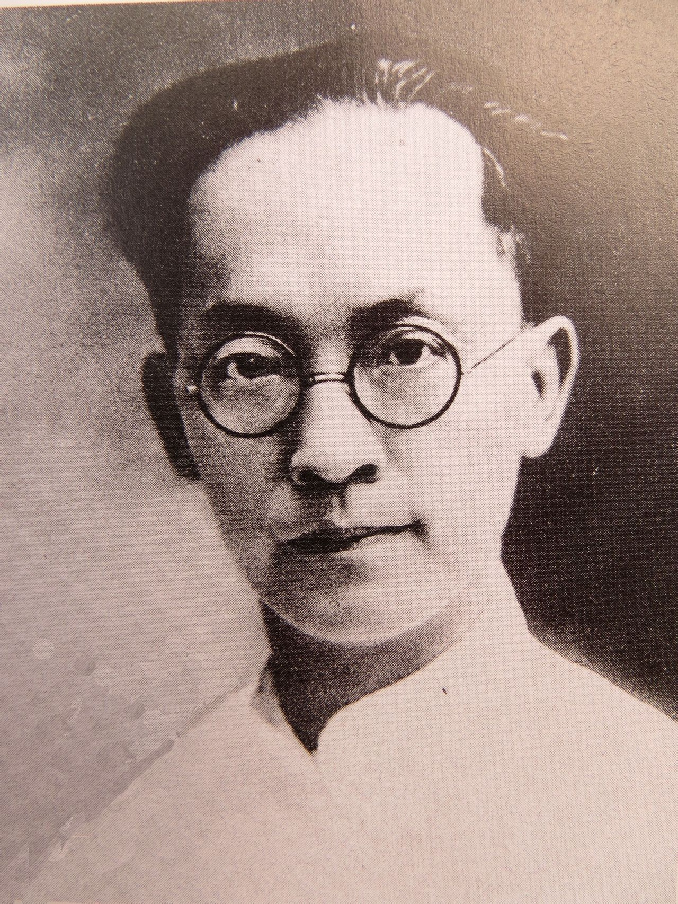
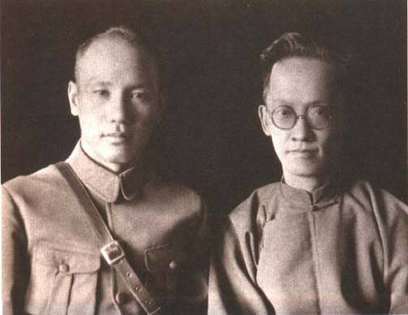
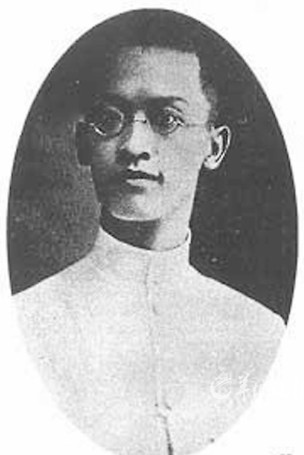
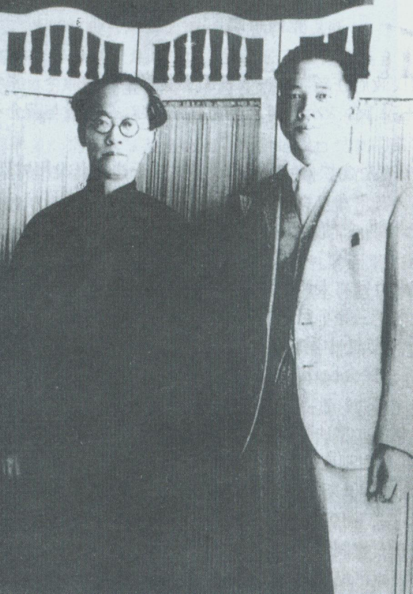
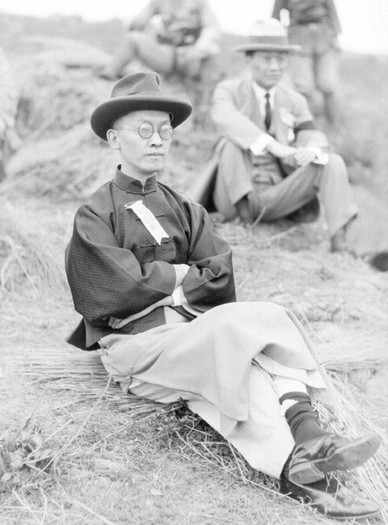
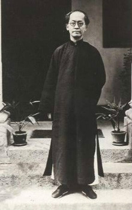
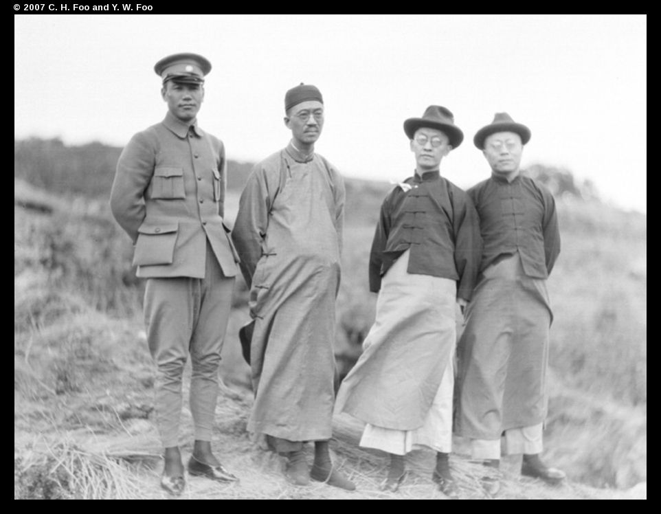
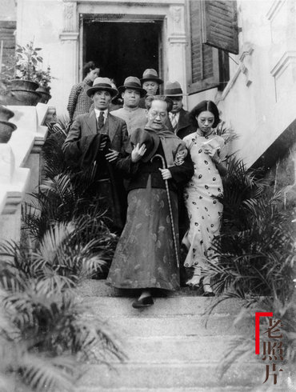
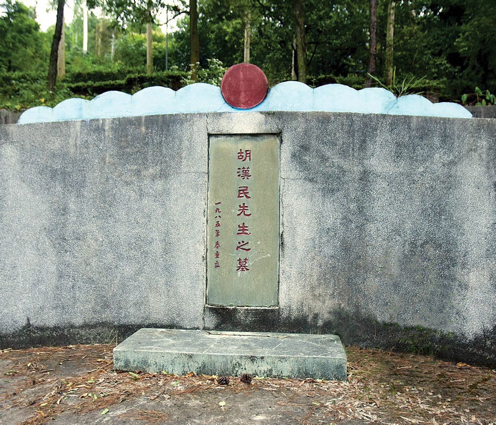

## 138年前的今天，因和蒋介石内讧诱发九一八事变的胡汉民出生

适合所有人的历史读物。每天了解一个历史人物、积累一点历史知识。三观端正，绝不戏说，欢迎留言。  

【1879年12月9日】138年前的今天，胡汉民出生

被蒋介石软禁的国民党元老胡汉民出生

138年前的今天，被蒋介石软禁，诱发九一八事变的国民党元老胡汉民出生

胡汉民（1879年12月9日－1936年5月12日），广东番禺人。自称汉民，意为不做清朝臣民，要做大汉之民。中国国民党元老、前期右派代表人物。

他一生追随孙中山，先后加入中国同盟会、中华革命党，参与改组国民党，孙中山去世后，因被怀疑刺杀廖仲恺，远赴苏联。宁汉分裂时，他选择和蒋介石合作，但之后两人产生严重分歧，被蒋介石软禁。进而引发两广反蒋事件，中国政局动荡，日本关东军趁机发动了震惊世界的九一八事件。

（蒋介石与胡汉民合影）

【替人考试的苦难少年】

1879年12月9日，胡汉民生于广东番禺县，祖籍江西吉安，父亲靠当师爷为生。11岁时，父亲去世，两年后母亲也病逝。在以后的几年里，一个哥哥及两弟一妹也因无钱就医而早逝。这接连而至的不幸，使胡汉民的人生观发生巨大变化，“一变而为冷酷的厌世观”。

16岁，胡汉民开始教书维持生计，对康有为、孙中山颇有了解，留下“早知康乐非山贼，漫信孙登是水仙”的诗句。1901年（22岁），中举人。次年为人“操刀”（替人考试），得到六千多两银子。

【一家人加入同盟会】

1902年（23岁），胡汉民与吴稚晖等人东渡日本，入东京宏文学院速成师范科。不久，吴稚晖与清朝公使闹翻，被日本警察驱逐出境，胡汉民愤而退学回国。

1904年冬，考取“赴日官费生”，公费留学日本法政大学，与汪精卫为同窗，结识廖仲恺。1905年，胡汉民夫妻加上妹妹，与廖仲恺一同加入了中国同盟会。胡汉民任评议部议员、书记部书记，主持编辑《民报》，与康、梁保皇派展开论战，对孙中山思想多有阐发。

（胡汉民与汪精卫合影）

【生死度外的黄花岗起义】

1907年3月（28岁），孙中山被日本政府驱逐出境，胡汉民随同孙中山到达越南河内。其后，孙中山和黄兴在西南边境发动多次武装起义，胡汉民担任筹饷运械等工作。

1909年10月，中国同盟会南方支部在香港成立，胡汉民任支部长，与黄兴等策划在广州新军中发动起义。同年，汪精卫暗杀摄政王载沣失败入狱，胡汉民为营救筹资，进了澳门赌博场，结果血本无归。

1911年4月，参与黄花岗起义，置生死于度外。胡汉民夫妇将女儿托付给一位老人，在一块布上写下了自己的名字、籍贯，缝在女儿的衣服上。起义失败后回到香港。

【总统府每人月薪30元】

1911年（32岁），辛亥革命后，胡汉民出任广东军政府大都督。12月，随孙中山至南京，任中华民国临时大总统府秘书长。期间，胡汉民制订了低薪制，规定总统府自秘书长以至录事，每人月薪30元，宿食由政府供给，不分官级，一律平等。

1913年9月，孙中山开始在日本筹组中华革命党。1914年5月1日，胡汉民考虑再三后，亲书誓约，加入中华革命党，在党内编号是450号，并担任政治部长，致力于反袁的宣传工作。

【留守广州的代理大元帅】

1917年9月（38岁），护法军政府在广州成立，胡汉民任交通总长。1918年5月，孙中山辞去大元帅职，胡汉民也随孙离开广东前往上海。1921年，任中华民国政府总参议兼文官长、政治部长，赞成孙中山改组中国国民党的决策。

1924年1月（45岁），中国国民党第一次全国代表大会在广州召开，胡汉民被任命为五人大会主席团之一，获选中央执行委员，兼任黄埔军校政治教官。这次大会确定了孙中山联俄容共的政策。9月，孙中山到韶关建立北伐大本营，胡汉民代行大元帅留守广州。

【被怀疑刺杀廖仲恺】

1925年3月12日，孙中山于北京逝世。此时，中国国民党内最具实力的人是汪精卫、胡汉民和廖仲恺。8月，国民党左派领袖廖仲恺被暗杀。由汪精卫、许崇智、蒋介石三人组成特别委员会，以控制局势和处理廖案。作为右派领袖的胡汉民被认为嫌疑最大，曾一度被拘留。随后，胡汉民被派往苏联考察。

1927年（48岁），宁汉分裂时，胡汉民支持蒋介石，与其合作，主持南京工作。1928年，胡汉民任国民政府立法院长。1930年，主持编成《总理全集》。

【被软禁诱发九一八事件】

1930年10月3日（51岁），蒋介石提出召开国民会议、制定约法等一系列政治主张，但遭到胡汉民强烈反对。1931年2月，因《中华民国临时约法》之争，胡汉民被蒋介石软禁在南京小汤山，被迫辞去所有职务。

胡汉民被软禁，举国舆论哗然。5月，广州国民政府成立，发表了反蒋宣言。汪精卫也发表《为胡汉民被囚重要宣言》，指责蒋介石。桂系的李宗仁、西山会议派等也加入反蒋的联合阵营中，形成了两广反蒋局面。

日本关东军抓住这个机会，发动九一八事变，形势急转直下。在国难当头之际，蒋介石不得不释放了软禁近八个月的胡汉民，以求和解。10月14日，胡汉民结束软禁。后至广州，成为南方实力派领袖，持“抗日、剿共、反蒋”三大政治主张，将蒋介石称为“新军阀”。

【一盘象棋引发的命案】

1935年6月（56岁），胡汉民赴欧考察，停止对蒋介石的抨击。12月，尚在法国的胡汉民被中国国民党五届一中全会选为中央常务委员会主席。1936年1月，自欧洲返国，留在广州。

1936年5月9日，在广州与其妻兄的象棋对弈中，突发脑溢血，5月12日病逝。25日至27日，全国公祭3天，南京、上海、北京等地有追悼大会，报纸上刊登了汪精卫和蒋介石的祭文，到广州参加公祭者共有40多万人。

原计划安葬在南京中山陵，因其妻子反对，国民政府改在广州银屏岭拨了800亩地兴建墓园。后因抗战爆发，未能竣工。文革期间，墓地被毁。80年代初，中共中央审查三年后，断定胡汉民没有杀害廖仲恺。为胡汉民在原墓东面300米处另建新墓，1985年8月7日竣工。但其女不同意将棺木迁至新墓，故新墓实为空冢。

